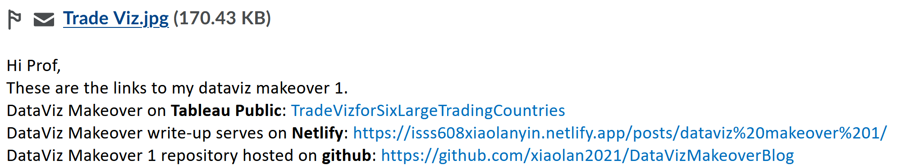

```{r setup, include=FALSE}
knitr::opts_chunk$set(echo = FALSE)
```

## Overview
Each fortnight, I will post one or two data visualisation and you are required to critic, suggest ways for improvement and rework the data visualisation. Maybe you retell the story more effectively, or find a new story in the data. I am curious to see the different approaches you all take.

The purpose of the makeover is to improve on the original visualisation. Focus on what works, what doesn’t work, why those things don’t work, and how you made it better. You should try stick to the fields in the data set provided and improve upon the original visualisation. However, if supplementing the data helps you tell a better story, go for it!

## DataViz Makeover Topics
- [DataViz Makeover 1](DataViz/DataViz1.html)
- [DataViz Makeover 2](DataViz/DataViz2.html)
- DataViz Makeover 3

## Submission Instructions

- The write-up of the DataViz Makeover must be in [**distill**](https://rstudio.github.io/distill/) or [**blogdown**](https://github.com/rstudio/blogdown) format. You are required to publish the write-up on [**Netlify**](https://www.netlify.com/).
- The R project of the DataViz Makeover must be pushed onto your [Github](https://github.com/) repository.
- The DataViz Makeover must be prepared by using **Tableau Desktop**.  The final workbook must be uploaded onto [Tableau Public](https://public.tableau.com/en-us/s/).
- All DataViz Makeover have to be completed by **Sunday before mid-night 11.59pm**. You are required to provide the links to the DataViz Makeover write-up, github repository and Tableau Public onto eLearn (i.e. DataViz Makeover section) as shown in the screenshot below:



## For your reference

### From seniors
- DataViz Makeover Blog Link [AY2020-2021 Term 2](https://wiki.smu.edu.sg/2021t2isss608/DataViz#DataViz_Makeover_Blog_Link)
    - [DataViz Makeover 1 handout](others/ISSS608_AY2020-21T2_DataViz1.pdf), [sample web article](https://kaichinlim.netlify.app/posts/2021-01-24-dataviz-makeover-1/) and [Tableau Public](https://public.tableau.com/profile/kai.chin#!/vizhome/DataViz1_16113674336320/Sheet1?publish=yes) submission. 

### From external sources
- [Makeover Monday](https://www.makeovermonday.co.uk/), especially:
    - [Gallery](https://www.makeovermonday.co.uk/gallery/)
    - [Our Makeover](https://www.makeovermonday.co.uk/makeovers/)
    - [Webinars](https://www.makeovermonday.co.uk/webinars/)
    - [blog](https://www.makeovermonday.co.uk/blog/)

- [Story Telling with Data](http://www.storytellingwithdata.com/), especially:
    - [Community](https://community.storytellingwithdata.com/)
    - [Blog](http://www.storytellingwithdata.com/blog)

## DataViz Makeover Blog Link


