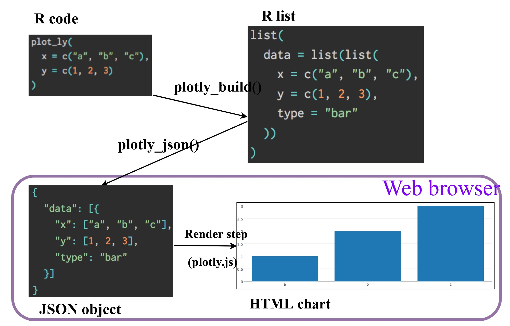

```{r setup, include=FALSE}
options(htmltools.dir.version = FALSE)
knitr::opts_chunk$set(
  fig.retina=3,
  cache = FALSE,
  echo = TRUE,
  message = FALSE, 
  warning = FALSE)
```

```{r xaringan-themer, include=FALSE, warning=FALSE}
library(xaringanthemer)
style_duo_accent(
  primary_color = "#1381B0",
  secondary_color = "#FF961C",
  inverse_header_color = "#FFFFFF"
)
```

## Interactive Data Visualisation with R

.large[
In this hands-on exercise, you will learn how to create:

- interactive data visualisation by using ggiraph and plotlyr packages,

- animated data visualisation by using gganimate and plotlyr packages.
]

---
## Getting Started

.pull-left[
First, write a code chunk to check, install and launch the following R packages:
+ [**ggiraph**](https://davidgohel.github.io/ggiraph/) for making ‘ggplot’ graphics interactive. 
+ [**plotly**](https://plotly.com/r/), R library for plotting interactive statistical graphs. 
+ [**gganimate**](https://gganimate.com/), an ggplot extension for creating animated statistical graphs. 
+ [**patchwork**](https://patchwork.data-imaginist.com/index.html), an ggplot extension for combining multiple ggplot objects into a single figure.
+ [**DT**](https://rstudio.github.io/DT/) provides an R interface to the JavaScript library [DataTables](https://datatables.net/) that create interactive table on html page. 
+ [**tidyverse**](https://www.tidyverse.org/), a family of modern R packages specially designed to support data science, analysis and communication task including creating static statistical graphs. 
]

--
.pull-right[
The solution:

```{r echo=TRUE, eval=TRUE}
packages = c('ggiraph', 'plotly', 
             'DT', 'patchwork',
             'gganimate', 'tidyverse',
             'readxl', 'gifski', 'gapminder')
for (p in packages){
  if(!require(p, character.only = T)){
    install.packages(p)
  }
  library(p,character.only = T)
}
```
]

---
## Importing Data

.pull-left[
.large[
Using [*read_csv()*](https://readr.tidyverse.org/reference/read_delim.html) of **readr** package, import *Exam_data.csv* into R.
]]

--

.pull-left[
.large[
The solution:

```{r}
exam_data <- read_csv("data/Exam_data.csv")
```
]]

---
## Interactive Data Visualisation - ggiraph methods

.large[
- An htmlwidget and a ggplot2 extension. It allows ggplot graphics to be interactive.

- Interactive is made with ggplot geometries that can understand three arguments:
    - **Tooltip**: a column of data-sets that contain tooltips to be displayed when the mouse is over elements.
    - **Onclick**: a column of data-sets that contain a JavaScript function to be executed when elements are clicked.
    - **Data_id**: a column of data-sets that contain an id to be associated with elements.

- If it used within a shiny application, elements associated with an id (data_id) can be selected and manipulated on client and server sides.
]

.small[
Reference: [ggiraph](https://davidgohel.github.io/ggiraph/index.html) package
]

---
### Tooltip effect with *tooltip* aesthetic

.pull-left[
```{r echo=TRUE, eval=FALSE}
p <- ggplot(data=exam_data, 
       aes(x = MATHS)) +
  geom_dotplot_interactive(
    aes(tooltip = ID),
    stackgroups = TRUE, 
    binwidth = 1, 
    method = "histodot") +
  scale_y_continuous(NULL, 
                     breaks = NULL)
girafe(
  ggobj = p,
  width_svg = 6,
  height_svg = 6*0.618
)
```
]

.pull-right[
```{r echo=FALSE, eval=TRUE}
p <- ggplot(data=exam_data, 
       aes(x = MATHS)) +
  geom_dotplot_interactive(                  
    aes(tooltip = ID),
    stackgroups = TRUE,                      
    binwidth = 1,                       
    method = "histodot") +              
  scale_y_continuous(NULL,              
                     breaks = NULL)
girafe(
  ggobj = p,
  width_svg = 6,
  height_svg = 6*0.618
)
```

Interactivity: 
hovering displays student's ID
]

---
### Comparing ggplot2 and ggiraph codes

.pull-left[
The original ggplot2 code chunk.

```{r, echo=TRUE, eval=FALSE, fig.height=6, fig.width=8}
ggplot(data=exam_data, 
       aes(x = MATHS)) +
  geom_dotplot(binwidth=2.5, 
               dotsize = 0.5) +
  scale_y_continuous(NULL, 
                     breaks = NULL)
```
]

--
.pull-right[
The ggiraph code chunk.

```{r echo=TRUE, eval=FALSE}
p <- ggplot(data=exam_data, 
       aes(x = MATHS)) +
  geom_dotplot_interactive(              #<<
    aes(tooltip = ID),                   #<<
    stackgroups = TRUE,                  #<<
    binwidth = 1,                        #<<
    method = "histodot") +               #<<
  scale_y_continuous(NULL,               
                     breaks = NULL)
girafe(                                  #<<
  ggobj = p,                             #<<
  width_svg = 6,                         #<<
  height_svg = 6*0.618                   #<<   
)                                        #<<
```

A complete list of geometries supported by ggiraph and their corresponding command syntax can be found [here](https://davidgohel.github.io/ggiraph/reference/index.html).                     
]

---
### Displaying multiple information on tooltip

.pull-left[
```{r eval=FALSE}
exam_data$tooltip <- c(paste0(     #<<
  "Name = ", exam_data$ID,         #<<
  "\n Class = ", exam_data$CLASS)) #<<

p <- ggplot(data=exam_data, 
       aes(x = MATHS)) +
  geom_dotplot_interactive(
    aes(tooltip = exam_data$tooltip), #<<
    stackgroups = TRUE,
    binwidth = 1,
    method = "histodot") +
  scale_y_continuous(NULL,               
                     breaks = NULL)
girafe(
  ggobj = p,
  width_svg = 8,
  height_svg = 8*0.618
)
```
]

.pull-right[
```{r echo=FALSE}
exam_data$tooltip <- c(paste0("Name = ", exam_data$ID, "\n Class = ", exam_data$CLASS)) #<<

p <- ggplot(data=exam_data, 
       aes(x = MATHS)) +
  geom_dotplot_interactive(
    aes(tooltip = exam_data$tooltip),
    stackgroups = TRUE,
    binwidth = 1,
    method = "histodot") +
  scale_y_continuous(NULL,               
                     breaks = NULL)
girafe(
  ggobj = p,
  width_svg = 8,
  height_svg = 8*0.618
)
```
]

---
### Displaying statistics on tooltip

.pull-right[
```{r echo=FALSE}
tooltip <- function(y, ymax, accuracy = .01) {
  mean <- scales::number(y, accuracy = accuracy)
  sem <- scales::number(ymax - y, accuracy = accuracy)
  paste("Mean maths scores:", mean, "+/-", sem)
}

gg_point <- ggplot(data=exam_data, 
                   aes(x = RACE),
) +
  stat_summary(aes(y = MATHS, 
                   tooltip = after_stat(
                     tooltip(y, ymax))),
    fun.data = "mean_se", 
    geom = ggiraph:::GeomInteractiveCol
  ) +
  stat_summary(aes(y = MATHS),
    fun.data = mean_se,
    geom = "errorbar", width = 0.2, size = 0.2
  )

girafe(ggobj = gg_point,
       width_svg = 8,
       height_svg = 8*0.618)
```
]

---
### Hover effect with *data_id* aesthetic

.pull-left[
```{r echo=TRUE, eval=FALSE}
p <- ggplot(data=exam_data, 
       aes(x = MATHS)) +
  geom_dotplot_interactive(           
    aes(data_id = CLASS),             #<<
    stackgroups = TRUE,               
    binwidth = 1,                        
    method = "histodot") +               
  scale_y_continuous(NULL,               
                     breaks = NULL)
girafe(                                  
  ggobj = p,                             
  width_svg = 6,                         
  height_svg = 6*0.618                      
)                                        
```
]

.pull-right[
```{r echo=FALSE, eval=TRUE}
p <- ggplot(data=exam_data, 
       aes(x = MATHS)) +
  geom_dotplot_interactive(
    aes(data_id = CLASS),
    stackgroups = TRUE,                  
    binwidth = 1,                        
    method = "histodot") +               
  scale_y_continuous(NULL,               
                     breaks = NULL)
girafe(                                  
  ggobj = p,                             
  width_svg = 6,                         
  height_svg = 6*0.618                      
)                                        
```

Interactivity:
Elements associated with a *data_id* (i.e CLASS) will be highlighted upon mouse over.

Note that the default value of the hover css is *hover_css = "fill:orange;"*
.
]

---
### Styling hover effect

.pull-left[
In the code chunk below, css codes are used to change the highlighting effect.

```{r echo=TRUE, eval=FALSE}
p <- ggplot(data=exam_data, 
       aes(x = MATHS)) +
  geom_dotplot_interactive(              
    aes(data_id = CLASS),              
    stackgroups = TRUE,                  
    binwidth = 1,                        
    method = "histodot") +               
  scale_y_continuous(NULL,               
                     breaks = NULL)
girafe(                                  
  ggobj = p,                             
  width_svg = 6,                         
  height_svg = 6*0.618,
  options = list(                        #<<
    opts_hover(css = "fill: #202020;"),  #<<
    opts_hover_inv(css = "opacity:0.2;") #<<
  )                                      #<<  
)                                        
```
]

.pull-right[
```{r echo=FALSE, eval=TRUE}
p <- ggplot(data=exam_data, 
       aes(x = MATHS)) +
  geom_dotplot_interactive(              
    aes(data_id = CLASS),              
    stackgroups = TRUE,                  
    binwidth = 1,                        
    method = "histodot") +               
  scale_y_continuous(NULL,               
                     breaks = NULL)
girafe(                                  
  ggobj = p,                             
  width_svg = 6,                         
  height_svg = 6*0.618,
  options = list(                         
    opts_hover(css = "fill: #202020;"),  
    opts_hover_inv(css = "opacity:0.2;")
  )
)                                        
```

Interactivity:
Elements associated with a *data_id* (i.e CLASS) will be highlighted upon mouse over.
]

---
### Click effect with **onclick**

.pull-left[
```{r echo=TRUE, eval=FALSE}
exam_data$onclick <- sprintf("window.open(\"%s%s\")",
"https://www.moe.gov.sg/schoolfinder?journey=Primary%20school", as.character(exam_data$ID) )

p <- ggplot(data=exam_data, 
       aes(x = MATHS)) +
  geom_dotplot_interactive(              
    aes(onclick = onclick),              #<<
    stackgroups = TRUE,                  
    binwidth = 1,                        
    method = "histodot") +               
  scale_y_continuous(NULL,               
                     breaks = NULL)
girafe(                                  
  ggobj = p,                             
  width_svg = 6,                         
  height_svg = 6*0.618)                                        
```
]

.pull-right[
```{r echo=FALSE, eval=TRUE}
exam_data$onclick <- sprintf("window.open(\"%s%s\")",
"https://www.moe.gov.sg/schoolfinder?journey=Primary%20school", as.character(exam_data$ID) )

p <- ggplot(data=exam_data, 
       aes(x = MATHS)) +
  geom_dotplot_interactive(              
    aes(onclick = onclick),              #<<
    stackgroups = TRUE,                  
    binwidth = 1,                        
    method = "histodot") +               
  scale_y_continuous(NULL,               
                     breaks = NULL)
girafe(                                  
  ggobj = p,                             
  width_svg = 6,                         
  height_svg = 6*0.618)
```

Interactivity:
Web document link with a data object will be displayed on the web browser upon mouse click.
]

---
### Coordinated Multiple Views with **ggiraph**

.pull-left[
Coordinated multiple views methods has been implemented in the data visualisation on the right.

- when a data point of one of the dotplot is selected, the corresponding data point ID on the second data visualisation will be highlighted too. 
]

.pull-right[
```{r echo=FALSE}
p1 <- ggplot(data=exam_data, 
       aes(x = MATHS)) +
  geom_dotplot_interactive(              
    aes(data_id = ID),              
    stackgroups = TRUE,                  
    binwidth = 1,                        
    method = "histodot") + 
  coord_cartesian(xlim=c(0,100)) +
  scale_y_continuous(NULL,               
                     breaks = NULL)

p2 <- ggplot(data=exam_data, 
       aes(x = ENGLISH)) +
  geom_dotplot_interactive(              
    aes(data_id = ID),              
    stackgroups = TRUE,                  
    binwidth = 1,                        
    method = "histodot") + 
  coord_cartesian(xlim=c(0,100)) +
  scale_y_continuous(NULL,               
                     breaks = NULL)

girafe(code = print(p1 / p2),
       width_svg = 6,
       height_svg = 6,
       options = list(
         opts_hover(css = "fill: #202020;"),
         opts_hover_inv(css = "opacity:0.2;")
         )
       )                                        
```
]


---
### Coordinated Multiple Views with **ggiraph**

.pull-left[
In order to build a coordinated multiple views, the following programming strategy will be used:

1. Appropriate interactive functions of **ggiraph** will be used to create the multiple views.
2. *patchwork* function of [patchwork](https://patchwork.data-imaginist.com/) package will be used inside girafe function to create the interactive coordinated multiple views.  

```{r eval=FALSE}
p1 <- ggplot(data=exam_data, 
       aes(x = MATHS)) +
  geom_dotplot_interactive(              
    aes(data_id = ID),              
    stackgroups = TRUE,                  
    binwidth = 1,                        
    method = "histodot") +  
  coord_cartesian(xlim=c(0,100)) + #<<
  scale_y_continuous(NULL,               
                     breaks = NULL)
```
]

.pull-right[
```{r eval=FALSE}
p2 <- ggplot(data=exam_data, 
       aes(x = ENGLISH)) +
  geom_dotplot_interactive(              
    aes(data_id = ID),              
    stackgroups = TRUE,                  
    binwidth = 1,                        
    method = "histodot") + 
  coord_cartesian(xlim=c(0,100)) + #<<
  scale_y_continuous(NULL,               
                     breaks = NULL)

girafe(code = print(p1 / p2), #<<
       width_svg = 6,
       height_svg = 6,
       options = list(
         opts_hover(css = "fill: #202020;"),
         opts_hover_inv(css = "opacity:0.2;")
         )
       ) 
```

The data_id aesthetic is critical to link observations between plots and the tooltip aesthetic is optional but nice to have when mouse over a point.
]
---
## Interactive Data Visualisation - plotly methods!

- Plotly's R graphing library create interactive web graphics from **ggplot2** graphs and/or a custom interface to the (MIT-licensed) JavaScript library [**plotly.js**](https://plotly.com/javascript/) inspired by the grammar of graphics.
- Different from other plotly platform, plot.R is free and open source.

.center[

]

There are two ways to create interactive graph by using plotly, they are:

- by using *plot_ly()*, and 
- by using *ggplotly()*

---
### Creating an interactive scatter plot: plot_ly() method

.pull-left[
The code chunk below plots an interactive scatter plot by using *plot_ly()*.

```{r eval=FALSE}
plot_ly(data = exam_data, 
             x = ~MATHS, 
             y = ~ENGLISH)
```
]

.pull-right[
The output:

```{r echo=FALSE, eval=TRUE}
plot_ly(data = exam_data, 
             x = ~MATHS, 
             y = ~ENGLISH)
```
]

---
### Working with visual variable: plot_ly() method

.pull-left[
In the code chunk below, *color* argument is mapped to a qualitative visual variable (i.e. RACE).

```{r eval=FALSE}
plot_ly(data = exam_data, 
        x = ~ENGLISH, 
        y = ~MATHS, 
        color = ~RACE) #<<
```
]

.pull-right[
Interactive:

- Click on the colour symbol at the legend.

```{r echo=FALSE, fig.height=6}
plot_ly(data = exam_data, 
        x = ~ENGLISH, 
        y = ~MATHS, 
        color = ~RACE)
```
]

---
### Changing colour pallete: plot_ly() method

.pull-left[
In the code chunk below, *colors* argument is used to change the default colour palette to [ColorBrewel](https://www.r-graph-gallery.com/38-rcolorbrewers-palettes.html) colour palette.

```{r eval=FALSE}
plot_ly(data = exam_data, 
        x = ~ENGLISH, 
        y = ~MATHS, 
        color = ~RACE, 
        colors = "Set1") #<<
```
]

.pull-right[
Interactive:

- Click on the colour symbol at the legend.

```{r echo=FALSE, fig.height=6}
plot_ly(data = exam_data, 
        x = ~ENGLISH, 
        y = ~MATHS, 
        color = ~RACE, 
        colors = "Set1") #<<
```
]

---
### Customising colour scheme: plot_ly() method

.pull-left[
In the code chunk below, a customised colour scheme is created.  Then, *colors* argument is used to change the default colour palette to the customised colour scheme. 

```{r eval=FALSE}
pal <- c("red", "purple", "blue", "green") #<<

plot_ly(data = exam_data, 
        x = ~ENGLISH, 
        y = ~MATHS, 
        color = ~RACE, 
        colors = pal) #<<
```
]

.pull-right[
Interactive:

- Click on the colour symbol at the legend.

```{r echo=FALSE, fig.height=6}
pal <- c("red", "purple", "blue", "green")

plot_ly(data = exam_data, 
        x = ~ENGLISH, 
        y = ~MATHS, 
        color = ~RACE, 
        colors = pal)
```
]

---
### Customising tooltip: plot_ly() method

.pull-left[
In the code chunk below, *text* argument is used to change the default tooltip.

```{r eval=FALSE}
plot_ly(data = exam_data, 
        x = ~ENGLISH, 
        y = ~MATHS,
        text = ~paste("Student ID:", ID,     #<<
                      "<br>Class:", CLASS),  #<<
        color = ~RACE, 
        colors = "Set1")
```
]

.pull-right[
Interactive:

- Click on the colour symbol at the legend.

```{r echo=FALSE, fig.height=6}
plot_ly(data = exam_data, 
        x = ~ENGLISH, 
        y = ~MATHS,
        text = ~paste("Student ID:", ID, 
                      "<br>Class:", CLASS),
        color = ~RACE, 
        colors = "Set1") #<<
```
]

---
### Working with layout: plot_ly() method

.pull-left[
In the code chunk below, *layout* argument is used to change the default tooltip.

```{r eval=FALSE}
plot_ly(data = exam_data, 
        x = ~ENGLISH, 
        y = ~MATHS,
        text = ~paste("Student ID:", ID,     
                      "<br>Class:", CLASS),  
        color = ~RACE, 
        colors = "Set1") %>%
  layout(title = 'English Score versus Maths Score ', #<<
         xaxis = list(range = c(0, 100)),             #<<
         yaxis = list(range = c(0, 100)))             #<<
```

To learn more about layout, visit this [link](https://plotly.com/r/reference/#Layout_and_layout_style_objects).
]

.pull-right[
Interactive:

- Click on the colour symbol at the legend.

```{r echo=FALSE, fig.height=6}
plot_ly(data = exam_data, 
        x = ~ENGLISH, 
        y = ~MATHS,
        text = ~paste("Student ID:", ID, 
                      "<br>Class:", CLASS),
        color = ~RACE, 
        colors = "Set1") %>%
  layout(title = 'English Score versus Maths Score ',
         xaxis = list(range = c(0, 100)),
         yaxis = list(range = c(0,100)))
```
]

---
### Creating an interactive scatter plot: ggplotly() method

.pull-left[
The code chunk below plots an interactive scatter plot by using *ggplotly()*.

```{r, eval=FALSE}
p <- ggplot(data=exam_data, 
            aes(x = MATHS,
                y = ENGLISH)) +
  geom_point(dotsize = 1) +
  coord_cartesian(xlim=c(0,100),
                  ylim=c(0,100))
ggplotly(p) #<<

```

Notice that the only extra line you need to include in the code chunk is *ggplotly()*. 
]

.pull-right[
```{r, echo=FALSE,  eval=TRUE}
p <- ggplot(data=exam_data, 
            aes(x = MATHS,
                y = ENGLISH)) +
  geom_point(size=1) +
  coord_cartesian(xlim=c(0,100),
                  ylim=c(0,100))
ggplotly(p)

```
]


---
### Coordinated Multiple Views with **plotly**

.pull-left[

Code chunk below plots two scatterplots and places them next to each other side-by-side by using [*subplot()*](https://plotly.com/r/subplots/) of **plotly** package.

```{r echo=TRUE, eval=FALSE}
p1 <- ggplot(data=exam_data, 
              aes(x = MATHS,
                  y = ENGLISH)) +
  geom_point(size=1) +
  coord_cartesian(xlim=c(0,100),
                  ylim=c(0,100))

p2 <- ggplot(data=exam_data, 
            aes(x = MATHS,
                y = SCIENCE)) +
  geom_point(size=1) +
  coord_cartesian(xlim=c(0,100),
                  ylim=c(0,100))
subplot(ggplotly(p1),            #<<
        ggplotly(p2))            #<<
```
]

.pull-right[
The side-by-side scatterplots.

```{r echo=FALSE, eval=TRUE, fig.height=4}
p1 <- ggplot(data=exam_data, 
              aes(x = MATHS,
                  y = ENGLISH)) +
  geom_point(size=1) +
  coord_cartesian(xlim=c(0,100),
                  ylim=c(0,100))

p2 <- ggplot(data=exam_data, 
            aes(x = MATHS,
                y = SCIENCE)) +
  geom_point(size=1) +
  coord_cartesian(xlim=c(0,100),
                  ylim=c(0,100))
subplot(ggplotly(p1),
        ggplotly(p2))
```

Notice that these two scatter plots are not linked.
]

---
### Coordinated Multiple Views with **plotly**

.pull-left[

To create a coordinated scatterplots, *highlight_key()* of **plotly** package is used.

```{r echo=TRUE, eval=FALSE}
d <- highlight_key(exam_data)  #<<
p1 <- ggplot(data=d, 
            aes(x = MATHS,
                y = ENGLISH)) +
  geom_point(size=1) +
  coord_cartesian(xlim=c(0,100),
                  ylim=c(0,100))

p2 <- ggplot(data=d, 
            aes(x = MATHS,
                y = SCIENCE)) +
  geom_point(size=1) +
  coord_cartesian(xlim=c(0,100),
                  ylim=c(0,100))
subplot(ggplotly(p1),
        ggplotly(p2))
```
]

.pull-right[
Click on a data point of one of the scatterplot and see how the corresponding point on the other scatterplot is selected. 

```{r echo=FALSE, eval=TRUE, fig.height=4}
d <- highlight_key(exam_data)
p1 <- ggplot(data=d, 
            aes(x = MATHS,
                y = ENGLISH)) +
  geom_point(size=1) +
  coord_cartesian(xlim=c(0,100),
                  ylim=c(0,100))

p2 <- ggplot(data=d, 
            aes(x = MATHS,
                y = SCIENCE)) +
  geom_point(size=1) +
  coord_cartesian(xlim=c(0,100),
                  ylim=c(0,100))
subplot(ggplotly(p1),
        ggplotly(p2))
```

Thing to learn from the code chunk:

- *highlight_key()* simply creates an object of class crosstalk::SharedData.  
- Visit this [link](https://rstudio.github.io/crosstalk/) to learn more about crosstalk, 

]

---
## Interactive Data Table: DT package

- A wrapper of the JavaScript Library [DataTables](https://datatables.net/)

- Data objects in R can be rendered as HTML tables using the JavaScript library 'DataTables' (typically via R Markdown or Shiny). 

```{r}
DT::datatable(exam_data)
```

---
### Linked brushing: crosstalk method 

```{r echo=FALSE}
d <- highlight_key(exam_data)
p <- ggplot(d, aes(ENGLISH, MATHS)) + 
  geom_point(size=1) +
  coord_cartesian(xlim=c(0,100),
                  ylim=c(0,100))

gg <- highlight(ggplotly(p), 
                "plotly_selected")

crosstalk::bscols(gg, DT::datatable(d), widths = 5)
```

---
### Linked brushing: crosstalk method 

.pull-left[
Code chunk below is used to implement the coordinated brushing shown on Slide 24.

```{r echo=TRUE, eval=FALSE}
d <- highlight_key(exam_data)       #<<
p <- ggplot(d, 
            aes(ENGLISH, 
                MATHS)) + 
  geom_point(size=1) +
  coord_cartesian(xlim=c(0,100),
                  ylim=c(0,100))

gg <- highlight(ggplotly(p),        #<<
                "plotly_selected")  #<<

crosstalk::bscols(gg,               #<<
                  DT::datatable(d), #<<
                  widths = 5)       #<< 
```
]

.pull-right[
Things to learn from the code chunk:

- *highlight()* is a function of **plotly** package. It sets a variety of options for brushing (i.e., highlighting) multiple plots. These options are primarily designed for linking multiple plotly graphs, and may not behave as expected when linking plotly to another htmlwidget package via crosstalk.  In some cases, other htmlwidgets will respect these options, such as persistent selection in leaflet.

- *bscols()* is a helper function of **crosstalk** package.  It makes it easy to put HTML elements side by side.  It can be called directly from the console but is especially designed to work in an R Markdown document.  **Warning:**  This will bring in all of Bootstrap!. 
]

---
## Animated Data Visualisation: gganimate methods  

[**gganimate**](https://gganimate.com/index.html) extends the grammar of graphics as implemented by ggplot2 to include the description of animation. It does this by providing a range of new grammar classes that can be added to the plot object in order to customise how it should change with time.

+ `transition_*()` defines how the data should be spread out and how it relates to itself across time.
+ `view_*()` defines how the positional scales should change along the animation.
+ `shadow_*()` defines how data from other points in time should be presented in the given point in time.
+ `enter_*()/exit_*()` defines how new data should appear and how old data should disappear during the course of the animation.
+ `ease_aes()` defines how different aesthetics should be eased during transitions.

---
### Getting started

.pull-left[
.large[
+ Add the following packages in the packages list:
    + gganimate
    + [**gifski**](https://cran.r-project.org/web/packages/gifski/index.html) converts video frames to GIF animations using pngquant's fancy features for efficient cross-frame palettes and temporal dithering. It produces animated GIFs that use thousands of colors per frame.
    + [**gapminder**](https://cran.r-project.org/web/packages/gapminder/index.html): An excerpt of the data available at Gapminder.org. We just want to use its *country_colors* scheme.
]]

--
.pull-right[
.large[
+ Import the *Data* worksheet from *GlobalPopulation* Excel workbook.  
]]

---
### Building a static population bubble plot

.pull-left[

```{r echo=FALSE}
col <- c("Country", "Continent")
globalPop <- read_xls("data/GlobalPopulation.xls", sheet="Data") %>%
  mutate_each_(funs(factor(.)), col) %>%
  mutate(Year = as.integer(Year))
```

```{r eval=FALSE}
ggplot(globalPop, aes(x = Old, y = Young, 
                      size = Population, 
                      colour = Country)) +
  geom_point(alpha = 0.7, 
             show.legend = FALSE) +
  scale_colour_manual(values = country_colors) +
  scale_size(range = c(2, 12)) +
  labs(title = 'Year: {frame_time}', 
       x = '% Aged', 
       y = '% Young') 
```
]

.pull-right[

```{r echo=FALSE}
ggplot(globalPop, aes(x = Old, y = Young, 
                      size = Population, 
                      colour = Country)) +
  geom_point(alpha = 0.7, 
             show.legend = FALSE) +
  scale_colour_manual(values = country_colors) +
  scale_size(range = c(2, 12)) +
  labs(title = 'Year: {frame_time}', 
       x = '% Aged', 
       y = '% Young') 
```
]

---
### Building the animated bubble plot

.pull-left[
The code chunk:

```{r eval=FALSE}
ggplot(globalPop, aes(x = Old, y = Young, 
                      size = Population, 
                      colour = Country)) +
  geom_point(alpha = 0.7, 
             show.legend = FALSE) +
  scale_colour_manual(values = country_colors) +
  scale_size(range = c(2, 12)) +
  labs(title = 'Year: {frame_time}', 
       x = '% Aged', 
       y = '% Young') +
  transition_time(Year) +       #<<
  ease_aes('linear')            #<<
```
]

.pull-right[
The animated bubble chart

```{r echo=FALSE}
ggplot(globalPop, aes(x = Old, y = Young, 
                      size = Population, 
                      colour = Country)) +
  geom_point(alpha = 0.7, 
             show.legend = FALSE) +
  scale_colour_manual(values = country_colors) +
  scale_size(range = c(2, 12)) +
  labs(title = 'Year: {frame_time}', 
       x = '% Aged', 
       y = '% Young') +
  transition_time(Year) +       #<<
  ease_aes('linear')            #<<
```
]


---
## Reference

### ggiraph

This [link](https://davidgohel.github.io/ggiraph/index.html) provides online version of the reference guide and several useful articles.  Use this [link](https://cran.r-project.org/web/packages/ggiraph/ggiraph.pdf) to download the pdf version of the reference guide. 

- [How to Plot With Ggiraph](https://www.r-bloggers.com/2018/04/how-to-plot-with-ggiraph/)
- [Interactive map of France with ggiraph](http://rstudio-pubs-static.s3.amazonaws.com/152833_56a4917734204de7b37881d164cf8051.html)  
- [Custom interactive sunbursts with ggplot in R](https://www.pipinghotdata.com/posts/2021-06-01-custom-interactive-sunbursts-with-ggplot-in-r/)
- This [link](https://github.com/d-qn/2016_08_02_rioOlympicsAthletes) provides code example on how ggiraph is used to interactive graphs for [Swiss Olympians - the solo specialists](https://www.swissinfo.ch/eng/rio-2016-_swiss-olympians---the-solo-specialists-/42349156?utm_content=bufferd148b&utm_medium=social&utm_source=twitter.com&utm_campaign=buffer). 

### plotly for R

- [Getting Started with Plotly in R](https://plotly.com/r/getting-started/) 
- - A collection of plotly R  graphs are available via this [link](https://plotly.com/r/).
- Carson Sievert (2020) **Interactive web-based data visualization with R, plotly, and shiny**, Chapman and Hall/CRC is the best resource to learn plotly for R.  The online version is available via this [link](https://plotly-r.com/)
- [Plotly R Figure Reference](https://plotly.com/r/reference/index/) provides a comprehensive discussion of each visual representations.
- [Plotly R Library Fundamentals](https://plotly.com/r/plotly-fundamentals/) is a good place to learn the fundamental features of Plotly's R API. 

### gganimate

- [Getting Started](https://gganimate.com/articles/gganimate.html)
- Visit this [link](https://rpubs.com/raymondteo/dataviz8) for a very interesting implementation of gganimate by your senior.


```{r echo=FALSE, eval=FALSE}
library(pagedown)
pagedown::chrome_print("Hands-on_Ex03.html")
```
