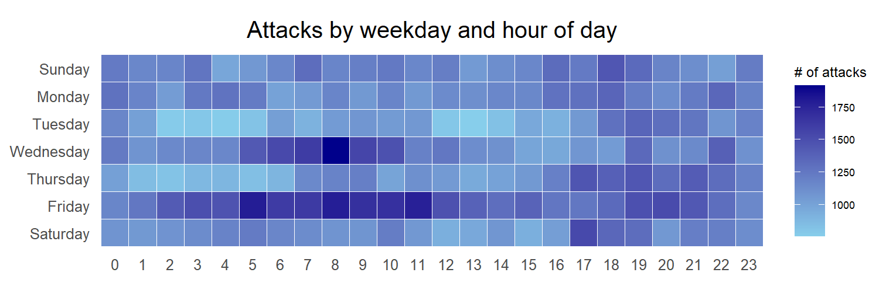
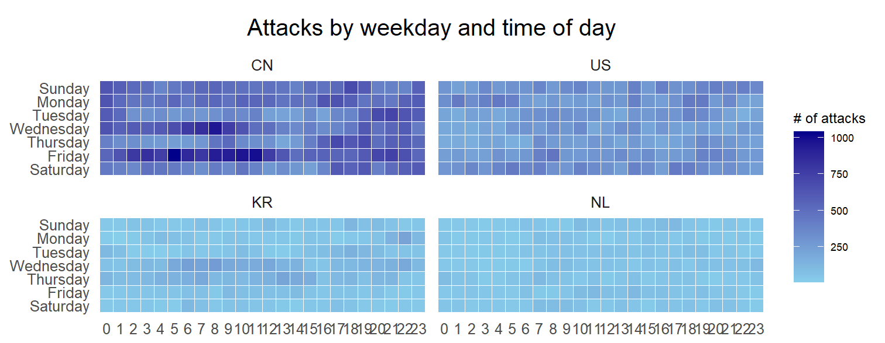
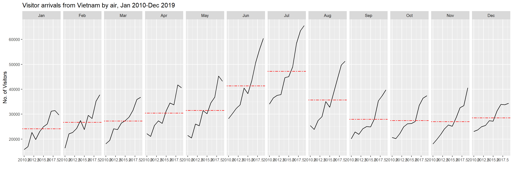
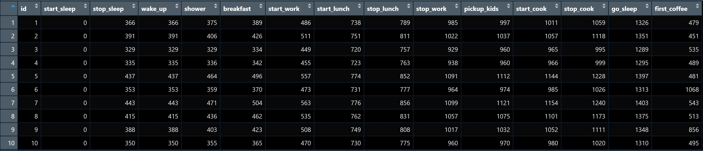
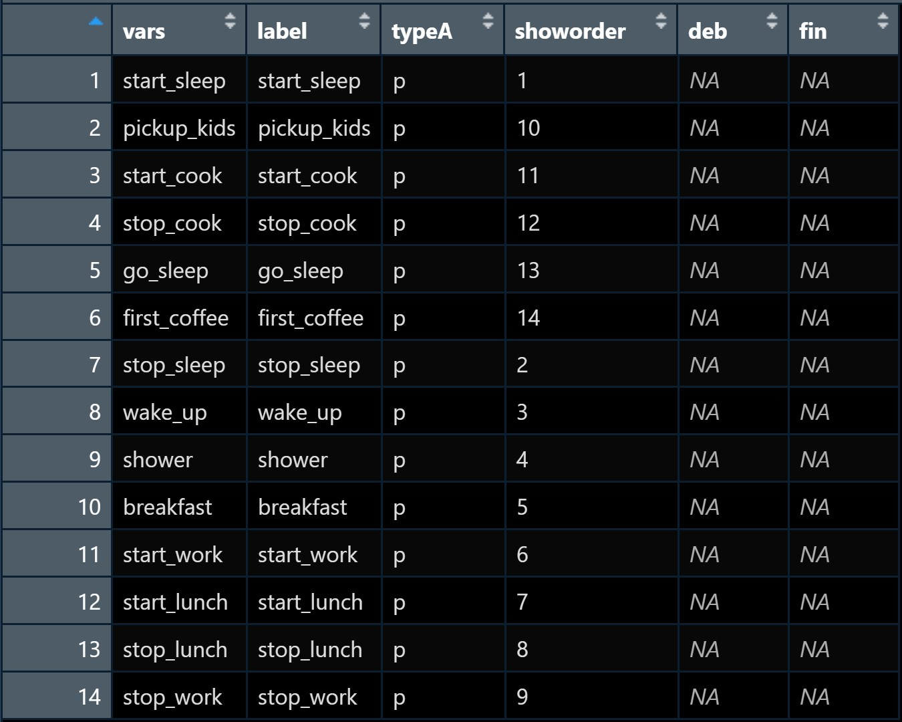
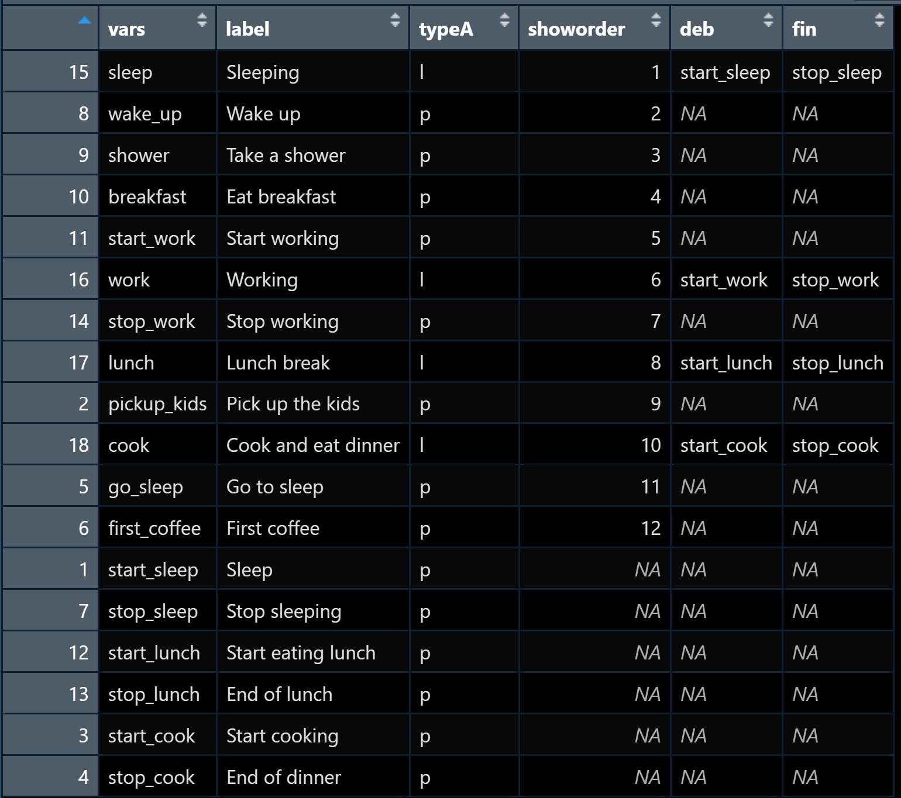

```{r setup, include=FALSE}
options(htmltools.dir.version = FALSE)
knitr::opts_chunk$set(
  fig.retina=3,
  cache = FALSE,
  echo = TRUE,
  message = FALSE, 
  warning = FALSE)
```

```{r xaringan-themer, include=FALSE, warning=FALSE}
library(xaringanthemer)
style_duo_accent(
  primary_color = "#1381B0",
  secondary_color = "#FF961C",
  inverse_header_color = "#FFFFFF"
)
```

## Learning Outcome

.vlarge[
In this hands-on exercise, you will gain hands-on experience on:

+ plotting a calender heatmap by using ggplot2 functions,

+ plotting a cycle plot by using ggplot2 function, 

+ plotting a horizon chart
]

---
## Getting Started

.pull-left[
Write a code chunk to check, install and launch the following R packages:
+ 'scales', 
+ 'viridis', 
+ 'lubridate', 
+ 'ggthemes', 
+ 'gridExtra',
+ 'tidyverse', 
+ 'readxl', 
+ 'knitr',
+ data.table]

--
.pull-right[
The solution:

```{r}
packages = c('scales', 'viridis', 
             'lubridate', 'ggthemes', 
             'gridExtra', 'tidyverse', 
             'readxl', 'knitr',
             'data.table', 'ViSiElse')

for (p in packages){
  if(!require(p, character.only = T)){
    install.packages(p)
  }
  library(p,character.only = T)
}
```
]

---
## Calendar Heatmap

.pull-left[
In this section, you will learn how to plot a calender heatmap programmetically with R.  



By the end of this section, you will be able to:

- plot a calender heatmap by using ggplot2 functions and extension, 
- to write function using R programming,
- to derive specific date and time related field by using base R and lubridate packages 
- to perform data preparation task by using tidyr and dplyr packages.  


]

--
.pull-right[
### The Data

For the purpose of this hands-on exercise, *eventlog.csv* file will be used.  This data file consists of 199,999 rows of time-series cyber attack records by country.  

#### Importing the data

First, you will use the code chunk below to import *eventlog.csv* file into R environment and called the data frame as *attacks*. 

```{r}
attacks <- read_csv("data/eventlog.csv")
```
]

---
### Examining the data structure 

.pull-left[
It is always a good practice to examine the imported data frame before further analysis is performed.

For example, *kable()* can be used to review the structure of the imported data frame.

```{r eval=FALSE}
kable(head(attacks))
```

There are three columns, namely  *timestamp*, *source_country* and *tz*.  

- *timestamp* field stores date-time values in POSIXct format.
- *source_country* field stores the source of the attack.  It is in *ISO 3166-1 alpha-2* country code.  
- *tz* field stores time zone of the source IP address.
]

.pull-right[
```{r echo=FALSE}
kable(head(attacks))
```
]

---
### Data Preparation

Step 1: Deriving *weekday* and *hour of day* fields 

Before we can plot the calender heatmap, two new fields namely *wkday* and *hour* need to be derived.  In this step, we will write a function to perform the task.

```{r, echo=TRUE}
make_hr_wkday <- function(ts, sc, tz) {
  real_times <- ymd_hms(ts, 
                        tz = tz[1], 
                        quiet = TRUE)
  dt <- data.table(source_country = sc,
                   wkday = weekdays(real_times),
                   hour = hour(real_times))
  return(dt)
  }
```

Note: [`ymd_hms()`](https://lubridate.tidyverse.org/reference/ymd_hms.html) and [`hour()`](https://lubridate.tidyverse.org/reference/hour.html) are from [**lubridate**](https://lubridate.tidyverse.org/) package and [`weekdays()`](https://www.rdocumentation.org/packages/base/versions/3.6.2/topics/weekdays) is a **base** R function.

---
###  Data Preparation

Step 2: Deriving the attacks tibble data frame

.pull-left[
```{r}
wkday_levels <- c('Saturday', 'Friday', 
                  'Thursday', 'Wednesday', 
                  'Tuesday', 'Monday', 
                  'Sunday')

attacks <- attacks %>%
  group_by(tz) %>%
  do(make_hr_wkday(.$timestamp, 
                   .$source_country, 
                   .$tz)) %>% 
  ungroup() %>% 
  mutate(wkday = factor(
    wkday, levels = wkday_levels),
    hour  = factor(
      hour, levels = 0:23))
```

Note: Beside extracting the necessary data into *attacks* data frame, `mutate()` of **dplyr** package is used to convert *wkday* and *hour* fields into **factor** so they'll be ordered when plotting
]

--
.pull-right[
Table below shows the tidy tibble table after processing.

.pull-left[
```{r echo=FALSE}
kable(head(attacks))
```
]]

---
### Building the Calendar Heatmaps

.pull-left[
```{r eval=FALSE}
grouped <- attacks %>% 
  count(wkday, hour) %>% 
  ungroup() %>%
  na.omit()

ggplot(grouped, 
       aes(hour, 
           wkday, 
           fill = n)) + 
geom_tile(color = "white", 
          size = 0.1) + 
theme_tufte(base_family = "Helvetica") + 
coord_equal() +
scale_fill_gradient(name = "# of attacks",
                    low = "sky blue", 
                    high = "dark blue") +
labs(x = NULL, 
     y = NULL, 
     title = "Attacks by weekday and time of day") +
theme(axis.ticks = element_blank(),
      plot.title = element_text(hjust = 0.5),
      legend.title = element_text(size = 8),
      legend.text = element_text(size = 6) )
```
]

.pull-right[
Things to learn from the code chunk:
- a tibble data table called *grouped* is derived by aggregating the attack by *wkday* and *hour* fields.
- a new field called *n* is derived by using `group_by()` and `count()` functions.
- `na.omit()` is used to exclude missing value.
- `geom_tile()` is used to plot tiles (grids) at each x and y position.  `color` and `size` arguments are used to specify the border color and line size of the tiles.
- [`theme_tufte()`](https://jrnold.github.io/ggthemes/reference/theme_tufte.html) of  [**ggthemes**](https://jrnold.github.io/ggthemes/reference/index.html) package is used to remove unnecessary chart junk.  To learn which visual components of default ggplot2 have been excluded, you are encouraged to comment out this line to examine the default plot. 
- `coord_equal()` is used to ensure the plot will have an aspect ratio of 1:1.
- `scale_fill_gradient()` function is used to creates a two colour gradient (low-high).

```{r echo=FALSE}
grouped <- attacks %>% 
  count(wkday, hour) %>% 
  ungroup() %>%
  na.omit()

ggplot(grouped, 
       aes(hour, 
           wkday, 
           fill = n)) + 
geom_tile(color = "white", 
          size = 0.1) + 
theme_tufte(base_family = "Helvetica") + 
coord_equal() +
scale_fill_gradient(name = "# of attacks",
                    low = "sky blue", 
                    high = "dark blue") +
labs(x = NULL, 
     y = NULL, 
     title = "Attacks by weekday and time of day") +
theme( axis.ticks = element_blank(),
       plot.title = element_text(hjust = 0.5),
       legend.title = element_text(size = 8),
       legend.text = element_text(size = 6) )
```
]

???
Then we can simply group the count by hour and wkday and plot it, since we know that we have values for every combination there's no need to further preprocess the data.

---
### Building Multiple Calendar Heatmaps

**Challenge:** Building multiple heatmaps for the top four countries with the highest number of attacks.

.center[

]

---
### Plotting Multiple Calendar Heatmaps

.pull-left[
Step 1: Deriving attack by country object

In order to identify the top 4 countries with the highest number of attacks, you are required to do the followings:

- count the number of attacks by country, 
- calculate the percent of attackes by country, and
- save the results in a tibble data frame.

```{r}
attacks_by_country <- count(
  attacks, source_country) %>%
  mutate(percent = percent(n/sum(n))) %>%
  arrange(desc(n))
```
]

.pull-right[
Step 2: Preparing the tidy data frame

In this step, you are required to extract the attack records of the top 4 countries from *attacks* data frame and save the data in a new tibble data frame (i.e. *top4_attacks*).

```{r}
top4 <- attacks_by_country$source_country[1:4]
top4_attacks <- attacks %>%
  filter(source_country %in% top4) %>%
  count(source_country, wkday, hour) %>%
  ungroup() %>%
  mutate(source_country = factor(
    source_country, levels = top4)) %>%
  na.omit()
```
]

---
### Plotting Multiple Calendar Heatmaps

Step 3: Plotting the Multiple Calender Heatmap by using ggplot2 package.

```{r fig.width = 12}
ggplot(top4_attacks, 
       aes(hour, 
           wkday, 
           fill = n)) + 
  geom_tile(color = "white", 
          size = 0.1) + 
  theme_tufte(base_family = "Helvetica") + 
  coord_equal() +
  scale_fill_gradient(name = "# of attacks",
                    low = "sky blue", 
                    high = "dark blue") +
  facet_wrap(~source_country, ncol = 2) +
  labs(x = NULL, y = NULL, 
     title = "Attacks on top 4 countries by weekday and time of day") +
  theme(axis.ticks = element_blank(),
        axis.text.x = element_text(size = 7),
        plot.title = element_text(hjust = 0.5),
        legend.title = element_text(size = 8),
        legend.text = element_text(size = 6) )
```

---
## Cycle Plot

In this section, you will learn how to plot a cycle plot showing the time-series patterns and trend of visitor arrivals from Vietnam programmatically by using ggplot2 functions.    



---
### Data Preparation

.pull-left[
#### Step 1: Data Import

For the purpose of this hands-on exercise, *arrivals_by_air.xlsx* will be used.

The code chunk below imports *arrivals_by_air.xlsx* by using `read_excel()` of **readxl** package and save it as a tibble data frame called *air*.  

```{r}
air <- read_excel("data/arrivals_by_air.xlsx")
```
]

--
.pull-right[
#### Step 2: Deriving month and year fields

Next, two new fields called *month* and *year* are derived from *Month-Year* field.

```{r}
air$month <- factor(month(air$`Month-Year`), 
                    levels=1:12, 
                    labels=month.abb, 
                    ordered=TRUE) 
air$year <- year(ymd(air$`Month-Year`))
```
]

---
### Data Preparation

.pull-left[
#### Step 4: Extracting the target country

Next, the code chunk below is use to extract data for the target country (i.e. Vietnam)

```{r}
Vietnam <- air %>% 
  select(`Vietnam`, 
         month, 
         year) %>%
  filter(year >= 2010)
```
]

--
.pull-right[
#### Step 5: Computing year average arrivals by month

The code chunk below uses `group_by()` and `summarise()` of **dplyr** to compute year average arrivals by month.

```{r}
hline.data <- Vietnam %>% 
  group_by(month) %>%
  summarise(avgvalue = mean(`Vietnam`))
```
]

---
### Plotting the cycle plot

The code chunk below is used to plot the cycle plot as shown in Slide 12/23.

```{r eval=FALSE}
ggplot() + 
  geom_line(data=Vietnam,
            aes(x=year, 
                y=`Vietnam`, 
                group=month), 
            colour="black") +
  geom_hline(aes(yintercept=avgvalue), 
             data=hline.data, 
             linetype=6, 
             colour="red", 
             size=0.5) + 
  facet_grid(~month) +
  labs(axis.text.x = element_blank(),
       title = "Visitor arrivals from Vietnam by air, Jan 2010-Dec 2019") +
  xlab("") +
  ylab("No. of Visitors")
```


---
## Visulising Daily Life 

.pull-left[
In this section, you will learn how to visual daily life by using [**ViSiElse**](https://cran.r-project.org/web/packages/ViSiElse/index.html) package.  It is specially designed for visualising behavioral observation over time.

- To get started, install **ViSiElse** package.
- Add ViSiElse in the packages list and re-run the code chunk.
]

---
### Data preparation

.pull-left[
For the purpose of this hands-on exercise, *typDay* data set includes together with **ViSiElse** package will be used.

- Loading *typDay* dataset

```{r}
data("typDay")
```

- Examine the data table in RStudio

]

--
.pull-right[



This data set shows the actions usually performed during a typical day. The simulated dataset of 100 subjects correspond to the timestamps (in min) of each action of the day, from midnight to midnight. Each value is the time elapse between the beginning of the day (midnight) and the execution of the action.
]

---
### Working with visielse()

.pull-left[
Using the default

```{r fig.height=6}
visielse(typDay)
```
]

.pull-right[
- On the graph, actions are organized one under the other (y-axis) and their executions are distributed along the time axis (x-axis). 
- A drawn rectangle means that at least one subject has done the action in the interval of time. 
- The size of the time interval is set by the breaks of the time axis (here every 30 min from midnight to midnight). 
- The color’s intensity of the rectangles is proportional to the number of individuals who realized the action during the time interval.
]

---
### Working with visielse()

.pull-left[
- excluding the default summary statistics by using `informer` argument.

```{r fig.height=5.5}
visielse(typDay, informer = NULL)
```
]

--
.pull-right[
- displaying mean as summary statistics .

```{r fig.height=6}
visielse(typDay, informer = "mean")
```
]

---
### Punctual and long actions

.pull-left[
ViSiElse differentiate two type of actions, namely: *punctual* and **long**. 

- A punctual action is an action with no duration, or not lasting long enough to be measured regarding the time scale of the studied behavior. 
- A long action is an action having duration defined by two punctual actions, one for its beginning, and one for its ending. For example, the action “sleep” is long — it lasts at least a few hours which is substantial in the scale of a day - while the action “wake up” is punctual — it usually only takes seconds or a few minutes and its duration is not relevant in the scale of a day.
]

.pull-right[
For the typical day example, the list of actions can then be transformed to:

.small[
1 - Sleeping — long

2 - Wake up — punctual

3 - Take a shower — punctual

4 - Eat breakfast — punctual

5 - Start working — punctual

6 - Working — long

7 - Stop working — punctual

8 - Lunch break — long

9 - Pick up the kids — punctual

10 - Cook and eat dinner — long

11 - Go to sleep — punctual

12 - First coffee — punctual
]]

---
### Working with ViSibook

.pull-left[
While the dataset contains the raw time data of the studied behavior, the ViSibook contains its structure. Mainly, it is a table consisting of the characteristics of every action.

When running `visielse()` function with only the dataset as argument, the ViSibook is automatically generated and can then be extracted from the visielse object. Then, we can use the `ConvertFromViSibook()` function to transform the ViSibook into a data.frame and modify it.

```{r eval=FALSE}
p1 <- visielse(typDay, informer = NULL)
b1 <- ConvertFromViSibook(p1@book)
```
]

```{r echo=FALSE, fig.height=5}
p1 <- visielse(typDay, informer = NULL)
b1 <- ConvertFromViSibook(p1@book)
```

---
### Working with ViSibook

.pull-left[
Let’s see what the ViSibook from our first plot looks like !


]

.pull-right[
The minimum structure of a ViSibook is :

- vars: name of the actions. It must be identical to the action names in the dataset
- label: label of the actions
- typeA: type of the actions. Either “p” for punctual or “l” for long actions.
- showorder: action plotted order in the graph. Set to “NA”, the action is not displayed.
- deb: for long action only, the name of the punctual action that delimit the beginning of the long one
- fin: for long action only, the name of the punctual action that delimit the end of the long one
]

---
### Editing the labels and add long actions

Code chunk below changes the labels and add long actions to the graph.

```{r}
b1 <- b1[order(as.numeric(b1$showorder)), ] # order the data.frame 
b1$label <- c("Sleep", "Stop sleeping", "Wake up", "Take a shower", "Eat breakfast", 
              "Start working", "Start eating lunch", "End of lunch", 
              "Stop working", "Pick up the kids", "Start cooking", 
              "End of dinner", "Go to sleep", "First coffee")

b1[15,] <- c("sleep", "Sleeping", "l", 1, "start_sleep", "stop_sleep")
b1[16,] <- c("work", "Working", "l", 5, "start_work", "stop_work")
b1[17,] <- c("lunch", "Lunch break", "l", 6, "start_lunch", "stop_lunch")
b1[18,] <- c("cook", "Cook and eat dinner", "l", 8, "start_cook", "stop_cook")

b1$showorder <- c(NA, NA, 2, 3, 4, 5, NA, NA, 7, 9, NA, NA, 11, 12, 1, 6, 8, 10) 
b1 <- b1[order(as.numeric(b1$showorder)), ]
```

Things to learn from the code chunk:

- Line 1 orders the data.frame.
- Line 2 changes the Labels of the Punctual actions.
- Line 3-6 define the Long actions.
- Line 7 defines which actions should be plotted and in which order.
- Line 8 re-orders the ViSibook according to the action order.

---
### Editing the labels and add long actions

Let's take a look at the revised ViSibook.

.pull-left[

]

.pull-right[
Notice that the long action sleep is defined by the two punctual actions: *start_sleep* (beginning) and *stop_sleep* (ending). The punctual actions used to define long actions do not need to be displayed so their order is set to *NA*.
]

---
### Visualising the long action

.pull-left[
```{r eval=FALSE}
v2 <- visielse(typDay, 
               book = b1, 
               informer = NULL, 
               doplot = F, 
               pixel = 30)
plot(v2, 
     vp0w = 0.7, 
     unit.tps = "min", 
     scal.unit.tps = 30, 
     main = "Typical day") 
```

.small[
Long actions are displayed by one line per subject with a size proportional to the duration of the action and the lines are sorted by their starting time.

NB1: As long actions are delimited by punctual actions, no additional data are required in the dataset. `visielse()` automatically computes the duration of long actions.

NB2: In the `visielse()` function, doplot is set to FALSE as the ViSiElse graph is displayed by the `plot()` function. Using `plot()` allows the access to more formatting options. For example, changing the units of the x-axis (in s by default) or the name of the graph.]
]

.pull-left[
```{r echo=FALSE}
v2 <- visielse(typDay, 
               book = b1, 
               informer = NULL, 
               doplot = F, 
               pixel = 30)
plot(v2, 
     vp0w = 0.7, 
     unit.tps = "min", 
     scal.unit.tps = 30, 
     main = "Typical day") 
```
]

---
## References
### ViSiElse 

- [ViSIElse reference guide](https://cran.r-project.org/web/packages/ViSiElse/ViSiElse.pdf)
- [ViSiElSe Step by Step](https://cran.r-project.org/web/packages/ViSiElse/vignettes/ViSiElSe_Step_by_Step.html)
- [ViSiElSe paper: R code walkthrough](https://cran.r-project.org/web/packages/ViSiElse/vignettes/ViSiElSe_Paper_Walkthrough.html)
- [ViSiElse: an innovative R-package to visualize raw behavioral data over time](https://www.ncbi.nlm.nih.gov/pmc/articles/PMC7003689/pdf/peerj-08-8341.pdf)

```{r echo=FALSE, eval=FALSE}
library(pagedown)
pagedown::chrome_print("Hands-on_Ex06-TimeVis.html")
```

