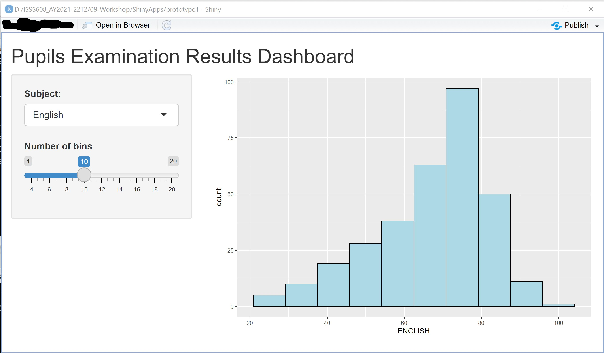

```{r setup, include=FALSE}
options(htmltools.dir.version = FALSE)
knitr::opts_chunk$set(
  fig.retina=3,
  echo = TRUE,
  eval = TRUE,
  cache = FALSE,
  message = FALSE, 
  warning = FALSE)
```

```{r xaringan-themer, include=FALSE, warning=FALSE}
library(xaringanthemer)
style_duo_accent(
  primary_color = "#1381B0",
  secondary_color = "#FF961C",
  inverse_header_color = "#FFFFFF"
)
```

## Content

.large[
- What is a Web-enabled Visual Analytics Application?

- Why building Web-enabled Visual Analytical Application?

- Evolution of web-based Technology

- Getting to Know Shiny
]

---
## What is a Web-enabled Visual Analytics Application?

.pull-left[
.large[
- Focuses and emphasises on **interactivity** and effective integration of techniques from **data analytics, visualization and human-computer interaction (HCI)**.]] 

.pull-right[
]

---
## Why building a Web-enabled Visual Analytics Application?

.pull-left[
.large[
- To explore how the best of these different but related domains can be combined such that **the sum is greater than the parts**.

- To **democratise data and analytics** through web-based analytical applications for data exploration, visualisation analysis and modelling.
]]

.pull-right[

.small[Source: https://www.rekener.com/blog/democratize-data-analytics-customer-data-platform-B2B]]

---
## Technology Challanges

.pull-left[
.large[
- Mainframe computing tend to have low usability and low accessibility.

- Desktop computing tend to have high usability but low accessibility.

- Web-based computing (including mobile computing) are highly accesible but with relatively low capability]]

.pull-right[
]

---
## Web-based data visualisation

.pull-left[
.large[
- The break-through is Rich Internet Applications (RIA)]]

.pull-right[
]

.small[Reference: https://www.computerworld.com/article/2551058/rich-internet-applications.html]

---
## Development of RIA

.pull-left[
### First generation RIA data visualisation (2000~)

.large[
- Adobe Flex Builder
    - Flare (http://flare.prefuse.org/)
- Microsoft Silverlight
- JavaFX]]

--
.pull-right[
### Second generation RIA data visualisation (2010~)

.large[
- HTML 5 + JavaScript + SVG + CSS 
    - Client-side rendering 
    - No plug-in is required
    - Mobile computing enabled
- D3.js (https://d3js.org/) - Data Driven Document
]]

---
## Methodological Challenges

.pull-left[
.large[
- Lack of analysis functions.

- Not reproducible.

- Not extendable.

- Require to learn multiple technologies and methods.]]

.pull-right[
]

---
## Getting to Know Shiny
### Shiny: Overview

.pull-left[
.large[
- Shiny is an open package from RStudio.

- It provides a **web application framework** to create interactive web applications (visualization) called "Shiny apps".

- It can be found at https://shiny.rstudio.com/
]]

.pull-right[
]

---
## Getting to Know Shiny
### What is so special about Shiny?

.pull-left[
.large[

It allows R users:
-  to build and share highly interactive web-enabled applications without having to invest significant among of time and efforts to master core web design technologies such as html5, Javascript and CSS.

- to integrate the analytical and visualisation packages of R without having to change from one programming language to another.]]

.pull-right[
]

---
## Getting to Know Shiny
### Understanding the architecture

.large[
- Every Shiny app is maintained by a computer running R.]


---
## Getting to Know Shiny
### The Structure of a Shiny app

.pull-left[
.large[
- A Shiny app comprises of two components, namely:
    - a user-interface script, and 
    - a server script.]]

.pull-right[
]

---

## Getting to Know Shiny
### Shiny's user-interface, *ui.R*

.large[
- The *ui.R* script controls the layout and appearance of a shiny app.  
    - It is defined in a source script name *ui.R*.
    
    - Actually, *ui* is a web document that the user gets to see, it is based on the famous Twitter bootstrap framework, which makes the look and layout highly customizable and fully responsive.
    
    - In fact, you only need to know R and how to use the shiny package to build a pretty web application. Also, a little knowledge of HTML, CSS, and JavaScript may help.]
    
---
## Getting to Know Shiny
### Shiny's server *server.R*

.large[
- The *server.R* script contains the instructions that your computer needs to build your Shiny app.

- You are expected to:

    - know how to programme with R.
    - familiar with Tidyverse, specifically dplyr, tidyr and ggplot2 
]

---
## Getting to Know Shiny
### Shiny Examples

.large[
The Shiny package has elevent built-in examples that each demonstrates how Shiny works.]  

.center[
]

---
## Getting to Know Shiny
### Runing Shiny example

.pull-left[
.large[
```{r, echo=TRUE, eval=FALSE}
library(shiny)
runExample("01_hello")
```
]]

.pull-right[

]

---
## Building a Shiny app

.large[
- A Shiny app can be in a form of a single file called ***app.R***.
- Alternatively, a Shiny app can be also created using seperate ***ui.R*** and ***server.R*** files.
- The seperate files way is preferred when the app is complex and involves more codes.]

.center[
]

---
## Building a Shiny app
### A basic Shiny app script


---
## Building a Shiny app
### Important tips of Shiny app file

.large[
- It is very important that the name of the file is *app.R*, otherwise it would not be recognized as a Shiny app.

- You should not have any R code after the **shinyApp(ui = ui, server = server)** line. That line needs to be the last line in your file.

- It is good practice to place this app in its own folder, and not in a folder that already has other R scripts or files, unless those other files are used by your app.
]

---
## Loading the dataset

.pull-left[
.large[
```{r, echo=TRUE,eval=FALSE}
library(shiny)
library(tidyverse)

exam <- read_csv("data/Exam_data.csv")

ui <- fluidPage()
server <- function(input, output) {}
shinyApp (ui=ui, server=server)
```
]]

.pull-right[
.large[
- Make sure that the data file path and file name are correct.

- To check if the dataset has been added correctly, you can add a *print()* argument after reading the data.
]]

---
# Shiny Layout

.large[
- Shiny ui.R scripts use the function *fluidPage* to create a display that automatically adjusts to the dimensions of your user's browser window. 

- You lay out your app by placing elements in the fluidPage function. 

- *titlePanel* and *sidebarLayout* are the two most popular elements to add to fluidPage. They create a basic Shiny app with a sidebar.
]


---
## Shiny Layout Panels
### An overview

.center[
]

---
## Shiny Layout Panels
### Panels

.large[
- Use panels to group multiple elements into a single element that has its own properties.

- Especially important and useful for complex apps with a large number of inputs and outputs such that it might not be clear to the user where to get started.]

---
## Shiny Layout Panels
### titlePanel()

.center[
]


---
## Building the basic UI
### Working with *titlePanel*

.pull-left[
.large[
- *titlePanel* is used to add the application title.

```{r, echo=TRUE, eval=FALSE}
library(shiny)
library(tidyverse)

exam <- read_csv("data/Exam_data.csv")

ui <- fluidPage( #<<
  titlePanel("Pupils Examination Results Dashboard") #<<
) #<<

server <- function(input, output) {}

shinyApp (ui=ui, server=server)
```
]]

.pull-right[
]


---
## Shiny Layout Panels
### sidebarPanel() and mainPanel()

.center[
]

---
## Building the basic UI
### Working with *sidebarLayout()*

.center[
]

---
## Building the basic UI
### Working with *sidebarLayout()*

.large[
- *sidebarLayout()* always takes two arguments:
    - *sidebarPanel()* function output
    - *mainPanel()* function output
- These functions place content in either the sidebar or the main panels. 
- The *sidebarPanel()* will appear on the left side of your app by default. You can move it to the right side by giving *sidebarLayout()* the optional argument position = "right".
- You can use *navbarPage* to give your app a multi-page user-interface that includes a navigation bar. Or you can use *fluidRow()* and *column()* to build your layout up from a grid system. 
- To learn more about the advanced options, read the Shiny Application Layout Guide [http://shiny.rstudio.com/articles/layout-guide.html].] 

---
## Building the basic UI
### Working with *sidebarLayout()*

```{r, echo=TRUE,eval=FALSE}
library(shiny)
library(tidyverse)

exam <- read_csv("data/Exam_data.csv")

ui <- fluidPage(
  titlePanel("Pupils Examination Results Dashboard"),
  sidebarLayout( #<<
    sidebarPanel("Side bar panel"), #<<
    mainPanel("View display") #<<
  ) #<<
)

server <- function(input, output) {}
shinyApp (ui=ui, server=server)
```

- Note that in a fluid design your sidebar and other elements may "collapse" if your browser view is not wide enough.

---
## Shiny Inputs
### An overview of Shiny Inputs

.left-column[
- Inputs are what gives users a way to interact with a Shiny app.

- Shiny provides many input functions to support many kinds of interactions that the user could have with an app. ]

.right-column[
]

Reference: Refer to  [2 Basic UI](https://mastering-shiny.org/basic-ui.html) of Master Shiny to learn more about Shiny UI usage and arguments.

---
## Shiny Inputs
### Inputs syntax

.pull-left[
- All input functions have the same first two arguments: inputId and label. 
- The inputId will be the name that Shiny will use to refer to this input when you want to retrieve its current value. 
- It is important to note that every input must have a unique inputId.  
- The label argument specifies the text in the display label that goes along with the input widget. 
- Every input can also have multiple other arguments specific to that input type.]

.pull-right[
]

---
## Shiny Inputs
### Adding inputs to the UI (*selectInput()* and *sliderInput()* functions)

```{r, echo=TRUE,eval=FALSE}

ui <- fluidPage(
  titlePanel("Pupils Examination Results Dashboard"),
  sidebarLayout(
    sidebarPanel( #<<
      selectInput(inputId = "variable", #<<
                  label = "Subject:", #<<
                  choices = c("English" = "ENGLISH", #<<
                              "Maths" = "MATHS",#<<
                              "Science" = "SCIENCE"), #<<
                  selected = "ENGLISH"), #<<
      sliderInput(inputId = "bins", #<<
                  label = "Number of Bins", #<<
                  min = 5, #<<
                  max = 20, #<<
                  value= 10) #<<
                ), #<<
    mainPanel()
  )
)
```

---
## Shiny Inputs
### Adding *checkboxInput()*

.large[
Add a checkbox input to specify whether the data plotted should be shown in a data table.

- ui: Add an input widget that the user can interact with to check/uncheck the box.

- ui: Add an output defining where the data table should appear.

- server: Add a reactive expression that creates the
data table if the checkbox is checked.
]

---
## Shiny Inputs
### Adding *checkboxInput()*

.large[
- ui: Add an input widget that the user can interact with to check/uncheck the box.]

```{r echo=TRUE, eval=FALSE}
sliderInput(inputId = "bin",
            label = "Number of Bins",
            min = 5,
            max = 20,
            value = c(10)),
checkboxInput(inputId = "show_data", #<<
              label = "Show data table", #<<
              value = TRUE) #<<
        ), #<<
    mainPanel()
  )
)
```

---
## Shiny *Output()*
### An overview of Shiny *Output()* 

.large[
- After creating all the inputs, we should add elements to the UI to display the outputs. 
- To display output, add it to *fluidPage()* with an *Output()* function.]

.center[
]

.large[
- Similarly to the input functions, all the ouput functions have a outputId argument that is used to identify each output, and this argument must be unique for each output.
- Each output needs to be constructed in the server code later.]

---
## Shiny *Output()*
### Shiny *Output()* options

.pull-left[
.large[
- Outputs can be any object that R creates and that we want to display in our app - such as a plot, a table, or text.]]

.pull-right[
]

---
## Shiny *Output()*
### Adding *plotOutput()*

```{r, echo=TRUE, eval=FALSE}

ui <- fluidPage(
    titlePanel("Pupils Examination Results Dashboard"),
    sidebarLayout(
        sidebarPanel("Side bar panel"),
        mainPanel(
            plotOutput("distPlot") #<<
        )    
    )
)
```

---
## Shiny server.R
### Building an output

.large[
There are three rules to build an output in Shiny, they are:

- Save the output object into the output list (remember the app template - every server function has an output argument).

- Build the object with a *render()* function, where is the type of output.

- Access input values using the input list (every server function has an input argument)

Note: The third rule is only required if you want your output to depend on some input.
]

---

## Shiny server.R
### A generic Shiny *Render()* syntax


---
## Shiny server.R
### Shiny *Render()*

.center[
]

---
## Shiny server.R
### Building a basic output

Let's first see how to build a very basic output using only the first two rules. We'll create a plot and send it to the ***distPlot*** output.

```{r, echo=TRUE, eval=FALSE}

server <- function(input, output){
    output$distPlot <- renderPlot({ #<<
        ggplot(exam, aes(ENGLISH)) + #<<
            geom_histogram(bins = 20, #<<
                           color="black", #<< 
                           fill="light blue") #<<
    }) #<<
} 
```

- This simple code shows the first two rules: we're creating a plot inside the *renderPlot()* function, and assigning it to ***distPlot*** in the output list. 
- Remember that every output created in the UI must have a unique ID, now we see why. In order to attach an R object to an output with ID x, we assign the R object to ***output$distPlot***.
- Since ***distPlot*** was defined as a ***plotOutput***, we must use the *renderPlot()* function, and we must create a plot inside the *renderPlot()* function.

---
## Shiny server.R
### Building a complete output 

```{r, echo=TRUE, eval=FALSE}
server <- function(input, output){
    output$distPlot <- renderPlot({
        x <- unlist(exam[,input$variable]) #<<
        
        ggplot(exam, aes(x)) +
            geom_histogram(bins = input$bin,
                           color="black", 
                           fill="light blue")
    })
}
```

---
## Shiny server.R
### Building a complete output: The revised version 

```{r, echo=TRUE, eval=FALSE}
server <- function(input, output){
    output$distPlot <- renderPlot({
      ggplot(exam, 
             aes_string(x = input$variable)) + #<<
        geom_histogram(bins = input$bin,
                       color="black", 
                       fill="light blue")
      })
}
```

+ Notice that [`aes_string()`](https://ggplot2.tidyverse.org/reference/aes_.html) instead of `aes()` of ggplot2 is used.  To understand the differences between `aes_string()` and `aes()`, please refer to this [link](https://stackoverflow.com/questions/28897577/what-is-the-difference-between-aes-and-aes-string-ggplot2-in-r).  


---
## The shinyApp()

.large[
- It is important to add *shinyApp()* at the end of your Shiny application.] 

```{r, echo=TRUE, eval=FALSE}
shinyApp(ui = ui, server = server) #<<
```

.center[
]

---
## Shiny app is Reactive

.large[
- Reactivity automatically occurs when an input value is used to render an output object.]

.center[
]

---
## Reactive Flow

.center[
]

---
## Survival Tips

.large[
- Always run the entire script, not just up to the point where you’re developing code.

- Sometimes the best way to see what’s wrong is to run the app and review the error.

- Watch out for commas!
]

---
# References

* Hadley Wickham (2021) ['''Mastering Shiny'''](https://mastering-shiny.org/index.html), O’Reilly Media.  This is a highly recommended book. 

* [Building Web Applications with Shiny](https://rstudio-education.github.io/shiny-course/), especially Module 1 and 2.

* [Shiny Three Parts Tutorial](https://shiny.rstudio.com/tutorial/).

* [Online Function reference](https://shiny.rstudio.com/reference/shiny/1.5.0/)

* [The basic parts of a Shiny app](https://shiny.rstudio.com/articles/basics.html)

* [How to build a Shiny app](https://shiny.rstudio.com/articles/build.html)

* [The Shiny Cheat sheet](https://shiny.rstudio.com/articles/cheatsheet.html)


**Beyond Uncle Google!** Last but not least, when you need help  

* [How to get help](https://shiny.rstudio.com/articles/help.html)


```{r echo=FALSE, eval=FALSE}
library(pagedown)
pagedown::chrome_print("Shiny1.html")
```


