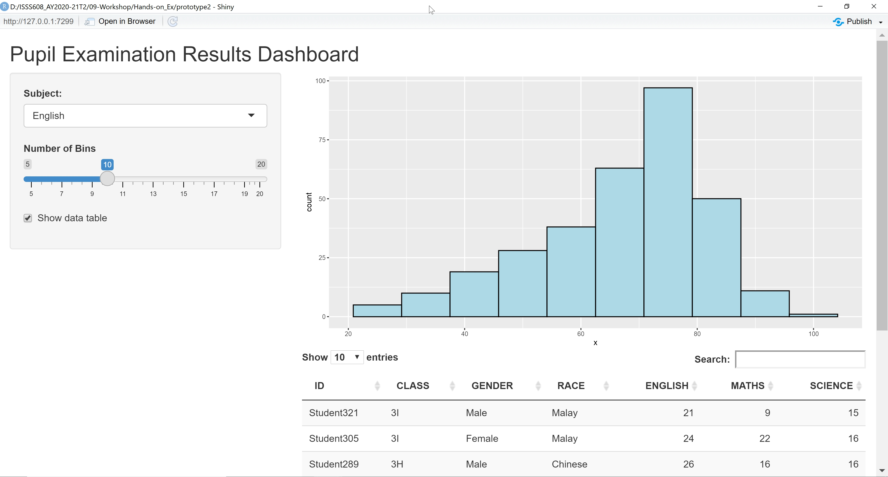
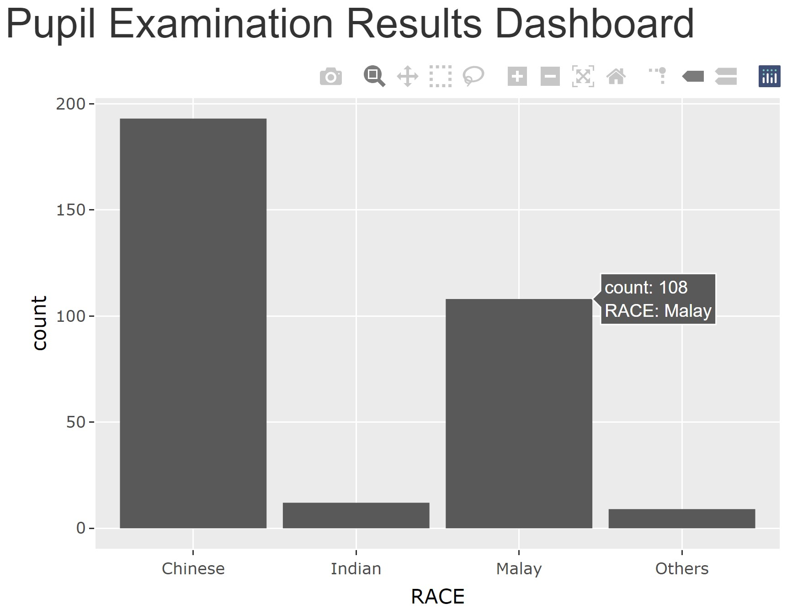
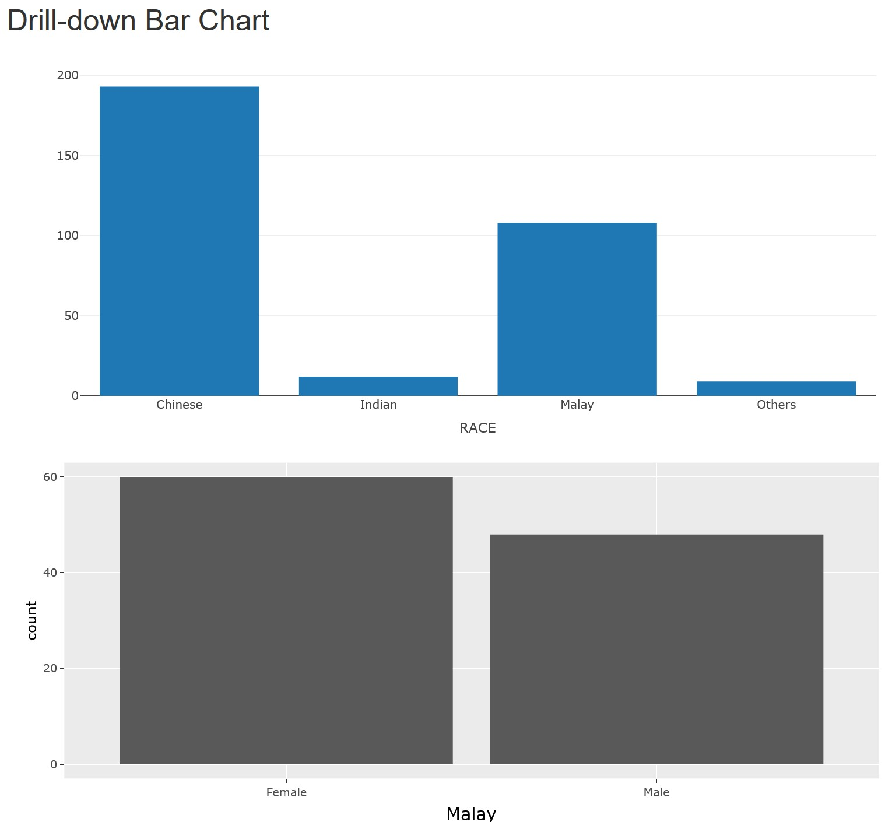
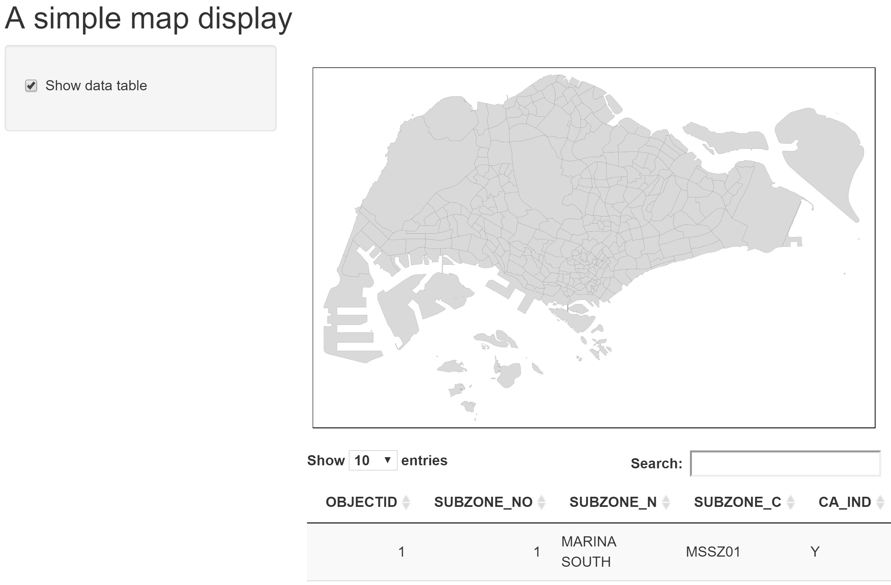

```{r setup, include=FALSE}
knitr::opts_chunk$set(fig.retina=3,
                      echo = TRUE,
                      eval = TRUE,
                      cache = FALSE,
                      message = FALSE,
                      warning = FALSE)
```

```{r xaringan-themer, include=FALSE, warning=FALSE}
library(xaringanthemer)
style_duo_accent(
  primary_color = "#1381B0",
  secondary_color = "#FF961C",
  inverse_header_color = "#FFFFFF"
)
```

## Overview

.large[
In this lesson, selected advanced methods of  Shiny will be discussed.  You will also gain hands-on experiences on using these advanced methods to build Shiny applications. 

By the end of this lesson, you will be able to:

- gain further understanding of the reactive feature of Shiny and Shiny's functions that support reactive flow,
- build interactive Shiny application by using plotly R and
- build static, interactive and reactive geovisualisation application by using tmap
]

---
## Reactive Flow

By default, Shiny application is **Reactive**!

.center[

]

---
## Reactive Flow - the basic

The user selects an input, this input goes through some expression in the server, and an output is rendered. Each time the user changes their input selection, the expression that generates the output will automatically re-execute, and the relevant output will be re-rendered based on the new value of the input.

In a Shiny application, there’s no need to explictly describe the relationships between inputs and outputs and tell R what to do when each input changes, Shiny automatically handles these details for you.

.center[

]

.small[
Source: [Module 2](https://minecr.shinyapps.io/02-flow/#section-reactive-flow) of [Building Web Applications with Shiny](https://rstudio-education.github.io/shiny-course/)
]

---
## Reactive Flow - The full features

.center[

]

---
### Reactive elements

Three components of reactive execution in Shiny are:

- reactive inputs,
- reactive expressions, and
- reactive outputs.

.center[

]

---
### Reactive elements

.pull-left[
#### Reactive inputs and outputs

- A **reactive input** is a user input that comes through a browser interface, typically.
- A **reactive output** is something that appears in the user’s browser window, such as a plot or a table of values.
.center[

]

- One reactive input can be connected to multiple outputs, and vice versa. For example we might have a UI input widget for filtering out data based on user’s selection, and the filtered data can be used in multiple outputs like plots and summaries.
]

--
.pull-right[
#### Reactive expressions

- A **reactive expressions** is component between an input and an output.

- It can both be a dependent (i.e be a child) and have dependents (i.e. be a parent).


]

---
## In-class Exercise: Building a reactive scatter plot using Shiny

.pull-left[
In this in-class exercise, you are going to explore advanced reactive features.

To get started, you need to do the followings:

- start a new Shiny Application
- load the necessary R package, namely Shiny and tidyverse
- import the data file (i.e. Exam_data.csv )
- build a basic scatterplot look similar to the figure on the right.
]

.pull-right[

]

---
### The UI 

```{r eval=FALSE}
library(shiny)
library(tidyverse)
exam <- read_csv("data/Exam_data.csv")
ui <- fluidPage(
    titlePanel("Subject Correlation Analysis"),
    sidebarLayout(
        sidebarPanel(
            selectInput(inputId = "yvariable",
                        label = "y Variable:",
                        choices = c("English" = "ENGLISH",
                                    "Maths" = "MATHS",
                                    "Science" = "SCIENCE"),
                        selected = "MATHS"),
            selectInput(inputId = "xvariable",
                        label = "x Variable:",
                        choices = c("English" = "ENGLISH",
                                    "Maths" = "MATHS",
                                    "Science" = "SCIENCE"),
                        selected = "SCIENCE")
        ),
        mainPanel(
            plotOutput("scatterPlot")
        )
    )
)
```

---
### The server

```{r eval=FALSE}
server <- function(input, output, session){    #<<
    output$scatterPlot <- renderPlot({
        ggplot(data=exam,
               aes_string(x = input$xvariable,      #<<
                          y = input$yvariable)) +   #<<
                   geom_point()
    })
}
```

Lastly, do not forget to add this line!

```{r eval=FALSE}
shinyApp (ui=ui, server=server)
```

---
## Stop-trigger-delay

In this section, you will learn how to how to stop, trigger, and delay Shiny actions.

- Using *submitButton()*
- Using *isolate()* and *actionButton()*

---
### Working with *submitButton()*

.center[

]

---
### Working with *submitButton()*

.large[
- *submitButton()* is used when you want to delay a reaction.

- Edit the code as shown below:

```{r eval=FALSE}
            selectInput(inputId = "xvariable",
                        label = "x Variable:",
                        choices = c("English" = "ENGLISH",
                                    "Maths" = "MATHS",
                                    "Science" = "SCIENCE"),
                        selected = "SCIENCE"),
            submitButton("Apply changes")  #<<
```

Note: The use of *submitButton* is generally discouraged in favor of the more versatile *actionButton()*
]

.small[Reference: https://shiny.rstudio.com/reference/shiny/latest/submitButton.html]

---
### Isolating reactions
#### When to use?

.pull-left[
- Suppose your app has an input widget where users can enter text for the title of the plot. However you only want the title to update if any of the other inputs that go into the plot change. You can achieve this by isolating the plot title such that: 
    - When input$x or input$y changes, the plot will update.
    - But when only the title input (input$plot_title) changes, the plot will not update.
]

.pull-right[

]

.small[Reference: https://shiny.rstudio.com/articles/isolation.html]

---
### Working with *isolate()* and *actionButton()*

.large[

- At the ui, edit the code as shown below:]

```{r eval=FALSE}
            selectInput(inputId = "xvariable",
                        label = "x Variable:",
                        choices = c("English" = "ENGLISH",
                                    "Maths" = "MATHS",
                                    "Science" = "SCIENCE"),
                        selected = "SCIENCE"),
            textInput(                      #<< 
                inputId = "plot_title",     #<<
                label = "Plot title",       #<<
                placeholder = "Enter text to be used as plot title"), #<<
            actionButton("goButton", "Go!") #<<
```

- Reference guide on [textInput()](https://shiny.rstudio.com/reference/shiny/1.6.0/textInput.html)
- Reference guide on [actionButton()](https://shiny.rstudio.com/reference/shiny/1.6.0/actionButton.html)

---
### Working with *isolate()* and *actionButton()*

.large[
- At the server side, edit the codes as shown below:]

```{r eval=FALSE}
server <- function(input, output, session){
    output$scatterPlot <- renderPlot({
        input$goButton                           #<<
        
        ggplot(data=exam,
               aes_string(x = input$xvariable,
                          y = input$yvariable)) +
            geom_point() +
            labs(title = isolate({               #<<
                toTitleCase(input$plot_title)    #<<
            }))                                  #<<
    })
}
```

- Reference guide on [isolate()](https://shiny.rstudio.com/reference/shiny/1.6.0/isolate.html)

---
## Embedding Interactive Graphs in R Shiny
### The **plotly** way

.pull-left[
Two approaches:
- Using plotly directly, or
- Plot the basic visualisation using **ggplot2**, then wrap the visualisation object into plotly object using *ggplotly()*.

Reference:
- [Plotly R Open Source Graphing Library](https://plotly.com/r/)
- [17 Server-side linking with shiny](https://plotly-r.com/linking-views-with-shiny.html) of [Interactive web-based data visualization with R, plotly, and shiny](https://plotly-r.com/index.html)
]

.pull-right[
]

---
### In-class Exercise: Embedding an interactive scatter plot in Shiny

.pull-left[
- Install plotly R package if it has yet to be install in RStudio.
- include a new line as shown below to launch plotly library. 

```{r}
library(shiny)
library(plotly) #<< 
library(tidyverse)
```

- At UI, edit the code as shown below

```{r eval=FALSE}
 mainPanel(
    plotlyOutput("scatterPlot") #<<
```
]

--
.pull-right[

- edit the server section of the Shiny app as shown below.

```{r eval=FALSE}
server <- function(input, output){
    output$scatterPlot <- renderPlotly({ #<<
        
      p <- ggplot(data = exam, 
            aes_string(x = input$xvariable,
                       y = input$yvariable)) +
            geom_point(color="grey 10", 
                       size=1)
        
            ggplotly(p) #<<                           
    })
}
```
]

---
### In-class Exercise: Embedding an interactive bar chart in Shiny

In this exercise, you will learn how going to embed an interactive bar chart in Shiny by using plotly.  The output will look similar to the figure below.

.center[

]

---
### In-class Exercise: Embedding an interactive bar chart in Shiny

.pull-left[
The ui:

```{r eval=FALSE}
library(shiny)
library(plotly)
library(tidyverse)

exam <- read_csv("data/Exam_data.csv")

ui <- fluidPage(
    titlePanel("Pupils Profile"),
    mainPanel(
            plotlyOutput("race"),
        )
    )
```
]

--
.pull-right[
The server:

```{r}
server <- function(input, output) {
    output$race <- renderPlotly({
        p <- ggplot(data=exam, 
                    aes(x=RACE)) +
            geom_bar()
        ggplotly(p)
    })
}
```

Last but not least the app

```{r eval=FALSE}
shinyApp (ui=ui, server=server)
```
]

---
### In-class Exercise: Embedding a drill-down bar chart in Shiny

In this exercise, you will learn how to embed a drill-down bar chart in Shiny by using [event_data()](https://search.r-project.org/CRAN/refmans/plotly/html/event_data.html) of plotly.

.center[

]

---
### In-class Exercise: Embedding a drill-down bar chart in Shiny

.pull-left[
The ui:

```{r eval=FALSE}
library(shiny)
library(plotly)
library(tidyverse)

exam <- read_csv("data/Exam_data.csv")

ui <- fluidPage(
    titlePanel("Drill-down Bar Chart"),
    mainPanel(
            plotlyOutput("race"),
            plotlyOutput("gender"),
            verbatimTextOutput("info")
        )
    )
```

Visit this [link](https://www.marsja.se/how-to-use-in-in-r/) to learn more about %in%.
]

--
.pull-right[
The server:

```{r}
server <- function(input, output) {
    output$race <- renderPlotly({
        p <- ggplot(data=exam, 
                    aes(x=RACE)) +
            geom_bar()
        ggplotly(p)
    })
    output$gender <- renderPlotly({
        d <- event_data("plotly_click") #<<
        if (is.null(d)) return(NULL) #<<
        
        p <- exam %>% 
            filter(RACE %in% d$x) %>%  #<<
            ggplot(aes(x=GENDER)) +
            geom_bar() 
        ggplotly(p) %>%
            layout(xaxis = list(title = d$x)) #<<
    })
    output$info <- renderPrint({
        event_data("plotly_click") #<<
    })    
}
```
]

---
### In-class Exercise: Embedding a drill-down bar chart in Shiny (Revised version)

.pull-left[
The ui:

```{r eval=FALSE}
library(shiny)
library(plotly)
library(tidyverse)

exam <- read_csv("data/Exam_data.csv")

ui <- fluidPage(
    titlePanel("Drill-down Bar Chart"),
    mainPanel(
            plotlyOutput("race"),
            plotlyOutput("gender"),
            verbatimTextOutput("info")
        )
    )
```
]

--
.pull-right[
The server:

```{r}
server <- function(input, output) {
    output$race <- renderPlotly({
        p <- exam %>% #<<
            plot_ly(x = ~RACE) #<<
    })

    output$gender <- renderPlotly({
        d <- event_data("plotly_click")
        if (is.null(d)) return(NULL)
        
        p <- exam %>% 
            filter(RACE %in% d$x) %>% 
            ggplot(aes(x=GENDER)) +
            geom_bar() 
        ggplotly(p) %>%
            layout(xaxis = list(title = d$x))
    })

    output$info <- renderPrint({
        event_data("plotly_click")
    })    
}
```
]

---
## In-class Exercise: Embedding A Static Map in Shiny

In this exercise, you will learn how to embed a static map in Shiny by using *renderPlot()*.  By the end of this exercise, you will be able to plot a static map on Shiny display as shown below.

.center[

]

---
### In-class Exercise: Embedding A Static Map in Shiny

.pull-left[
#### Setting up

```{r eval=FALSE}
library(shiny)
library(sf)
library(tmap)
library(tidyverse)
```
]

--
.pull-right[
#### Importing the geospatial data

```{r eval=FALSE}
mpsz <- st_read(dsn = "data/geospatial", 
                layer = "MP14_SUBZONE_WEB_PL")
```
]

---
### In-class Exercise: Embedding a static map in Shiny

The UI codes

```{r eval=FALSE}
ui <- fluidPage(
    titlePanel("A simple map display"),
    sidebarLayout(
        sidebarPanel(
            checkboxInput(inputId = "show_data",
                          label = "Show data table",
                          value = TRUE)
        ),
        mainPanel(
            plotOutput("mapPlot"),
            DT::dataTableOutput(outputId = "szTable")
        )
    )
)
```

---
### In-class Exercise: Embedding a static map in Shiny

The Server codes:

```{r eval=FALSE}
server <- function(input, output){
    output$mapPlot <- renderPlot({
        tm_shape(mpsz)+
            tm_fill() +
            tm_borders(lwd = 0.1,  alpha = 1)
    })
    
    output$szTable <- DT::renderDataTable({
        if(input$show_data){
            DT::datatable(data = mpsz %>% select(1:7),
                          options= list(pageLength = 10),
                          rownames = FALSE)
        }
    })    
}
```

Important, don't miss out this line

```{r eval=FALSE}
shinyApp (ui=ui, server=server)
```

---
## In-class Exercise:  Building a choropleth mapping application

In this exercise, you will learn how to build a choropleth mapping application by using tmap and Shiny.

.center[

]

---
### In-class Exercise:  Building a choropleth mapping application

Edit the code as shown below:

```{r eval=FALSE}
library(shiny)
library(sf)
library(tmap)
library(tidyverse)

mpsz <- st_read(dsn = "data/geospatial", 
                layer = "MP14_SUBZONE_WEB_PL")

popagsex <- read_csv("data/aspatial/respopagsex2000to2018.csv") #<<
```

---
### In-class Exercise:  Building a choropleth mapping application

Edit the codes as shown below:

```{r eval=FALSE}
popagsex2018_male <- popagsex %>%
    filter(Sex == "Males") %>%
    filter(Time == 2018) %>%
    spread(AG, Pop) %>%
    mutate(YOUNG = `0_to_4`+`5_to_9`+`10_to_14`+
               `15_to_19`+`20_to_24`) %>%
    mutate(`ECONOMY ACTIVE` = rowSums(.[9:13])+
               rowSums(.[15:17]))%>%
    mutate(`AGED`=rowSums(.[18:22])) %>%
    mutate(`TOTAL`=rowSums(.[5:22])) %>%  
    mutate(`DEPENDENCY` = (`YOUNG` + `AGED`)
           /`ECONOMY ACTIVE`) %>%
    mutate_at(.vars = vars(PA, SZ), 
              .funs = funs(toupper)) %>%
    select(`PA`, `SZ`, `YOUNG`, 
           `ECONOMY ACTIVE`, `AGED`, 
           `TOTAL`, `DEPENDENCY`) %>%
    filter(`ECONOMY ACTIVE` > 0)
mpsz_agemale2018 <- left_join(mpsz,
                              popagsex2018_male,
                              by = c("SUBZONE_N" = "SZ"))
```

---
### In-class Exercise:  Building a choropleth mapping application

At the UI, edit the codes as shown below:

```{r eval=FALSE}
ui <- fluidPage(
    titlePanel("Choropleth Mapping"),
    sidebarLayout(
        sidebarPanel(
            selectInput(inputId = "classification",
                        label = "Classification method:",
                        choices = list("fixed" = "fixed", 
                                       "sd" = "sd", 
                                       "equal" = "equal", 
                                       "pretty" = "pretty", 
                                       "quantile" = "quantile", 
                                       "kmeans" = "kmeans", 
                                       "hclust" = "hclust", 
                                       "bclust" = "bclust", 
                                       "fisher" = "fisher", 
                                       "jenks" = "jenks"),
                        selected = "pretty"),
```

---
### In-class Exercise:  Building a choropleth mapping application

At the UI, continue edit the codes as shown below:

```{r eval=FALSE}
            sliderInput(inputId = "classes",
                        label = "Number of classes",
                        min = 6,
                        max = 12,
                        value = c(6)),
            selectInput(inputId = "colour",
                        label = "Colour scheme:",
                        choices = list("blues" = "Blues", 
                                       "reds" = "Reds", 
                                       "greens" = "Greens",
                                       "Yellow-Orange-Red" = "YlOrRd",
                                       "Yellow-Orange-Brown" = "YlOrBr",
                                       "Yellow-Green" = "YlGn",
                                       "Orange-Red" = "OrRd"),
                        selected = "YlOrRd")
        ),
```

---
### In-class Exercise:  Building a choropleth mapping application

At the server, edit the codes as shown below:

```{r eval=FALSE}
server <- function(input, output){
    output$mapPlot <- renderPlot({
        tm_shape(mpsz_agemale2018)+ #<<
            tm_fill("DEPENDENCY",  #<<
                    n = input$classes, #<<
                    style = input$classification, #<<
                    palette = input$colour) + #<<
            tm_borders(lwd = 0.1,
                       alpha = 1)
        })
}
```

A gentle reminder,

```{r eval=FALSE}
shinyApp (ui=ui, server=server)
```

---
## Embedding an interactive map in Shiny

In this exercise, you will learn how to embed an interactive map in Shiny by using *renderTmap()* and *tmapOutput()* of **tmap** package.  The interactive map is a proportional symbol map showing distribution of winnings by branches/outlets.

.center[

]

---
### Embedding an interactive map in Shiny
#### Setting up

```{r eval=FALSE}
library(shiny)
library(sf)
library(tmap)
library(tidyverse)
```

#### Importing the geospatial data

```{r eval=FALSE}
sgpools <- read_csv("data/aspatial/SGPools_svy21.csv")
sgpools_sf <- st_as_sf(sgpools, 
                       coords = c("XCOORD", 
                                  "YCOORD"),
                       crs= 3414)
```

Things to learn from the code chunk above:

- [*st_as_sf()*](https://r-spatial.github.io/sf/reference/st_as_sf.html) of sf package is used to convert the tibble data frame into simple feature data frame by using values from the XCOORD and YCOORD fields.  The crs argument is used to specify the projected coordinates systems (i.e. svy21 for Singapore).

---
### Embedding an interactive map in Shiny
#### The ui

```{r eval=FALSE}
ui <- fluidPage(
    titlePanel("Interactive Map View"),
    sidebarLayout(
        sidebarPanel(
            checkboxInput(inputId = "showData",
                          label = "Show data table",
                          value = TRUE)
        ),
        mainPanel(
            tmapOutput("mapPlot"), #<<
            DT::dataTableOutput(outputId = "aTable")
        )
    )
)

```

Notice that *tmapout()* is used instead of *plotOutput()*.

---
### Embedding an interactive map in Shiny
#### The server

```{r eval=FALSE}
server <- function(input, output, session){
    output$mapPlot <- renderTmap({   #<<
        tm_shape(sgpools_sf)+
            tm_bubbles(col = "OUTLET TYPE",
                       size = "Gp1Gp2 Winnings",
                       border.col = "black",
                       border.lwd = 0.5)
    })
    
    output$aTable <- DT::renderDataTable({
        if(input$showData){
            DT::datatable(data = sgpools_sf %>% 
                            select(1:4),
                          options= list(pageLength = 10),
                          rownames = FALSE)
        }
    })    
}
```
Notice that [*renderTmap()*](https://rdrr.io/cran/tmap/man/renderTmap.html) is used instead of *renderPlot()*.

---
## In-class Exercise: Reactive Map in R Shiny

In this exercise, you will learn how to create reactive map in Shiny.  The output will look similar to the figure below.

.center[

]

---
### In-class Exercise: Reactive Map in R Shiny
#### The ui

```{r eval=FALSE}
ui <- fluidPage(
    titlePanel("Reactive Map"),
    sidebarLayout(
        sidebarPanel(
            selectInput(inputId = "type",
                        label = "Branch or Outlet?",
                        choices = c("branch" = "Branch",
                                    "outlet" = "Outlet"),
                        selected = "Branch",
                        multiple = TRUE),
            sliderInput(inputId = "winning", 
                        label = "Number of winnings", 
                        min = 2,
                        max = 80, 
                        value = 20),
            checkboxInput(inputId = "showData",
                          label = "Show data table",
                          value = TRUE)
        ),
```

---
### In-class Exercise: Reactive Map in R Shiny
#### The ui (continue)

```{r eval=FALSE}
        mainPanel(
            tmapOutput("mapPlot"),
            DT::dataTableOutput(outputId = "aTable")
        )
    )
)
```

---
### In-class Exercise: Reactive Map in R Shiny
#### The server

```{r eval=FALSE}
server <- function(input, output, session){
    dataset = reactive({ #<<                   
        sgpools_sf %>% #<<
            filter(TYPE == input$type) %>% #<<
            filter(WINNINGS > input$winning) #<<
    })
    
    output$mapPlot <- renderTmap({
        tm_shape(shp = dataset(), #<<
                 bbox = st_bbox(sgpools_sf))+ #<<
            tm_bubbles(col = "TYPE",
                       size = "WINNINGS",
                       border.col = "black",
                       border.lwd = 0.5)
    })
```

Things to learn from the code chunk above:

- [*reactive()*](https://shiny.rstudio.com/reference/shiny/1.6.0/reactive.html) is used to create a reactive expression (i.e. dataset) that hold the extracted data set.
- *bbox = st_bbox()* argument is used to fix the extend of the map view.

---
### In-class Exercise: Reactive Map in R Shiny
#### The server (continue)

```{r eval=FALSE}
    output$aTable <- DT::renderDataTable({
        if(input$showData){
            DT::datatable(data = dataset() %>% #<<
                              select(1:4),
                          options= list(pageLength = 10),
                          rownames = FALSE)
        }
    })    
}
```

Also, don't forget this magic line!

```{r eval=FALSE}
shinyApp (ui=ui, server=server)
```

---
## References

- Hadley Wickham (2020) **Mastering Shiny: Build Interactive Apps, Reports, and Dashboards Powered by R** online version
    - [Chapter 3 Basic reactivity](https://mastering-shiny.org/basic-reactivity.html)
    - [Chapter 13 Why reactivity?](https://mastering-shiny.org/reactive-motivation.html)
    - [Chapter 14 The reactive graph](https://mastering-shiny.org/reactive-graph.html)
    - [Chapter 15 Reactive building blocks](https://mastering-shiny.org/reactivity-objects.html)
    - [Chapter 16 Escaping the graph](https://mastering-shiny.org/reactivity-components.html)
- Carson Sievert (2019) **Interactive web-based data visualization with R, plotly, and shiny**, online version. 
    - [Chapter 17 Server-side linking with shiny](https://plotly-r.com/linking-views-with-shiny.html)


```{r echo=FALSE, eval=FALSE}
library(pagedown)
pagedown::chrome_print("Lesson12-Advanced_Shiny.html")
```
