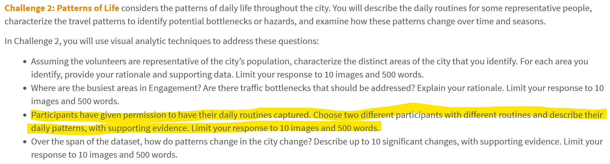

```{r setup, include=FALSE}
knitr::opts_chunk$set(echo = FALSE)
```

# The Task

With reference to bullet point 3 of Challenge 2 of VAST Challenge 2022, you are required to reveal the daily routines of **two** selected participant of the [city of Engagement, Ohio USA](https://vast-challenge.github.io/2022/).  For the purpose of this take-home exercise, you are required to use [**ViSIElse**](https://cran.r-project.org/web/packages/ViSiElse/index.html) and other appropriate visual analytics methods.



# Submission Instructions 

This is an individual assignment. You are required to work on the take-home exercises and prepare submission individually. 

- The take-home exercise submission must be written by using **distill for R Markdown**.  It can be in either [distill article](https://distill.pub/guide/) or [distill blog ](https://rstudio.github.io/distill/blog.html) format. You are required to publish the exercise on [Netlify](https://www.netlify.com/) and provide the link on the take-home exercise submission page on elearn. 
- You are also required to push the take-home exercise folder and data onto your individual Github repository and provide the link on the take-home exercise submission page on eLearn.
 
### Submission date 
 
Your completed take-home exercise is due on **22nd May 2022, by 11:59pm evening**.

# Peer Learning

- [ALOYSIUS TENG]()
- [ANTONIUS HANDY](https://isss608-hhhandy.netlify.app/th_ex/th_ex4.html)
- [CHE XUAN](https://r4dsa4va.netlify.app/th_ex/th_ex4.html)
- [CHU YI-NING]()
- [CUI JIARUI](https://jiarui-cui-isss608.netlify.app/th_ex/th_ex04)
- [DAVID KWOK WEI XIANG]()
- [DING YANMU](https://dingyanmu.netlify.app/th_ex/th_ex4.html)
- [HERANSHAN SO SUBRAMANIAM]()
- [HUANG ANNI](https://huanganni.netlify.app/th_ex/th_ex4.html)
- [HUANG YAPING](https://analytics-homework.netlify.app/th_ex/th_ex4.html)
- [HULWANA BINTE SAIFULZAMAN](https://hulwana-va.netlify.app/th_ex/th_ex4.html)
- [KIM BOMIN]()
- [LAM KUO JIAN JEREMIAH](https://jeremiahlam.netlify.app/th_ex/th_ex4.html)
- [LEE XIAO QI](https://tiffanylxq.netlify.app/takehomeex/th_ex4_final)
- [LI HONGYI](https://jessielhy.netlify.app/th_ex/th_ex4.html)
- [LI HUAN](https://katherine-isss608.netlify.app/th_ex/th_ex4.html)
- [LI MINQI](https://isss608-visualization-liminqi.netlify.app/th_ex/th_ex4)
- [LIU ZHENGLIN](https://zhenglinliuvisual.netlify.app/th_ex/th_ex4.html)
- [LONG NU](https://leslielong-da.netlify.app/posts/2022-05-16-takehome4/) 
- [NI JUNQIU](https://isss-608-junqiuni.netlify.app/takehome_ex/takehome_ex04.html)
- [ONG ZHI RONG JORDAN](https://isss608-jordan-va.netlify.app/th_ex4/th_ex4.html)
- [RAKENDU RAMESH](https://rakendu-mitb2021.netlify.app/th_ex/th_ex04.html)
- [RAO NINGZHEN](https://moonlit-banoffee-74b270.netlify.app/th_ex/th4.html)
- [RAUNAK KAPUR](https://isss608-raunakkapur.netlify.app/th_ex/the4)
- [RAVEENA CHAKRAPANI](https://raveenaclr.netlify.app/th_ex/th_ex4.html)
- [SHACHI ANIRUDHA RAODEO]()
- [SUI TIANYUE](https://isss608visualjourney.netlify.app/take_home_exercise/ex_4.html)
- [TAY CHENG WEI CLARENCE](https://clarencetay.netlify.app/th_ex/th_ex4.html)
- [TSENG CHIA-YI](https://mitb-va-joycetseng.netlify.app/posts/2022-05-19-takehome4/)
- [WANG TIANQI](https://wtqmitbva.netlify.app/takehome4)
- [YEO KIM SIANG](https://kimsiang-va.netlify.app/takehome_exercise/takehome_exercise_4.html)
- [YU DI](https://yudiva.netlify.app/exe4)
   

```{r echo=FALSE, eval=FALSE}
library(pagedown)
pagedown::chrome_print("_site/take-home.html")
```


