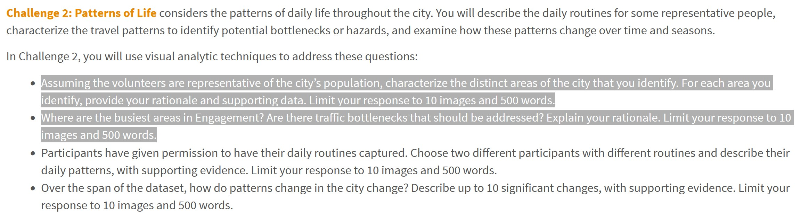

```{r setup, include=FALSE}
knitr::opts_chunk$set(echo = FALSE)
```

# The Task

With reference to bullet point 1 and 2 of Challenge 2 of VAST Challenge 2022, you are required to reveal:

- social areas of the [city of Engagement, Ohio USA](https://vast-challenge.github.io/2022/).  
- visualising and analysing locations with traffic bottleneck of the [city of Engagement, Ohio USA](https://vast-challenge.github.io/2022/).  



# Submission Instructions 

This is an individual assignment. You are required to work on the take-home exercises and prepare submission individually. 

- The take-home exercise submission must be written by using **distill for R Markdown**.  It can be in either [distill article](https://distill.pub/guide/) or [distill blog ](https://rstudio.github.io/distill/blog.html) format. You are required to publish the exercise on [Netlify](https://www.netlify.com/) and provide the link on the take-home exercise submission page on elearn. 
- You are also required to push the take-home exercise folder and data onto your individual Github repository and provide the link on the take-home exercise submission page on eLearn.
 
### Submission date 
 
Your completed take-home exercise is due on **29th May 2022, by 11:59pm evening**.

# Peer Learning

- [ALOYSIUS TENG]()
- [ANTONIUS HANDY]()
- [CHE XUAN]()
- [CHU YI-NING]()
- [CUI JIARUI]()
- [DAVID KWOK WEI XIANG]()
- [DING YANMU]()
- [HERANSHAN SO SUBRAMANIAM]()
- [HUANG ANNI]()
- [HUANG YAPING]()
- [HULWANA BINTE SAIFULZAMAN]()
- [KIM BOMIN]()
- [LAM KUO JIAN JEREMIAH]()
- [LEE XIAO QI]()
- [LI HONGYI]()
- [LI HUAN]()
- [LI MINQI]()
- [LIU ZHENGLIN]()
- [LONG NU]() 
- [NI JUNQIU]()
- [ONG ZHI RONG JORDAN]()
- [RAKENDU RAMESH]()
- [RAO NINGZHEN]()
- [RAUNAK KAPUR]()
- [RAVEENA CHAKRAPANI]()
- [SHACHI ANIRUDHA RAODEO]()
- [SUI TIANYUE]()
- [TAY CHENG WEI CLARENCE]()
- [TSENG CHIA-YI]()
- [WANG TIANQI]()
- [YEO KIM SIANG]()
- [YU DI]()
   

```{r echo=FALSE, eval=FALSE}
library(pagedown)
pagedown::chrome_print("TH_EX05.html")
```


