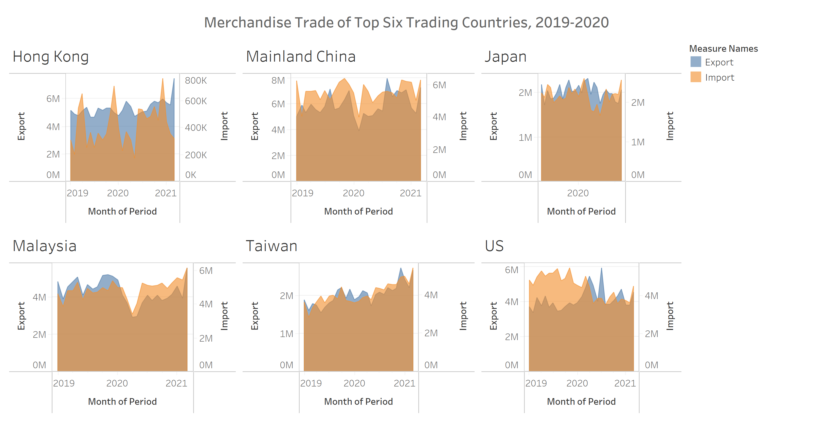

```{r setup, include=FALSE}
knitr::opts_chunk$set(echo = FALSE)
```

## The Data Visualisation



## Data Source
The data visualisation above is created by using data provided by Department of Statistics, Singapore (DOS).  The data are available under the sub-section of [Merchandise Trade by Region/Market](https://www.singstat.gov.sg/find-data/search-by-theme/trade-and-investment/merchandise-trade/latest-data).  For the purpose of the makeover exercise, you should download the data by clicking on the link **Download all in Excel** on the same webpage.   


## The Task
1.	Critic the graph from both its clarity and aesthetics.  At least three from each evaluation criterion. (15 marks)
2.	With reference to the critics above, suggest alternative graphical presentation to improve the current design.  The proposed alternative data visualisation must be in **static** form. Sketch out the proposed design.  Support your design by describing the advantages or which part of the issue(s) your alternative design try to overcome. (15 marks)
3.	Using Tableau, design the proposed data visualization. (25 marks)
4.	Provide step-by-step description on how the data visualization was prepared. (30 marks)
5.	Describe three major observations revealed by the data visualisation prepared.(15 marks)

## Deliverable
- The write-up of the DataViz Makeover must be in [**distill**](https://rstudio.github.io/distill/) or [**blogdown**](https://github.com/rstudio/blogdown) format. You are required to publish the write-up on [**Netlify**](https://www.netlify.com/). 
- The DataViz Makeover must be prepared using **Tableau Desktop**.  The final workbook must be uploaded onto [Tableau Public](https://public.tableau.com/en-us/s/).
- All DataViz Makeover have to be completed by **Sunday before mid-night 11.59pm**. Students are required to upload the artefacts onto eLearn (i.e. DataViz Makeover section).
- To encourage peer-learning, students must also provide the link to the blog your prepared for the DataViz Makeover eLearn.

## Submission date
Submission deadline: **30th May 2021 (Sunday), mid-night 11:59pm**.

## Peer Learning

- ARYAH UMRALKAR CHOPRA
    - [DataViz Makeover write-up on Netlify](https://arychopra.netlify.app/) and [Tableau Public link](https://public.tableau.com/profile/aryah.umralkar.chopra#!/)
        - An overall well balanced submission, including the web blog design. 

- KELLY KOH KIA WOON
    - [DataViz Makeover write-up on Netlify](https://kellykkw.netlify.app/posts/2021-05-15-dataviz-makeover-1/) and [Tableau Public link](https://public.tableau.com/app/profile/kelly2850/viz/DatavizMakeover1_16220368938730/Dashboard1)
        - A well balanced submission.  The DataViz Makeover retains the basic design but providing several effective makeover.  The step-by-step makeover procedures provided are highly reproducible.  

- LI ZHEN
    - [DataViz Makeover write-up on Netlify](https://bloglz.netlify.app/posts/2021-05-22-dataviz-makeover-1/) and [Tableau Public link](https://public.tableau.com/app/profile/zhen.li7736/viz/VizMakeover1/Makeover1).
        - An interesting makeover design.   

## Peer Learning

### Quality of Critic

Beside **appropriateness** and **correctness**, a good critic should support with specific examples.

- Screenshot below provides an example of a correct and good critic.


- General or/and ambiguous statement like below should be avoided.


### Quality of Alternative DataViz Makeover Design

DataViz Makeover aims to **improve existing design** as much as possible according to the critics provided.  If possible, students should **avoid introducing a totally new data visualisation**.  You should also **avoid changing the original content of the original design**.  

- For example, the original data visualisation uses monthly merchandise trade values but the proposed design showing quaterly values. 


- Beside making over the existing data visualisation, if necessary, you are encouraged to use additional data visualisation to complement and improve the current design.


- However, you should ensure that the visual arrangement of the data visualisation as balance.  Avoiding imbalance layout like the figure below.


### Level of Tableau Desktop Proficiency

To demonstrate your Tableau Desktop proficiency, students should avoid using default features and functions as much as possible.  When it is appropriate, you should not hesitate to use advanced functions such as calculated field and parameters.

- For example, the reference line in the figure below can be improved by customising the reference line including the label.  Furthermore, the checkbox at the legend pane should be excluded because in this dataviz makaover, only static data visualisation are allowed. 


- The data visualisation below demonstrated relatively higher Tableau Desktop proficiency.  In this data visualisation, calculated field is used to ensure the trade surplus or deficit will be shaded using similar colour for both data visualisation.  Furthermore, customised reference lines are used to improve the readability of the data visualisation. 


### Quality of Reproducibility

One of the important learning objective of DataViz Makeover is **to embark your the skill in creating reproducible data visualisation**.  This is achieved by requiring students to to prepare complete and comprehensive step-by-step guide on  how the proposed dataviz makeover is created.  

- You should avoid providing providing incomplete and difficult if not impossible to reproduce guide as should in the screenshot below.


- This [link](https://kellykkw.netlify.app/posts/2021-05-15-dataviz-makeover-1/#step-by-step-preparation) provides an excellance example of reproducible dataviz makeover.

### Quality of Storytelling

Visual communication plays an important role in a visual analytics process.  No matter how advanced and sophisticated data visualisation technqiues are used, if we failed to tell a compelling story by using the data visualisation designed, all the hardwork and efforts will be wasted.  

- When telling visual story, you should avoid giving general statement without reference to the data visualisation designed.  


- A btter version of the visual story is shown in the screenshot below.


- Ideally, you might want to support your visual storytelling by using appropriate figure look similar to the screenshot below.


- However, it is also important to alert students not to use external reference which only providing partial information like figure below.  The reference source can be found by using this [link](https://www.enterprisesg.gov.sg/-/media/esg/files/media-centre/media-releases/2020/may-2020/monthly-trade-report---apr-2020.pdf?la=enn).


```{r echo=FALSE, eval=FALSE}
library(pagedown)
pagedown::chrome_print("DataViz1.html")
```
