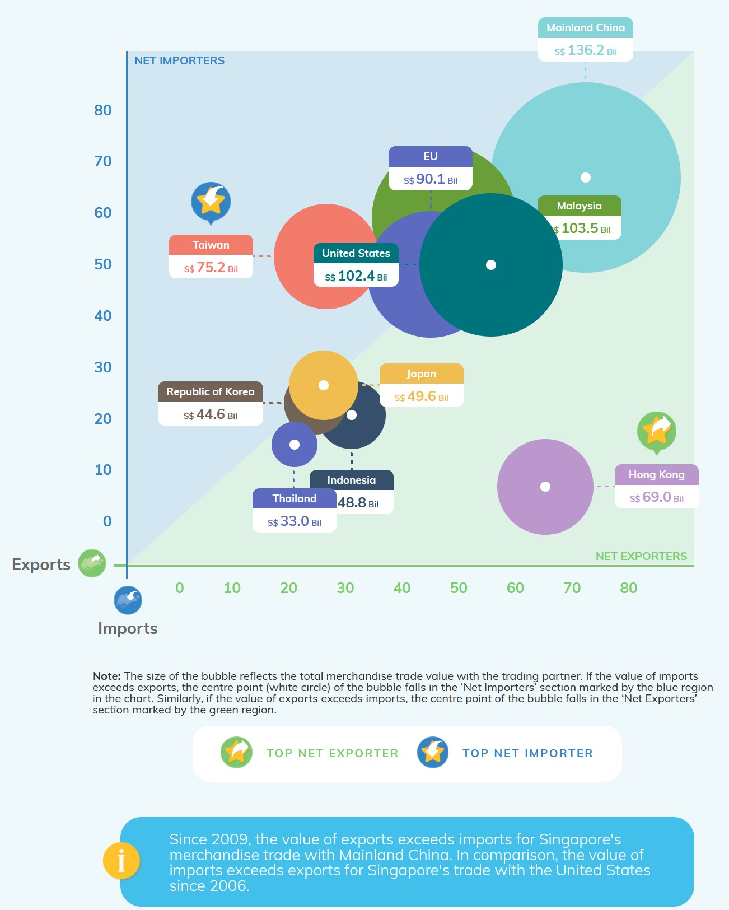

```{r setup, include=FALSE}
knitr::opts_chunk$set(echo = FALSE)
```

## The Data Visualisation



Source: [Department of Statistics, Singapore](https://www.singstat.gov.sg/modules/infographics/singapore-international-trade)

## The Task

1. Critic the data visualisation from both its clarity and aesthetics.  At least three from each evaluation criterion.  (15 marks)
2. With reference to the critics above, suggest alternative graphical presentation to improve the current design.  Sketch out the proposed design.  The proposed alternative design should include **appropriate interactive techniques**.  Support your design by describing the advantages or which part of the issue(s) your alternative design try to overcome.  (15 marks)
3. Using Tableau, design the proposed data visualisation.  (25 marks)
4. Provide step-by-step description on how the data visualisation was prepared.  (30 marks)
5. Describe three major observations revealed by the data visualisation prepared.
(15 marks)

### Additional design instruction
1. The study period should be between January 2011-December 2020.  No additional data sets are required.
2. Focus on telling data story using appropriate statistical graphic methods, graphical design principles and interactive techniques, including animation.


## Data Source
The data visualisation above is created by using data provided by Department of Statistics, Singapore (DOS).  The data are available under the sub-section of [Merchandise Trade by Region/Market](https://www.singstat.gov.sg/find-data/search-by-theme/trade-and-investment/merchandise-trade/latest-data).  For the purpose of this dataviz makeover exercise, you should download the data by clicking on the link **Download all in Excel** on the same webpage.   

## Submission deadline
Submission deadline: **20th June 2021 (Sunday), mid-night 11:59pm**.
