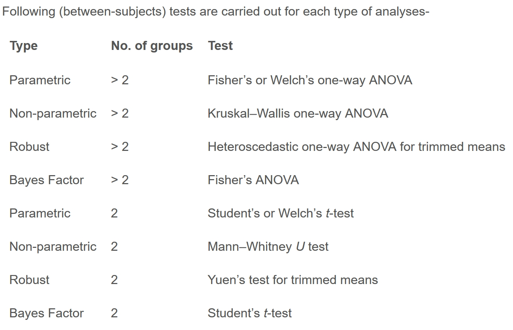
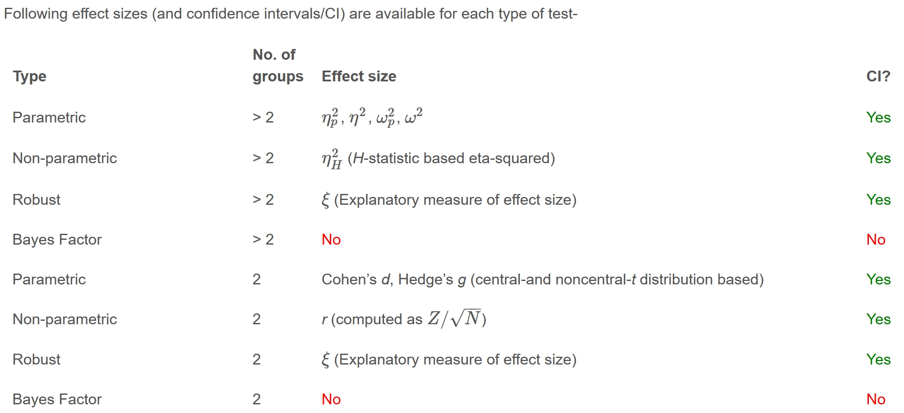

```{r setup, include=FALSE}
options(htmltools.dir.version = FALSE)
knitr::opts_chunk$set(
  fig.retina=3,
  cache = FALSE,
  echo = TRUE,
  message = FALSE, 
  warning = FALSE)
```

```{r xaringan-themer, include=FALSE, warning=FALSE}
library(xaringanthemer)
style_duo_accent(
  primary_color = "#1381B0",
  secondary_color = "#FF961C",
  inverse_header_color = "#FFFFFF"
)
```

## Content

+ Visual Statistical Testing with ggstatsplot
+ Visualising Uncertainty

---
# Getting Started

In this exercise, **infer**, **ggstatsplot** and **tidyverse** will be used.

```{r}
packages = c('ggstatsplot', 'ggside', 
             'tidyverse', 'ggdist')
for (p in packages){
  if(!require(p, character.only = T)){
    install.packages(p)
  }
}
```

In this exercise, the Exam.csv
 data will be used.
 
```{r message=FALSE, warning=FALSE}
exam <- read_csv("data/Exam_data.csv")
```


---
## Visual Statistical Analysis with **ggstatsplot** 

.large[

+ [**ggstatsplot**](https://indrajeetpatil.github.io/ggstatsplot/index.html) is an extension of [**ggplot2**](https://ggplot2.tidyverse.org/) package for creating graphics with details from statistical tests included in the information-rich plots themselves.
    + To provide alternative statistical inference methods by default.
    + To follow best practices for statistical reporting. For all statistical tests reported in the plots, the default template abides by the [APA](https://my.ilstu.edu/~jhkahn/apastats.html) gold standard for statistical reporting. For example, here are results from a robust t-test:

.center[
]
]

---
### One-sample test: *gghistostats()* method

.pull-left[
In the code chunk below, [*gghistostats()*](https://indrajeetpatil.github.io/ggstatsplot/reference/gghistostats.html) is used to to build an visual of one-sample test on English scores.

```{r eval=FALSE}
set.seed(1234)

gghistostats(
  data = exam,
  x = ENGLISH,
  test.value = 60,
  xlab = "English scores"
)
```

Default information:
- statistical details
- Bayes Factor
- sample sizes
- distribution summary

]

.pull-right[

```{r echo=FALSE}
set.seed(1234)

gghistostats(
  data = exam,
  x = ENGLISH,
  test.value = 60,
  xlab = "English scores"
)
```
]
---
### Unpacking the Bayes Factor

- A Bayes factor is the ratio of the likelihood of one particular hypothesis to the likelihood of another. It can be interpreted as a measure of the strength of evidence in favor of one theory among two competing theories.

- That’s because the Bayes factor gives us a way to evaluate the data in favor of a null hypothesis, and to use external information to do so. It tells us what the weight of the evidence is in favor of a given hypothesis.

- When we are comparing two hypotheses, H1 (the alternate hypothesis) and H0 (the null hypothesis), the Bayes Factor is often written as B10. It can be defined mathematically as

.center[
]

- The [**Schwarz criterion**](https://www.statisticshowto.com/bayesian-information-criterion/) is one of the easiest ways to calculate rough approximation of the Bayes Factor.


---
### How to interpret Bayes Factor

A **Bayes Factor** can be any positive number. One of the most common interpretations is this one—first proposed by Harold Jeffereys (1961) and slightly modified by [Lee and Wagenmakers](https://www-tandfonline-com.libproxy.smu.edu.sg/doi/pdf/10.1080/00031305.1999.10474443?needAccess=true) in 2013:

.center[
]

---
### Two-sample mean test: *ggbetweenstats()*

.pull-left[
In the code chunk below, [*ggbetweenstats()*](https://indrajeetpatil.github.io/ggstatsplot/reference/ggbetweenstats.html) is used to build a visual for two-sample mean test of Maths scores by gender.

```{r echo=TRUE, eval=FALSE}
ggbetweenstats(
  data = exam,
  x = GENDER, 
  y = MATHS,
  messages = FALSE
)
```

Default information:
- statistical details
- Bayes Factor
- sample sizes
- distribution summary
]

.pull-right[
```{r echo=FALSE, eval=TRUE, fig.retina = 3}
ggbetweenstats(
  data = exam,
  x = GENDER, 
  y = MATHS,
  messages = FALSE
)
```
]

---
### Oneway ANOVA Test: *ggbetweenstats()* method

.pull-left[
In the code chunk below, [*ggbetweenstats()*](https://indrajeetpatil.github.io/ggstatsplot/reference/ggbetweenstats.html) is used to build a visual for One-way ANOVA test on English score by race.

```{r echo=TRUE, eval=FALSE}
ggbetweenstats(
  data = exam,
  x = RACE, 
  y = ENGLISH,
  type = "np",
  mean.ci = TRUE, 
  pairwise.comparisons = TRUE, 
  pairwise.display = "s",
  p.adjust.method = "fdr",
  messages = FALSE
)
```

- "ns" → only non-significant
- "s" → only significant
- "all" → everything
]

.pull-right[
```{r echo=FALSE, eval=TRUE, fig.retina = 3}
ggbetweenstats(
  data = exam,
  x = RACE, 
  y = ENGLISH,
  type = "np",
  mean.ci = TRUE, 
  pairwise.comparisons = TRUE, 
  pairwise.display = "ns",
  p.adjust.method = "fdr",
  messages = FALSE
)
```
]

---
## ggbetweenstats - Summary of tests

.center[
]

---
## ggbetweenstats - Summary of tests

.center[
]

---
## ggbetweenstats - Summary of tests

.center[
]

---
### Significant Test of Correlation: *ggscatterstats()*

.pull-left[
In the code chunk below, [*ggscatterstats()*](https://indrajeetpatil.github.io/ggstatsplot/reference/ggscatterstats.html) is used to build a visual for Significant Test of Correlation between Maths scores and English scores.

```{r eval=FALSE}
ggscatterstats(
  data = exam,
  x = MATHS,
  y = ENGLISH,
  marginal = FALSE,
  )
```
]

.pull-right[
```{r echo=FALSE}
ggscatterstats(
  data = exam,
  x = MATHS,
  y = ENGLISH,
  marginal = FALSE,
  )
```
]

---
### Significant Test of Association (Depedence) : *ggbarstats()* methods

.pull-left[

In the code chunk below, the Maths scores is binned into a 4-class variable by using [*cut()*](https://www.rdocumentation.org/packages/base/versions/3.6.2/topics/cut).

```{r}
exam1 <- exam %>% 
  mutate(MATHS_bins = 
           cut(MATHS, 
               breaks = c(0,60,75,85,100))
)
```

In this code chunk below [*ggbarstats()*](https://indrajeetpatil.github.io/ggstatsplot/reference/ggbarstats.html) is used to build a visual for Significant Test of Association

```{r eval=FALSE}
ggbarstats(exam1, 
           x = MATHS_bins, 
           y = GENDER)
```
]

.pull-right[
```{r echo=FALSE}
ggbarstats(exam1, 
           x = MATHS_bins, 
           y = GENDER)
```

]

---
## Toyota Corolla case study

.pull-left[
.large[
+ Build a model to discover factors affecting prices of used-cars by taking into consideration a set of explanatory variables.   
]]

.pull-right[

]
---
## Installing and loading the required libraries

.large[
Type the code chunk below to install and launch the necessary R packages
] 

```{r}
packages = c('readxl', 'report', 'performance', 
             'parameters', 'see')

for(p in packages){
  if(!require(p, character.only = T)){
    install.packages(p)
  }
  library(p, character.only = T)
}
```

---
## Importing Excel file: readxl methods 

In the code chunk below, [*read_xls()*](https://readxl.tidyverse.org/reference/read_excel.html) of [**readxl**](https://readxl.tidyverse.org/) package is used to import the data worksheet of `ToyotaCorolla.xls` workbook into R.

```{r}
car_resale <- read_xls("data/ToyotaCorolla.xls", 
                       "data")
```

Notice that the output object `car_resale` is a tibble data frame.


---
## Multiple Regression Model using lm()

The code chunk below is used to calibrate a multiple linear regression model by using *lm()* of Base Stats of R.

```{r}
model <- lm(Price ~ Age_08_04 + Mfg_Year + KM + 
              Weight + Guarantee_Period, data = car_resale)
model
```

---
## Model Diagnostic: checking for multicolinearity: 

In the code chunk, [*check_collinearity()*](https://easystats.github.io/performance/reference/check_collinearity.html) of [**performance**](https://easystats.github.io/performance/index.html) package.

.pull-left[
```{r}
check_collinearity(model)
```
]

--
.pull-right[
```{r fig.height=5}
check_c <- check_collinearity(model)
plot(check_c)
```
]

---
## Model Diagnostic: checking normality assumption

.pull-left[
In the code chunk, [*check_normality()*](https://easystats.github.io/performance/reference/check_normality.html) of [**performance**](https://easystats.github.io/performance/index.html) package.

```{r echo=FALSE}
model1 <- lm(Price ~ Age_08_04 + KM + 
              Weight + Guarantee_Period, data = car_resale)

```

```{r}
check_n <- check_normality(model1)

```
]

.pull-right[
```{r fig.height=4}
plot(check_n)
```
]
---
## Model Diagnostic: Check model for homogeneity of variances

.pull-left[
In the code chunk, [*check_heteroscedasticity()*](https://easystats.github.io/performance/reference/check_heteroscedasticity.html) of [**performance**](https://easystats.github.io/performance/index.html) package.

```{r fig.height=4}
check_h <- check_heteroscedasticity(model1)

```
]

.pull-right[
```{r fig.height=4}
plot(check_h)
```
]

---
## Model Diagnostic: Complete check

We can also perform the complete by using [*check_model()*](https://easystats.github.io/performance/reference/check_model.html).

```{r fig.width=12, fig.height=6}
check_model(model1)
```

---
### Visualising Regression Parameters: see methods

.pull-left[
In the code below, plot() of see package and parameters() of parameters package is used to visualise the parameters of a regression model. 

```{r eval=FALSE}
plot(parameters(model1))
```
]

.pull-left[

```{r echo=FALSE}
plot(parameters(model1))
```
]

---
### Visualising Regression Parameters: *ggcoefstats()* methods

.pull-left[
In the code below, [*ggcoefstats()*](https://indrajeetpatil.github.io/ggstatsplot/reference/ggcoefstats.html) of ggstatsplot package to visualise the parameters of a regression model. 

```{r eval=FALSE}
ggcoefstats(model1, 
            output = "plot")
```
]

.pull-left[

```{r echo=FALSE}
ggcoefstats(model1, 
            output = "plot")
```
]

---
## Visualising Uncertainty: **ggdist** package 

.pull-left[
+ [**ggdist**](https://mjskay.github.io/ggdist/index.html) is an R package that provides a flexible set of ggplot2 geoms and stats designed especially for visualising distributions and uncertainty. 
+ It is designed for both frequentist and Bayesian uncertainty visualization, taking the view that uncertainty visualization can be unified through the perspective of distribution visualization: 
    + for frequentist models, one visualises confidence distributions or bootstrap distributions (see vignette("freq-uncertainty-vis")); 
    + for Bayesian models, one visualises probability distributions (see the tidybayes package, which builds on top of ggdist).
]

.pull-right[

]

---
### Visualising uncertainty between groups

.pull-left[
In the code chunk below, [*stat_eye()*](https://mjskay.github.io/ggdist/articles/slabinterval.html) of ggdist is used to build a visual for displaying distribution of maths scores by race.

```{r eval=FALSE}
exam %>%
  ggplot(aes(x = RACE, y = MATHS)) +
  stat_eye() +
  ggtitle("stat_eye()")
```
]

.pull-right[

```{r echo=FALSE}
exam %>%
  ggplot(aes(y = RACE, x = MATHS)) +
  stat_eye() +
  ggtitle("stat_eye()")
```
]


```{r echo=FALSE, eval=FALSE}
library(pagedown)
pagedown::chrome_print("Hands-on_Ex04.html")
```