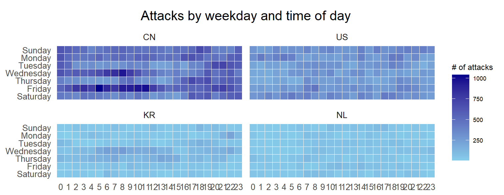

```{r setup, include=FALSE}
options(htmltools.dir.version = FALSE)
knitr::opts_chunk$set(
  fig.retina=3,
  cache = FALSE,
  echo = TRUE,
  message = FALSE, 
  warning = FALSE)
```

```{r xaringan-themer, include=FALSE, warning=FALSE}
library(xaringanthemer)
style_duo_accent(
  primary_color = "#1381B0",
  secondary_color = "#FF961C",
  inverse_header_color = "#FFFFFF"
)
```

## Learning Outcome

.vlarge[
In this hands-on exercise, you will gain hands-on experience on:

+ plotting a calender heatmap by using ggplot2 functions,

+ plotting a cycle plot by using ggplot2 function, 

+ plotting a horizon chart
]

---
## Getting Started

.pull-left[
Write a code chunk to check, install and launch the following R packages:
+ 'scales', 
+ 'viridis', 
+ 'lubridate', 
+ 'ggthemes', 
+ 'gridExtra',
+ 'tidyverse', 
+ 'readxl', 
+ 'knitr',
+ data.table]

--
.pull-right[
The solution:

```{r}
packages = c('scales', 'viridis', 
             'lubridate', 'ggthemes', 
             'gridExtra', 'tidyverse', 
             'readxl', 'knitr',
             'data.table')

for (p in packages){
  if(!require(p, character.only = T)){
    install.packages(p)
  }
  library(p,character.only = T)
}
```
]

---
## Calendar Heatmap

.pull-left[
In this section, you will learn how to plot a calender heatmap programmetically with R.  


By the end of this section, you will be able to:

- plot a calender heatmap by using ggplot2 functions and extension, 
- to write function using R programming,
- to derive specific date and time related field by using base R and lubridate packages 
- to perform data preparation task by using tidyr and dplyr packages.  


]

--
.pull-right[
### The Data

For the purpose of this hands-on exercise, *eventlog.csv* file will be used.  This data file consists of 199,999 rows of time-series cyber attack records by country.  

#### Importing the data

First, you will use the code chunk below to import ***eventlog.csv*** file into R environment and called the data frame as ***attacks***. 

```{r}
attacks <- read_csv("data/eventlog.csv")
```
]

---
### Examining the data structure 

.pull-left[
It is always a good practice to examine the imported data frame before further analysis is performed.

For example, *kable()* can be used to review the structure of the imported data frame.

```{r eval=FALSE}
kable(head(attacks))
```

There are three columns, namely  *timestamp*, *source_country* and *tz*.  

- *timestamp* field stores date-time values in POSIXct format.
- *source_country* field stores the source of the attack.  It is in *ISO 3166-1 alpha-2* country code.  
- *tz* field stores time zone of the source IP address.
]

.pull-right[
```{r echo=FALSE}
kable(head(attacks))
```
]

---
### Data Preparation

Step 1: Deriving *weekday* and *hour of day* fields 

Before we can plot the calender heatmap, two new fields namely *wkday* and *hour* need to be derived.  In this step, we will write a function to perform the task.

```{r, echo=TRUE}
make_hr_wkday <- function(ts, sc, tz) {
  real_times <- ymd_hms(ts, 
                        tz = tz[1], 
                        quiet = TRUE)
  dt <- data.table(source_country = sc,
                   wkday = weekdays(real_times),
                   hour = hour(real_times))
  return(dt)
  }
```

Note: [`ymd_hms()`](https://lubridate.tidyverse.org/reference/ymd_hms.html) and [`hour()`](https://lubridate.tidyverse.org/reference/hour.html) are from [**lubridate**](https://lubridate.tidyverse.org/) package and [`weekdays()`](https://www.rdocumentation.org/packages/base/versions/3.6.2/topics/weekdays) is a **base** R function.

---
###  Data Preparation

Step 2: Deriving the attacks tibble data frame

.pull-left[
```{r}
wkday_levels <- c('Saturday', 'Friday', 
                  'Thursday', 'Wednesday', 
                  'Tuesday', 'Monday', 
                  'Sunday')

attacks <- attacks %>%
  group_by(tz) %>%
  do(make_hr_wkday(.$timestamp, 
                   .$source_country, 
                   .$tz)) %>% 
  ungroup() %>% 
  mutate(wkday = factor(
    wkday, levels = wkday_levels),
    hour  = factor(
      hour, levels = 0:23))
```

Note: Beside extracting the necessary data into *attacks* data frame, `mutate()` of **dplyr** package is used to convert *wkday* and *hour* fields into **factor** so they'll be ordered when plotting
]

--
.pull-right[
Table below shows the tidy tibble table after processing.

.pull-left[
```{r echo=FALSE}
kable(head(attacks))
```
]]

---
### Building the Calendar Heatmaps

.pull-left[
```{r eval=FALSE}
grouped <- attacks %>% 
  count(wkday, hour) %>% 
  ungroup() %>%
  na.omit()

ggplot(grouped, 
       aes(hour, 
           wkday, 
           fill = n)) + 
geom_tile(color = "white", 
          size = 0.1) + 
theme_tufte(base_family = "Helvetica") + 
coord_equal() +
scale_fill_gradient(name = "# of attacks",
                    low = "sky blue", 
                    high = "dark blue") +
labs(x = NULL, 
     y = NULL, 
     title = "Attacks by weekday and time of day") +
theme(axis.ticks = element_blank(),
      plot.title = element_text(hjust = 0.5),
      legend.title = element_text(size = 8),
      legend.text = element_text(size = 6) )
```
]

.pull-right[
Things to learn from the code chunk:
- a tibble data table called *grouped* is derived by aggregating the attack by *wkday* and *hour* fields.
- a new field called *n* is derived by using `group_by()` and `count()` functions.
- `na.omit()` is used to exclude missing value.
- `geom_tile()` is used to plot tiles (grids) at each x and y position.  `color` and `size` arguments are used to specify the border color and line size of the tiles.
- [`theme_tufte()`](https://jrnold.github.io/ggthemes/reference/theme_tufte.html) of  [**ggthemes**](https://jrnold.github.io/ggthemes/reference/index.html) package is used to remove unnecessary chart junk.  To learn which visual components of default ggplot2 have been excluded, you are encouraged to comment out this line to examine the default plot. 
- `coord_equal()` is used to ensure the plot will have an aspect ratio of 1:1.
- `scale_fill_gradient()` function is used to creates a two colour gradient (low-high).

```{r echo=FALSE}
grouped <- attacks %>% 
  count(wkday, hour) %>% 
  ungroup() %>%
  na.omit()

ggplot(grouped, 
       aes(hour, 
           wkday, 
           fill = n)) + 
geom_tile(color = "white", 
          size = 0.1) + 
theme_tufte(base_family = "Helvetica") + 
coord_equal() +
scale_fill_gradient(name = "# of attacks",
                    low = "sky blue", 
                    high = "dark blue") +
labs(x = NULL, 
     y = NULL, 
     title = "Attacks by weekday and time of day") +
theme( axis.ticks = element_blank(),
       plot.title = element_text(hjust = 0.5),
       legend.title = element_text(size = 8),
       legend.text = element_text(size = 6) )
```
]

???
Then we can simply group the count by hour and wkday and plot it, since we know that we have values for every combination there's no need to further preprocess the data.

---
### Building Multiple Calendar Heatmaps

**Challenge:** Building multiple heatmaps for the top four countries with the highest number of attacks.

.center[

]


---
### Plotting Multiple Calendar Heatmaps

.pull-left[
Step 1: Deriving attack by country object

In order to identify the top 4 countries with the highest number of attacks, you are required to do the followings:

- count the number of attacks by country, 
- calculate the percent of attackes by country, and
- save the results in a tibble data frame.

```{r echo=FALSE}
attacks_by_country <- count(
  attacks, source_country) %>%
  mutate(percent = percent(n/sum(n))) %>%
  arrange(desc(n))
```
]

.pull-right[
Step 2: Preparing the tidy data frame

In this step, you are required to extract the attack records of the top 4 countries from *attacks* data frame and save the data in a new tibble data frame (i.e. *top4_attacks*).

```{r echo=FALSE}
top4 <- attacks_by_country$source_country[1:4]
top4_attacks <- attacks %>%
  filter(source_country %in% top4) %>%
  count(source_country, wkday, hour) %>%
  ungroup() %>%
  mutate(source_country = factor(
    source_country, levels = top4)) %>%
  na.omit()
```
]

---
### Plotting Multiple Calendar Heatmaps

Step 3: Plotting the Multiple Calender Heatmap by using ggplot2 package.

```{r echo=FALSE, fig.width = 12}
ggplot(top4_attacks, 
       aes(hour, 
           wkday, 
           fill = n)) + 
  geom_tile(color = "white", 
          size = 0.1) + 
  theme_tufte(base_family = "Helvetica") + 
  coord_equal() +
  scale_fill_gradient(name = "# of attacks",
                    low = "sky blue", 
                    high = "dark blue") +
  facet_wrap(~source_country, ncol = 2) +
  labs(x = NULL, y = NULL, 
     title = "Attacks on top 4 countries by weekday and time of day") +
  theme(axis.ticks = element_blank(),
        axis.text.x = element_text(size = 7),
        plot.title = element_text(hjust = 0.5),
        legend.title = element_text(size = 8),
        legend.text = element_text(size = 6) )
```

---
## Cycle Plot

In this section, you will learn how to plot a cycle plot showing the time-series patterns and trend of visitor arrivals from Vietnam programmatically by using ggplot2 functions.    


---
### Data Preparation

.pull-left[
#### Step 1: Data Import

For the purpose of this hands-on exercise, *arrivals_by_air.xlsx* will be used.

The code chunk below imports *arrivals_by_air.xlsx* by using `read_excel()` of **readxl** package and save it as a tibble data frame called *air*.  

```{r}
air <- read_excel("data/arrivals_by_air.xlsx")
```
]

--
.pull-right[
#### Step 2: Deriving month and year fields

Next, two new fields called *month* and *year* are derived from *Month-Year* field.

```{r}
air$month <- factor(month(air$`Month-Year`), 
                    levels=1:12, 
                    labels=month.abb, 
                    ordered=TRUE) 
air$year <- year(ymd(air$`Month-Year`))
```
]

---
### Data Preparation

.pull-left[
#### Step 4: Extracting the target country

Next, the code chunk below is use to extract data for the target country (i.e. Vietnam)

```{r}
Vietnam <- air %>% 
  select(`Vietnam`, 
         month, 
         year) %>%
  filter(year >= 2010)
```
]

--
.pull-right[
#### Step 5: Computing year average arrivals by month

The code chunk below uses `group-by()` and `summarise()` of **dplyr** to compute year average arrivals by month.

```{r}
hline.data <- Vietnam %>% 
  group_by(month) %>%
  summarise(avgvalue = mean(`Vietnam`))
```
]

---
### Plotting the cycle plot

.pull-left[
The code chunk below is used to plot the cycle plot.

```{r eval=FALSE}
ggplot() + 
  geom_line(data=Vietnam,
            aes(x=year, 
                y=`Vietnam`, 
                group=month), 
            colour="black") +
  geom_hline(aes(yintercept=avgvalue), 
             data=hline.data, 
             linetype=6, 
             colour="red", 
             size=0.5) + 
  facet_grid(~month) +
  labs(axis.text.x = element_blank(),
       title = "Visitor arrivals from Vietnam by air, Jan 2010-Dec 2019") +
  xlab("") +
  ylab("No. of Visitors")
```
]

---


