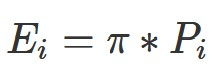

```{r setup, include=FALSE}
knitr::opts_chunk$set(fig.retina=3,
                      echo = TRUE,
                      eval = TRUE,
                      message = FALSE,
                      warning = FALSE)
```

## Content

.vlarge[
- Percentile Map
- Box Map
- Rate Map
- Relative Risk Map
] 

---
## Limitation of Statistical Map: Maps lie!

Although both choropleth maps were created using the same variable (i.e. aged population) but the choropleth maps produced look very different.  This is because the choropleth maps were created using two different data classification methods.  For the choropleth map on the left, quantile classification method was used and for choropleth on the right, equal interval classification method was used.   

```{r echo=FALSE}
packages = c('sf', 'tmap', 'tidyverse')
for (p in packages){
  if(!require(p, character.only = T)){
    install.packages(p)
  }
  library(p,character.only = T)
}
```

```{r echo=FALSE}
mpszpop2020 <- read_rds("data/rds/mpszpop2020.rds")
```


.pull-left[
```{r echo=FALSE, eval=TRUE, message=FALSE, warning=FALSE, fig.retina=3, fig.height=4}
tm_shape(mpszpop2020)+
  tm_fill("AGED",
          n = 6,
          style = "quantile",
          palette = "Blues") +
  tm_borders(alpha = 0.5)
```
]

.pull-right[
```{r echo=FALSE, eval=TRUE, message=FALSE, warning=FALSE, fig.retina=3, fig.height=4}
tm_shape(mpszpop2020)+
  tm_fill("AGED",
          n = 6,
          style = "equal",
          palette = "Blues") +
  tm_borders(alpha = 0.5)
```
]

>**Challenge:** 
- How to identify planning subzones with extreme high or low numbers of aged population?

---
## Visualising Extreme Values 

.pull-left[
.large[
- **Boxplot**is one one the popular Exploratory Data Analysis (EDA) technique used to show the statistics and distribution of data values.]

```{r echo=FALSE, eval=TRUE, message=FALSE, warning=FALSE, fig.retina=3, fig.align='center', fig.height=5, fig.width=4}

ggplot(data=mpszpop2020, 
       aes(x = "", 
           y = AGED)) +
  geom_boxplot()
```
]
--
.pull-right[
.large[The code chunk is:]
```{r echo=TRUE, eval=FALSE, message=FALSE, warning=FALSE, fig.retina=3}

ggplot(data=mpszpop2020, 
       aes(x = "", 
           y = AGED)) +
  geom_boxplot()
```

.large[
Despite its usefulness, boxplot is not able to reveal the spatial distribution of these outliers.
]]

---
## Extreme Value Maps

.vlarge[
- Extreme value maps are variations of common choropleth maps where the classification is designed to highlight extreme values at the lower and upper end of the scale, with the goal of identifying outliers. 

- These maps were developed in the spirit of spatializing EDA, i.e., adding spatial features to commonly used approaches in non-spatial EDA (Anselin 1994).
]

---
## Percentile Map

.pull-left[
.large[
+ The percentile map is a special type of quantile map with six specific categories: 0-1%,1-10%, 10-50%,50-90%,90-99%, and 99-100%. 
+ The corresponding breakpoints can be derived by means of the base R quantile command, passing an explicit vector of cumulative probabilities as c(0,.01,.1,.5,.9,.99,1). 
+ Note that the begin and endpoint need to be included.
]]

.pull-right[

]
---
### Extracting a variable from an sf data frame

Step 1: Exclude records with NA by using the code chunl below.

```{r}
mpszpop2020a <- mpszpop2020 %>%
  drop_na()
```

Step 2:

```{r}
percent <- c(0,.01,.1,.5,.9,.99,1)
var <- mpszpop2020a["DEPENDENCY"] %>%
  st_set_geometry(NULL)
quantile(var[,1], percent)
```

---
### Why Writing Functions?

.vlarge[
Writing a function has three big advantages over using copy-and-paste:

- You can give a function an evocative name that makes your code easier to understand.
- As requirements change, you only need to update code in one place, instead of many.
- You eliminate the chance of making incidental mistakes when you copy and paste (i.e. updating a variable name in one place, but not in another).
]

.small[
Source: [Chapter 19: Functions](https://r4ds.had.co.nz/functions.html#functions) of **R for Data Science**.
]

---
### Creating the get.var function

.pull-left[
```{r}
get.var <- function(vname,df) {
  v <- df[vname] %>% 
    st_set_geometry(NULL)
  v <- unname(v[,1])
  return(v)
}
```
]
.pull-right[
The code chunk on the left is an R function to extract a variable as a vector out of an sf data frame.
- arguments:
    - vname: variable name (as character, in quotes)
    - df: name of sf data frame
- returns:
    - v: vector with values (without a column name)
]
---
## Plotting a percentile map using tmap functions

.pull-left[
>**Challenge:** 
- Using the steps you learned in Hands-on Exercise 3, plot a percentile map as shown below.

```{r echo=FALSE}
percent <- c(0,.01,.1,.5,.9,.99,1)
var <- get.var("DEPENDENCY", mpszpop2020a)
bperc <- quantile(var,percent)
tm_shape(mpszpop2020) +
  tm_polygons() +
tm_shape(mpszpop2020a) +
  tm_fill("DEPENDENCY",
          title="DEPENDENCY",
          breaks=bperc,
          palette="Blues",
          labels=c("< 1%", "1% - 10%",
                   "10% - 50%", 
                   "50% - 90%",
                   "90% - 99%", 
                   "> 99%"))  +
  tm_borders() +
  tm_layout(title = "Percentile Map", 
            title.position = c("right",
                               "bottom"))
```
]

--
.pull-right[
```{r eval=FALSE}
percent <- c(0,.01,.1,.5,.9,.99,1)
var <- get.var("DEPENDENCY", mpszpop2020a)
bperc <- quantile(var,percent)
tm_shape(mpszpop2020) +
  tm_polygons() +
tm_shape(mpszpop2020a) +
  tm_fill("DEPENDENCY",
          title="DEPENDENCY",
          breaks=bperc,
          palette="Blues",
          labels=c("< 1%", "1% - 10%",
                   "10% - 50%", 
                   "50% - 90%",
                   "90% - 99%", 
                   "> 99%"))  +
  tm_borders() +
  tm_layout(title = "Percentile Map", 
            title.position = c("right",
                               "bottom"))
```
]

---
### A percentile mapping function

```{r}
percentmap <- function(vnam, df, legtitle=NA, mtitle="Percentile Map"){
  percent <- c(0,.01,.1,.5,.9,.99,1)
  var <- get.var(vnam,df)
  bperc <- quantile(var,percent)
  tm_shape(mpszpop2020) +
  tm_polygons() +
  tm_shape(df) +
     tm_fill(vnam,
             title=legtitle,
             breaks=bperc,
             palette="Blues",
          labels=c("< 1%", "1% - 10%", "10% - 50%", "50% - 90%", "90% - 99%", "> 99%"))  +
  tm_borders() +
  tm_layout(title = mtitle, title.position = c("right","bottom"))
}
```

---
### Test drive the percentile mapping function

To run the function, type the code chunk as shown below.

```{r}
youngmap <- percentmap("YOUNG", mpszpop2020a)
agedmap <- percentmap("AGED", mpszpop2020a)
```

---
## Box map

- Displaying summary statistics on a choropleth map by using the basic principles of boxplot.


- To create a box map, a custom breaks specification will be used. However, there is a complication. The break points for the box map vary depending on whether lower or upper outliers are present.

???
In essence, a box map is an augmented quartile map, with an additional lower and upper category. When there are lower outliers, then the starting point for the breaks is the minimum value, and the second break is the lower fence. In contrast, when there are no lower outliers, then the starting point for the breaks will be the lower fence, and the second break is the minimum value (there will be no observations that fall in the interval between the lower fence and the minimum value).


---
### Creating the boxbreaks function

.pull-left[
```{r}
boxbreaks <- function(v,mult=1.5) {
  qv <- unname(quantile(v))
  iqr <- qv[4] - qv[2]
  upfence <- qv[4] + mult * iqr
  lofence <- qv[2] - mult * iqr
  # initialize break points vector
  bb <- vector(mode="numeric",length=7)
  # logic for lower and upper fences
  if (lofence < qv[1]) {  # no lower outliers
    bb[1] <- lofence
    bb[2] <- floor(qv[1])
  } else {
    bb[2] <- lofence
    bb[1] <- qv[1]
  }
  if (upfence > qv[5]) { # no upper outliers
    bb[7] <- upfence
    bb[6] <- ceiling(qv[5])
  } else {
    bb[6] <- upfence
    bb[7] <- qv[5]
  }
  bb[3:5] <- qv[2:4]
  return(bb)
}
```
]

.pull-right[
The code chunk on the left is an R function that creating break points for a box map.
- arguments:
    - v: vector with observations
    - mult: multiplier for IQR (default 1.5)
- returns:
    - bb: vector with 7 break points compute quartile and fences
]

---
### Creating the get.var function

.pull-left[
```{r}
get.var <- function(vname,df) {
  v <- df[vname] %>% st_set_geometry(NULL)
  v <- unname(v[,1])
  return(v)
}
```
]
.pull-right[
The code chunk on the left is an R function to extract a variable as a vector out of an sf data frame.
- arguments:
    - vname: variable name (as character, in quotes)
    - df: name of sf data frame
- returns:
    - v: vector with values (without a column name)
]

---
## Test drive the newly created function

.pull-left[
.large[
Let's test the newly created function]

```{r echo=TRUE, eval=FALSE}
var <- get.var("AGED", mpszpop2020) 
boxbreaks(var)
```
]
--
.pull-right[
.large[
Let's exclude AGED = NA by using the code chunk below. 
]

```{r}
mpszpop2020a <- mpszpop2020 %>%
  filter(AGED>=0)
var <- get.var("AGED", mpszpop2020a)
boxbreaks(var)
```
]

---
## Boxmap function

.pull-left[

```{r}
boxmap <- function(vnam, df, 
                   legtitle=NA,
                   mtitle="Box Map",
                   mult=1.5){
  var <- get.var(vnam,df)
  bb <- boxbreaks(var)
  tm_shape(df) +
     tm_fill(vnam,title=legtitle,
             breaks=bb,
             palette="Blues",
          labels = c("lower outlier", 
                     "< 25%", 
                     "25% - 50%", 
                     "50% - 75%",
                     "> 75%", 
                     "upper outlier"))  +
  tm_borders() +
  tm_layout(title = mtitle, 
            title.position = c("right",
                               "bottom"))
}
```
]

.pull-right[
The code chunk on the left is an R function to create a box map.
- arguments:
    - vnam: variable name (as character, in quotes)
    - df: simple features polygon layer
    - legtitle: legend title
    - mtitle: map title
    - mult: multiplier for IQR
- returns:
    - a tmap-element (plots a map)
]

---
### The box map of AGED population

.pull-left[
```{r fig.retina=4, fig.height=5}
boxmap("ECONOMY ACTIVE", mpszpop2020a)
```
]

.pull-right[
- The box map reveals that there are six upper outliers (i.e. planning subzone with extremely high numbers of aged population)

- Four of the upper outliers are located at the eastern region and they are closed to each others.

- There is no lower outlier.
]

--
.center[
.vlarge[But why some planning subzones were eaten by rats? Can you fix it?
]]

---
### Tidy version of boxmap

```{r echo=FALSE}
boxmap <- function(vnam, df, 
                   legtitle=NA,
                   mtitle="Box Map",
                   mult=1.5){
  var <- get.var(vnam,df)
  bb <- boxbreaks(var)
  tm_shape(mpszpop2020) +
    tm_polygons() +
  tm_shape(df) +
     tm_fill(vnam,title=legtitle,
             breaks=bb,
             palette="Blues",
          labels = c("lower outlier", 
                     "< 25%", 
                     "25% - 50%", 
                     "50% - 75%",
                     "> 75%", 
                     "upper outlier"))  +
  tm_borders() +
  tm_layout(title = mtitle, 
            title.position = c("right",
                               "bottom"))
}
```

```{r fig.retina=4, fig.width=12, fig.height=6}
boxmap("ECONOMY ACTIVE", mpszpop2020a)
```


---
## Choropleth Map for Rates

.pull-left[
.large[
In much of our readings we have now seen the importance to map rates rather than counts of things, and that is for the simple reason that population is not equally distributed in space. That means that if we do not account for how many people are somewhere, we end up mapping population size rather than our topic of interest.
]
]

.pull-right[

]

---
### Comparing distribution of total and aged population, 2020

.pull-left[

```{r echo=FALSE}
qtm(mpszpop2020, "TOTAL",
    title = "Distribution of total population, 2020")
```
]

.pull-right[
```{r echo=FALSE}
qtm(mpszpop2020, "AGED",
    title = "Distribution of aged population, 2020")
```
]

---
### Raw rate map

.pull-left[
- First, compute the raw rate by using the code chunk below:

```{r}
mpszpop2020a <- mpszpop2020 %>%
  mutate(`AGED%` = (`AGED`
/`TOTAL`)*100) %>%
  filter(`AGED%` >= 0)
```

Next, the boxmap function will be used to plot the raw rate map as shown in the code chunk below.

```{r eval=FALSE, message=FALSE, fig.retina=4, fig.height=5}
var <- get.var("AGED%", mpszpop2020a)
boxbreaks(var)
boxmap("AGED%",mpszpop2020a)
```

]

--
.pull-right[
```{r echo=FALSE, message=FALSE, fig.retina=4, fig.height=5}
var <- get.var("AGED%", mpszpop2020a)
boxbreaks(var)
boxmap("AGED%",mpszpop2020a)
```
]

---
### Comparing Absolute and Rate Choropleth Maps

.pull-left[
```{r echo=FALSE, fig.retina=4, fig.height=5}
boxmap("AGED",mpszpop2020a)
```
]

.pull-right[
```{r echo=FALSE, fig.retina=4, fig.height=5}
boxmap("AGED%",mpszpop2020a)
```
]

---
## Relative Risk Map

.pull-left[
- A commonly used notion in demography and public health analysis is the concept of a **standardized mortality rate** (SMR), sometimes also referred to as **relative risk** or **excess risk**. 
- The idea is to compare the observed mortality rate to a national (or regional) standard. More specifically, the observed number of events is compared to the number of events that would be expected had a reference risk been applied.
]

.pull-right[
Formally, this is expressed as:

.center[

]

which yields the expected number of events for each area i as:

.center[

]

The relative risk then follows as the ratio of the observed number of events (e.g., aged) over the expected number:

.center[

]]

---
```{r}
mpszpop2020long <- mpszpop2020 %>% 
  pivot_longer(
    cols = 19:20,
  names_to = "TYPE",
  values_to = "COUNT"
)
```


```{r}
tm_shape(mpszpop2020long) +
  tm_fill("COUNT",
          n = 5,
          style = "quantile") +
  tm_borders(alpha = 0.5) +
  tm_facets(by= "TYPE",
            nrow = 1,
            sync = TRUE)
```


```{r echo=FALSE, eval=FALSE}
library(pagedown)
pagedown::chrome_print("In-class_Ex03.html")
```