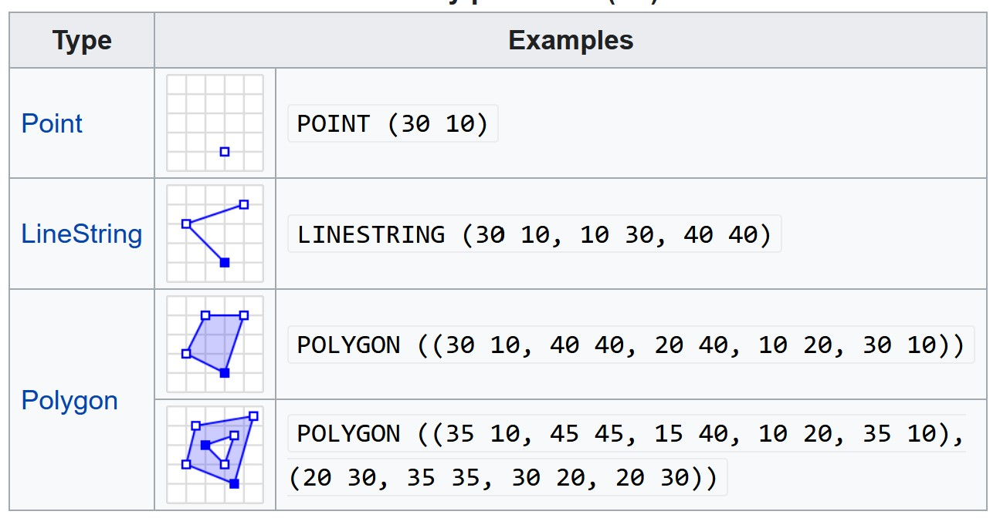
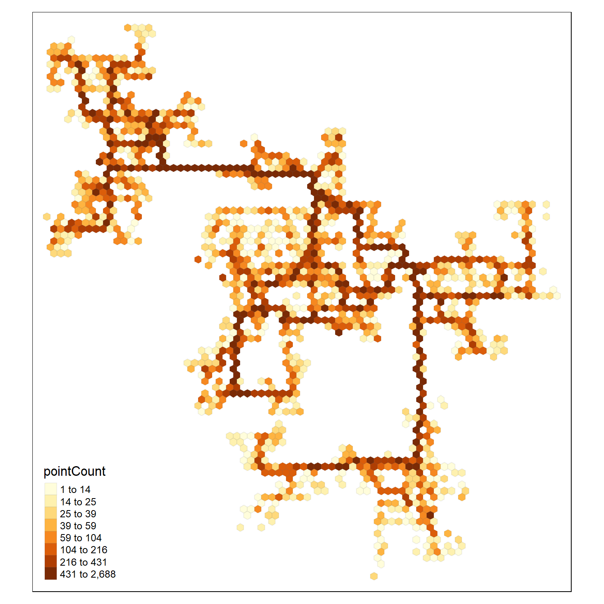

```{r setup, include=FALSE}
options(htmltools.dir.version = FALSE)
knitr::opts_chunk$set(
  fig.retina=3,
  cache = FALSE,
  echo = TRUE,
  message = FALSE, 
  warning = FALSE)
```

```{r xaringan-themer, include=FALSE, warning=FALSE}
library(xaringanthemer)
style_duo_accent(
  primary_color = "#1381B0",
  secondary_color = "#FF961C",
  inverse_header_color = "#FFFFFF"
)
```

## Content

.large[
In this hands-on exercise, you will learn how to handling, processing, visualising and analysing movement data using R.  By the end of this hands-on exercise, you will be able to:

- import geospatial data in *wkt* format into R and saved the imported data as **simple feature** objects by using **sf** package,
- mapping geospatial data using tmap package,
- import movement data in *wkt* format into R and saved the imported data as **simple feature** objects by using **sf** package,
- process movement data by using sf and tidyverse packages,
- visualising movement data by using **tmap** and **ggplot2** package,
- analysing movement data by using R methods.
] 

---
## Getting Started

.pull-left[
.large[
In this Hands-on Exercise, the following R packages will be used:

- sf, an R package specially designed to handle geospatial data in simple feature objects. 
]]

--
.pull-right[
.large[
Write a code chunk to check, install and launch  **readr**, **sf** and **tmap** packages of R

```{r echo=FALSE, eval=TRUE}
packages = c('sf', 'tmap', 'tidyverse', 
             'lubridate', 'clock', 
             'sftime', 'rmarkdown')

for (p in packages){
  if(!require(p, character.only = T)){
    install.packages(p)
  }
  library(p,character.only = T)
}
```
]]

---
## Visualising Geographical Data
### Importing wkt data

.pull-left[
- *Well-known text (WKT)* is a human readable representation for spatial objects like points, lines, or enclosed areas on a map.  Figure below shows the structure of point, line and polygons data in wkt format.


]

--
.pull-right[

In the code chunk below, [`read_sf()`]() of **sf** package is used to parse *School.csv* into R as an sf data.frame.

```{r}
schools <- read_sf("data/wkt/Schools.csv", 
                   options = "GEOM_POSSIBLE_NAMES=location")  
```

**DIY:**  Using the code you had learned, parses *Pubs.csv*, *Apartments.csv*, *Buildings.csv*, *Employer.csv*, and *Restaurants.csv* into R 

```{r echo=FALSE}
pubs <- read_sf("data/wkt/Pubs.csv", 
                   options = "GEOM_POSSIBLE_NAMES=location")
apartments <- read_sf("data/wkt/Apartments.csv", 
                   options = "GEOM_POSSIBLE_NAMES=location")
buildings <- read_sf("data/wkt/Buildings.csv", 
                   options = "GEOM_POSSIBLE_NAMES=location")
employers <- read_sf("data/wkt/Employers.csv", 
                   options = "GEOM_POSSIBLE_NAMES=location")
restaurants <- read_sf("data/wkt/Restaurants.csv", 
                   options = "GEOM_POSSIBLE_NAMES=location")
```
]

---
### Structure of a simple point feature data.frame

- After importing the data file into R, it is important for us to review the data object.

```{r}
print(schools)
```

---
### Structure of a simple polygon feature data.frame

Now we will print the *buildings* simple feature data.frame.

```{r}
print(buildings)
```

---
### Plotting the building footprint map: tmap methods

.pull-left[
The code chunk below plots the building polygon features by using `tm_polygon()`.

```{r eval=FALSE}
tmap_mode("view")
tm_shape(buildings)+
tm_polygons(col = "grey60",
           size = 1,
           border.col = "black",
           border.lwd = 1)
tmap_mode("plot")
```

Things to learn from the code chunk:
- `tmap_mode()` is used to switch the display from static mode (i.e. "plot") to interactive mode (i.e. "view").
- `tm_shape()` is used to create a **tmap-element** that specifies a spatial data object (i.e. buildings).
- `tm_polygon()` is used to create a **tmap-element** that draws polygon feature.
]

.pull-right[

```{r echo=FALSE}
tmap_mode("view")
tm_shape(buildings)+
  tm_polygons(col = "grey60",
             size = 1,
             border.col = "black",
             border.lwd = 1)
tmap_mode("plot")
```
]

---
### Plotting a composite map: tmap methods

.pull-left[
The code chunk below is used to plot a composite map by combining the buildings and employers simple feature data.frames.

```{r eval=FALSE}
tmap_mode("plot")
tm_shape(buildings)+
tm_polygons(col = "grey60",
           size = 1,
           border.col = "black",
           border.lwd = 1) +
tm_shape(employers) +
  tm_dots(col = "red")
```
]

.pull-right[

```{r echo=FALSE}
tmap_mode("plot")
tm_shape(buildings)+
tm_polygons(col = "grey60",
           size = 1,
           border.col = "black",
           border.lwd = 1) +
tm_shape(employers) +
  tm_dots(col = "red")
```
]

---
### DIY: Plotting a composite map

.pull-left[
The Task: Plot a composite map by combining *buildings*, *apartments*, *employers*, *pubs*, *restaurants*, and *schools*. 

```{r echo=FALSE, eval=FALSE}
tmap_mode("plot")
tm_shape(buildings)+
tm_polygons(col = "grey60",
           size = 1,
           border.col = "black",
           border.lwd = 1) +
tm_shape(employers) +
  tm_dots(col = "red") +
tm_shape(apartments) +
  tm_dots(col = "lightblue") +
tm_shape(pubs) +
  tm_dots(col = "green") +
tm_shape(restaurants) +
  tm_dots(col = "blue") +
tm_shape(schools) +
  tm_dots(col = "yellow")
tmap_mode("plot")
```
]

.pull-right[

```{r echo=FALSE}
tmap_mode("plot")
tm_shape(buildings)+
tm_polygons(col = "grey60",
           size = 1,
           border.col = "black",
           border.lwd = 1) +
tm_shape(employers) +
  tm_dots(col = "red") +
tm_shape(apartments) +
  tm_dots(col = "lightblue") +
tm_shape(pubs) +
  tm_dots(col = "green") +
tm_shape(restaurants) +
  tm_dots(col = "blue") +
tm_shape(schools) +
  tm_dots(col = "yellow")
tmap_mode("plot")
```
]

---
## Movement Data

.pull-left[
In this section, you will learn how to handle, process, visualise and analyse movement data.  For the purpose of this hands-on exercise, *ParticipantStatusLogs1.csv* will be used. 

### Importing wkt data

**DIY:** By using the step you had learned, import *ParticipantStatusLogs1.csv* and save it as a simple feature data.frame.

```{r eval=FALSE}
logs <- read_sf("data/wkt/ParticipantStatusLogs1.csv", 
                options = "GEOM_POSSIBLE_NAMES=currentLocation") 
```
]

--
.pull-right[
Let us examine the structure of *logs* simple feature data.frame by using `glimpse()`.

```{r eval=FALSE}
glimpse(logs)
```

Notice that `read_sf()` failed to parse `timestamp` field into correct date-time data type. 
]

---
### Processing movement data

.pull-left[
To process the movement data, the following steps will be performed:

- convert *timestamp* field from character data type to date-time data type by using [`date_time_parse()`](https://clock.r-lib.org/reference/date-time-parse.html) of clock package.
- derive a *day* field by using [`get_day()`](https://clock.r-lib.org/reference/Date-getters.html) of clock package.
- extract records whereby *currentMode* field is equal to *Transport* class by using `filter()` of dplyr package.
] 

.pull-right[
DIY: Write a code chunk to perform the tasks described on the left.  

```{r echo=FALSE, eval=FALSE}
logs_selected <- logs %>%
  mutate(Timestamp = date_time_parse(timestamp,
                zone = "",
                format = "%Y-%m-%dT%H:%M:%S")) %>%
  mutate(day = get_day(Timestamp)) %>%
  filter(currentMode == "Transport")
```
]

```{r echo=FALSE, eval=FALSE}
write_rds(logs_selected, "data/rds/logs_selected.rds")
```

```{r echo=FALSE}
logs_selected <- read_rds("data/rds/logs_selected.rds")
```

---
### Plotting the moving data as points

.pull-left[
- Using appropriate tmap functions to create a map look similar to the figure on the left.

```{r echo=FALSE, eval=FALSE}
tmap_mode("plot")
tm_shape(buildings)+
tm_polygons(col = "grey60",
           size = 1,
           border.col = "black",
           border.lwd = 1) +
tm_shape(logs_selected) +
  tm_dots(col = "red") 
tmap_mode("plot")
```
]

.pull-right[
```{r echo=FALSE}
tmap_mode("plot")
tm_shape(buildings)+
tm_polygons(col = "grey60",
           size = 1,
           border.col = "black",
           border.lwd = 1) +
tm_shape(logs_selected) +
  tm_dots(col = "red") 
tmap_mode("plot")
```
]

---
## Hexagon Binning Map

.pull-left[
In this section, you will learn how to create a [hexagon binning map](https://think.design/services/data-visualization-data-design/hexbin/) by using R.


]

---
### Computing the haxegons

.pull-left[
In the code chunk below, [`st_make_grid()`]() of sf package is used to create haxegons


```{r eval=FALSE}
hex <- st_make_grid(buildings, 
                    cellsize=100, 
                    square=FALSE) %>%
  st_sf() %>%
  rowid_to_column('hex_id')
plot(hex)
```
]

.pull-right[
```{r echo=FALSE}
hex <- st_make_grid(buildings, 
                    cellsize=100, 
                    square=FALSE) %>%
  st_sf() %>%
  rowid_to_column('hex_id')
plot(hex)
```

]

---
### Performing point in polygon overlay

.pull-left[
The code chunk below perform point in polygon overlay by using [`st_join()`] of sf package.

```{r}
points_in_hex <- st_join(logs_selected, 
                         hex, 
                         join=st_within)
#plot(points_in_hex, pch='.')
```
]

---
### Performing point in polygon count

.pull-left[
In the code chunk below, `st_join()` of sf package is used to count the number of event points in the hexagons.

```{r}
points_in_hex <- st_join(logs_selected, 
                        hex, 
                        join=st_within) %>%
  st_set_geometry(NULL) %>%
  count(name='pointCount', hex_id)
head(points_in_hex)
```
]

---
### Performing relational join

.pull-left[
In the code chunk below, left_join() of dplyr package is used to perform a left-join by using *hex* as the target table and *points_in_hex* as the join table.  The join ID is *hex_id*. 


```{r}
hex_combined <- hex %>%
  left_join(points_in_hex, 
            by = 'hex_id') %>%
  replace(is.na(.), 0)
```
]


---
### Plotting the hexagon binning mapp

.pull-left[
In the code chunk below, tmap package is used to create the hexagon binning map.

```{r eval=FALSE}
tm_shape(hex_combined %>%
           filter(pointCount > 0))+
  tm_fill("pointCount",
          n = 8,
          style = "quantile") +
  tm_borders(alpha = 0.1)
```
]

.pull-right[
```{r echo=FALSE}
tm_shape(hex_combined %>%
           filter(pointCount > 0))+
  tm_fill("pointCount",
          n = 8,
          style = "quantile") +
  tm_borders(alpha = 0.1)
```
]

---
## Plotting Movement Path using R

.pull-left[
In this section, you will learn how to plot movement path using R.   
]

---
### Creating movement path from event points

.pull-left[
Code chunk below joins the event points into movement paths by using the participants' IDs as unique identifiers. 

```{r}
logs_path <- logs_selected %>%
  group_by(participantId, day) %>%
  summarize(m = mean(Timestamp), 
            do_union=FALSE) %>%
  st_cast("LINESTRING")
```  
]

.pull-right[
```{r}
print(logs_path)
```
]

---
### Plotting the Movement Paths

Write a code chunk to overplot the gps path of participant ID = 0 onto the background building footprint map.

```{r echo=FALSE}
logs_path_selected <- logs_path %>%
  filter(participantId==0)
tmap_mode("plot")
tm_shape(buildings)+
tm_polygons(col = "grey60",
           size = 1,
           border.col = "black",
           border.lwd = 1) +
  tm_shape(logs_path_selected) +
  tm_lines(col = "blue")
tmap_mode("plot")
```


```{r echo=FALSE, eval=FALSE}
library(pagedown)
pagedown::chrome_print("Hands-on_Ex07-MovementVis.html")
```


