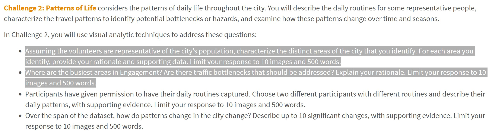

```{r setup, include=FALSE}
knitr::opts_chunk$set(echo = FALSE)
```

# The Task

With reference to bullet point 1 and 2 of Challenge 2 of VAST Challenge 2022, you are required to reveal:

- social areas of the [city of Engagement, Ohio USA](https://vast-challenge.github.io/2022/).  
- visualising and analysing locations with traffic bottleneck of the [city of Engagement, Ohio USA](https://vast-challenge.github.io/2022/).  



# Submission Instructions 

This is an individual assignment. You are required to work on the take-home exercises and prepare submission individually. 

- The take-home exercise submission must be written by using **distill for R Markdown**.  It can be in either [distill article](https://distill.pub/guide/) or [distill blog ](https://rstudio.github.io/distill/blog.html) format. You are required to publish the exercise on [Netlify](https://www.netlify.com/) and provide the link on the take-home exercise submission page on elearn. 
- You are also required to push the take-home exercise folder and data onto your individual Github repository and provide the link on the take-home exercise submission page on eLearn.
 
### Submission date 
 
Your completed take-home exercise is due on **29th May 2022, by 11:59pm evening**.

# Peer Learning

- [ALOYSIUS TENG](https://visual-analytics-course.netlify.app/th_ex/th_ex5.html)
- [ANTONIUS HANDY]()
- [CHE XUAN](https://r4dsa4va.netlify.app/th_ex/th_ex5.html)
- [CHU YI-NING]()
- [CUI JIARUI](https://jiarui-cui-isss608.netlify.app/th_ex/th_ex05)
- [DAVID KWOK WEI XIANG]()
- [DING YANMU](https://dingyanmu.netlify.app/th_ex/th_ex5.html)
- [HERANSHAN SO SUBRAMANIAM](https://heranshan-isss608.netlify.app/th_ex/th_ex5.html) Overall well balance submission.  Interesting approach used to prepare the map visualisation. Short code chunks were used to complete specific tasks.  

- [HUANG ANNI](https://huanganni.netlify.app/th_ex/th_ex5.html)
- [HUANG YAPING](https://analytics-homework.netlify.app/th_ex/th_ex5_v1.1)
- [HULWANA BINTE SAIFULZAMAN](https://hulwana-va.netlify.app/th_ex/th_ex5.html)
- [KIM BOMIN](https://bomink.netlify.app/posts/2022-04-25-hw5/index.html)
- [LAM KUO JIAN JEREMIAH](https://jeremiahlam.netlify.app/th_ex/th_ex5.html)
- [LEE XIAO QI](https://tiffanylxq.netlify.app/takehomeex/th_ex5)
- [LI HONGYI](https://jessielhy.netlify.app/th_ex/th_ex5.html)
- [LI HUAN](https://katherine-isss608.netlify.app/th_ex/th_ex5.html)
- [LI MINQI](https://isss608-visualization-liminqi.netlify.app/th_ex/th_ex5)
- [LIU ZHENGLIN](https://zhenglinliuvisual.netlify.app/th_ex/th_ex5.html)
- [LONG NU](https://leslielong-da.netlify.app/posts/2022-05-28-takehome5/) 
- [NI JUNQIU](https://isss-608-junqiuni.netlify.app/takehome_ex/takehome_ex05.html)
- [ONG ZHI RONG JORDAN](https://isss608-jordan-va.netlify.app/th_ex5/th_ex5.html) Another well prepared submission especially in term of storytelling (please refer to Analysis of Plot sub-sections)
- [RAKENDU RAMESH](https://rakendu-mitb2021.netlify.app/th_ex/th_ex05.html)
- [RAO NINGZHEN](https://moonlit-banoffee-74b270.netlify.app/th_ex/th5.html)
- [RAUNAK KAPUR](https://isss608-raunakkapur.netlify.app/th_ex/the5) A well rounded submission.  Short code chunks were used to address specific data processing and data visualisation tasks. Appropriate implementation of analytical mapping technique.  Visual storytelling were comprehensively edited.    
- [RAVEENA CHAKRAPANI](https://raveenaclr.netlify.app/th_ex/th_ex5.html)
- [SHACHI ANIRUDHA RAODEO](https://visualanalytics.netlify.app/th_ex/th_ex5.html)
- [SUI TIANYUE](https://isss608totallynew.netlify.app/take_home_exercise/ex_5.html)
- [TAY CHENG WEI CLARENCE](https://clarencetay.netlify.app/th_ex/th_ex5.html)
- [TSENG CHIA-YI](https://mitb-va-joycetseng.netlify.app/posts/2022-05-27-takehome5/)
- [WANG TIANQI](https://wtqmitbva.netlify.app/takehome5)
- [YEO KIM SIANG](https://kimsiang-va.netlify.app/takehome_exercise/takehome_exercise_5.html)
- [YU DI](https://yudiva.netlify.app/exe5)
   

```{r echo=FALSE, eval=FALSE}
library(pagedown)
pagedown::chrome_print("TH_EX05.html")
```


