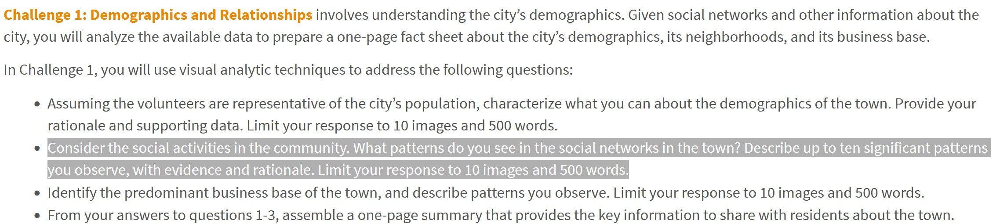

```{r setup, include=FALSE}
knitr::opts_chunk$set(echo = FALSE)
```

# The Task

With reference to bullet point 2 of Challenge 1 of VAST Challenge 2022, you are required to reveal the patterns of community interactions of the [city of Engagement, Ohio USA](https://vast-challenge.github.io/2022/) by using social network analysis approach.  



# Submission Instructions 

This is an individual assignment. You are required to work on the take-home exercises and prepare submission individually. 

- The take-home exercise submission must be written by using **distill for R Markdown**.  It can be in either [distill article](https://distill.pub/guide/) or [distill blog ](https://rstudio.github.io/distill/blog.html) format. You are required to publish the exercise on [Netlify](https://www.netlify.com/) and provide the link on the take-home exercise submission page on elearn. 
- You are also required to push the take-home exercise folder and data onto your individual Github repository and provide the link on the take-home exercise submission page on eLearn.
 
### Submission date 
 
Your completed take-home exercise is due on **5th June 2022, by 11:59pm evening**.

# Peer Learning

- [ALOYSIUS TENG](https://visual-analytics-course.netlify.app/th_ex/th_ex6.html)
- [ANTONIUS HANDY](https://isss608-hhhandy.netlify.app/th_ex/th_ex6.html)
- [CHE XUAN](https://r4dsa4va.netlify.app/th_ex/th_ex6.html)
- [CHU YI-NING]()
- [CUI JIARUI](https://jiarui-cui-isss608.netlify.app/th_ex/th_ex06)
- [DAVID KWOK WEI XIANG]()
- [DING YANMU](https://dingyanmu.netlify.app/th_ex/th_ex6.html)
- [HERANSHAN SO SUBRAMANIAM](https://heranshan-isss608.netlify.app/th_ex/th_ex6.html)
- [HUANG ANNI](https://huanganni.netlify.app/th_ex/th_ex6.html)
- [HUANG YAPING]()
- [HULWANA BINTE SAIFULZAMAN]()
- [KIM BOMIN](https://bomink.netlify.app/posts/2022-06-03-hw6/index.html)
- [LAM KUO JIAN JEREMIAH](https://jeremiahlam.netlify.app/th_ex/th_ex6.html)
- [LEE XIAO QI]()
- [LI HONGYI](https://jessielhy.netlify.app/th_ex/th_ex6.html)
- [LI HUAN](https://katherine-isss608.netlify.app/th_ex/th_ex6.html)
- [LI MINQI](https://isss608-visualization-liminqi.netlify.app/th_ex/th_ex6)
- [LIU ZHENGLIN](https://zhenglinliuvisual.netlify.app/th_ex/th_ex6.html)
- [LONG NU](https://leslielong-da.netlify.app/posts/2022-06-02-takehome6/) 
- [NI JUNQIU](https://isss-608-junqiuni.netlify.app/takehome_ex/takehome_ex06.html)
- [ONG ZHI RONG JORDAN](https://isss608-jordan-va.netlify.app/th_ex6/th_ex6.html)
- [RAKENDU RAMESH](https://rakendu-mitb2021.netlify.app/th_ex/th_ex06.html)
- [RAO NINGZHEN]()
- [RAUNAK KAPUR](https://isss608-raunakkapur.netlify.app/th_ex/the6)
- [RAVEENA CHAKRAPANI](https://raveenaclr.netlify.app/th_ex/th_ex6.html)
- [SHACHI ANIRUDHA RAODEO](https://visualanalytics.netlify.app/th_ex/th_ex6.html)
- [SUI TIANYUE](https://isss608totallynew.netlify.app/take_home_exercise/ex_6.html)
- [TAY CHENG WEI CLARENCE]()
- [TSENG CHIA-YI](https://mitb-va-joycetseng.netlify.app/posts/2022-06-04-takehome6/)
- [WANG TIANQI](https://wtqmitbva.netlify.app/takehome6)
- [YEO KIM SIANG](https://kimsiang-va.netlify.app/takehome_exercise/takehome_exercise_6.html)
- [YU DI](https://yudiva.netlify.app/exe6)
   

```{r echo=FALSE, eval=FALSE}
library(pagedown)
pagedown::chrome_print("TH_EX06.html")
```


