```{r setup, include=FALSE}
knitr::opts_chunk$set(echo = FALSE)
```

## What will you learn from this lesson?

.large[
- Typology of Interactive Techniques
    - Data & view specification
    - View Manipulation
    - Process and Provenance

- Interactive Design Primitive

- Animation: Principles and Best Practices
]

---
## Building Block of Visual Analytics

.center[
]

---
## Revisiting Visual Analytics Framework

.center[
]

---
## Taxonomy of Interactive Dynamics 

.center[
]

.small[
Source: Heer, J. & Shneiderman, B. (2012) "[Interactive Dynamics for Visual Analytics](https://queue.acm.org/detail.cfm?id=2146416)" ***ACM Queue***, Vol. 55, No. 4, pp 45-54.]

---
### Data & view specification
- **Visualise** data by choosing visual encodings.
- **Polaris** of Tableau

.center[
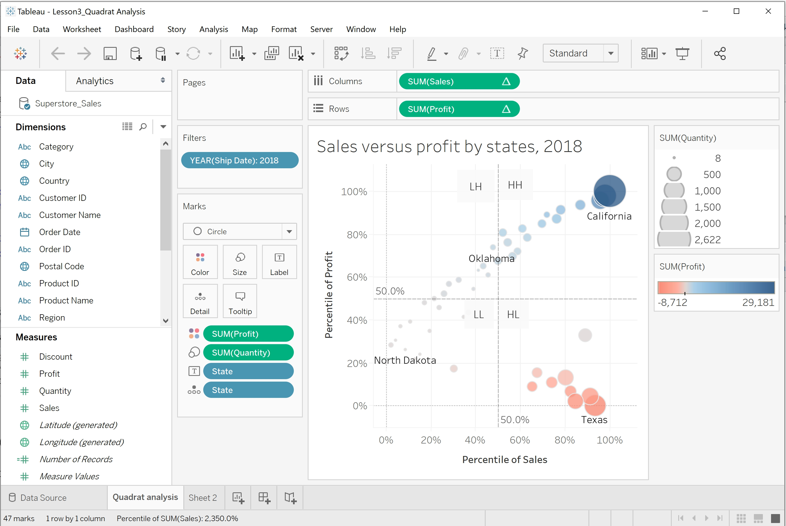]

---
### Data & view specification
- **Filter** out data to focus on relevant items.

.center[
]

---
### Data & view specification
- **Slicer** is an axis-parallel selection tool, which selects a range along an axis, where the end-point of the interval can be modified dynamically.

.center[
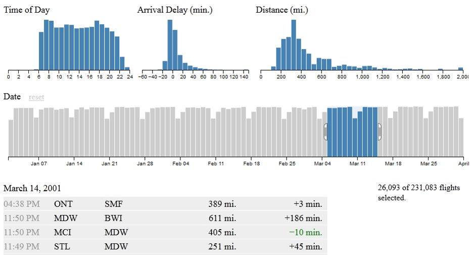]
.small[Source: https://square.github.io/crossfilter/]

---
### Data & view specification
- **Sort** items to expose patterns.

.center[
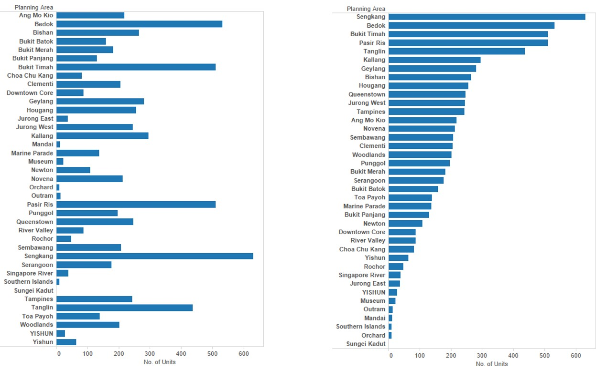]

---
### Data & view specification
- Hierarchical sorting

.center[
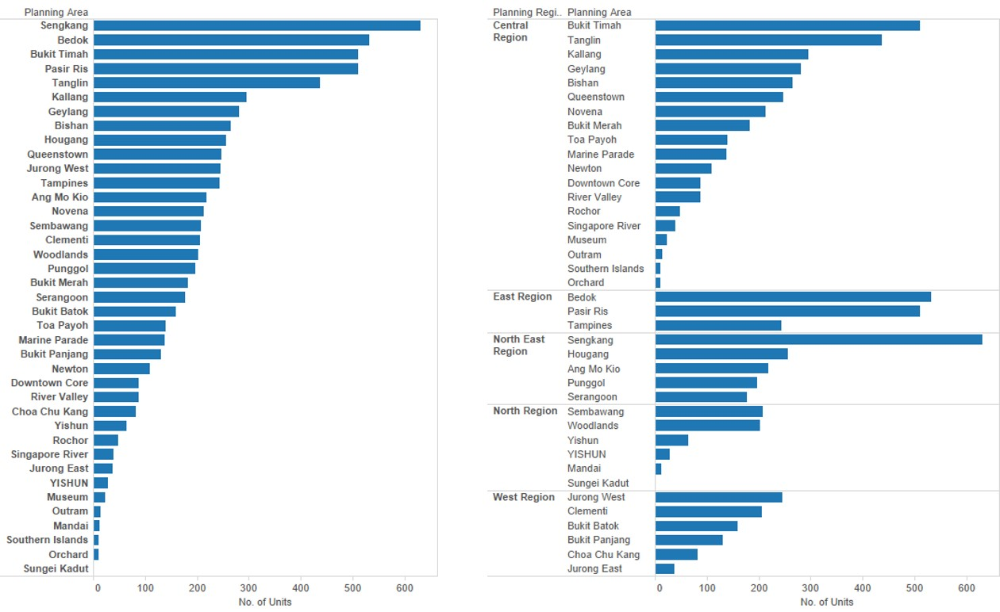]

---
### Data & view specification
- **Derive** values or models from source data.

.center[
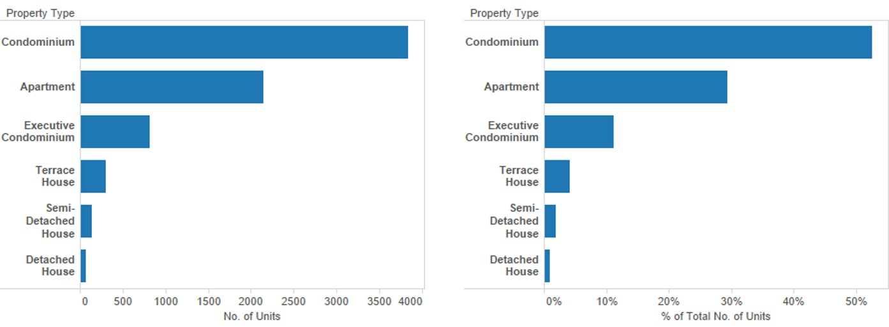]

---
## View Manipulation
### Selection functions
- **Pointer** selects a single object in a plot.
.center[
]

---
## View Manipulation
### Selection functions
- **Drag-box** selects a rectangular region in a box.

.center[
]

---
## View Manipulation
### Selection functions
.pull-left[
- **Brush** is a generalisation of the drag-box.  Once a rectangular region is define, the brush allows users to move that region across a plot and thus dynamically change the selected subset.
]

.pull-right[
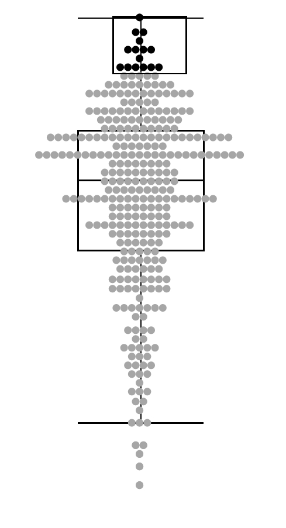]

---
## View Manipulation
### Selection functions
- **Lasso** allows users to define an arbitrary contiguous shape to select data.

.center[
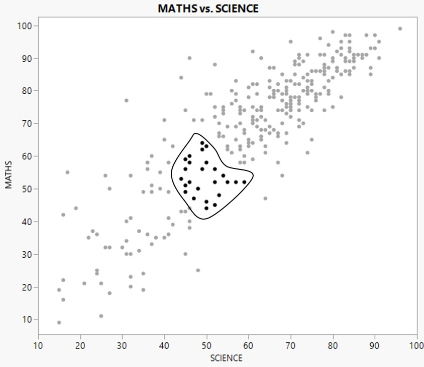]

---
## View Manipulation
### Selection modes

.center[
]
.small[
Reference: http://www.theusrus.de/Mondrian/]

---
## View Manipulation
### Highlighting
- Selected records are highlighted.

.center[
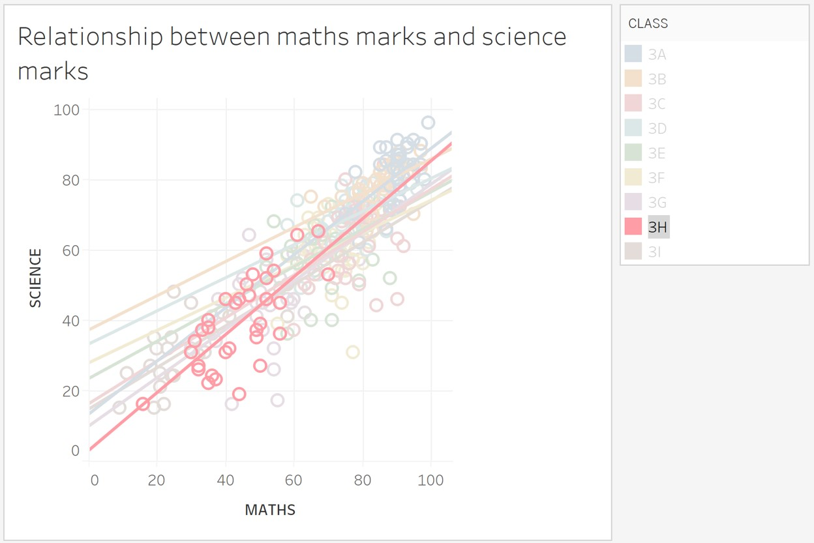]

---
## View Manipulation
- **Navigate** to examine high-level patterns and low-level detail.
- Shneiderman’s mantra

.center[
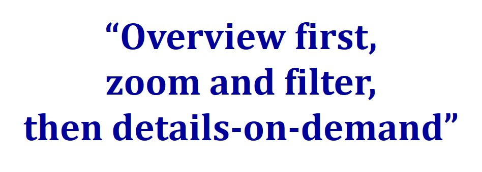]

---
## View Manipulation
- The scatter plot provides an overview and the bar and line graphs provide detail sales and profits trends overtime.

.center[
]

---
## View Manipulation
- **Coordinate** views for linked, multi-dimensional exploration

.center[

]

.center[
Scatterplot with marginal boxplot]

---
## View Manipulation
- **Organise** multiple windows and workspaces

.center[
]

.small[
Source:https://public.tableau.com/profile/yifei2012#!/vizhome/Updated1/VASTChallenge2017MC1]

---
## View Manipulation
### Rotating
- Touring view with JMP’s 3D scatterplot

.center[
]

---
## Process and Provenance

.large[
- Record analysis histories for revisitation, review and sharing.

- Annotate patterns to determine findings.

- Share views and annotations to enable collaboration.

- Guide users through analysis tasks or stories.

]


---
## Interactive Design Primitive

A framework for effective interactive design in visual analytics application.

.center[

]

.small[
Source: Roth, R.E. (2012) “Cartographic Interaction Primitive: Framework and Synthesis”. The Cartographic Journal, Vol. 49, No. 4 pp. 376-395.
]

---
## Interactive Design Primitive

.pull-left[
### Visual Analytics Objective Primitives


]

.pull-right[
### Interactive Analytics Operator Primitives

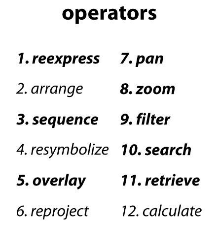
]

---
## Interactive Design Primitive

.center[

]

---
## Animation in Visual Analytics

.pull-left[
.large[
- The purpose of animation is to facilitate perception of changes when transitioning between related data graphics

- Do not confine to time-series data only
]
]

.pull-right[
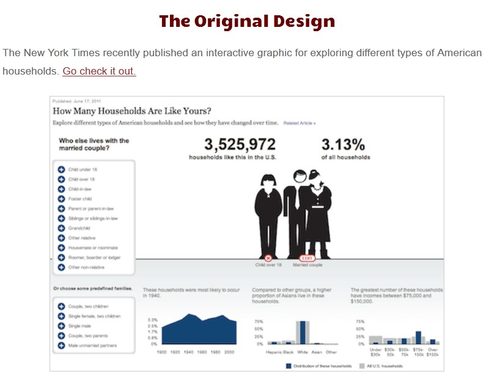
.small[Source: http://worrydream.com/HowManyHouseholds/] 
]

---
### Why using Animation in Visual Analytics

.large[
- Motion is highly effective at attracting attention.

- Animation facilitates object constancy for changing objects.

- Animated behaviours can give rise to perceptions of causality and intentionality, communicating cause-and-effect relationships and establishing narrative.

- Animation can be emotionally engaging, engendering increased interest or enjoyment.
]

---
### Principles of Animation

.pull-left[
- ***Congruence*** principle states that the structure and content of the external representation should correspond to the desired and content of the internal representation.

- Maintain valid data graphics during transitions

- Use consistent semantic-syntactic mappings

- Respect semantic correspondence

- Avoid ambiguity
]

.pull-right[
- ***Apprehension*** principle states that the structure and content of the external representation should be readily and accurately perceived and comprehended.

- Group similar transitions

- Minimise occlusion

- Maximise predictability

- Use simple transitions

- Use staging for complex transitions

- Make transitions as long as needed, but no longer
]

.small[Source: Heer, J and Robertson G. (2007) [Animated Transitions in Statistical data Graphics](https://idl.cs.washington.edu/files/2007-AnimatedTransitions-InfoVis.pdf), IEEE Transactions on Visualization and Computer Graphics, Vol. 13, No. 6, 1240-1247 and the [video](https://www.youtube.com/watch?v=vLk7mlAtEXI).
]

---
## Animation in Action

.pull-left[
### Stacked-to-Grouped Bars

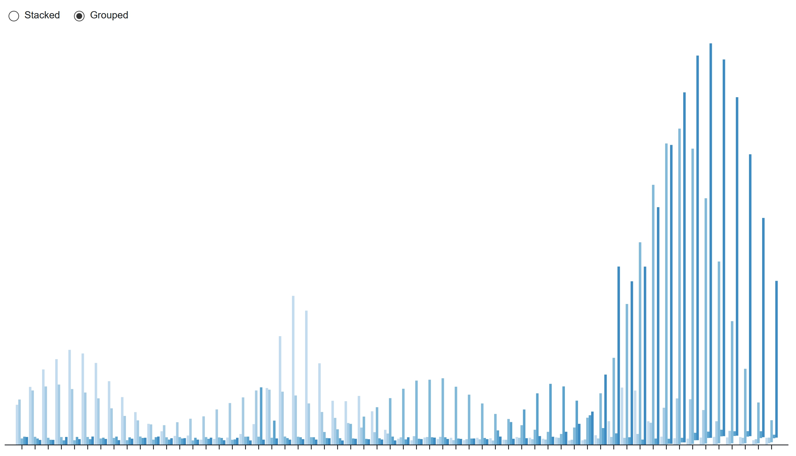
.small[Source:
https://observablehq.com/@d3/stacked-to-grouped-bars
]
]

.pull-right[
### Animated Co-occurrence matrix


.small[Source: https://bost.ocks.org/mike/miserables/ 
]
]

---
## References

- [Dynamics for Visual Analysis](https://idl.cs.washington.edu/files/2012-InteractiveDynamics-CACM.pdf)

- [Animated Transitions in Statistical Data Graphics](https://idl.cs.washington.edu/files/2007-AnimatedTransitions-InfoVis.pdf), IEEE Transactions on Visualization and Computer Graphics, Vol. 13, No. 6, 1240-1247 and the [video](https://www.youtube.com/watch?v=vLk7mlAtEXI) 
- [Coordinated Highlighting in Context](http://www.perceptualedge.com/articles/visual_business_intelligence/coordinated_highlighting_in_context.pdf)

- [Cartographic Interaction Primitive: Framework and Synthesis](https://web-a-ebscohost-com.libproxy.smu.edu.sg/ehost/pdfviewer/pdfviewer?vid=1&sid=16eab3bc-b4a2-47b5-9a03-2619822e5ddb%40sessionmgr4007)


```{r echo=FALSE, eval=FALSE}
library(pagedown)
pagedown::chrome_print("Lesson03-Interactivity_in_Visual_Analytics.html")
```

