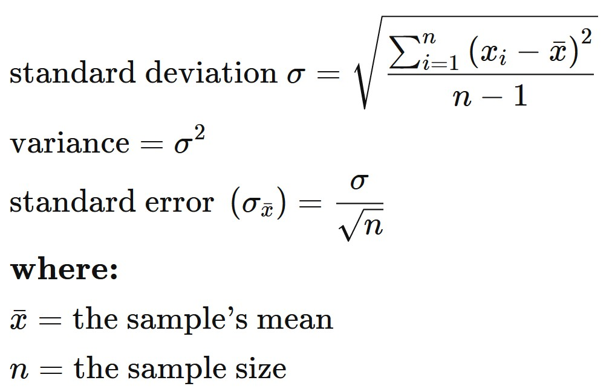

```{r setup, include=FALSE}
knitr::opts_chunk$set(echo = FALSE)
```

# What will you learn from this lesson?
.vlarge[
- Visual Analytics for Knowledge Discovery
- Visual Analytics Approach for Statistical Testing
- Visual Analytics for Building Better Models
- Visualising Uncertainty
- Variation and Its Discontents
]

???
In this lesson, I am going to share with you how visual analytics approach can be used to complement conventional statistical testing and model building.  Then, We will examine methods for visualising uncertainty.  Lastly, I will introduce you to funnel plot, a visual method specially designed to provide a fare comparison among entities in a group.    

---
## Visually Analytics for Knowledge Discovery

.large[
Motivation: To combine data visualisation and statistical modeling]

.center[
]

???
This slide highlight the important roles play by visual analytics in the knowledge discovery framework.

Before building model, visual analytics can be used to provide better understanding of the variables.  These information can be very useful in the subsequent model building process.  For example, appropriately designed visual analytics can be used to reveals if there is sign of multicolinearity.

After calibrating the model, visual analytics can be used to reveal the model output for example to check if the model conform to a specific statistical assumption.

---
## Visual Statistical Testing

.large[
To provide alternative statistical inference methods by default.
]

.pull-left[
]

.pull-right[
]

???
It is important to note that by combining data visualisation and statistical analysis, we need ensure that the methods used are regorous and inline with the statistical principles.

---
## Visual Statistical Testing

.large[
To follow best practices for statistical reporting.

+ For all statistical tests reported in the plots, the default template abides by the [APA](https://my.ilstu.edu/~jhkahn/apastats.html) gold standard for statistical reporting. For example, here are results from a robust t-test:
]

.center[
]

???
At the sametime, we also want to ensure that the reports are inline with the academic publication best practices. 

---
### Two-sample means

.pull-left[
.large[
Boxplot revealing the mean and distribution of two samples. 


]]

.pull-right[
.large[
Boxplot with two-sample mean test


]]

???
The chart on the left is a typical boxplot commonly prepared by data visualisation designer.

The chart on the right is an example of a visual analytic boxplot.  Notice that, the chart is complement with statistical test results and other ancillary information such as sample sizes and sample means. 

---
### Visually-driven Correlation Analysis

.pull-left[
.large[
Scatter plot showing the relationship between two continuous variables. 


]]

.pull-right[
.large[
Scatter plot with significant test of correlation.


]]

???
The chart on the left is a typical scatter plot commonly prepared by data visualisation designer.

The chart on the right is an example of a visual analytic boxplot.  Notice that, the chart is complement with statistical test results and other ancillary information such as sample sizes. 

---
### Visually-driven Association (Independent) Analysis

.pull-left[
Mosaic plot showing the association between two categorical variables.


]

.pull-right[
Stacked bar chart with significant test of association.


]

???
The chart on the left is a typical stacked bar chart commonly prepared by data visualisation designer.

The chart on the right is an example of a visual analytic stacked bar chart.  Notice that, the chart is complement with statistical test results and other ancillary information such as sample sizes. 

---
## Visual Analytics Appraoch for Building Exploratory Models
### Model Diagnostic: checking for multicolinearity:

.pull-left[
Conventional statistical report


]

.pull-right[
Visual Analytics approach


]

???
When building explanatory model by using multiple regression method, it is important for us to avoid having dependent variables that are high correlated. Conventional a statistical method called VIF (Variance Inflation Factor) is used and a typical result is shown on the left.  The report is not easy to comprehend by casual data analyst. 

The bar chart on the right is a visual analytic approach to show the same report.  Three different colours are used to diffrentiate the degree of multicolinearity and the VIF values are mapped to the height of the bar.

---
## Visual Analytics Appraoch for Building Exploratory Models
 
.pull-left[
.vlarge[Model Diagnostic: Checking normality assumption]


]

.pull-right[
.vlarge[Model Diagnostic: Checking model for homogeneity of variances]


]

???
The analytical histogram of the left is specially designed for normality assumption test.  When the residual histogram (in cyan colour) is not closed to the theretical histogram (i.e in green), then we will reject the Null hypotehsis and infer that the model residual failed to conform to normality assumption.

The analytical scatter plot on the right is used to perform homogeneity of Variance assumption test.  A constant variance distribution should be flat and horizontal and the data points should be scattered around the fit line.  The chart on the right shows clear sign of heteroscedasticity. 

---
## Visual Analytics Appraoch for Building Exploratory Models
### Analysing model parameters

.pull-left[
Conventional statistical report


]

--
.pull-right[
Visual Analytics approach


]


---
# Visualising Uncertainty
## Why it is important?

.left-column[
.large[
- One of the most challenging aspects of data visualization is the visualization of uncertainty.]] 

.right-column[


.small[Source: Chart 61, LABOUR FORCE IN SINGAPORE 2019, pg. 52]
]

???
One of the most challenging aspects of visual analytics is the visualisation of uncertainty.  When we see data point drawn in a specific location, we tend to interpret it as a precise representation of the true value.  It is difficult to conceive that a data point could actually lie somewhere it hasn't been drawn.  Yet this scenario is ubiquitous in data visualisation.  Nearly every dataset we work with has some uncertainty, and whether and how we choose to represent this uncertainty can make a major difference in how accurately our audience perceives the meaning of the data.

Two commonly used approaches to indicate uncertainty are error bars and confidence bands.  In this section, we will examine the basic concepts and design pricinples of these methods. 

---
### Why one shouldn’t use a bar graph, even if the data are normally distributed?

.pull-left[
.large[
- It is not appropriate to displace average values on bars]]

.pull-right[
.center[
]]

???
Figure on the right is an EDA plot that I use to see in the Assignment 1 reports of ISSS602 Data Analytics Lab.  Bar chart should be used to show count or frequency count and should not be used to reveal summary statistics such as mean.  This is because the bar failed to show the range of observed values.

---
### Why Error bar failed?

.pull-left[
.large[
- Each error bar is constructed using a 95% confidence interval of the mean.]]

.pull-right[
]

???
In an error bar, the bar height represents the mean. Error bars represent 1 standard error. The y-axis starts at zero and ends just above the highest error bar.

Given that the y-axis typically starts at zero, bars often include
irrelevance values as shown in the figure. zone of irrelevance.

---
### Error bar on a dot plot

.pull-left[
- Each error bar is constructed using a 95% confidence interval of the percentage.]

.pull-right[
.center[
]]

???
The error plot on dot plot is more truthful and informative alternatives to the error bar graph in previous slide.  The plot reveals the value range of each race clearly.  By applying inking principle in the design, the error plot and the mean value of each race is shown clearly.  

---
## Graphical methods for visualising uncertainty
.center[
]
.small[Reference: https://serialmentor.com/dataviz/visualizing-uncertainty.html#visualizing-the-uncertainty-of-point-estimates]

???
This figure shows different different alternative design of error plots:
+ graded error plots with caps;
+ graded error plots without caps;
+ single-interval error plots with caps;
+ single-interval error plots without caps;
+ confidence strips; and
+ confidence distributions.

There are advantages and disadvantages to all these choices.  You are encouraged to explore them one by one and select the best data visualisation that meet you storytelling need.

---
## Back to Statistics 101
### Population and samples

.pull-left[

]

.pull-right[
]

- When drawing many samples from a population, it is possible to obtain a few with means that greatly differ from the population.

.small[Reference: Cairo, A. (2016) The Truthful Art, Chapter 11, New Riders]

???
in order to prepare an error plot manually, it is good for us the revise some of the basic statistical concepts.

---
## A reminder of the standard normal distribution

.center[
]
.small[Reference: Cairo, A. (2016) The Truthful Art, Chapter 11, New Riders]

???
If the distribution of heights in the population is roughly normal (and, again, we don't know this), your answer can be inspired by a chart in this slide, which displays the percentage of scores that lie in between a certain number of standard deviations from the mean.  We see that 68.2 percent of score lie between -1 and 1 standard deviations from the mean, and just 0.1 percent of scores are above three standard deviation.
+ In a standard normal distribution, 95 percent of the scores lie between z-score -1.96 and 1.96 (that is, between -1.96 and 1.96 standard deviations from the mean).
+ Also in a standard normal distribution, 99 percent of the scores lie between z-scores -2.58 and 2.58 (they are between -2.58 and 2.58 standard deviations from the mean)


---
## The standard error

.pull-left[
The formulas of standard deviation and standard error


]

.pull-right[
]
.small[Reference: Cairo, A. (2016) The Truthful Art, Chapter 11, New Riders]

???
Imagine that instead of drawing just a few samples from our population, we are able to get dozens of random samples of 40 purples each and that we calculate the mean of each of them.  
Next, imagine that we discard all scores from all samples, and that we just keep their means.  Then, we draw a histogram of just these means.  This imaginary histogram is called **a distribution of sample means**.
As any other distribution, it will have a mean of its own (a mean of sample means) and a standard deviation.  This standard deviation of many imaginary sample means is called **the standard error of the mean**.

---
## Calculating the confidence interval of a mean

.center[
]
.small[Reference: Cairo, A. (2016) The Truthful Art, Chapter 11, New Riders]

???
A confidence interval is an expression of the uncertainty around any statistic we wish to report.  It is based on the standard error, and it's usually communicated this way: 

"With a 95 percent level of confidence, we estimate that the average height of 12-year-old purples is 5.3feet +/-(margin of error here).

To calculate a confidence interval first, we need to decide on a confidence level.  The most common one is 95% and 98%, although you could really pick any figure you wish. What we need to remember is that **the greater the confidence level we choose, the greater the margin of error becomes**.

Let us begin with the confidence interval for the mean of a sample.  The average height of purples in our sample was 5.3 feet, and the standard deviation was 0.5.  The 5.3 score is a **point estimate**.  Reporting it on its own isn't correct.  We must also disclose the uncertainty that surrounds it.  The formulas for the confidence interval of the mean of a large sample and to apply them are in the slide.  The z in red is called the **critical value**.

---
## Calculating the confidence interval of a percentage

.center[
]

.small[Reference: Cairo, A. (2016) The Truthful Art, Chapter 11, New Riders]

???
This slide shows the formulas to calculate the confidence interval of a percentage. Notice that the main different in these formula.  

---
## 2-d graphical methods for visualising uncertainty

.pull-left[
### Scatter plot with 95% confidence ellipse

]

--

.pull-right[
### Scatter plot with 95% confidence intervals

]

???
The chart on the left shows the 95% confidence ellipse of a scatter plot and the chart on the right shows the 95% confidence band of a trend line (also known as best fit line).

It is a common mistake to think that 95% confidence ellipse contains 95% of the data.  A 95% confidence ellipse for it's mean is really an algorithm with the following property: if you were to replicate our sampling from the underlying distribution many times and each time calculate a confidence ellipse, then 95% of the ellipses so constructed would contain the underlying mean. (Note that each sample would of course yield a different ellipse.)

---
### Confidence band of a trend line

.pull-left[
.large[Confidence band and fit lines]


]

--
.pull-right[
A graded confidence band
]

???
The 95% confidence band, on the other hand, provides us with a range of different fit lines that would be compatible with the data.  When student encounter a confidence band for the first time, they are often surprised that even a perfectly straight line produces a confidence band that is curved.  The reason for the curvature is that the straight line fit can move in two distinct directions: it can be up and down (i.e have different intercepts), and it can rotate (i.e. having different slopes.)

To draw a confidence ban, we need to specify a confidence lvel, and just as we did for error plots, it can be useful to highlight different levels of confidence.  This leads us to the graded confidence band, which shows several confidence levels at once.  

---
# Variation and Its Discontents
## Random and unfair comparisons

.center[
]
.small[Reference: https://www.perceptualedge.com/articles/visual_business_intelligence/variation_and_its_discontents.pdf]

???
Central to quantitative data analysis is an understanding of **variation**. When we measure multiple occurrences of things to determine how and to what extent they differ, we’re examining variation. Some variation is random and some is caused by factors that we can attempt to identify and perhaps control. Random variation consists of differences in measures that occur routinely, without a specific cause. We should note random variation and move on, because nothing can be done about it. It is noise. It tells us nothing that requires a response.

Instances of non-random variation are signals; they tell us something useful and provide opportunities for action. Signals that indicate poor performance—an undesirable state—can perhaps be reduced by controlling the causes. Signals that indicate an especially good state of affairs can provide useful insights and opportunities for improvement.

Despite the significance of variation, relatively few people who work with data in most organizations understand it, especially the nature of randomness. This leads to false conclusions and poor decisions, especially when comparing measures of performance within a set of like entities (e.g., countries or companies). Most organizations spend too much time examining noise: the cacophony of random variation. Learning to distinguish signals from the noise is a fundamental skill of data analysis and performance monitoring. In this article, we’ll take a look at a special version of a scatter plot, called a **funnel plot** (not to be confused with a funnel chart), which is designed to filter out the noise and shine a spotlight on meaningful variation when we compare performance among entities in a group. Funnel plots address the fact that entities with relatively few occurrences of the thing being measured (a small sample), when compared to entities with many occurrences (a large sample), exhibit a greater degree of random variation, which must be taken into account when comparing them. A little later we’ll take a look at this problem and the solution that funnel plots provide in relation to healthcare data, but first let’s get more familiar with the effects of sample size on randomness.

Consider the following display (a caterpillar plot) of actual healthcare data. Each data point represents a hospital, with 260 in total. The values are mortality rates following surgeries and the solid horizontal line represents the mean.

The sample sizes (number of surgeries reported by each hospital) on which this graph is based range from 7 to 3,151. For this reason it isn’t appropriate to rank the hospitals by mortality rate. The ranking suggests a relationship of relative performance that cannot be determined by the data.

Imagine that, unlike the anonymous version of the graph above, each data point is labeled with the hospital’s name. Can you hear the screams of surgeons from the hospitals with the highest mortality rates in the 4th quartile section of the chart? Can you see the puffed up egos of the surgeons who work at the hospitals with mortality rates of zero in the 1st quartile section? One of the hospitals with a zero mortality rate provided a sample of only seven surgeries.

Note: You might realize, especially if you work with healthcare data similar to the example above, that a fair comparison of hospitals would require the data to be adjusted not just to account for varying sample sizes but also for varying levels of risk. Some surgeries are more risky than others and some patients, due to varying levels of illness, are more at risk than others. We’ll ignore this for now to keep the example simple.

---
## Funnel plots to the rescue

.pull-left[
.vlarge[Statistical details]
]

.pull-right[
]

???
This funnel plot displays one data point per hospital, each of which shows the number of surgeries and the square root transformed mortality rate. The square roots of the mortality rates are not particularly meaningful in and of themselves, but that doesn’t matter because we’re simply trying to identify the hospitals that exhibit a level of performance that is outside of the boundaries of random variation and thus, according to the language of statistical process control, were probably due to a “special cause.” The farther a value falls outside of the boundaries, the more likely it is due to a special cause rather than randomness.

Notice in the lower left-hand corner of the same plot below that two of the hospitals with mortality rates of zero reside within the boundaries, which indicates that we cannot rely on their low rates as significant.

It is important to note that in making this comparison, we are assuming that the hospitals are homogeneous, all part of a single system which might not true in real world. For example, surgeries of many types are being compared without taking into account the fact that surgeries vary significantly in mortality risk.  Likewise, patients of various levels of heath are being compared without taking into account that some of them went into surgery much healthier than others and were therefore at lesser mortality risk.  

It is routine when dealing with heterogeneous entities such as different types of surgeries and patients of varying levels of health to adjust values to account for these factors. In a case such as post-surgical mortality, typically an expected number of deaths is calculated to account for varying levels of risk and then the observed (actual) number of deaths that occurred is compared to this, resulting in an observed vs. expected (O/E) ratio. For a completely fair comparison of post-surgical mortality among these hospitals, it is this O/E ratio that should appear in the funnel plot.

---
## Normality assumption

.pull-left[
.large[- Before plotting the graph, it is important to check if the values are conformed to normal distribution assumption.

- If the raw values are not conformed to normality assumption, they have to be transformed.
]]

.pull-right[
]


```{r echo=FALSE, eval=FALSE}
library(pagedown)
pagedown::chrome_print("Lesson04-Fundamentals_of_Visual_Analytics.html")
```
