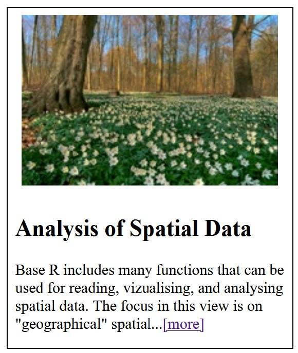
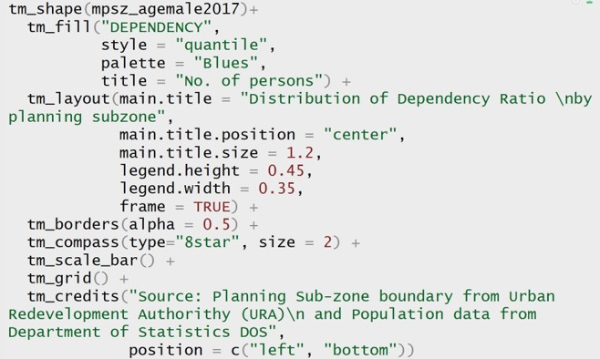
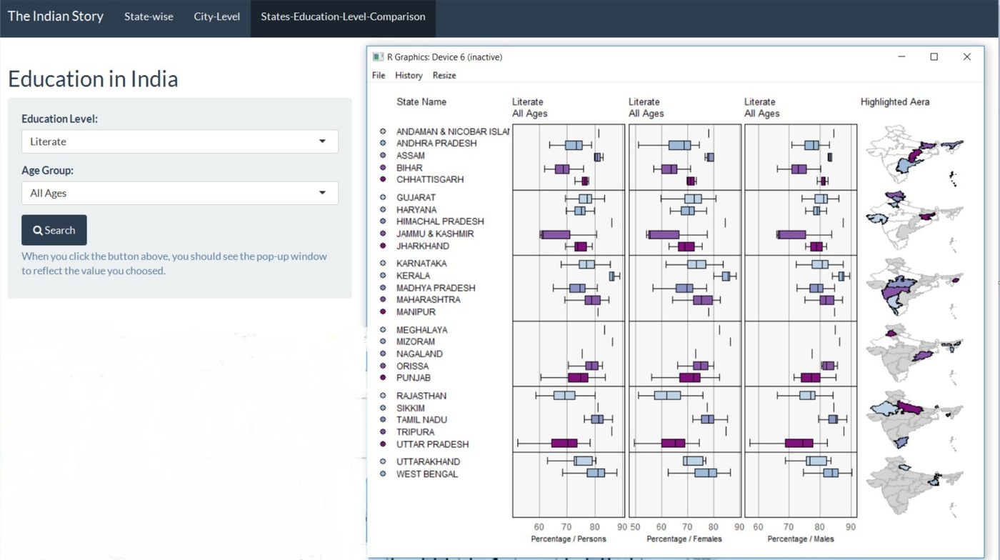
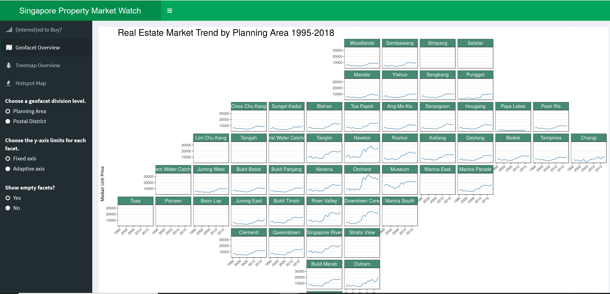

```{r setup, include=FALSE}
options(htmltools.dir.version = FALSE)
knitr::opts_chunk$set(
  fig.retina=3,
  cache = FALSE,
  echo = TRUE,
  message = FALSE, 
  warning = FALSE)
```

```{r xaringan-themer, include=FALSE, warning=FALSE}
library(xaringanthemer)
style_duo_accent(
  primary_color = "#1381B0",
  secondary_color = "#FF961C",
  inverse_header_color = "#FFFFFF"
)
```

## Content

.pull-left[
.large[
- Handling Geospatial Data with R
    - Simple features approach: **sf** package
    - Raster package

- Visualising Geospatial Data with R
    - Popular R packages for visualising geospatial data
    - Getting to know **tmap** package
    - Working with **tmap** 
]]

.pull-right[

Click [here](https://cran.r-project.org/web/views/Spatial.html)
]
    
---
# An introduction to Simple Features

.large[
- **feature**: abstraction of real world phenomena (type or instance); has a geometry and other attributes (properties)
- **simple feature**: feature with all geometric attributes described piecewise by straight line or planar interpolation between sets of points (no curves)
- It is a hierarchical data model that simplifies geographic data by condensing a complex range of geographic forms into a single geometry class.]

---
## Simple Features Objects

- *Simple features specification* is an open standard developed and endorsed by the Open Geospatial Consortium (OGC) to represent a wide range of geographic information. 
.center[ 
]

---
## An Introduction to Simple Features

- Only 7 out of 17 possible types of simple feature are currently used in the vast majority of GIS operations.

.center[
]

---
## Working with Simple Features
### Simple Features: How they look like?
.center[
]

---
## Working with Simple Features
### Simple Features: How they look like?
.center[
]

---
## Introducing [**sf**](https://cran.r-project.org/web/packages/sf/index.html) package

.center[

]

---
## Introducing sf Package
### An overview

.large[
A package that provides [simple features](https://en.wikipedia.org/wiki/Simple_Features) access for R. Package sf:

- represents simple features as records in a data.frame or tibble with a geometry list-column.
- represents natively in R all 17 simple feature types for all dimensions (XY, XYZ, XYM, XYZM).
- interfaces to [GEOS](https://trac.osgeo.org/geos) to support geometrical operations including the [DE9-IM](https://en.wikipedia.org/wiki/DE-9IM).
- interfaces to [GDAL](https://gdal.org/), supporting all driver options, Date and POSIXct and list-columns.
- interfaces to [PRØJ](https://proj.org/) for coordinate reference system conversions and transformations.
- uses [well-known-binary](https://en.wikipedia.org/wiki/Well-known_text_representation_of_geometry#Well-known_binary) serialisations written in C++/Rcpp for fast I/O with GDAL and GEOS.
- reads from and writes to spatial databases such as [PostGIS](http://postgis.net/) using [DBI](https://cran.r-project.org/web/packages/DBI/index.html).
- is extended by pkg [lwgeom](https://github.com/r-spatial/lwgeom/) for further liblwgeom/PostGIS functions, including some spherical geometry functions.
]

---
## Introducing sf package
### sfg : geometry for one feature

.center[
]

---
## Introducing sf package
### sf: objects with simple features


---
## Introducing sf package
### sf: objects with simple features
.large[
- in green a **simple feature**: a single record, or data.frame row, consisting of attributes and geometry.
- in blue a single **simple feature geometry** (an object of class **sfg**).
- in red a **simple feature list-column** (an object of class **sfc**, which is a column in the data.frame).]

---
## Introducing sf package
### Precision
.large[
One of the attributes of a geometry list-column (sfc) is the precision: a double number that, when non-zero, causes some rounding during conversion to WKB, which might help certain geometrical operations succeed that would otherwise fail due to floating point representation. 

The model is that of GEOS, which copies from the Java Topology Suite (JTS), and works like this:

- if precision is zero (default, unspecified), nothing is modified.
- negative values convert to float (4-byte real) precision.
- positive values convert to round(x*precision)/precision.]

---
## sf Methods
### Book keeping, low-level I/O
.large[
- st_read: read simple features from file or database, or retrieve layer names and their geometry type(s)
- st_as_text: convert to WKT
- st_as_binary: convert to WKB
- st_as_sfc: convert geometries to sfc (e.g., from WKT, WKB) as(x, "Spatial"): convert to Spatial*
- st_as_sf: convert to sf (e.g., convert from Spatial*)]

---
## sf Methods
### Logical binary geometry predicates

.large[
- st_intersects: touch or overlap
- st_disjoint: !intersects
- st_touches: touch
- st_crosses: cross (don't touch)
- st_within: within
- st_contains: contains
- st_overlaps: overlaps
- st_covers: cover
- st_covered_by: covered by
- st_equals: equals
- st_equals_exact: equals, with some fuzz returns a sparse (default) or dense logical matrix]

---
## sf Methods
### Geometry generating logical operators

.large[
- st_union: union of several geometries
- st_intersection: intersection of pairs of geometries
- st_difference: difference between pairs of geometries
- st_sym_difference: symmetric difference (xor)]

---
## sf Methods
### Higher-level operations: summarise, interpolate, aggregate, st_join

.large[
- aggregate and summarise use st_union (by default) to group feature geometries
- st_interpolate_aw: area-weighted interpolation, uses st_intersection to interpolate or redistribute attribute values, based on area of overlap:
- st_join uses one of the logical binary geometry predicates (default: st_intersects) to join records in table pairs]

---

## sf Methods
### Manipulating geometries

.large[
- st_line_merge: merges lines
- st_segmentize: adds points to straight lines
- st_voronoi: creates voronoi tesselation
- st_centroid: gives centroid of geometry
- st_convex_hull: creates convex hull of set of points
- st_triangulate: triangulates set of points (not constrained)
- st_polygonize: creates polygon from lines that form a closed ring
- st_simplify: simplifies lines by removing vertices
- st_split: split a polygon given line geometry
- st_buffer: compute a buffer around this geometry/each geometry
- st_make_valid: tries to make an invalid geometry valid (requires lwgeom)
- st_boundary: return the boundary of a geometry]

---
## sf Methods
### Convenience functions
.large[
- st_zm: sets or removes z and/or m geometry
- st_coordinates: retrieve coordinates in a matrix or data.frame
- st_geometry: set, or retrieve sfc from an sf object
- st_is: check whether geometry is of a particular type]

---
## Introducing sf package
### sf and other geospatial packages
.center[
]

---
## Introducing sf package
### sf & tidyverse
.large[
- sf spatial objects are data.frames (or tibbles)
- you can always un-sf, and work with tbl_df or data.frame having an sfc list-column
- sf methods for filter, arrange, distinct, group_by, ungroup, mutate, select have sticky geometry
- *st_join()* joins tables based on a spatial predicate
- summarise unions geometry by group (or altogether)]

---
## Mapping packages in R

.pull-left[
### Selected popular mapping packages

[CRAN Task View: Analysis of Spatial Data](https://cran.r-project.org/web/views/Spatial.html)

.large[
- [tmap](https://cran.r-project.org/web/packages/tmap/index.html)
- [cartography](https://cran.r-project.org/web/packages/cartography/index.html)
- [leaflet](https://cran.r-project.org/web/packages/leaflet/index.html)
- [ggplot2](https://ggplot2.tidyverse.org/index.html).  Read [Chapter 6: Maps](https://ggplot2-book.org/maps.html) of  'ggplot2: Elegant Graphics for Data Analysis' for more detail. 
- [ggmap](https://cran.r-project.org/web/packages/ggmap/index.html)
- [quickmapr](https://cran.r-project.org/web/packages/quickmapr/index.html)
- [mapview](https://cran.r-project.org/web/packages/mapview/index.html)
]
]

--

.pull-right[
### Other packages

.large[
- [RColorBrewer](https://cran.r-project.org/web/packages/RColorBrewer/index.html)
-  [classInt](https://cran.r-project.org/web/packages/classInt/index.html)]
]

---
## Introducing *tmap*

.pull-left[
.large[
- [*tmap*](https://github.com/mtennekes/tmap) is a R package specially designed for creating thematic maps using the pricinples of the **Grammar of Graphics**.  
- It offers a flexible, layer-based, and easy to use approach to create thematic maps, such as choropleths and proportional symbol maps.]]

.pull-right[
]

---
## Introducing *tmap*
### A choropleth map created using *tmap*

.center[
]

---
## Introducing *tmap*
### Under the hood

The R codes used to create the thematic map shown earlier



---
## Introducing *tmap*
### Shape objects

- *tmap* supports the class Spatial or Raster, respectively from the *sp* and the *raster* package. The supported subclasses are:
.center[
]

-  *tmap* also supports **simple features** from the new *sf* package.

---

## Plotting functions of *tmap*

Two approaches can be used to prepare thematic map using *tmap*, they are:

- Plotting a thematic map quickly by using **qtm()**.
- Plotting highly customisable thematic map by using tmap elements. 


---
## Plotting functions of *tmap*
### **qtm()** 

```{r, echo=TRUE, eval=FALSE, fig.width=4, fig.height=4}
qtm(mpsz_agemale2017, fill = "DEPENDENCY")
```

---
## *tmap* elements
### tm_shape()

- The first element to start with is tm_shape(), which specifies the shape object. 

.center[
]

---
## *tmap* elements
### Base layers

- Next, one, or a combination of the following drawing layers should be specified:

.center[
]

---

## *tmap* element
### Base layers
.large[
* Each of these functions specifies the geometry, mapping,
and scaling component of the LGTM. 
* An aesthetic can take a constant value, a data variable
name, or a vector consisting of values or variable names. 
* If a data variable is provided, the scale is automatically configured according to the values of this variable, but can be adjusted with several arguments. For instance, the main scaling arguments for a color aesthetic are color palette, the preferred number of classes,
and a style to create classes. 
* Also, for each aesthetic, except for the text labels, a legend is automatically created. 
* If a vector of variable names is provided, small multiples are created, which will be explained further below.]

---
## *tmap* elements
### Derived layers

- The supported derived layers are as follows:
.center[
]

---
# *tmap* elements
### Derived layers

* Each aesthetic can take a constant value or a data variable name. For instance, tm_fill(col="blue") colors all polygons blue, while tm_fill(col="var1"), where "var1" is the name of a data variable in the shape object, creates a choropleth. 

---
## *tmap* elements
### Attribute layers

* Attribute layers provide support to cartographic furniture such as grid lines, map compass, scale bar and text label.


---
## Colour scheme of *tmap*'
### The colour schemen

- *tmap* supports colour ramps either defined by the user or a set of predefined colour ramps from the RColorBrewer() function.

- "-" as prefix to reverse the palette.

---
## Colour scheme of *tmap*
### RColorBrewer

.pull-left[

]

.pull-right[

The code chunk used to retrieve RColorBrewer palette.

```{r, echo=TRUE, eval=FALSE, fig.width=14, fig.height=6.5}
library(RColorBrewer)
display.brewer.all()
```
]

---
## Data classification methods of tmap
.large[
- The  **fixed**  style  permits  a  "classIntervals"  object  to  be specified  with  given  breaks,  set  in  the fixedBreaks argument; the length of fixedBreaks should be n+1; this style can be used to insert rounded break values.

- The **sd** style chooses breaks based on pretty of the centred and scaled variables, and may have a number of classes different from n; the returned par= includes the centre and scale values.

- The **equal** style divides the range of the variable into n parts.

- The **pretty** style chooses a number of breaks not necessarily equal to n using pretty, but likely to be legible; arguments to pretty may be passed through.

- The **quantile** style provides quantile breaks; arguments to quantile may be passed through.]

---
## Data classification methods of tmap

.large[
- The **kmeans** style uses kmeans to generate the breaks; it may be anchored using set.seed; the pars attribute returns the kmeans object generated; if kmeans fails, a jittered input vector containing rtimes replications of var is tried - with few unique values in var, this can prove necessary; arguments to kmeans may be passed through.

- The **hclust** style uses hclust to generate the breaks using hierarchical clustering;  the pars attribute returns the hclust object generated, and can be used to find other breaks using getHclustClassIntervals; arguments to hclust may be passed through.]

---
## Data classification methods of tmap

.large[
- The **bclust** style uses bclust to generate the breaks using bagged clustering; it may be anchored using set.seed; the pars attribute returns the bclust object generated, and can be used to find other breaks using getBclustClassIntervals; if bclust fails, a jittered input vector containing rtimes replications of var is tried - with few unique values in var, this can prove necessary; arguments to bclust may be passed through.

- The **fisher** style uses the algorithm proposed by W. D. Fisher (1958) and discussed by Slocum et. al. (2005) as the Fisher-Jenks algorithm; added here thanks to Hisaji Ono.

- The **jenks** style has been ported from Jenks' Basic code.]


---
## Map layout of *tmap*

.large[
- The layout of the thematic map can be changed with tm_layout() or one of its wrapper functions. 

- The wrapper functions starting with tm_format_ specify the format for a specific shape. In the tmap package, a couple of them are included, for instance tm_format_World() that is tailored for world maps. It's also possible to create your own wrapper function for shapes that you will use frequently.

- Besides the shape-dependent tm_format_ wrapper(), tmap also contains wrapper functions for shape-independent styles.]

---
## Drawing Small Multiples with *tmap* 

.large[
With *tmap*, small multiples can be generated in three ways:

- By assigning multiple values to at least one of the aesthetic arguments

- By defining a group-by variable in tm_facets()

- By creating multiple stand-alone maps with tmap_arrange()]

---
## Micromap

.pull-left[
.large[
- [**micromap**](https://cran.r-project.org/web/packages/micromap/) is a R package specially designed to display statistical summaries associated with areal units, or polygons.

- The package contains functions, heavily dependent on the utilities of the **ggplot2** package, which may be used to produce a row-oriented graph composed of different panels, or columns, of information. These panels at a minimum contain maps, a legend, and statistical summaries.
]
]

.pull-right[
.center[

]

.small[
Source: [The Indian Story](https://wiki.smu.edu.sg/1617t3isss608g1/The_Indian_Story_Report)]

.large[
- This [link](https://link-springer-com.libproxy.smu.edu.sg/chapter/10.1007/978-3-540-33037-0_12) explains the basic concepts of Interactive Linked Micromap Plots. 

- This [article](https://www.jstatsoft.org/article/view/v063i02) provides detail discussion on micromap package. 
]
]

---
# Geofacet

.large[
[Geofacet](https://hafen.github.io/geofacet/) provides geofaceting functionality for 'ggplot2'. Geofaceting arranges a sequence of plots of data for different geographical entities into a grid that preserves some of the geographical orientation.]

.center[

]
.small[
Source: [Singapore Property Market Watch](https://joannetyy.shinyapps.io/SGPrivateProperty/)
]


---
# References

.pull-left[
## All About **sf** package

- [Reference manual](https://r-spatial.github.io/sf/reference/index.html)

- Vignettes:
    - [1. Simple Features for R](https://cran.r-project.org/web/packages/sf/vignettes/sf1.html) 
    - [2. Reading, Writing and Converting Simple Features](https://cran.r-project.org/web/packages/sf/vignettes/sf2.html)
    - [3. Manipulating Simple Feature Geometries](https://cran.r-project.org/web/packages/sf/vignettes/sf3.html)
    - [4. Manipulating Simple Features](https://cran.r-project.org/web/packages/sf/vignettes/sf4.html)
    - [5. Plotting Simple Features](https://cran.r-project.org/web/packages/sf/vignettes/sf5.html)
    - [6.  Miscellaneous](https://cran.r-project.org/web/packages/sf/vignettes/sf6.html)
    - [7. Spherical geometry in sf using s2geometry](https://r-spatial.github.io/sf/articles/sf7.html)
]

.pull-right[
## All About **tmap** package

- [tmap: Thematic Maps in R](https://www.jstatsoft.org/article/view/v084i06)

- [tmap User Guide](https://cran.r-project.org/web/packages/tmap/index.html)

- [tmap: get started!](https://cran.r-project.org/web/packages/tmap/vignettes/tmap-getstarted.html)

- [tmap: changes in version 2.0](https://cran.r-project.org/web/packages/tmap/vignettes/tmap-changes-v2.html)

- [tmap: creating thematic maps in a flexible way (useR!2015)](http://von-tijn.nl/tijn/research/presentations/tmap_user2015.pdf)

- [Exploring and presenting maps with tmap (useR!2017)](http://von-tijn.nl/tijn/research/presentations/tmap_user2017.pdf)
]


```{r echo=FALSE, eval=FALSE}
library(pagedown)
pagedown::chrome_print("ISSS608-Lesson08-GeoVizR.html")
```
