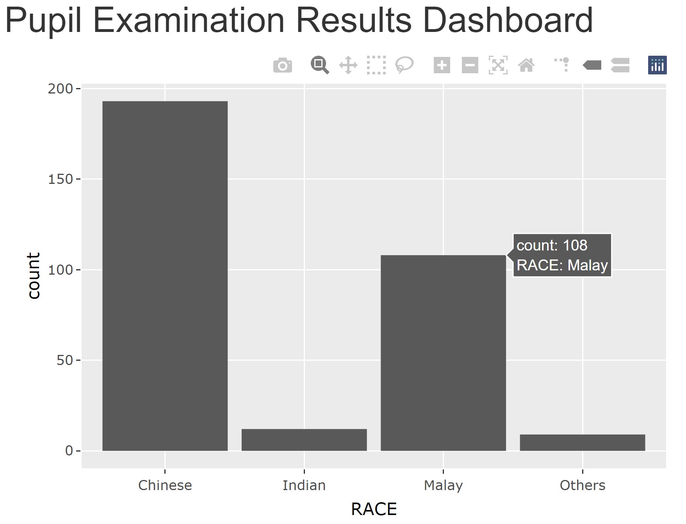

```{r setup, include=FALSE}
knitr::opts_chunk$set(fig.retina=3,
                      echo = TRUE,
                      eval = TRUE,
                      cache = FALSE,
                      message = FALSE,
                      warning = FALSE)
```

```{r xaringan-themer, include=FALSE, warning=FALSE}
library(xaringanthemer)
style_duo_accent(
  primary_color = "#1381B0",
  secondary_color = "#FF961C",
  inverse_header_color = "#FFFFFF"
)
```

## Overview

.large[
In this lesson, selected advanced methods of  Shiny will be discussed.  You will also gain hands-on experiences on using these advanced methods to build Shiny applications. 

By the end of this lesson, you will be able to:

- gain further understanding of the reactive feature of Shiny and Shiny's functions that support reactive flow,
- build interactive Shiny application by using plotly R,
- plot both static and interactive thematic maps by using tmap,
- improve the productivity of Shiny applications development by using related built-in functions of Shiny for debugging and extension package. 
]

---
## Reactive Flow

By default, Shiny application is **Reactive**!

.center[

]

---
## Reactive Flow - the basic

The user selects an input, this input goes through some expression in the server, and an output is rendered. Each time the user changes their input selection, the expression that generates the output will automatically re-execute, and the relevant output will be re-rendered based on the new value of the input.

In a Shiny application, there’s no need to explictly describe the relationships between inputs and outputs and tell R what to do when each input changes, Shiny automatically handles these details for you.

.center[

]

.small[
Source: [Module 2](https://minecr.shinyapps.io/02-flow/#section-reactive-flow) of [Building Web Applications with Shiny](https://rstudio-education.github.io/shiny-course/)
]

---
## Reactive Flow - The full features

.center[

]

---
### Reactive elements

Three components of reactive execution in Shiny are:

- reactive inputs,
- reactive expressions, and
- reactive outputs.

.center[

]

---
### Reactive elements

.pull-left[
#### Reactive inputs and outputs

- A **reactive input** is a user input that comes through a browser interface, typically.
- A **reactive output** is something that appears in the user’s browser window, such as a plot or a table of values.
.center[

]

- One reactive input can be connected to multiple outputs, and vice versa. For example we might have a UI input widget for filtering out data based on user’s selection, and the filtered data can be used in multiple outputs like plots and summaries.
]

--
.pull-right[
#### Reactive expressions

- A **reactive expressions** is component between an input and an output.

- It can both be a dependent (i.e be a child) and have dependents (i.e. be a parent).


]

---
## In-class Exercise: Building a reactive scatter plot using Shiny

.pull-left[
In this in-class exercise, you are going to explore advanced reactive features.

To get started, you need to do the followings:

- start a new Shiny Application
- load the necessary R package, namely Shiny and tidyverse
- import the data file (i.e. Exam_data.csv )
- build a basic scatterplot look similar to the figure on the right.
]

.pull-right[

]

---
### The UI 

```{r eval=FALSE}
library(shiny)
library(tidyverse)
exam <- read_csv("data/Exam_data.csv")
ui <- fluidPage(
    titlePanel("Subject Correlation Analysis"),
    sidebarLayout(
        sidebarPanel(
            selectInput(inputId = "yvariable",
                        label = "y Variable:",
                        choices = c("English" = "ENGLISH",
                                    "Maths" = "MATHS",
                                    "Science" = "SCIENCE"),
                        selected = "MATHS"),
            selectInput(inputId = "xvariable",
                        label = "x Variable:",
                        choices = c("English" = "ENGLISH",
                                    "Maths" = "MATHS",
                                    "Science" = "SCIENCE"),
                        selected = "SCIENCE")
        ),
        mainPanel(
            plotOutput("scatterPlot")
        )
    )
)
```

---
### The server

```{r eval=FALSE}
server <- function(input, output, session){    #<<
    output$scatterPlot <- renderPlot({
        ggplot(data=exam,
               aes_string(x = input$xvariable,      #<<
                          y = input$yvariable)) +   #<<
                   geom_point()
    })
}
```

Lastly, do not forget to add this line!

```{r eval=FALSE}
shinyApp (ui=ui, server=server)
```

---
## Stop-trigger-delay

In this section, you will learn how to how to stop, trigger, and delay Shiny actions.

- Using *submitButton()*
- Using *isolate()* and *actionButton()*

---
## Build Reactivity
### Working with *submitButton()*

.center[

]

---
## Build Reactivity
### Working with *submitButton()*

.large[
- *submitButton()* is used when you want to delay a reaction.

- Edit the code as shown below:

```{r eval=FALSE}
            selectInput(inputId = "xvariable",
                        label = "x Variable:",
                        choices = c("English" = "ENGLISH",
                                    "Maths" = "MATHS",
                                    "Science" = "SCIENCE"),
                        selected = "SCIENCE"),
            submitButton("Apply changes")  #<<
```

Note: The use of *submitButton* is generally discouraged in favor of the more versatile *actionButton()*
]

.small[Reference: https://shiny.rstudio.com/reference/shiny/latest/submitButton.html]

---
### Isolating reactions

#### When to use?

.pull-left[
- Suppose your app has an input widget where users can enter text for the title of the plot. However you only want the title to update if any of the other inputs that go into the plot change. You can achieve this by isolating the plot title such that: 
    - When input$x or input$y changes, the plot will update.
    - But when only the title input (input$plot_title) changes, the plot will not update.
]

.pull-right[

]

.small[Reference: https://shiny.rstudio.com/articles/isolation.html]

---
## Build Reactivity
### Working with *isolate()* and *actionButton()*

.large[

- At the ui, edit the code as shown below:]

```{r eval=FALSE}
            selectInput(inputId = "xvariable",
                        label = "x Variable:",
                        choices = c("English" = "ENGLISH",
                                    "Maths" = "MATHS",
                                    "Science" = "SCIENCE"),
                        selected = "SCIENCE"),
            textInput(                      #<< 
                inputId = "plot_title",     #<<
                label = "Plot title",       #<<
                placeholder = "Enter text to be used as plot title"), #<<
            actionButton("goButton", "Go!") #<<
```

- Reference guide on [textInput()](https://shiny.rstudio.com/reference/shiny/1.6.0/textInput.html)
- Reference guide on [actionButton()](https://shiny.rstudio.com/reference/shiny/1.6.0/actionButton.html)

---
## Build Reactivity
### Working with *isolate()* and *actionButton()*

.large[
- At the server side, edit the codes as shown below:]

```{r eval=FALSE}
server <- function(input, output, session){
    output$scatterPlot <- renderPlot({
        input$goButton                           #<<
        
        ggplot(data=exam,
               aes_string(x = input$xvariable,
                          y = input$yvariable)) +
            geom_point() +
            labs(title = isolate({               #<<
                toTitleCase(input$plot_title)    #<<
            }))                                  #<<
    })
}
```

- Reference guide on [isolate()](https://shiny.rstudio.com/reference/shiny/1.6.0/isolate.html)

---
## Embedding Interactive Graphs in R Shiny
### The **plotly** way

.pull-left[
Two approaches:
- Using plotly directly, or
- Plot the basic visualisation using **ggplot2**, then wrap the visualisation object into plotly object using *ggplotly()*.

Reference:
- [Plotly R Open Source Graphing Library](https://plotly.com/r/)
- [17 Server-side linking with shiny](https://plotly-r.com/linking-views-with-shiny.html) of [Interactive web-based data visualization with R, plotly, and shiny](https://plotly-r.com/index.html)
]

.pull-right[
]

---
### In-class Exercise: Embedding an interactive scatter plot in Shiny

.pull-left[
- Install plotly R package if it has yet to be install in RStudio.
- include a new line as shown below to launch plotly library. 

```{r}
library(shiny)
library(plotly) #<< 
library(tidyverse)
```

- At UI, edit the code as shown below

```{r eval=FALSE}
 mainPanel(
    plotlyOutput("scatterPlot") #<<
```
]

--
.pull-right[

- edit the server section of the Shiny app as shown below.

```{r eval=FALSE}
server <- function(input, output){
    output$scatterPlot <- renderPlotly({ #<<
        
      p <- ggplot(data = exam, 
            aes_string(x = input$xvariable,
                       y = input$yvariable)) +
            geom_point(color="grey 10", 
                       size=1)
        
            ggplotly(p) #<<                           
    })
}
```
]

---
### In-class Exercise: Embedding an interactive bar chart in Shiny

In this exercise, you will learn how going to embed an interactive bar chart in Shiny by using plotly.  The output will look similar to the figure below.

.center[

]

---
### In-class Exercise: Embedding an interactive bar chart in Shiny

.pull-left[
The ui:

```{r eval=FALSE}
library(shiny)
library(plotly)
library(tidyverse)

exam <- read_csv("data/Exam_data.csv")

ui <- fluidPage(
    titlePanel("Pupils Profile"),
    mainPanel(
            plotlyOutput("race"),
        )
    )
```
]

--
.pull-right[
The server:

```{r}
server <- function(input, output) {
    output$race <- renderPlotly({
        p <- ggplot(data=exam, 
                    aes(x=RACE)) +
            geom_bar()
        ggplotly(p)
    })
}
```

Last but not least the app

```{r eval=FALSE}
shinyApp (ui=ui, server=server)
```
]

---
### In-class Exercise: Embedding a drill-down bar chart in Shiny

In this exercise, you will learn how to embed a drill-down bar chart in Shiny by using [event_data()](https://search.r-project.org/CRAN/refmans/plotly/html/event_data.html) of plotly.

.center[

]

---
### In-class Exercise: Embedding a drill-down bar chart in Shiny

.pull-left[
The ui:

```{r eval=FALSE}
library(shiny)
library(plotly)
library(tidyverse)

exam <- read_csv("data/Exam_data.csv")

ui <- fluidPage(
    titlePanel("Drill-down Bar Chart"),
    mainPanel(
            plotlyOutput("race"),
            plotlyOutput("gender"),
            verbatimTextOutput("info")
        )
    )
```
]

--
.pull-right[
The server:

```{r}
server <- function(input, output) {
    output$race <- renderPlotly({
        p <- ggplot(data=exam, 
                    aes(x=RACE)) +
            geom_bar()
        ggplotly(p)
    })
    output$gender <- renderPlotly({
        d <- event_data("plotly_click") #<<
        if (is.null(d)) return(NULL) #<<
        
        p <- exam %>% 
            filter(RACE %in% d$x) %>%  #<<
            ggplot(aes(x=GENDER)) +
            geom_bar() 
        ggplotly(p) %>%
            layout(xaxis = list(title = d$x)) #<<
    })
    output$info <- renderPrint({
        event_data("plotly_click") #<<
    })    
}
```
]

---
### In-class Exercise: Embedding a drill-down bar chart in Shiny (Revised version)

.pull-left[
The ui:

```{r eval=FALSE}
library(shiny)
library(plotly)
library(tidyverse)

exam <- read_csv("data/Exam_data.csv")

ui <- fluidPage(
    titlePanel("Drill-down Bar Chart"),
    mainPanel(
            plotlyOutput("race"),
            plotlyOutput("gender"),
            verbatimTextOutput("info")
        )
    )
```
]

--
.pull-right[
The server:

```{r}
server <- function(input, output) {
    output$race <- renderPlotly({
        p <- exam %>% #<<
            plot_ly(x = ~RACE) #<<
    })

    output$gender <- renderPlotly({
        d <- event_data("plotly_click")
        if (is.null(d)) return(NULL)
        
        p <- exam %>% 
            filter(RACE %in% d$x) %>% 
            ggplot(aes(x=GENDER)) +
            geom_bar() 
        ggplotly(p) %>%
            layout(xaxis = list(title = d$x))
    })

    output$info <- renderPrint({
        event_data("plotly_click")
    })    
}
```
]


---
### Coordinated and Linked Views


---
## Plotting static map in Shiny - *renderPlot()* method

.large[
- Setting up

```{r eval=FALSE}
library(shiny)
library(sf)
library(tmap)
library(tidyverse)
```

- Importing the geospatial data

```{r eval=FALSE}
mpsz <- st_read(dsn = "data/geospatial", 
                layer = "MP14_SUBZONE_WEB_PL")
```
]

---
## Plotting static map in Shiny - *renderPlot()* method

.large[
The UI codes]

```{r eval=FALSE}
ui <- fluidPage(
    titlePanel("A simple map display"),
    sidebarLayout(
        sidebarPanel(
            checkboxInput(inputId = "show_data",
                          label = "Show data table",
                          value = TRUE)
        ),
        mainPanel(
            plotOutput("mapPlot"),
            DT::dataTableOutput(outputId = "szTable")
        )
    )
)
```

---
## Plotting static map in Shiny - *renderPlot()* method

.large[
The Server codes]

```{r eval=FALSE}
server <- function(input, output){
    output$mapPlot <- renderPlot({
        tm_shape(mpsz)+
            tm_fill() +
            tm_borders(lwd = 0.1,  alpha = 1)
    })
    
    output$szTable <- DT::renderDataTable({
        if(input$show_data){
            DT::datatable(data = mpsz %>% select(1:7),
                          options= list(pageLength = 10),
                          rownames = FALSE)
        }
    })    
}
```

Important, don't miss out this line

```{r eval=FALSE}
shinyApp (ui=ui, server=server)
```

---
## Plotting interactive map in Shiny - *renderPlot()* method

.large[
At the UI, edit the code as shown below:

```{r eval=FALSE}
mainPanel(
            tmapOutput("mapPlot"), #<<
            DT::dataTableOutput(outputId = "szTable")
        )
```

At the server, edit the code as shown below:

```{r eval=FALSE}
server <- function(input, output){
    output$mapPlot <- renderTmap({ #<<
        tm_shape(mpsz)+
            tm_fill() +
            tm_borders(lwd = 0.1,  
                       alpha = 1)
    })
```
]

---
## Building a choropleth mapping application

.large[
Edit the code as shown below:

```{r eval=FALSE}
mpsz <- st_read(dsn = "data/geospatial", 
                layer = "MP14_SUBZONE_WEB_PL")

popagsex <- read_csv("data/aspatial/respopagsex2000to2018.csv") #<<
```
]

---
## Building a choropleth mapping application

.large[
Edit the codes as shown below:

```{r eval=FALSE}
popagsex2018_male <- popagsex %>%
    filter(Sex == "Males") %>%
    filter(Time == 2018) %>%
    spread(AG, Pop) %>%
    mutate(YOUNG = `0_to_4`+`5_to_9`+`10_to_14`+
               `15_to_19`+`20_to_24`) %>%
    mutate(`ECONOMY ACTIVE` = rowSums(.[9:13])+
               rowSums(.[15:17]))%>%
    mutate(`AGED`=rowSums(.[18:22])) %>%
    mutate(`TOTAL`=rowSums(.[5:22])) %>%  
    mutate(`DEPENDENCY` = (`YOUNG` + `AGED`)
           /`ECONOMY ACTIVE`) %>%
    mutate_at(.vars = vars(PA, SZ), 
              .funs = funs(toupper)) %>%
    select(`PA`, `SZ`, `YOUNG`, 
           `ECONOMY ACTIVE`, `AGED`, 
           `TOTAL`, `DEPENDENCY`) %>%
    filter(`ECONOMY ACTIVE` > 0)
mpsz_agemale2018 <- left_join(mpsz,
                              popagsex2018_male,
                              by = c("SUBZONE_N" = "SZ"))
```
]

---
## Building a choropleth mapping application

.large[
At the UI, edit the codes as shown below:

```{r eval=FALSE}
ui <- fluidPage(
    titlePanel("Choropleth Mapping"),
    sidebarLayout(
        sidebarPanel(
            selectInput(inputId = "classification",
                        label = "Classification method:",
                        choices = list("fixed" = "fixed", 
                                       "sd" = "sd", 
                                       "equal" = "equal", 
                                       "pretty" = "pretty", 
                                       "quantile" = "quantile", 
                                       "kmeans" = "kmeans", 
                                       "hclust" = "hclust", 
                                       "bclust" = "bclust", 
                                       "fisher" = "fisher", 
                                       "jenks" = "jenks"),
                        selected = "pretty"),
```
]

---
## Building a choropleth mapping application

.large[
At the UI, continue edit the codes as shown below:

```{r eval=FALSE}
            sliderInput(inputId = "classes",
                        label = "Number of classes",
                        min = 6,
                        max = 12,
                        value = c(6)),
            selectInput(inputId = "colour",
                        label = "Colour scheme:",
                        choices = list("blues" = "Blues", 
                                       "reds" = "Reds", 
                                       "greens" = "Greens",
                                       "Yellow-Orange-Red" = "YlOrRd",
                                       "Yellow-Orange-Brown" = "YlOrBr",
                                       "Yellow-Green" = "YlGn",
                                       "Orange-Red" = "OrRd"),
                        selected = "YlOrRd")
        ),
```
]

---
## Building a choropleth mapping application

.large[
At the server, edit the codes as shown below:

```{r eval=FALSE}
server <- function(input, output){
    output$mapPlot <- renderPlot({
        tm_shape(mpsz_agemale2018)+ #<<
            tm_fill("DEPENDENCY",  #<<
                    n = input$classes, #<<
                    style = input$classification, #<<
                    palette = input$colour) + #<<
            tm_borders(lwd = 0.1,
                       alpha = 1)
        })
}
```

A gentle reminder,

```{r eval=FALSE}
shinyApp (ui=ui, server=server)
```
]

---
### Selecting fields to download


---
## Introducing Shiny Module

.large[
- As Shiny applications grow larger and more complicated, modules are used to manage the growing complexity of Shiny application code.

- Functions are the fundamental unit of abstraction in R, and we designed Shiny to work with them. 

- We can write UI-generating functions and call them from our app, and we can write functions to be used in the server function that define outputs and create reactive expressions.
]

---
## Introducing Shiny Modules

.pull-left[
.large[
An example of a large and complex Shiny application diagram.


]]

--
.pull-right[
.large[
An example of modulerised Shiny application.


]]

---
## Module basics

.large[
A module is very similar to an app. Like an app, it’s composed of two pieces:

- The **module UI** function that generates the *ui* specification.

- The **module server** function that runs code inside the *server* function.

The two functions have standard forms. They both take an *id* argument and use it to namespace the module. To create a module, we need to extract code out of the app UI and server and put it in to the module UI and server.
]

---
### The original Shiny application codes 

In order to understand the basics of Shiny modules, let us consider a simple Shiny application codes to plot a histogram shown below.

.pull-left[

```{r eval=FALSE}
ui <- fluidPage(
  selectInput("var", 
              "Variable", 
              names(mtcars)),
  numericInput("bins", 
               "bins", 
               10, 
               min = 1),
  plotOutput("hist")
)
server <- function(input, 
                   output, 
                   session) {
  data <- reactive(mtcars[[input$var]])
  output$hist <- renderPlot({
    hist(data(), 
         breaks = input$bins, 
         main = input$var)
  }, res = 96)
}
```
]

.pull-right[

]

---
### Module UI

We’ll start with the module UI. There are two steps:

- Put the UI code inside a function that has an id argument.

- Wrap each existing ID in a call to NS(), so that (e.g.) "var" turns into NS(id, "var").


```{r}
histogramUI <- function(id) {
  tagList(
    selectInput(NS(id, "var"), "Variable", choices = names(mtcars)),
    numericInput(NS(id, "bins"), "bins", value = 10, min = 1),
    plotOutput(NS(id, "hist"))
  )
}
```

Here we have returned the UI components in a *tagList()*, which is a special type of layout function that allows you to bundle together multiple components without actually implying how they will be laid out. It is the responsibility of the person calling *histogramUI()* to wrap the result in a layout function like *column()* or *fluidRow()* according to their needs.

---
### Module server

Next we tackle the server function. This gets wrapped inside another function which must have an id argument. This function calls *moduleServer()* with the *id*, and a function that looks like a regular server function:

```{r eval=FALSE}
histogramServer <- function(id) {
  moduleServer(id, function(input, output, session) {
    data <- reactive(mtcars[[input$var]])
    output$hist <- renderPlot({
      hist(data(), breaks = input$bins, main = input$var)
    }, res = 96)
  })
}
```

Note that *moduleServer()* takes care of the namespacing automatically: inside of *moduleServer(id)*, *input$var* and *input$bins* refer to the inputs with names *NS(id, "var")* and *NS(id, "bins")*.
]

---
### Revised Shiny Application

Now that we have the ui and server functions, it’s good practice to write a function that uses them to generate an app which we can use for experimentation and testing:

```{r eval=FALSE}
ui <- fluidPage(
    histogramUI("hist")
    )

server <- function(input, output, session) {
    histogramServer("hist")
    }

shinyApp(ui, server)
```

Note that, like all Shiny control, you need to use the same *id* in both UI and server, otherwise the two pieces will not be connected.

---
## In-class Exercise: Function to import csv file


---
### Module UI function

```{r eval=FALSE}
# Module UI function
csvFileUI <- function(id, label = "CSV file") {
    # `NS(id)` returns a namespace function, which was save as `ns` and will
    # invoke later.
    ns <- NS(id)
    
    tagList(
        fileInput(ns("file"), label),
        checkboxInput(ns("heading"), "Has heading"),
        selectInput(ns("quote"), "Quote", c(
            "None" = "",
            "Double quote" = "\"",
            "Single quote" = "'"
        ))
    )
}
```

---
### Module server function

```{r eval=FALSE}
csvFileServer <- function(id, stringsAsFactors) {
    moduleServer(
        id,
        function(input, output, session) {
            userFile <- reactive({
                validate(need(input$file, message = FALSE))
                input$file
            })
            dataframe <- reactive({
                read.csv(userFile()$datapath,
                         header = input$heading,
                         quote = input$quote,
                         stringsAsFactors = stringsAsFactors)
            })
            observe({
                msg <- sprintf("File %s was uploaded", userFile()$name)
                cat(msg, "\n")
            })
            return(dataframe)
        }
    )    
}
```

---
### The Shiny app

```{r eval=FALSE}
ui <- fluidPage(
    sidebarLayout(
        sidebarPanel(
            csvFileUI("datafile", "User data (.csv format)")
        ),
        mainPanel(
            dataTableOutput("table")
        )
    )
)

server <- function(input, output, session) {
    datafile <- csvFileServer("datafile", stringsAsFactors = FALSE)
    
    output$table <- renderDataTable({
        datafile()
    })
}

shinyApp(ui, server)
```

---
## R Shiny Productive Extension

- [Awesome Shiny Extensions](https://github.com/nanxstats/awesome-shiny-extensions): This github repository provides a comprehensive list of awesome R packages that offer extended UI or server components for the R web framework Shiny.  


---
## shinythemes: Themes for Shiny

.pull-left[
.large[
- It includes several Bootstrap themes from <https://bootswatch.com/>, which are packaged for use with Shiny applications.


]]

.pull-right[
.large[
- For detail themes and getting started, refer to the [online document](https://rstudio.github.io/shinythemes/).

]]

---
## shinytest

.large[
- [Shinytest](https://rstudio.github.io/shinytest/index.html) uses snapshot-based testing strategy.  
- The first time it runs a set of tests for an application, it performs some scripted interactions with the app and takes one or more snapshots of the application’s state.  
- These snapshots are saved to disk so that future runs of the tests can compare their results to them.
]

---
## Standard R debugging tools

.vlarge[
- Tracing 
    - print()/cat()/str() 
    - renderPrint eats messages, must use cat(file = stderr(), ""...) 
    - Also consider shinyjs package's logjs, which puts messages in the browser's JavaScript console  
- Debugger
    - Set breakpoints in RStudio 
    - browser() 
    - Conditionals: if (!is.null(input$x)) browser()
]

---
# Common errors

.center[
## "Object of type 'closure' is not subsettable"] 


.vlarge[
- You forgot to use () when retrieving a value from a reactive expression *plot(userData)* should be *plot(userData())*
]

---
# Common errors

.center[
## "Unexpected symbol"

## "Argument xxx is missing, with no default"] 

.vlarge[
- Missing or extra comma in UI.  
- Sometimes Shiny will realise this and give you a hint, or use RStudio editor margin diagnostics.
]

---
## Common errors

.center[
### "Operation not allowed without an active reactive context. (You tried to do something that can only be done from inside a reactive expression or observer.)]

.vlarge[
- Tried to access an input or reactive expression from directly inside the server function. You must use a reactive expression or observer instead. 
- Or if you really only care about the value of that input at the time that the session starts, then use isolate().
]


---
# Testing

.large[
- There are many possible reasons for an application to stop working. These reasons include: 
    - An upgraded R package has different behavior. (This could include Shiny itself!) 
    - You make modifications to your application. 
    - An external data source stops working, or returns data in a changed format. 
- Automated tests can alert you to these kinds of problems quickly and with almost zero effort, after the tests have been created.
]


---
## References

### Shiny Module

- [Chapter 19 Shiny modules](https://mastering-shiny.org/scaling-modules.html) of Mastering Shiny.
- [Modularizing Shiny app code](https://shiny.rstudio.com/articles/modules.html), online article
- [Communication between modules](https://shiny.rstudio.com/articles/communicate-bet-modules.html).  This is a relatively old article, some functions have changed.
- [Shiny Modules](https://www.inwt-statistics.com/read-blog/shiny-modules.html)
- [Shiny Modules (part 1) : Why using modules?](https://www.ardata.fr/en/post/2019/02/11/why-using-modules/)
- [Shiny Modules (part 2): Share reactive among multiple modules](https://www.ardata.fr/en/post/2019/04/26/share-reactive-among-shiny-modules/)
- [Shiny Modules (part 3): Dynamic module call](https://www.ardata.fr/en/post/2019/07/01/dynamic-module-call/)

### Advanced R

- [awesome-rshiny](https://github.com/grabear/awesome-rshiny), a curated list of resources for R Shiny.


```{r echo=FALSE, eval=FALSE}
library(pagedown)
pagedown::chrome_print("Lesson12-Advanced_Shiny.html")
```
