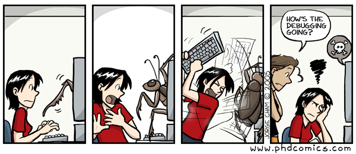
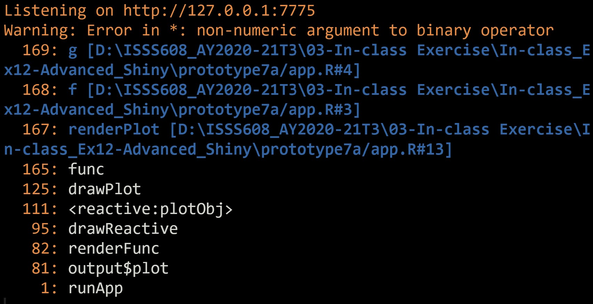

```{r setup, include=FALSE}
knitr::opts_chunk$set(fig.retina=3,
                      echo = TRUE,
                      eval = TRUE,
                      cache = FALSE,
                      message = FALSE,
                      warning = FALSE)
```

## Overview

.large[
In this lesson, selected advanced methods of Shiny will be discussed.  You will also gain hands-on experiences on using these advanced methods to build Shiny applications. 

By the end of this lesson, you will be able to:

- understanding the basic development cycle of creating apps, making changes, and experimenting with the results,
- debug errors in the codes, 
- build complex Shiny application using module, and 
- improve the productivity of Shiny applications development
]

---
## Programming Shiny Application: Survival Tip! 

.center[
.pull-left[
.vlarge[What can we learn from Lego?]


]]

--
.pull-right[
.large[
- Sketch the storyboard 
- Building the app incrementally
    - Using prototyping approach
    - Start as simple as possible
    - Adding features one at a time
- Save -> Run App
]]

---
## Debugging

.pull-left[

.vlarge[Programming == Frustration?]



.small[
Source: The original [article](https://medium.com/@JustineBethKay/programming-is-frustration-788cfe9d73c7).
]


]

--
.pull-right[
Three main cases of problems which we’ll discuss below:

- You get an unexpected error. This is the easiest case, because you’ll get a traceback which allows you to figure out exactly where the error occurred. 
- You don’t get any errors, but some value is incorrect. Here, you’ll need to use the interactive debugger, along with your investigative skills to track down the root cause.
- All the values are correct, but they’re not updated when you expect. This is the most challenging problem because it’s unique to Shiny, so you can’t take advantage of your existing R debugging skills.
]

---
### Common errors

.center[
### "Object of type 'closure' is not subsettable"] 

.vlarge[
- You forgot to use () when retrieving a value from a reactive expression *plot(userData)* should be *plot(userData())*
]

---
### Common errors

.center[
### "Unexpected symbol"

### "Argument xxx is missing, with no default"] 

.vlarge[
- Missing or extra comma in UI.  
- Sometimes Shiny will realise this and give you a hint, or use RStudio editor margin diagnostics.
]

---
### Common errors

.center[
### "Operation not allowed without an active reactive context. (You tried to do something that can only be done from inside a reactive expression or observer.)]

.vlarge[
- Tried to access an input or reactive expression from directly inside the server function. You must use a reactive expression or observer instead. 
- Or if you really only care about the value of that input at the time that the session starts, then use isolate().
]

---
## Standard R debugging tools

.vlarge[
- Tracing
    - tracebacks
    - print()/cat()/str() 
    - renderPrint eats messages, must use cat(file = stderr(), ""...) 
    - Also consider shinyjs package's logjs, which puts messages in the browser's JavaScript console  
- Debugger
    - Set breakpoints in RStudio 
    - browser() 
    - Conditionals: if (!is.null(input$x)) browser()
]

---
## In-class Exercise: Working with Tracebacks in Shiny

In this hands-on exercise, you will learn how to detect error by using tracebacks in Shiny.

.pull-left[

The codes:

```{r eval=FALSE}
library(shiny)

f <- function(x) g(x)
g <- function(x) h(x)
h <- function(x) x * 2

ui <- fluidPage(
    selectInput("n", "N", 1:10),
    plotOutput("plot")
)
server <- function(input, output, session) {
    output$plot <- renderPlot({
        n <- f(input$n)
        plot(head(cars, n))
    }, res = 96)
}
shinyApp(ui, server)
```
]

--
.pull-right[
Op, there is an error!


]

---
### Learning how to debug

.pull-left[
Tracebacks in Shiny


Things to learn from the call stack:

- The first few calls start the app in this case you just see runApp() but depending on how you start the app, you might see something more complicated. 
- In general, you can ignore anything before the first runApp(); this is just the setup code to get the app running.
]

--
.pull-right[

- Next, you’ll see some internal Shiny code in charge of calling the reactive expression:
    - Here, spotting **output$plot** is really important — that tells which of your **reactives (plot)** is causing the error. The next few functions are internal, and you can ignore them.
- Finally, at the very top, you’ll see the code that you have written:
    - This is the code called inside of *renderPlot()*. You can tell you should pay attention here because of the file path and line number; this lets you know that it’s your code.

If you get an error in your app but don’t see a traceback then make sure that you’re running the app using Cmd/Ctrl + Shift + Enter (or if not in RStudio, calling runApp()), and that you’ve saved the file that you’re running it from. Other ways of running the app don’t always capture the information necessary to make a traceback.
]

---
## In-class Exercise: Working with RStudio's Interactive Debugger

.pull-left[
In this hands-on Exercise, you will learn how to work with the interactive debugger in RStudio.

- Double click prototype7a.
- Double click on *prototype7a.rproj* file to open the project file in RStudio.
- Click on *app.R* file to open the Shiny app file on RStudio
- Add a call to *browser()* in your source code (for example line 5).
- Click in **Run App** button to run the Shiny app.
]

.pull-right[


- Next (press n): executes the next step in the function. Note that if you have a variable named n, you’ll need to use print(n) to display its value.
- Continue (press c): leaves interactive debugging and continues regular execution of the function. This is useful if you’ve fixed the bad state and want to check that the function proceeds correctly.
- Stop (press Q): stops debugging, terminates the function, and returns to the global workspace. Use this once you’ve figured out where the problem is, and you’re ready to fix it and reload the code.
]

---
## shinytest

.large[
- [Shinytest](https://rstudio.github.io/shinytest/index.html) uses snapshot-based testing strategy.  
- The first time it runs a set of tests for an application, it performs some scripted interactions with the app and takes one or more snapshots of the application’s state.  
- These snapshots are saved to disk so that future runs of the tests can compare their results to them.
]

---
## Testing

.large[
- There are many possible reasons for an application to stop working. These reasons include: 
    - An upgraded R package has different behavior. (This could include Shiny itself!) 
    - You make modifications to your application. 
    - An external data source stops working, or returns data in a changed format. 
- Automated tests can alert you to these kinds of problems quickly and with almost zero effort, after the tests have been created.
]

---
## Introducing Shiny Module

.large[
- As Shiny applications grow larger and more complicated, modules are used to manage the growing complexity of Shiny application code.

- Functions are the fundamental unit of abstraction in R, and we designed Shiny to work with them. 

- We can write UI-generating functions and call them from our app, and we can write functions to be used in the server function that define outputs and create reactive expressions.
]

---
### Shiny Modules Workflow

.pull-left[
.large[
An example of a large and complex Shiny application diagram.


]]

--
.pull-right[
.large[
An example of modulerised Shiny application.


]]

---
### Module basics

.large[
A module is very similar to an app. Like an app, it’s composed of two pieces:

- The **module UI** function that generates the *ui* specification.

- The **module server** function that runs code inside the *server* function.

The two functions have standard forms. They both take an *id* argument and use it to namespace the module. To create a module, we need to extract code out of the app UI and server and put it in to the module UI and server.
]

---
## In-class Exercise: Building Shiny App with Basic Modele

In order to understand the basics of Shiny modules, let us consider a simple Shiny application codes to plot a histogram shown below.

.pull-left[

```{r eval=FALSE}
ui <- fluidPage(
  selectInput("var", 
              "Variable", 
              names(mtcars)),
  numericInput("bins", 
               "bins", 
               10, 
               min = 1),
  plotOutput("hist")
)
server <- function(input, 
                   output, 
                   session) {
  data <- reactive(mtcars[[input$var]])
  output$hist <- renderPlot({
    hist(data(), 
         breaks = input$bins, 
         main = input$var)
  }, res = 96)
}
```
]

.pull-right[

]

---
### Module UI

We’ll start with the module UI. There are two steps:

- Put the UI code inside a function that has an id argument.

- Wrap each existing ID in a call to NS(), so that (e.g.) "var" turns into NS(id, "var").


```{r}
histogramUI <- function(id) {
  tagList(
    selectInput(NS(id, "var"), "Variable", choices = names(mtcars)),
    numericInput(NS(id, "bins"), "bins", value = 10, min = 1),
    plotOutput(NS(id, "hist"))
  )
}
```

- Here we have returned the UI components in a *tagList()*, which is a special type of layout function that allows you to bundle together multiple components without actually implying how they will be laid out. 
- It is the responsibility of the person calling *histogramUI()* to wrap the result in a layout function like *column()* or *fluidRow()* according to their needs.

---
### Module server

Next we tackle the server function. This gets wrapped inside another function which must have an id argument. This function calls *moduleServer()* with the *id*, and a function that looks like a regular server function:

```{r eval=FALSE}
histogramServer <- function(id) {
  moduleServer(id, function(input, output, session) {
    data <- reactive(mtcars[[input$var]])
    output$hist <- renderPlot({
      hist(data(), breaks = input$bins, main = input$var)
    }, res = 96)
  })
}
```

Note that:

- *moduleServer()* takes care of the namespacing automatically: inside of *moduleServer(id)*, 
- *input$var* and *input$bins* refer to the inputs with names *NS(id, "var")* and *NS(id, "bins")*.

---
### Revised Shiny Application

Now that we have the ui and server functions, it’s good practice to write a function that uses them to generate an app which we can use for experimentation and testing:

```{r eval=FALSE}
ui <- fluidPage(
    histogramUI("hist")
    )

server <- function(input, output, session) {
    histogramServer("hist")
    }

shinyApp(ui, server)
```

Note that, like all Shiny control, you need to use the same *id* in both UI and server, otherwise the two pieces will not be connected.

---
## In-class Exercise: Function to import csv file


---
### Module UI function

```{r eval=FALSE}
# Module UI function
csvFileUI <- function(id, label = "CSV file") {
    # `NS(id)` returns a namespace function, which was save as `ns` and will
    # invoke later.
    ns <- NS(id)
    
    tagList(
        fileInput(ns("file"), label),
        checkboxInput(ns("heading"), "Has heading"),
        selectInput(ns("quote"), "Quote", c(
            "None" = "",
            "Double quote" = "\"",
            "Single quote" = "'"
        ))
    )
}
```

---
### Module server function

```{r eval=FALSE}
csvFileServer <- function(id, stringsAsFactors) {
    moduleServer(
        id,
        function(input, output, session) {
            userFile <- reactive({
                validate(need(input$file, message = FALSE))
                input$file
            })
            dataframe <- reactive({
                read.csv(userFile()$datapath,
                         header = input$heading,
                         quote = input$quote,
                         stringsAsFactors = stringsAsFactors)
            })
            observe({
                msg <- sprintf("File %s was uploaded", userFile()$name)
                cat(msg, "\n")
            })
            return(dataframe)
        }
    )    
}
```

---
### The Shiny app

```{r eval=FALSE}
ui <- fluidPage(
    sidebarLayout(
        sidebarPanel(
            csvFileUI("datafile", "User data (.csv format)")
        ),
        mainPanel(
            dataTableOutput("table")
        )
    )
)

server <- function(input, output, session) {
    datafile <- csvFileServer("datafile", stringsAsFactors = FALSE)
    
    output$table <- renderDataTable({
        datafile()
    })
}

shinyApp(ui, server)
```

---
## R Shiny Productive Extension

- [Awesome Shiny Extensions](https://github.com/nanxstats/awesome-shiny-extensions): This github repository provides a comprehensive list of awesome R packages that offer extended UI or server components for the R web framework Shiny.  


---
## shinythemes: Themes for Shiny

.pull-left[
.large[
- It includes several Bootstrap themes from <https://bootswatch.com/>, which are packaged for use with Shiny applications.


]]

.pull-right[
.large[
- For detail themes and getting started, refer to the [online document](https://rstudio.github.io/shinythemes/).

]]


---
## References

### Shiny Module

- [Chapter 19 Shiny modules](https://mastering-shiny.org/scaling-modules.html) of Mastering Shiny.
- [Modularizing Shiny app code](https://shiny.rstudio.com/articles/modules.html), online article
- [Communication between modules](https://shiny.rstudio.com/articles/communicate-bet-modules.html).  This is a relatively old article, some functions have changed.
- [Shiny Modules](https://www.inwt-statistics.com/read-blog/shiny-modules.html)
- [Shiny Modules (part 1) : Why using modules?](https://www.ardata.fr/en/post/2019/02/11/why-using-modules/)
- [Shiny Modules (part 2): Share reactive among multiple modules](https://www.ardata.fr/en/post/2019/04/26/share-reactive-among-shiny-modules/)
- [Shiny Modules (part 3): Dynamic module call](https://www.ardata.fr/en/post/2019/07/01/dynamic-module-call/)

### Advanced R

- [awesome-rshiny](https://github.com/grabear/awesome-rshiny), a curated list of resources for R Shiny.


```{r echo=FALSE, eval=FALSE}
library(pagedown)
pagedown::chrome_print("Lesson13-Advanced_Shiny_II.html")
```
