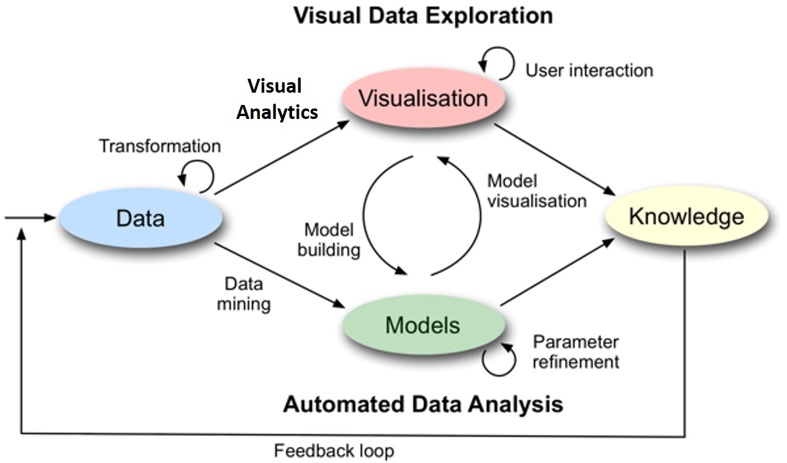
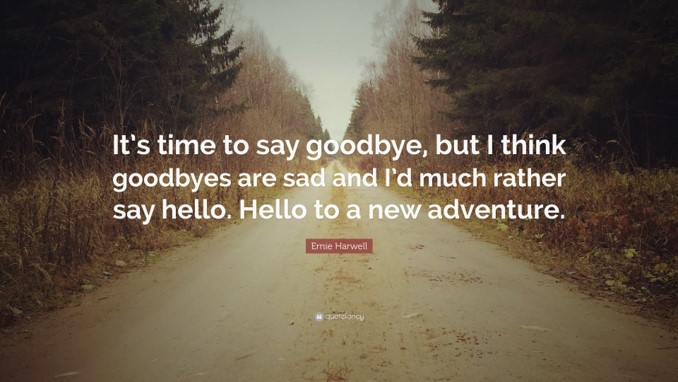

```{r setup, include=FALSE}
knitr::opts_chunk$set(fig.retina=3,
                      echo = TRUE,
                      eval = TRUE,
                      message = FALSE,
                      warning = FALSE)
```

## ISSS608: Visual Analytics and Applications

.center[

]

---
## Motivation of Visual Analytics

.center[
### The World is full of charts that lie!

]

.center[
### We need to get smarter about visual information 
]

---
## Motivation of Visual Analytics
### Is there a place for Visual Analytics in knowledge discovery? 
.center[
]

---
## What is Visual Analytics?
### Visual Analytics must be Reprducible

.center[

]

Reference: https://journals.plos.org/ploscompbiol/article?id=10.1371/journal.pcbi.1003285#s9

---
## A Gentle Reminder
### Data Visualization: Clarity or Aesthetics?

.pull-left[

]

.pull-right[

]

---
## A Gentle Reminder
### Avoiding junk charts

.center[

]

---
## A Gentle Reminder
### Avoiding junk charts

.center[

]

---
## A Gentle Reminder
### Avoiding junk charts

.center[

]

---
## A Gentle Reminder
### Avoiding junk charts

.center[

]

---
## A Gentle Reminder
### Avoiding junk charts

.center[

]

---
## A Gentle Reminder
### Avoiding junk charts

.center[

]

---
## A Gentle Reminder
### Avoiding junk charts

.center[

]

---
## A Gentle Reminder
### Show the world the good visual design priciples

.center[

]

---
## A Gentle Reminder
### Show the world the good visual design priciples

.center[

]

---
## The bumper ride of R rollercoaster

.center[

]

---
## The bumper ride of R rollercoaster

.center[

]

---
## The bumper ride of R rollercoaster

.center[

]

---
## The bumper ride of R rollercoaster

.center[

]

---
## The bumper ride of R rollercoaster

.center[

]

---
## Time to Say Goodbye


.center[



## Let's Build a Better World with Analytics
]

```{r echo=FALSE, eval=FALSE}
library(pagedown)
pagedown::chrome_print("ISSS608-Epilogue.html")
```