```{r setup, include=FALSE}
knitr::opts_chunk$set(echo = FALSE)
```

# What will you learn from this lesson?
.vlarge[
- Visualising count
- Visualising proportion
    - Part-whole and ranking analysis 
- Visualising distribution
- Visualising deviation
- Visualising relationships
    - between two continuous variables
    - between two categorical variables
- Visualising relationship between sub-categories
]

---
## Choosing the Right Visualisation

.center[
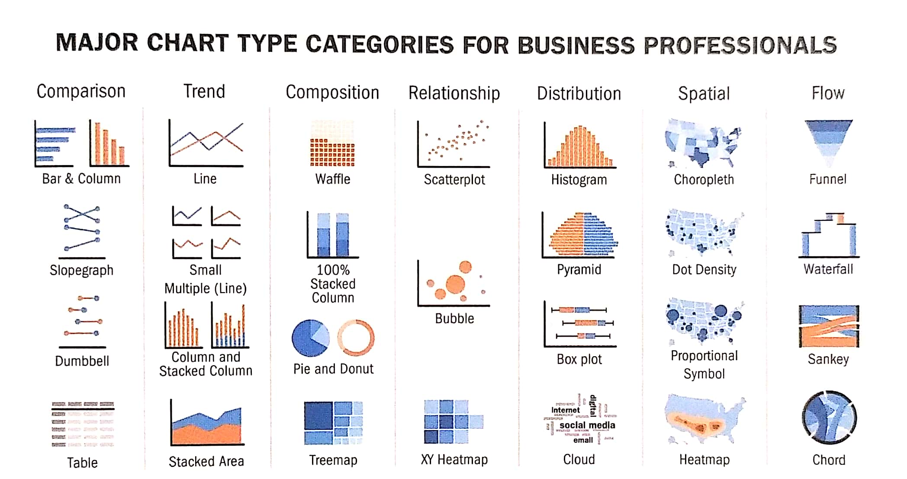
]


---
## Visualising Count
### Bar Chart

- A bar chart is used for plotting categorical data.
- It can be mapped horizontally or vertically.
- When displaying data using bar chart, it is a good practice to sort the count or frequency ascendingly or descendingly.   

.center[
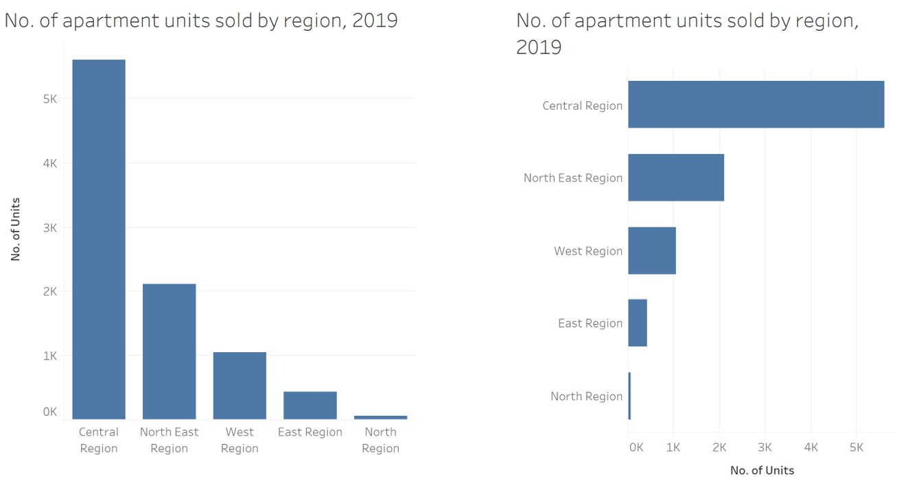]

---
## Visualising Proportion
### A case for pie chart

.center[
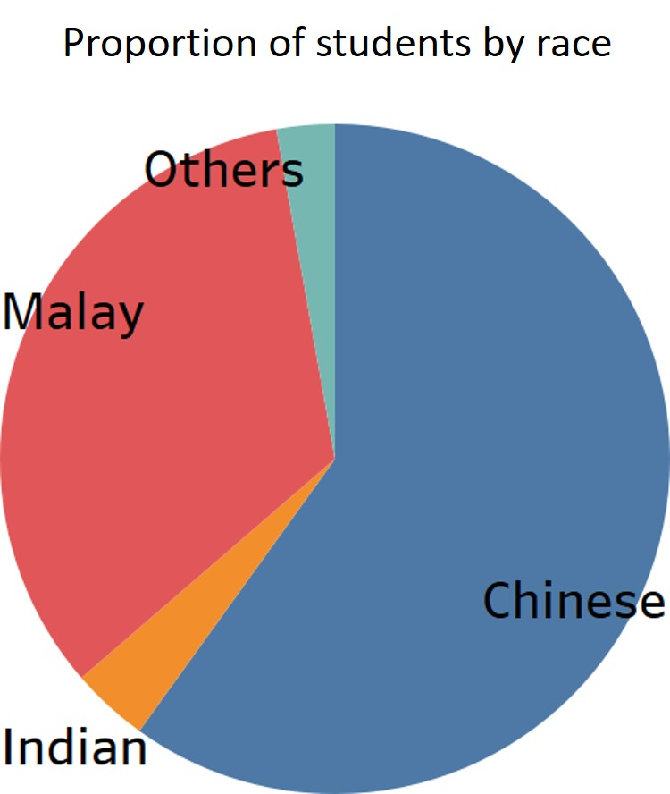]

---
## Visualising Proportion 
### A case against pie chart

- Avoid pie chart if the sub-groups are very similar because our eyes are not good in reading areas

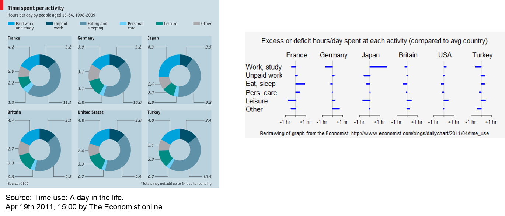

---
## Visualising Proportion 
### A case against pie chart

- Avoid pie chart if you are comparing changes over time

.pull-left[
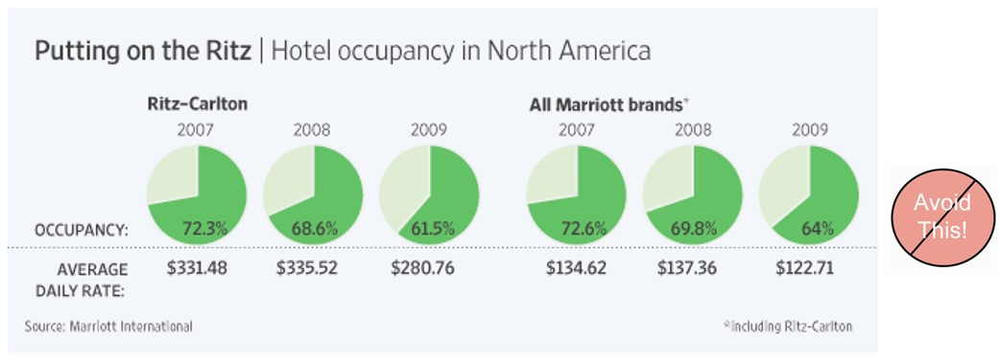]

.pull-right[
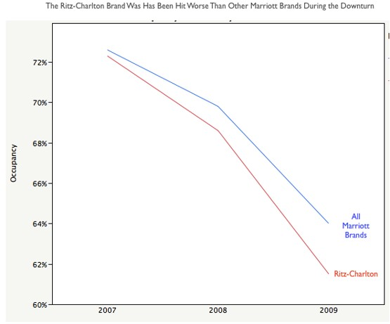]

---
## Visualising Proportion
### Side-by-side bar chart 

.pull-left[
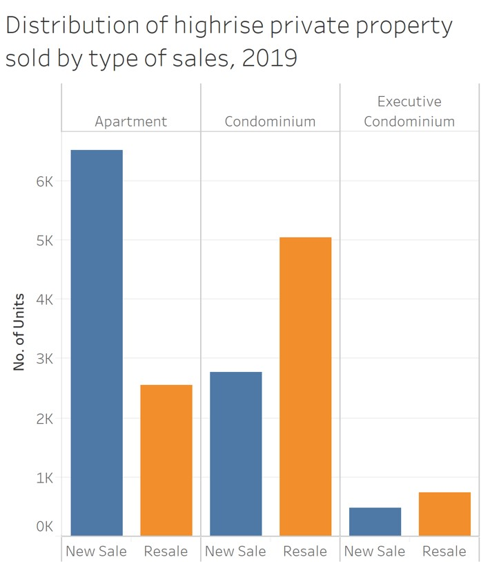]

---
## Visualising Proportion
### Stacked bar chart 

.center[
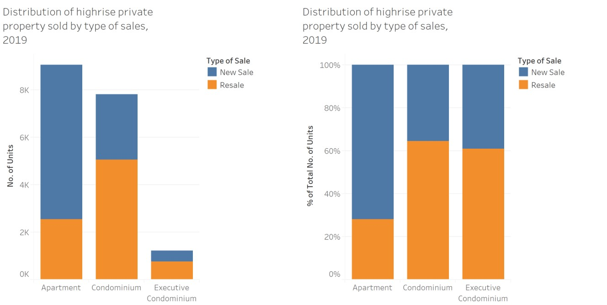]

---
## Comparing Proportion
### Age-sex pyramid

.pull-left[
.large[
- An age-sex pyramid, also popularly know as population pyramid, breaks down a country's or location's population into male and female genders and age cohorts. 

- Usually, you'll find the left side of the pyramid graphing the male population and the right side of the pyramid displaying the female population.
]]

.pull-right[
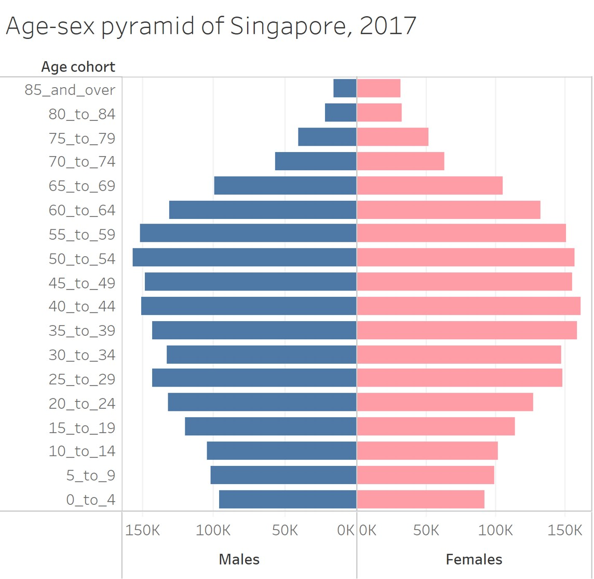]

---
## Part-to-Whole and Ranking Analysis
### Pareto Chart

.pull-left[
- A Pareto chart is a special type of bar chart where the values being plotted are arranged in descending order.

- Pareto chart was developed to illustrate the 80-20 Rule - that 80 percent of the problems stem from 20 percent of the various causes.

- In Pareto chart there are two y-axises.  The primary y-axis is used to display the frequency counts of the sub-types and the secondary axis is used to display the cumulative frequency of the subtype.

- The frequency count usually is represented as bar chart and the cumulative frequency is represented as line chart.
]

.pull-right[
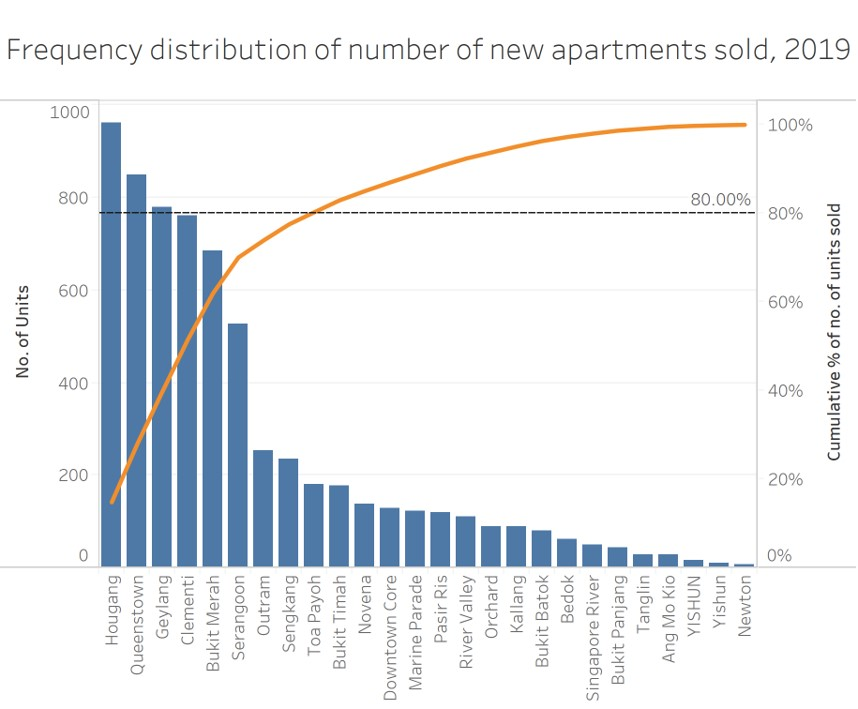]

---
## Visualising Likert Scale Data
### Diverging stacked bar chart

.left-column[
- What is likert scale?


.small[Reference: 
- https://en.wikipedia.org/wiki/Likert_scale
- Dwight Barry (2017) [Do not use averages with Likert scale data](https://bookdown.org/Rmadillo/likert/).
- Heiberger RM, Robbins NB. [Design of diverging stacked bar charts for Likert scales and other applications](https://www.jstatsoft.org/article/view/v057i05/v57i05.pdf). Journal of Statistical Software. 2014;57(5): 1-32. 
]

]

.right-column[
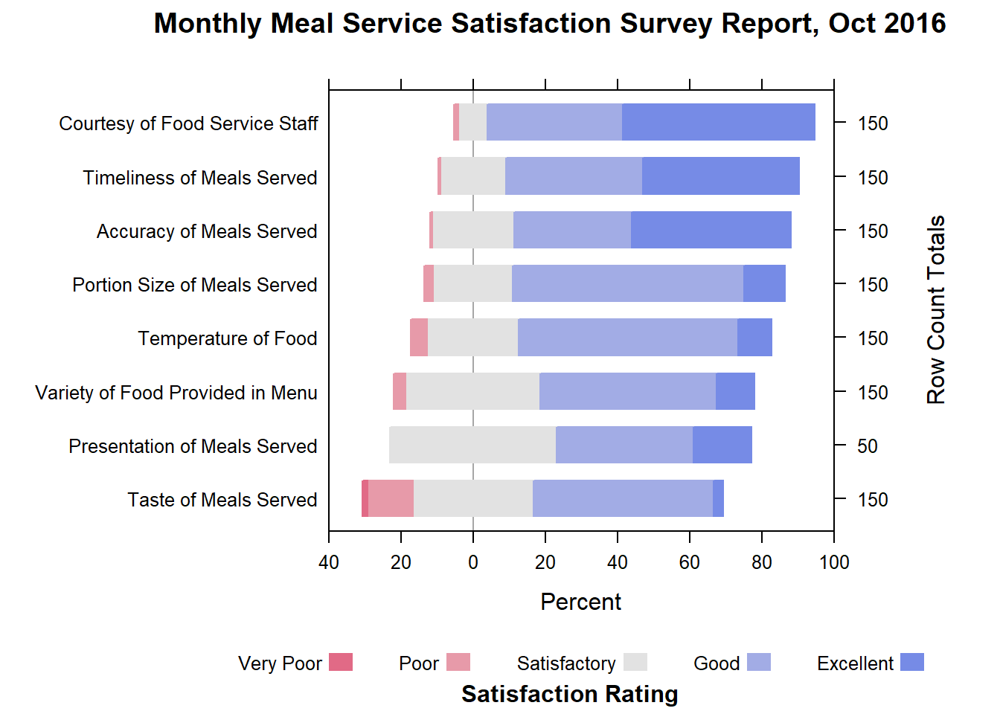]

---
## What about line graph?
### Lorenz curve

.pull-left[
.vlarge[
- A graphical representation of the distribution of income or of wealth.
]]

.pull-right[
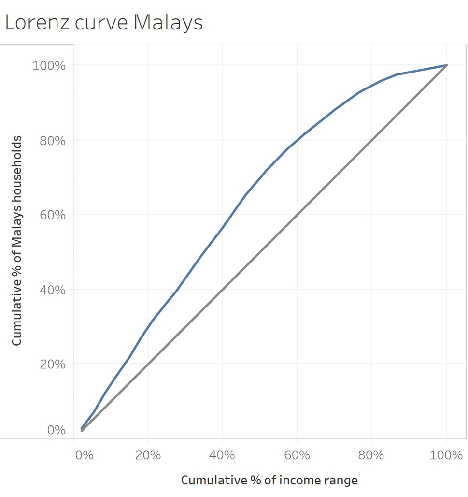]

---
## Visualising Distribution
### Histogram

.pull-left[
- A histogram is a graphical display of tabular frequencies, shown as adjacent rectangles.

- Each rectangle is erected over an interval, with an area equal to the frequency of the interval. 

- The height of a rectangle is also equal to the frequency density of the interval, i.e. the frequency divided by the width of the interval. 

- The total area of the histogram is equal to the number of data.]

.pull-right[
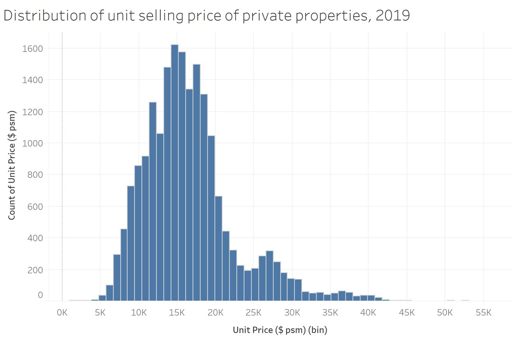]

---
## Visualising Distribution
### Histogram

- It is important to note that the shape of a histogram can be affected by the number of bins or/and classification methods used.  

.center[
]

---
## Visualising Distribution
### Density plot

.pull-left[
- To visualise the underlying probability distribution of the data by drawing an appropriate continuous curve.]

.pull-right[
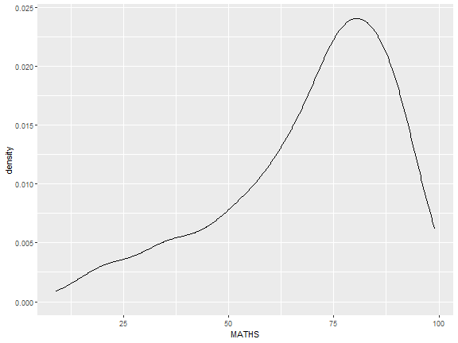]

---
## Visualising Distribution: Ridge Plot

.pull-left[
- Ridgeline Plot or Joy Plot is a kind of chart that is used to visualize distributions of several groups of a category. 
- Each category or group of a category produces a density curve overlapping with each other creating a beautiful piece of the plot.

.small[Reference: 
- [Introducing Ridgeline Plots (formerly Joyplots)](https://blog.revolutionanalytics.com/2017/07/joyplots.html)
- [Visualizing distributions along the horizontal axis](https://clauswilke.com/dataviz/boxplots-violins.html#boxplots-violins-horizontal)
]]

.pull-right[
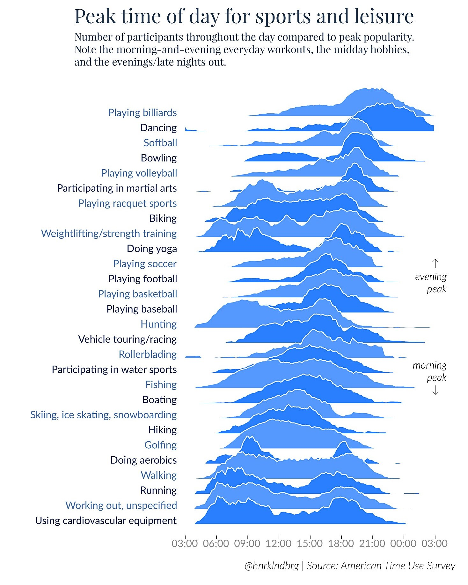


]


---
## Deviation Analysis
### Boxplot

.pull-left[
- A convenient way of graphically depicting groups of numerical data through their five-number summaries (the smallest observation, lower quartile (Q1), median (Q2), upper quartile (Q3), and largest observation). 

- A box plot may also indicate which observations, if any, might be considered outliers.

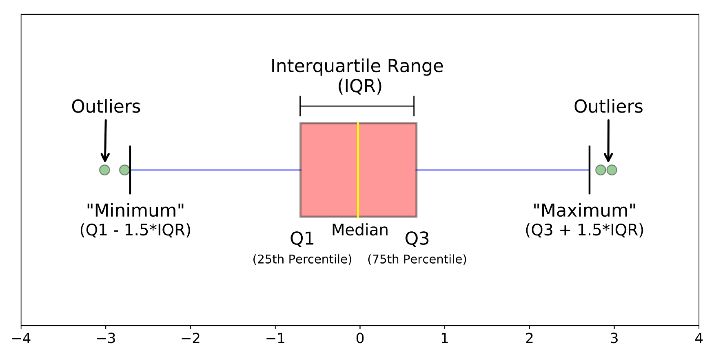
]

.pull-right[
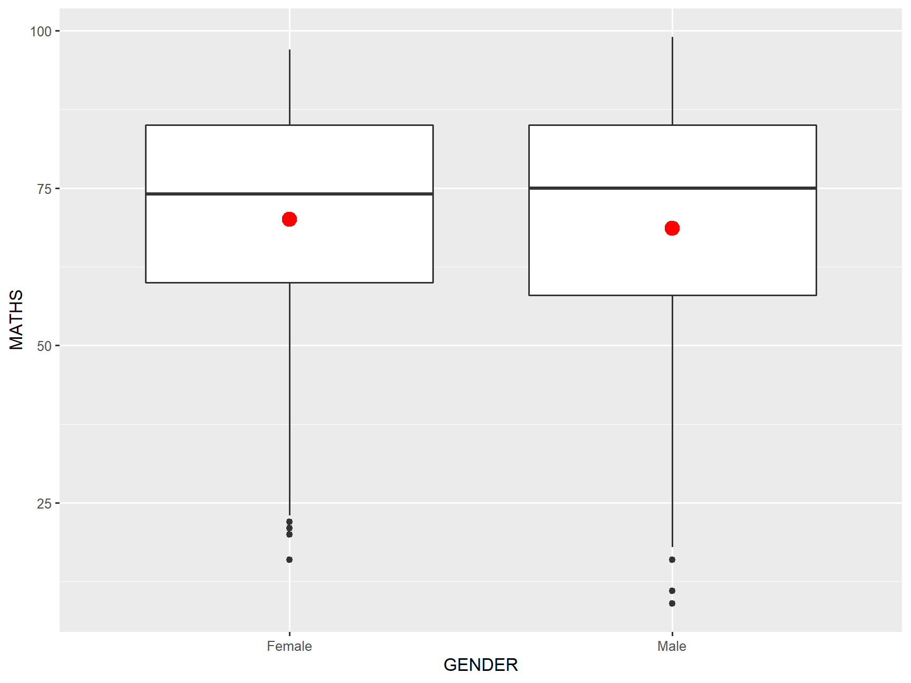]

---
## Deviation Analysis
### Violin plot

.pull-left[
- While box plots are highly effective and widely used in data analytics, they are limited in the fact that they only show specific statistical points, such as the median average or outliers, rather than the distribution of a data set as a whole.

- Violin plots are a way of comparing multiple data distributions. With ordinary density curves, it is difficult to compare more than just a few distributions because the lines visually interfere with each other. With a violin plot, it's easier to compare several distributions since they're placed side by side.
]

.pull-right[
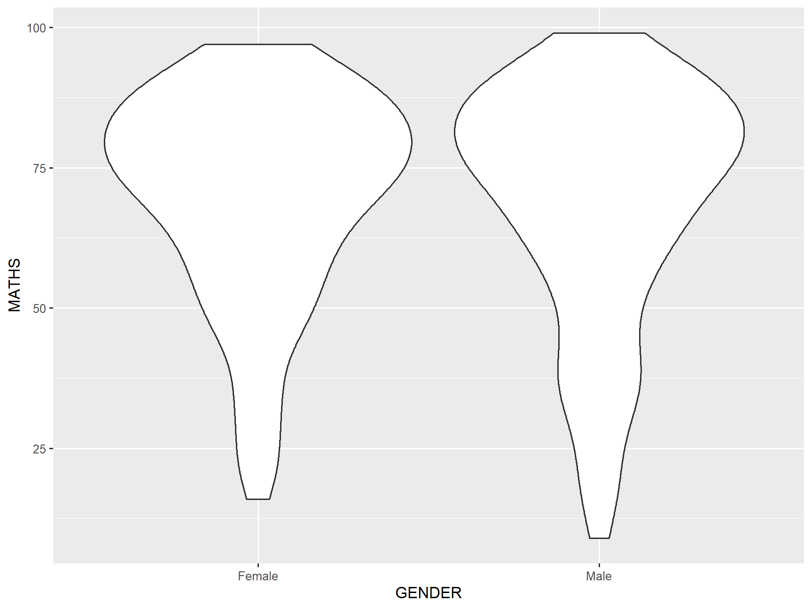
]

---
## Deviation Analysis
### Boxplot + Violin 

.pull-left[
- By over-plotting boxplots on top of violin plots, we will be able to reveal both the value distribution and the summary statistics.
]

.pull-right[
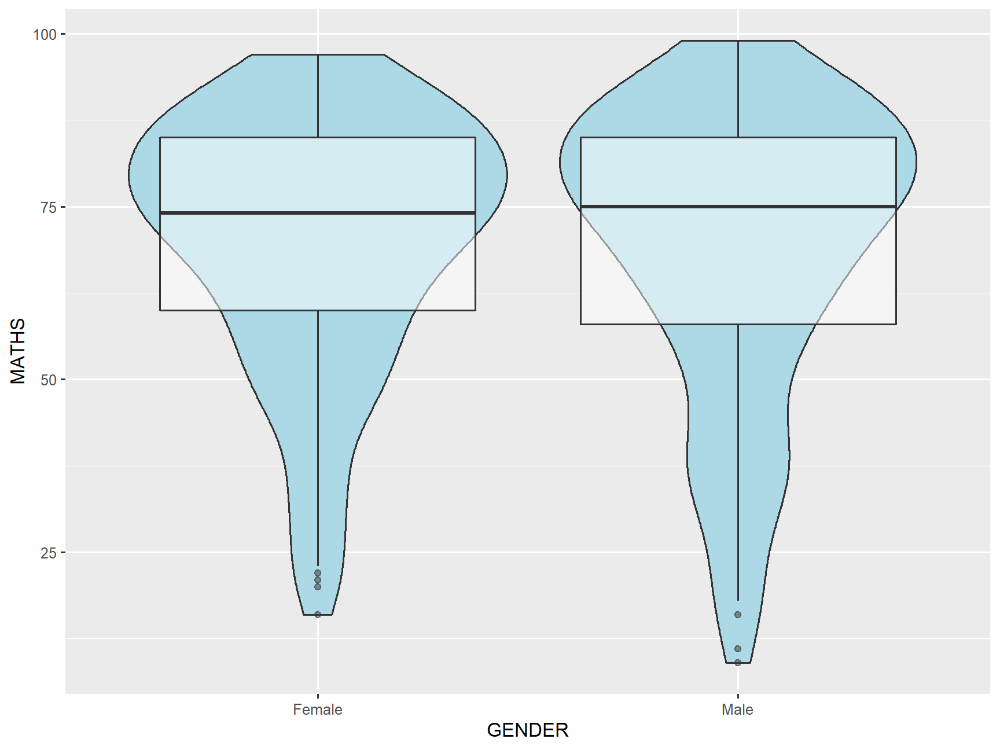
]

---
## Deviation Analysis
### Do you know Violin Plots can be splitted?

.pull-left[
- The hidden power of violin plots is that they can be split across an additional category to give an extra level of comparative analysis. This is a unique feature of violin plots and allows for particularly useful insights and, if used in the correct scenario, it can create an extremely intuitive way of explaining complicated patterns of a data set.
- In this split violin plots, the maths score is further split by gender of four major races. As can be seen, this demonstrates the variation across category about the distribution of the maths scores of male and female by races.
- This additional split can only be used with a boolean (yes/no) variable.
]

.pull-right[
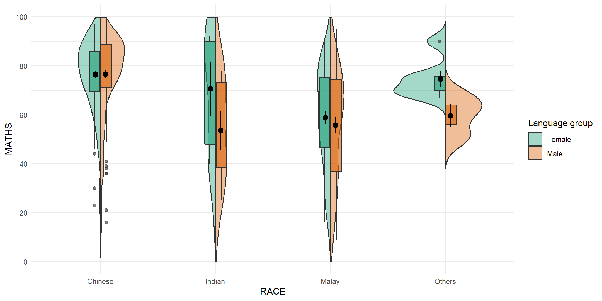
]


---
## Visualising Relationship Between Two Continuous Variables
### Scatterplot 

.pull-left[
- A scatter plot or scattergraph is a type of mathematical diagram using Cartesian coordinates to display values for two variables for a set of data.
- The data is displayed as a collection of points, each having the value of one variable determining the position on the horizontal axis and the value of the other variable determining the position on the vertical axis.
- Also known as scatter chart, scattergram, scatter diagram or scatter graph.]

.pull-right[
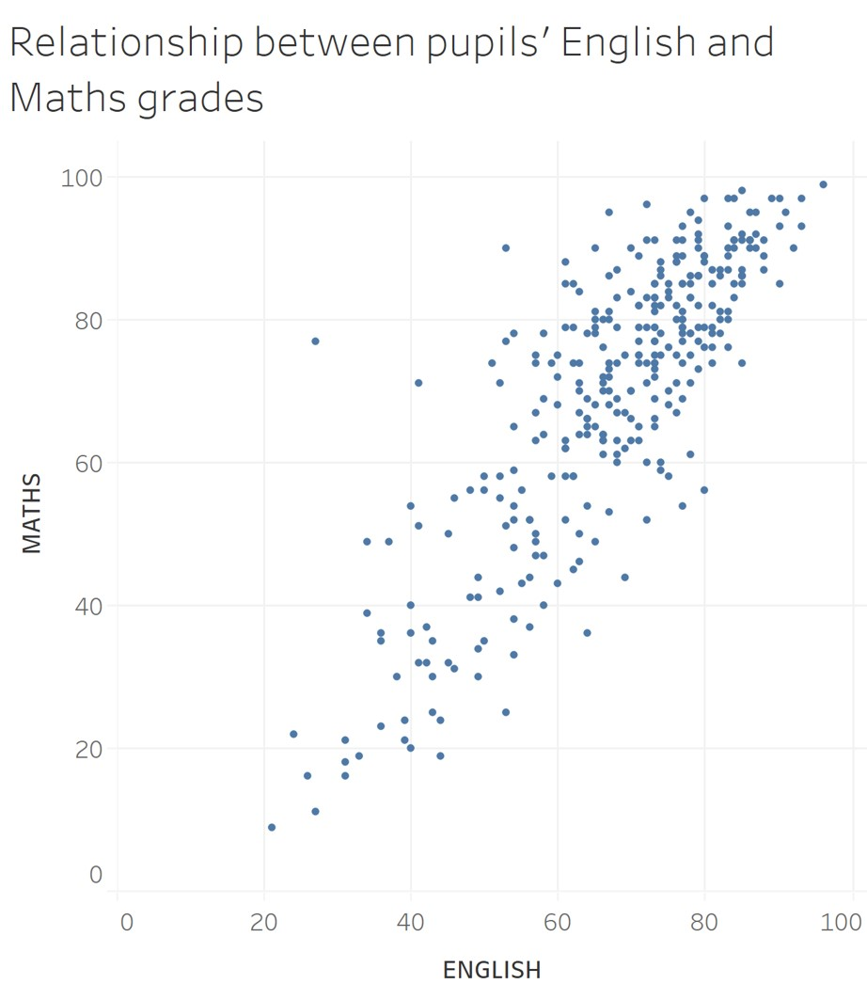]

---
## Visualising Relationship Between Two Continuous Variables

.left-column[
### Interpreting scatterplot
]

.right-column[
.center[
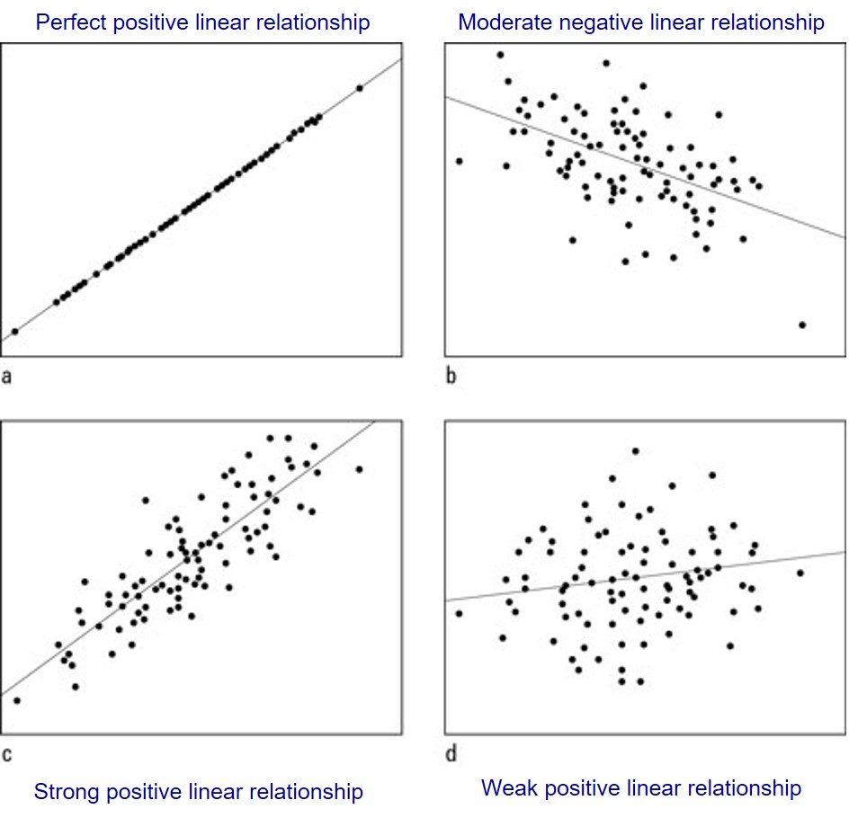]]

---
## Visualising Relatinships
### Caution: Not all relationships are linear

.pull-left[
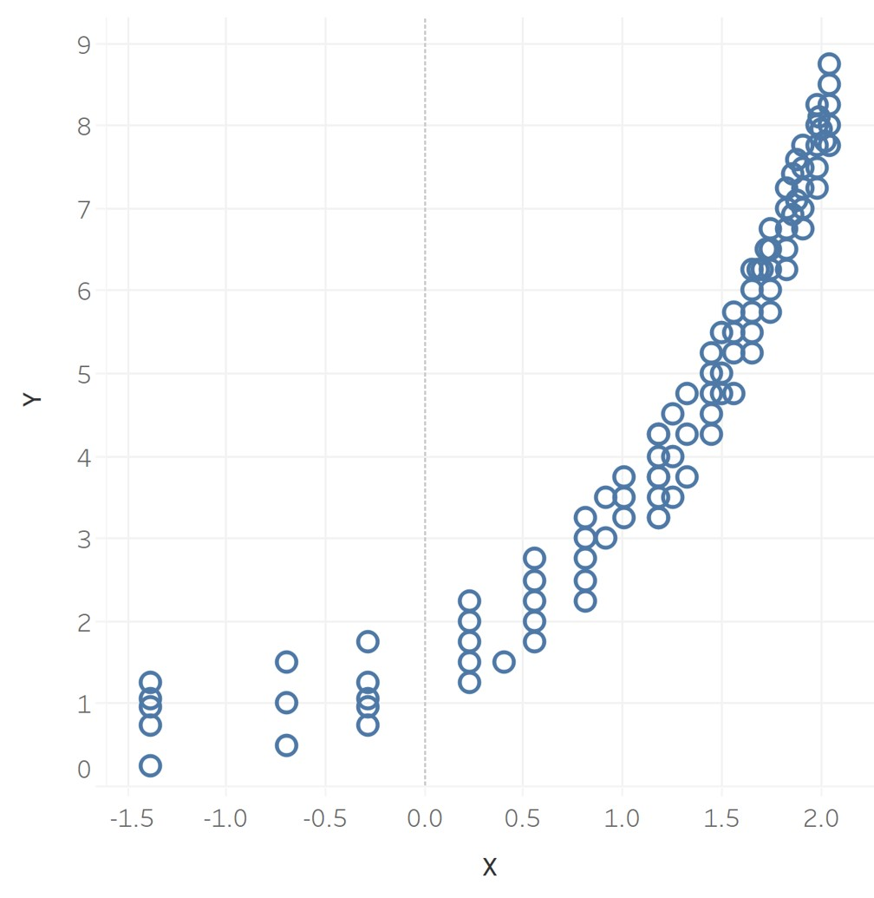]

--

.pull-right[
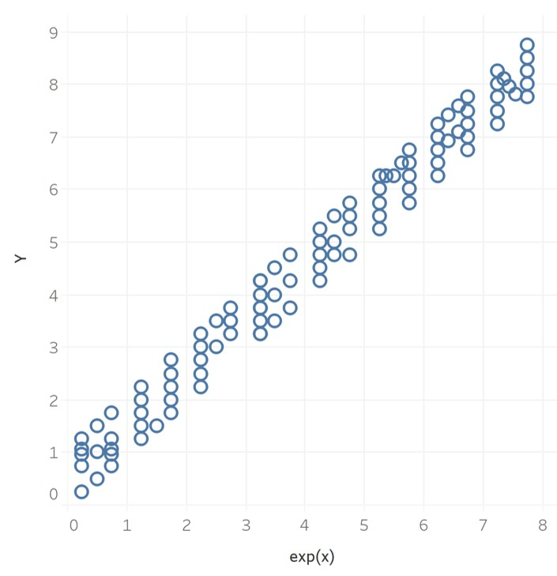
]

---
## Visualising Relationships

.pull-left[
.vlarge[Warning!]

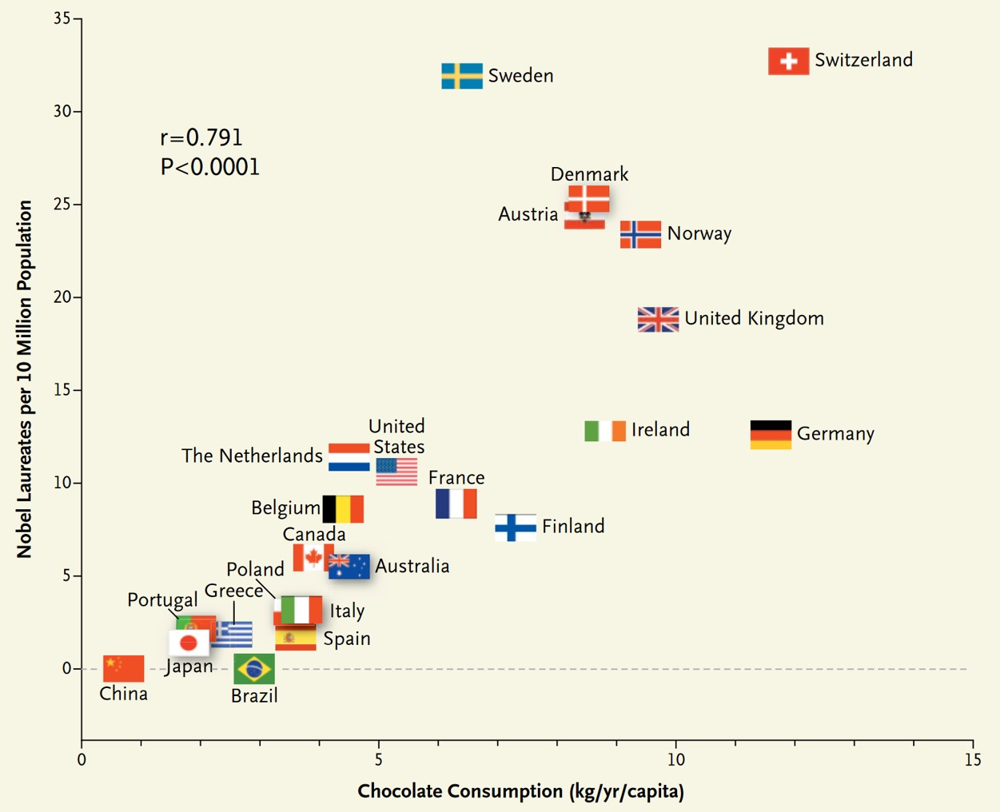

.small[
Source: Messerli (2012) "Chocolate Consumption, Cognitive Function, and Nobel Laureates", [*The New England Journal of Medicine*]( http://www.biostat.jhsph.edu/courses/bio621/misc/Chocolate%20consumption%20cognitive%20function%20and%20nobel%20laurates%20(NEJM).pdf)
]] 

--
.pull-right[
.vlarge[Correlation does not imply causation]


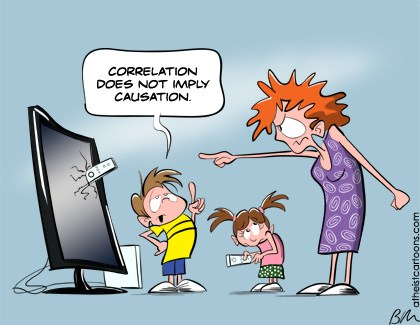]

---
## Visualising Relationship 
### Quadrat analysis

.center[
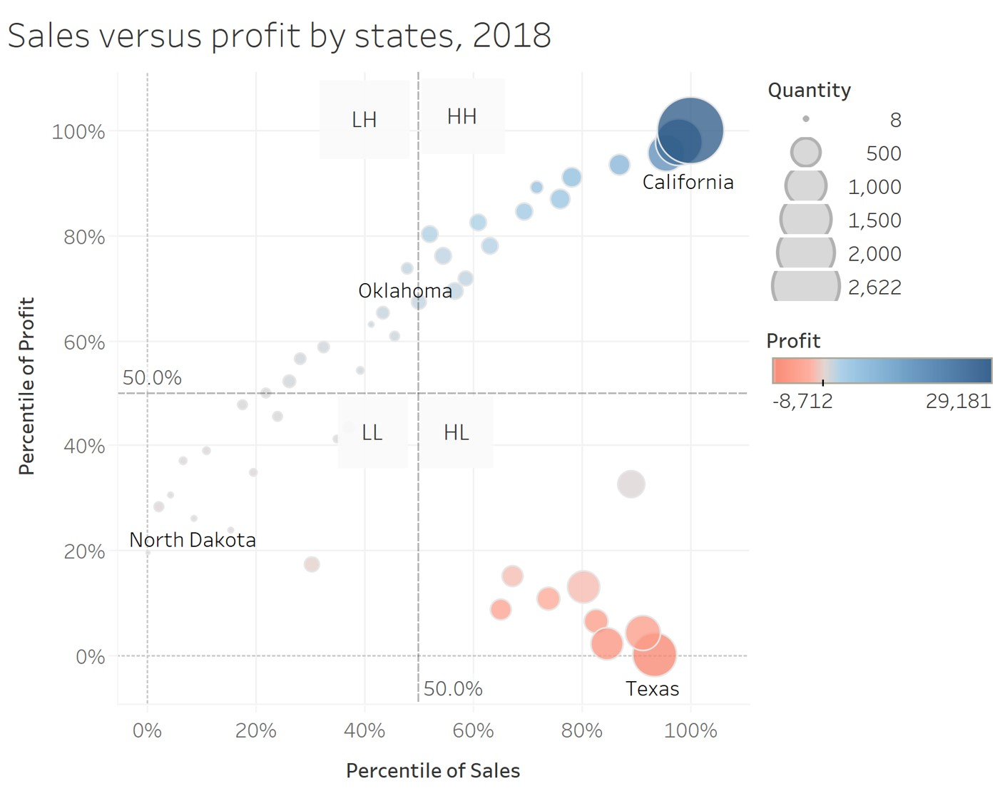]

---
## Visualising Relationship Between Two Categorical Variables
### Mosaic Plot

.pull-left[
- A mosaic plot is a graphical display that allows you to examine the relationship among two or more categorical variables.  
]

.pull-right[
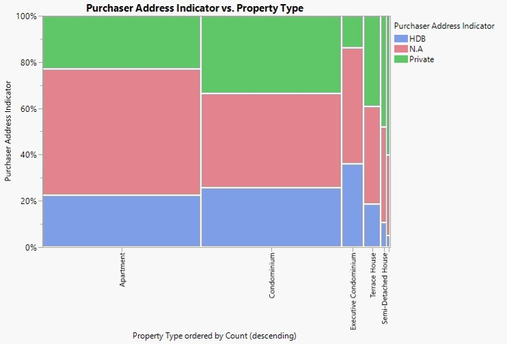]

---
## Visualising Relationship Between Sub-groups
### Trellis

- Trellised visualizations enable you to quickly recognize similarities or differences between different categories in the data. 
- Each individual panel in a trellis visualization displays a subset of the original data table, where the subsets are defined by the categories available in a column or hierarchy.

.center[
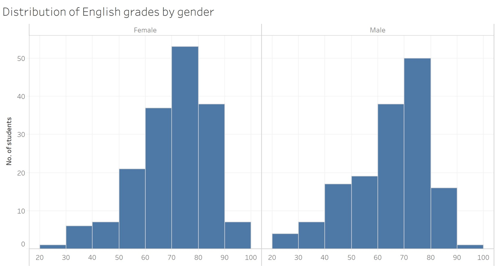]


```{r echo=FALSE, eval=FALSE}
library(pagedown)
pagedown::chrome_print("Lesson01a-Choosing-the-Right-Visualisation.html")
```
