```{r setup, include=FALSE}
knitr::opts_chunk$set(echo = FALSE)
```

# What will you learn from this lesson?
.vlarge[
- Visually Driven Analytics
- Visualising uncertainty
]

---
## Visually Driven Analytics (VDA)

.large[
Motivation: To combine data visualisation and statistical modeling]

.center[
]

---
### ggstatsplot methods

.large[
To provide alternative statistical inference methods by default.
]

.pull-left[
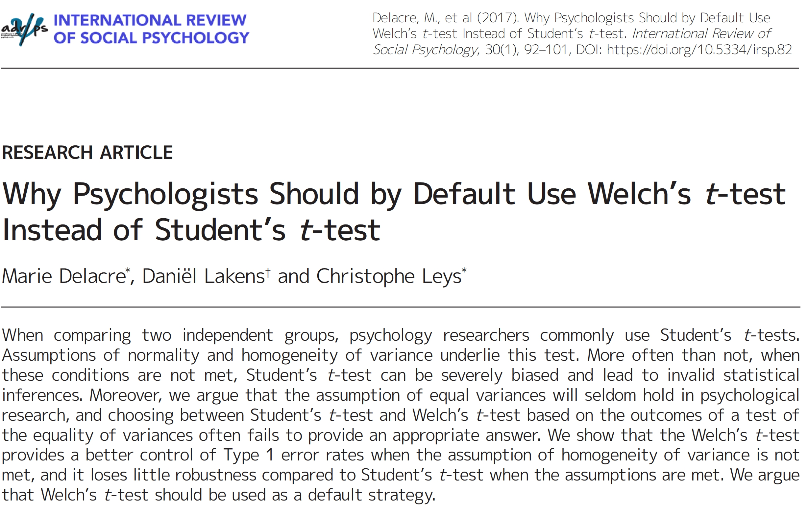]

.pull-right[
]

---
### ggstatsplot methods

.large[
To follow best practices for statistical reporting.

+ For all statistical tests reported in the plots, the default template abides by the [APA](https://my.ilstu.edu/~jhkahn/apastats.html) gold standard for statistical reporting. For example, here are results from a robust t-test:
]

.center[
]

---
### Two-sample means

.pull-left[
.large[
Visualisation centric approach

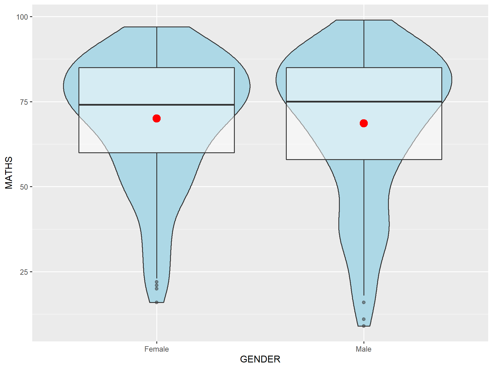
]]

--
.pull-right[
.large[
Visually Driven Analytics approach

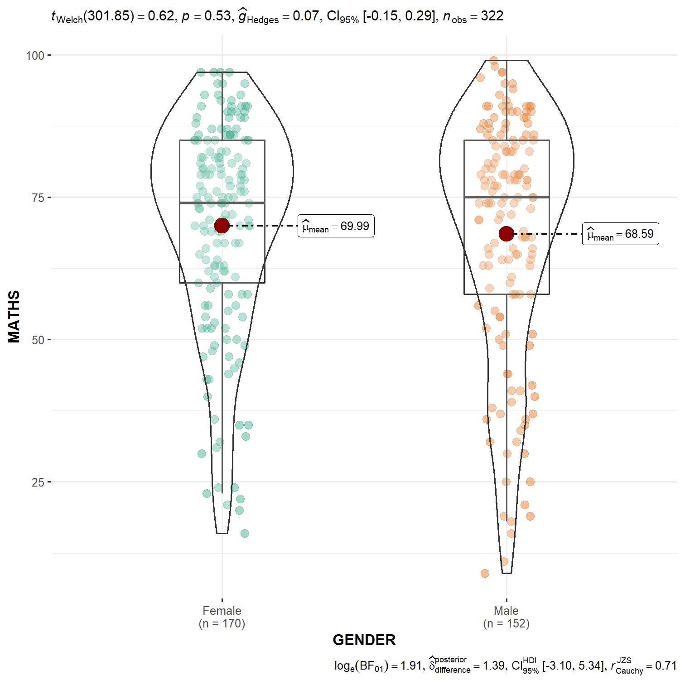
]]

---
# Visualising Uncertainty
## Why it is important?

.left-column[
.large[
- One of the most challenging aspects of data visualization is the visualization of uncertainty.]] 

.right-column[


.small[Source: Chart 61, LABOUR FORCE IN SINGAPORE 2019, pg. 52]
]

---
# Visualising Uncertainty
## Commend mistake

.pull-left[
.large[
- It is not appropriate to displace average values on bars]]

.pull-right[
.center[
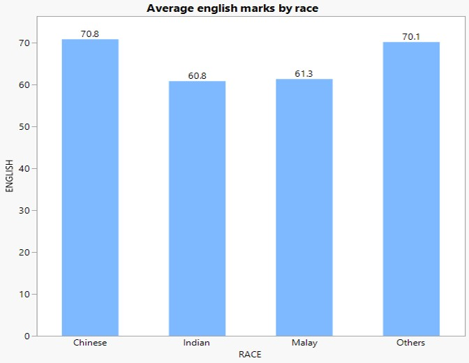]]

---
## 1-d statistical graphic methods for visualising uncertainty
### Error bar on a bar chart

.pull-left[
.large[
- Each error bar is constructed using a 95% confidence interval of the mean.]]

.pull-right[
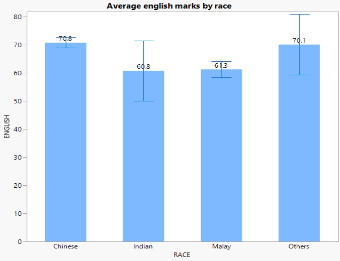]

---
## Back to Statistics 101
### Population and samples

.pull-left[
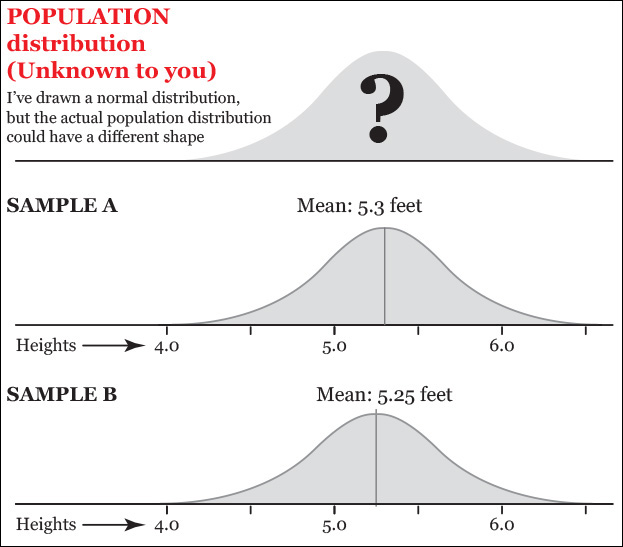
]

.pull-right[
]

- When drawing many samples from a population, it is possible to obtain a few with means that greatly differ from the population.

.small[Reference: Cairo, A. (2016) The Truthful Art, Chapter 11, New Riders]


---
## A reminder of the standard normal distribution

.center[
]
.small[Reference: Cairo, A. (2016) The Truthful Art, Chapter 11, New Riders]

---
## The standard error

.center[
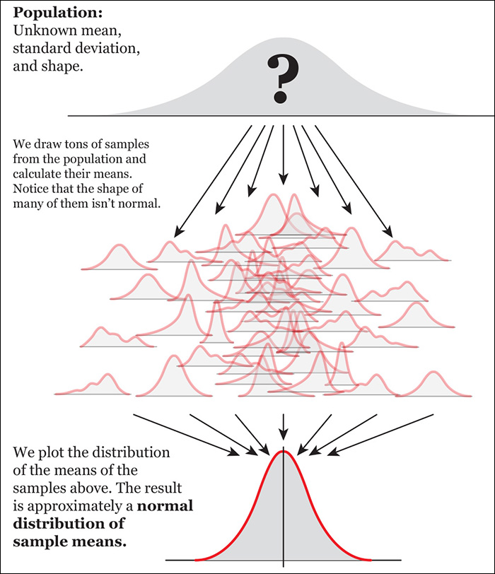]
.small[Reference: Cairo, A. (2016) The Truthful Art, Chapter 11, New Riders]

---
## Calculating the confidence interval of a mean

.center[
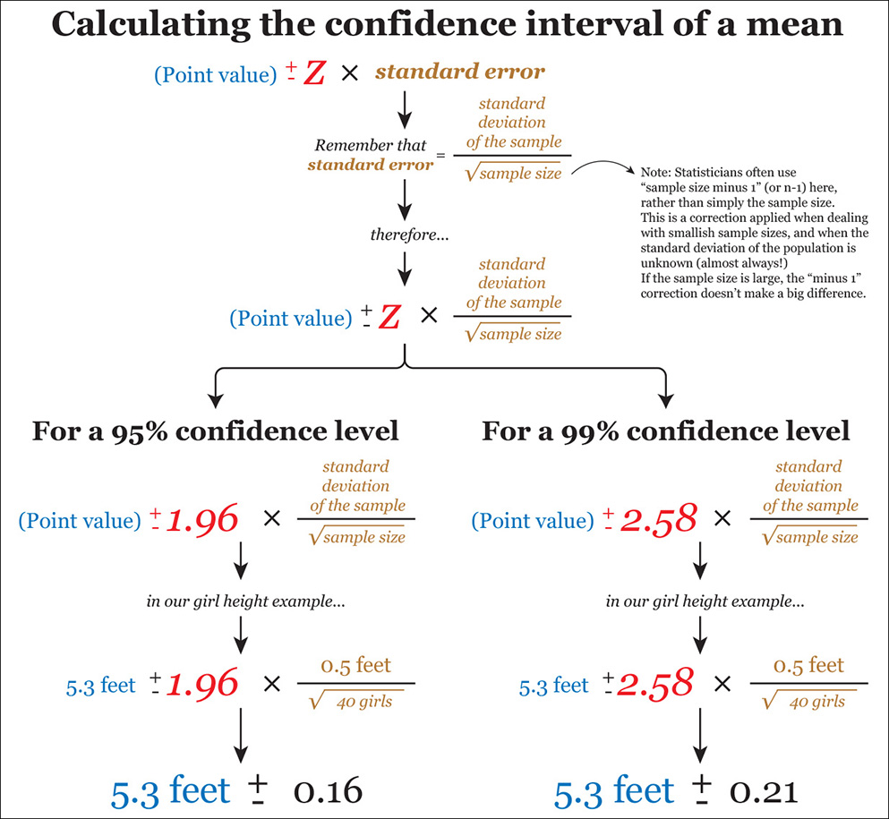]
.small[Reference: Cairo, A. (2016) The Truthful Art, Chapter 11, New Riders]

---
## Calculating the confidence interval of a percentage

.center[
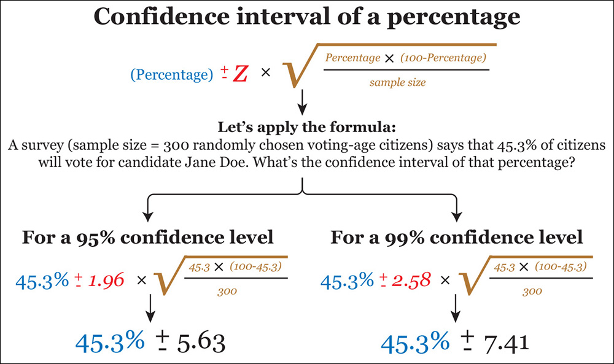]

.small[Reference: Cairo, A. (2016) The Truthful Art, Chapter 11, New Riders]

---
## 1-d graphical methods for visualising uncertainty

.pull-left[
### Error bar on a dot plot
- Each error bar is constructed using a 95% confidence interval of the percentage.]

.pull-right[
.center[
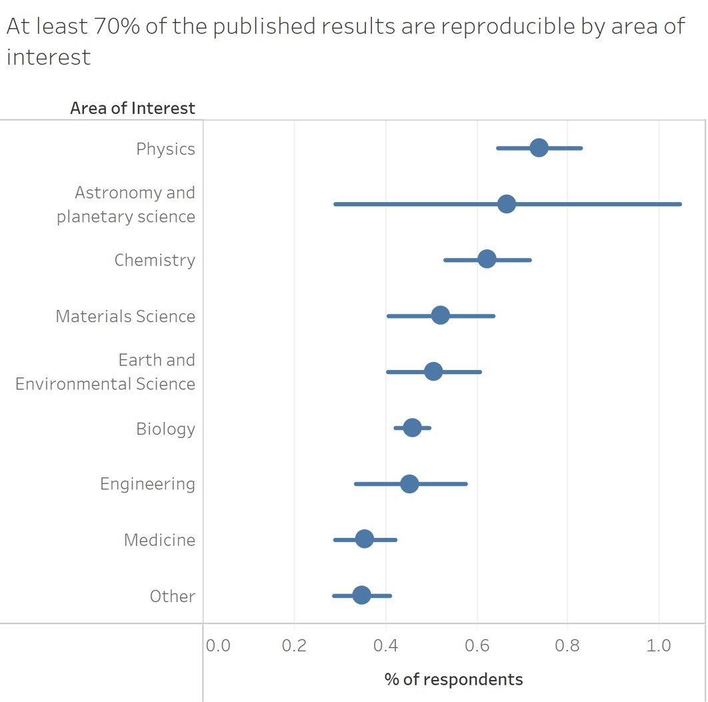]]

---
## Graphical methods for visualising uncertainty
.center[
]
.small[Reference: https://serialmentor.com/dataviz/visualizing-uncertainty.html#visualizing-the-uncertainty-of-point-estimates]

---
## 2-d graphical methods for visualising uncertainty

.pull-left[
### Scatter plot with 95% confidence ellipse

]

--

.pull-right[
### Scatter plot with 95% confidence intervals

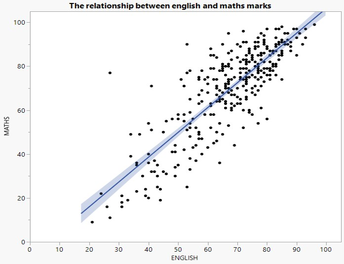]

---
## 2-d graphical methods for visualising uncertainty

### Trellis scatter plot with 95% confidence intervals

.pull-left[
.large[
Figure on the right reveals that the relationships between english and maths grades for Indians and Other races are relatively less certain than Chinese and Malays.]]

.pull-right[
]

---
# Variation and Its Discontents
## Random and unfair comparisons

.center[
]
.small[Reference: https://www.perceptualedge.com/articles/visual_business_intelligence/variation_and_its_discontents.pdf]

---
# Variation and Its Discontents
## Funnel plots to the rescue

.pull-left[
.vlarge[Statistical details]

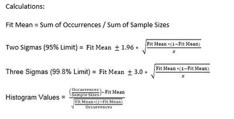]


.pull-right[
]

---
## Normality assumption

.pull-left[
.large[- Before plotting the graph, it is important to check if the values are conformed to normal distribution assumption.

- If the raw values are not conformed to normality assumption, they have to be transformed.
]]

.pull-right[
]


```{r echo=FALSE, eval=FALSE}
library(pagedown)
pagedown::chrome_print("Lesson04-Fundamentals_of_Visual_Analytics.html")
```
