```{r setup, include=FALSE}
options(htmltools.dir.version = FALSE)
knitr::opts_chunk$set(
  fig.retina=3,
  cache = FALSE,
  echo = TRUE,
  message = FALSE, 
  warning = FALSE)
```

```{r xaringan-themer, include=FALSE, warning=FALSE}
library(xaringanthemer)
style_duo_accent(
  primary_color = "#1381B0",
  secondary_color = "#FF961C",
  inverse_header_color = "#FFFFFF"
)
```

# Content

.vlarge[
What will you learn from this lesson?

+ Understand the characteristics of multidimensional data
+ Visual analytics techniques and tools for visualising and analysing multidimensional continuous data 
+ Visual analytics techniques and tools for visualising and analysing multidimensional categorical data
+ Sensing both categorical and continuous multidimensional data
+ Multidimensional data analysis best practices
]

???
In this lesson, I am going to share with you a collection of visual multivariate analysis techniques.

---
## Visual analytics techniques

.vlarge[
+ Scatterplot Matrix
+ Ternary plot
+ Glyphs
+ Parallel coordinates
+ Heatmap
]

???
There are many Visual Multivariate Analysis technqiues.  In this lesson, I am going share with you five popular one.  They are: 

---
## Introducing Multidimensional Data
### Wine data set

There are 13 variables in this data set.  11 of them are in continuous data type, one in ordinal scale and one in nominal scale.

```{r echo=FALSE}
library(readr)
library(tidyverse)
wine <- read_csv("data/wine_quality.csv")
head(wine) %>% 
  knitr::kable(format = "html")

```

.small[Source:UCI Machine Learning Repository https://archive.ics.uci.edu/ml/datasets/Wine]

???
Table in this slide shows a typical multivariate data sets.  This is the popular wine quality data from UCI Machine Learning Repository.  It consists of 13 variables in this data set.  The first 11 variables are in continuous data type. The quality and type variables are in ordinal scale and nominal scale respectively.

---
## Scatterplot Matrix

.pull-left[
.large[
+ **Scatterplot matrix** (also known as **correlation matrix**) is a graphical method used to reveal the relationship between multiple variables *pairwisely*.
]]

.pull-right[

]

???
Each black dot in the scatterplot matrix represents an observation in the data table.

---
### Scatterplot Matrix: Problem with large data

.center[

]

???
When a relatively large number of observation points is used, the scatterplot matrix failed to reveal the pair relationship effectively.

---
## Correlogram

.pull-left[
.large[
- [`Correlogram`](https://www.data-to-viz.com/graph/correlogram.html) uses **visual geometrics** such as ellipse, circle, square, and bars to replace the scatterplot in correlation matrix. 

- It is very useful to reveal pair-relationships between variables in a large correlation matrix. 

- In this plot, correlation coefficients is colored according to the value. 
]] 

.pull-right[

]

???
For positive correlation, the colour intensity change from light blue to dark blue when the correlation coefficient values increases from 0 to 1.  For negative correlation, the colour intensity change from light red to dark red when the correlation coefficient values increase from 0 to -1.
Besides colour, the shape and direction of the ellipse also used to map the correlation coefficient.  For example, the direction of the ellipses indicate positive or negative correlation and thin ellipses are shown paired variables with strong linear correlation.

---
## Correlogram
### Visual abstractions for rendering correlation values.

.center[
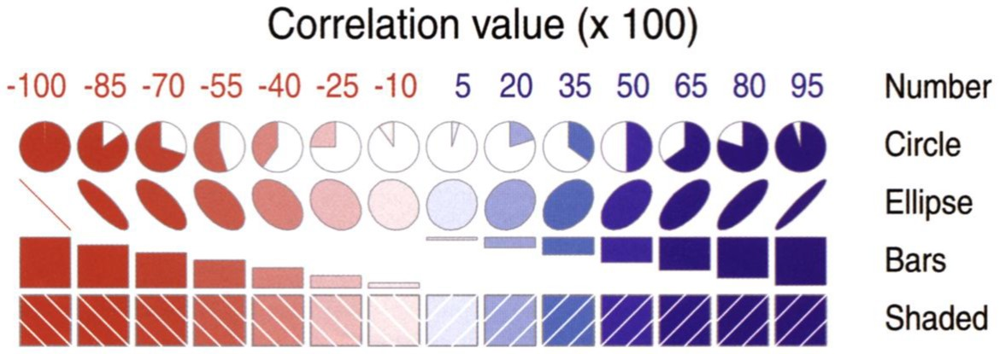
]

???
Figure in this slide shows the visual variables commonly used to build correlogram.  These include visual objects such as circle, ellipse, bar, and shaded.  Other visual variables include colour, pattern, direction and number.  

---
## Correlogram
### **corrgram** package  

.pull-left[
- The [**corrgram**](https://kwstat.github.io/corrgram/index.html) is one of the oldest R package specially designed to correlograms. You can choose what to display in the upper, lower and diagonal part of the figure: scatterplot, pie chart, text, ellipse and more.]

.pull-right[
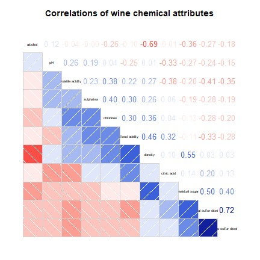
]

---
## Correlogram
### ggstatsplot package

.pull-left[
- The [*ggcorrmat()*](https://indrajeetpatil.github.io/ggstatsplot/reference/ggcorrmat.html) of [**ggstatsplot**](https://indrajeetpatil.github.io/ggstatsplot/) package can be used to plot a correlogram and their corresponding coefficients.

- To learn more, refer to [ggcorrmat](https://indrajeetpatil.github.io/ggstatsplot/articles/web_only/ggcorrmat.html) and the [function's reference guide](https://indrajeetpatil.github.io/ggstatsplot/reference/ggcorrmat.html).
]

.pull-right[
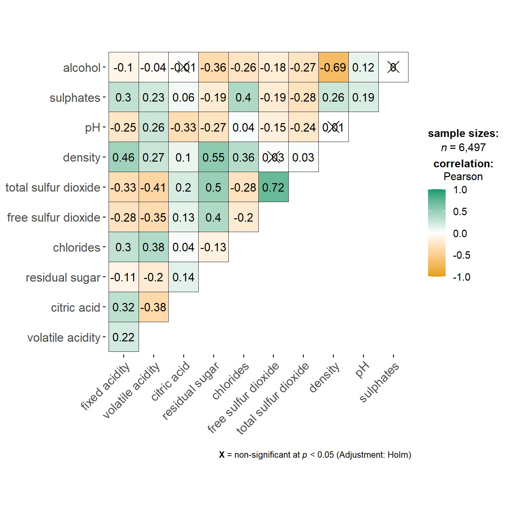
]

???
One of the added feature in `ggcorrmat()` of ggstatsplot is the statistics report.  The statistical report is conformed to APA standard.  
With `ggcorrmat()`, we can have both visual representation and statistical testing report.  Furthermore, the statistical test include both frequentist versus bayesian methods.


---
## Correlogram
### Corrplot package

.pull-left[
- The correlogram on the right is produced by using R [**corrplot**](https://cran.r-project.org/web/packages/corrplot/index.html).

- The article entitle [An Introduction to corrplot Package](https://cran.r-project.org/web/packages/corrplot/vignettes/corrplot-intro.html) provides a good overview of the functions of the package.
]

.pull-right[
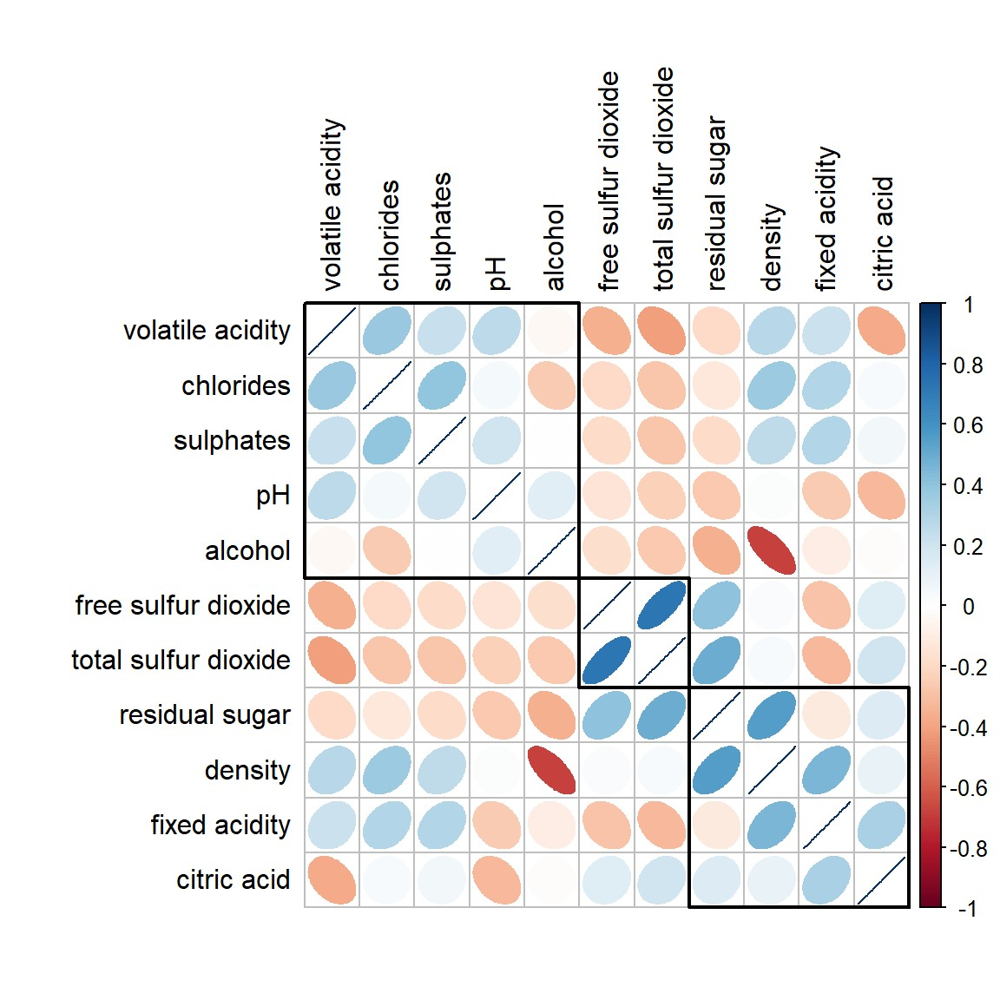
]

???
One of important feature of **corrplot** package that I enjoyed most is it's ability to reorder the correlation matrix by using selected statistical algorithms.  Currently, four methods are provided, they are: AOE, FPC, hclust, alphabet.  You can find the detail of each methods by visiting the recommended article.

---
## Correlogram
### Multivariate data with both continuous and categorical variables

```{r echo=FALSE}
exam <- read_csv("data/Exam_data.csv")
head(exam) %>% 
  knitr::kable(format = "html")

```

???
There are time the data set comprises of both continuous and categorical variables as shown in the slide.

---
## Correlogram: GGally Package

.pull-left[
- The [**GGally**](https://ggobi.github.io/ggally/) package offers great options to build correlograms. 

- The [*ggpairs()*](https://ggobi.github.io/ggally/reference/ggpairs.html) function build a classic correlogram with scatterplot, correlation coefficient and variable distribution. On top of that, it is possible to inject ggplot2 code, for instance to color categories.

- Visit this [link](http://vita.had.co.nz/papers/gpp.html) to learn more about Generalised Pairs Plot
]

.pull-right[
Generalised Pairs Plot

```{r echo=FALSE, fig.height=6}
library(GGally)
ggpairs(exam, columns = 3:7)

```
]

---
## Beyond Visualising Variables Pairwisely
### The data

.center[

]

---
## Ternary Plot

.pull-left[
.large[
+ A ternary plot (also known as ternary graph, triangle plot, simplex plot, Gibbs triangle or de Finetti diagram) is a [barycentric plot](https://en.wikipedia.org/wiki/Barycentric_coordinate_system) on three variables which sum to a constant, usually in percentage.

+ It graphically depicts the ratios of the three variables as positions in an [equilateral triangle](https://en.wikipedia.org/wiki/Equilateral_triangle). ]]

.pull-right[
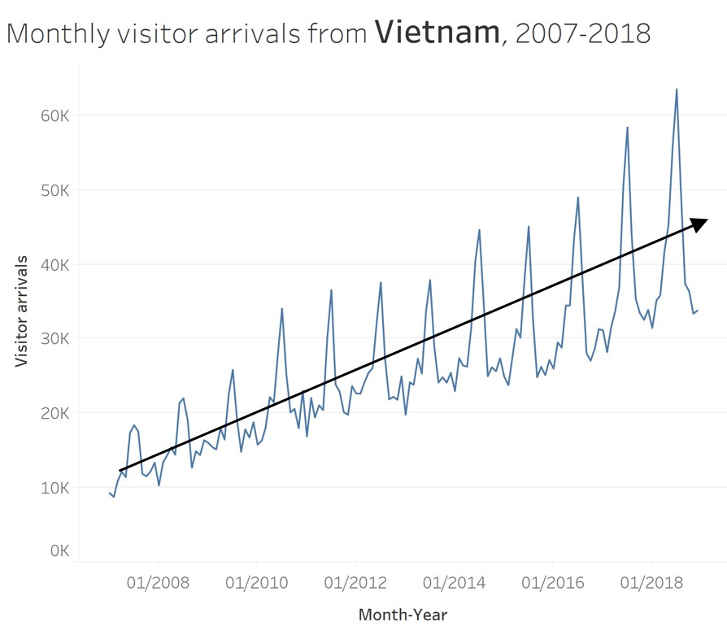
]

---
## Ternary Plot
### ggtern package

.pull-left[
.large[
+ [ggtern](http://www.ggtern.com/) is a package that extends the functionality of ggplot2, giving the capability to plot ternary diagrams for (subset of) the ggplot2 proto geometries.

+ For a good start, please refer to the article entitle [ggtern: Ternary Diagrams Using ggplot2](https://www.jstatsoft.org/article/view/v087c03)]]

.pull-right[
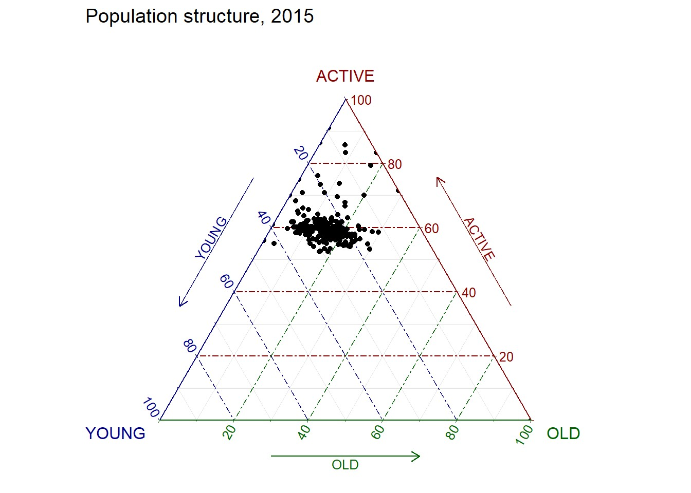
]

---
## Glyphs

.pull-left[
.large[
+ Star plot (Chambers 1983)(also known as radar chart, star chart and spider chart) is a method of displaying multivariate data. 
+ The star plot consists of a sequence of equi-angular spokes, called radii, with each spoke representing one of the variables. The data length of a spoke is proportional to the magnitude of the variable for the data point relative to the maximum magnitude of the variable across all data points. A line is drawn connecting the data values for each spoke. This gives the plot a star-like appearance and the origin of the name of this plot. 
]]

.pull-right[
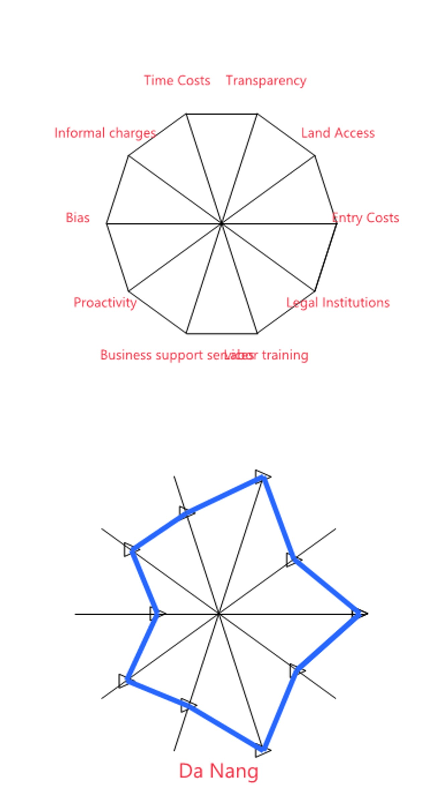
]

---
### Multiple Glyphs Chart

.center[
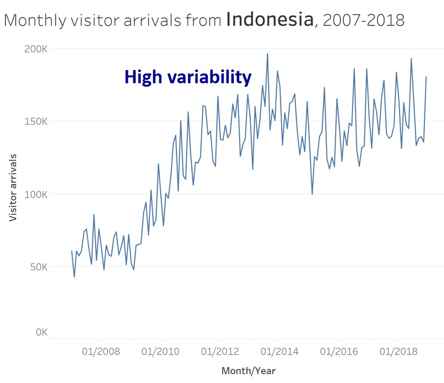
]

---
### Glyphs Chart in R

.pull-left[
.large[
+ In R, *radarchart()* of **fmsb** library is the best tool to build radar chart.
]]

.pull-right[
```{r echo=FALSE, eval=FALSE}
library(fmsb)
vpci <- read_csv("data/VPCI2020.csv") %>%
  select(c(1,3:12)) %>%
  filter(Province == "Max" | Province == "Min" | Province == "HCMC")
radarchart(vpci)
```
]

---
## Visualising and Analysing Multivariate Data: Heatmap method

.pull-left[

- A heat map (or heatmap) is a graphical representation of data where the individual values contained in a matrix are represented as colors.

]

.pull-right[
]

???
+ When applied to a tabular format, heatmaps are useful for cross-examining multivariate data, through placing variables in the columns and observation (or records) in row and colouring the cells within the table. 
+ Heatmaps are good for showing variance across multiple variables, revealing any patterns, displaying whether any variables are similar to each other, and for detecting if any correlations exist in-between them.
+ It is important to note that when the values are all positive or all negative, a colour scheme with different intensity should be used.  On the other hand, if the values are in both positive and negative, then, diverging colour scheme should be used.


---
### R packages for creating statis Heatmap 

There are many R packages and functions can be used to drawing static heatmaps, they are:

- [heatmap()](https://www.rdocumentation.org/packages/stats/versions/3.6.0/topics/heatmap)of R stats package.  It draws a simple heatmap.
- [heatmap.2()](https://www.rdocumentation.org/packages/gplots/versions/3.0.1.1/topics/heatmap.2) of **gplots** R package.  It draws an enhanced heatmap compared to the R base function.
- [pheatmap()](https://www.rdocumentation.org/packages/pheatmap/versions/1.0.12/topics/pheatmap) of [**pheatmap**](https://www.rdocumentation.org/packages/pheatmap/versions/1.0.12) R package.  **pheatmap** package also known as Pretty Heatmap.  The package provides functions to draws pretty heatmaps and provides more control to change the appearance of heatmaps.
- [**ComplexHeatmap**](https://bioconductor.org/packages/release/bioc/html/ComplexHeatmap.html) package of R/Bioconductor package.  The package draws, annotates and arranges complex heatmaps (very useful for genomic data analysis).  The full reference guide of the package is available [here](https://jokergoo.github.io/ComplexHeatmap-reference/book/).
- [**superheat**](https://cran.r-project.org/web/packages/superheat/) package: A Graphical Tool for Exploring Complex Datasets Using Heatmaps.  A system for generating extendable and customizable heatmaps for exploring complex datasets, including big data and data with multiple data types.  The full reference guide of the package is available [here](https://rlbarter.github.io/superheat/).

---
### R package for creating Interactive Heatmap: heatmaply package

.pull-left[
- [**heatmaply**](https://talgalili.github.io/heatmaply/) is an R package for building interactive cluster heatmap that can be shared online as a stand-alone HTML file.  It is designed and maintained by Tal Galili.

- Before we get started, you should review the [Introduction to Heatmaply](https://cran.r-project.org/web/packages/heatmaply/vignettes/heatmaply.html) to have an overall understanding of the features and functions of Heatmaply package.  You are also required to have the [user manual](https://talgalili.github.io/heatmaply/index.html)of the package handy with you for reference purposes. 
]

.pull-right[
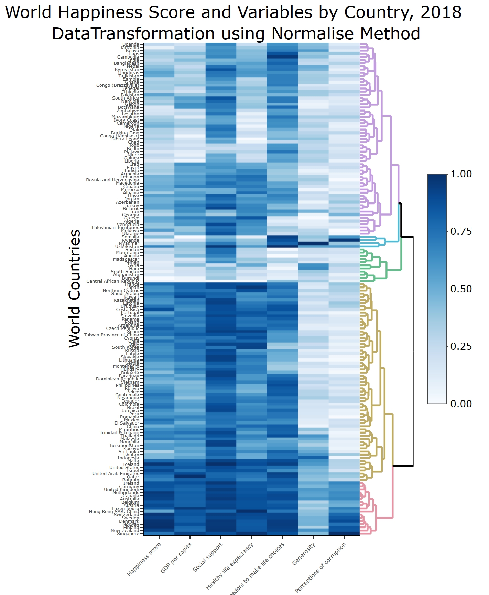
]

---
## Visualising and Analysing Multivariate Data
### Parallel Coordinates Plot Method

Parallel Coordinates plot or Parallel plot allows to compare the feature of several individual observations on a set of numeric variables. 

.center[
]

???
Each vertical bar represents a variable and usually has its own scale. (The units can even be different). Values are then plotted as series of lines connected across each axis.
Similar to heatmap, interactivity should be used to complete the data exploration and analysis when using parallel coordinates plot.

---
### Parallel Coordinates: Brushing

.center[
]

???
In this slide, brushing is use to select several observations of interest.  With brushing function, we can compare them easily.   
---
### Parallel Coordinates: Colour and Highlighting

.center[
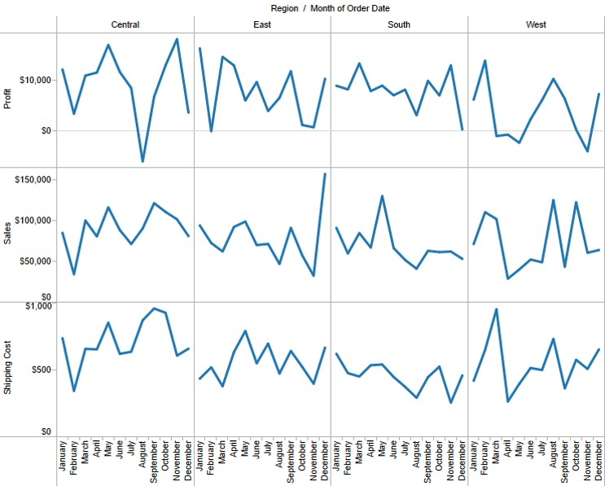]

???
In this slide, colour and highlighting interactive functions is used to select observation of interest.

---
### Parallel Coordinates: Filtering

.center[
]

???
In this slide, filtering is used to remove unwanted observations so that we can focus on the observation we are interested to investigate.

---
### Parallel Coordinates and boxplot

.center[
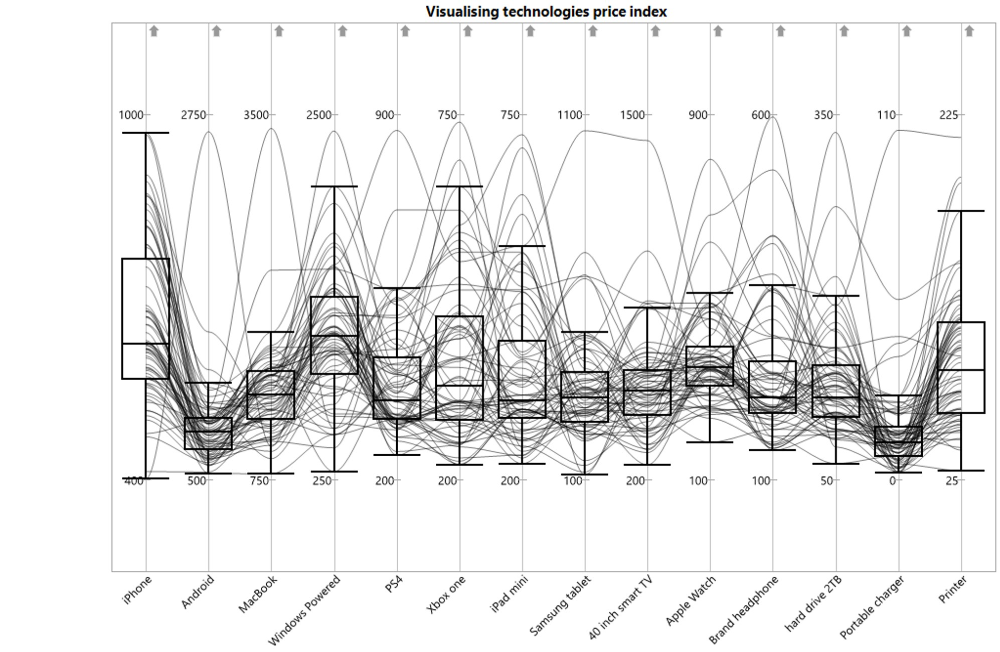]

???
Addition statistical graphics such as boxplot can be used to provide context for more effective visual data exploration and analysis. 

---
### Static Parallel Coordinates Plot in R

+ [ggparcoord()](Parallel coordinate plot) is a function of [**GGally**](https://ggobi.github.io/ggally/index.html) package for plotting static parallel coordinate plots, utilizing the ggplot2 graphics package.


---
### Interactive Parallel Coordinates Plot in R

+ [**parcoords**](https://cran.r-project.org/web/packages/parcoords/) package creates interactive parallel coordinates charts with this 'htmlwidget' wrapper for [`d3.js`](https://d3js.org/), a JavaScript library for manipulating documents based on data and for creating high interactive data visualisation.

```{r echo=FALSE, fig.width=14, fig.height=6}
packages = c('GGally', 'plotly', 'parcoords', 'parallelPlot', 'readr')

for(p in packages){
  if(!require(p, character.only = T)){
    install.packages(p)
  }
}

wh <- read_csv("data/WHData-2018.csv")

parcoords(
 wh[,7:12],
 reorderable = T,
 brushMode = '1D-axes')
```

???
In this slide, brush interactive function is implemented for selecting observation of interest.

---
### Interactive Parallel Coordinates Plot in R

- [**parallelPlot**](https://cran.r-project.org/web/packages/parallelPlot/) is an R package specially designed to plot a parallel coordinates plot by using 'htmlwidgets' package and [d3.js](https://d3js.org/).


```{r echo=FALSE, fig.align='center', fig.width=12, fig.height=6}
histoVisibility <- rep(TRUE, ncol(wh[,7:12]))
parallelPlot(wh[,7:12], histoVisibility = histoVisibility)
```

???
In this slide, the colour and highlighting interativity function are used to highlight observation of interest.

---
## Reference

+ Radar Chart (http://en.wikipedia.org/wiki/Radar_chart). 
+ Ternary plot (https://en.wikipedia.org/wiki/Ternary_plot), (http://csmres.jmu.edu/geollab/Fichter/SedRx/readternary.html) and (http://wvaughan.org/ternaryplots.html).
+ Friendly, M (2002) “Corrgrams: Exploratory Displays for Correlation Matrices” The American Statistician, Vol. 56, No. 4, pp. 316-324. 


```{r echo=FALSE, eval=FALSE}
library(pagedown)
pagedown::chrome_print("Lesson05-VMA.html")
```