```{r setup, include=FALSE}
knitr::opts_chunk$set(echo = FALSE)
```

# What will you learn from this lesson?

.vlarge[
- Characteristics of time-series data

- Classic ways of graphing time

- Time-series patterns

- Time-series data visualization

- Interactive techniques for time-series data visualisation
]

---
## Characteristics of time-series data
### A typical time-series data table

.center[
]

---
## Characteristics of time-series data
### Not so friendly time-series data

.center[
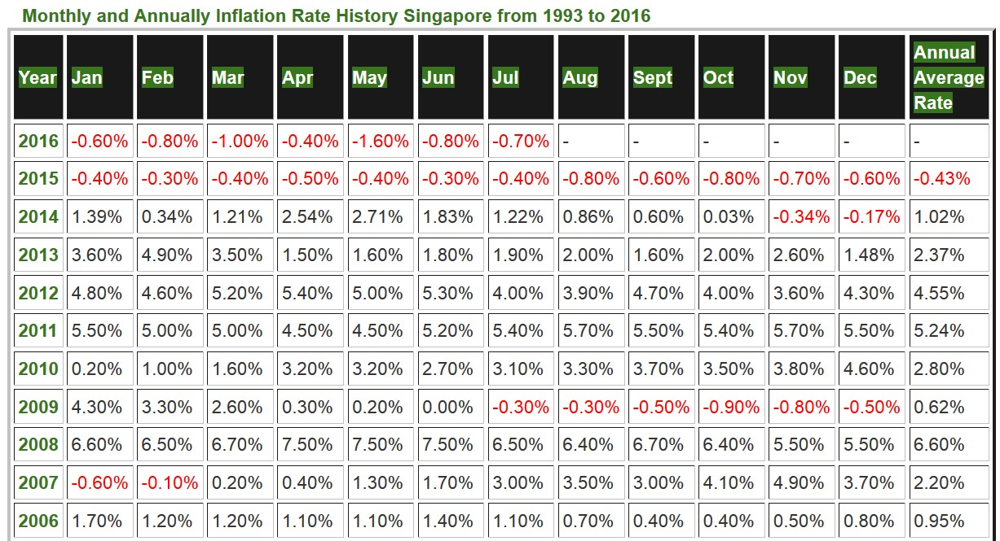]

---
## Characteristics of time-series data
### Not so friendly time-series data

.center[
]

---
## Characteristics of time-series data
### Not so friendly time-series data

.center[
]

---
## A short visual history of time-series graphs
### Playfair’s Commercial and Political Atlas (1786)

.center[
]
.small[Reference: https://en.wikipedia.org/wiki/William_Playfair]

---
## A short visual history of time-series graphs
### Playfair’s Chewing at One View Chart (1821)

.center[
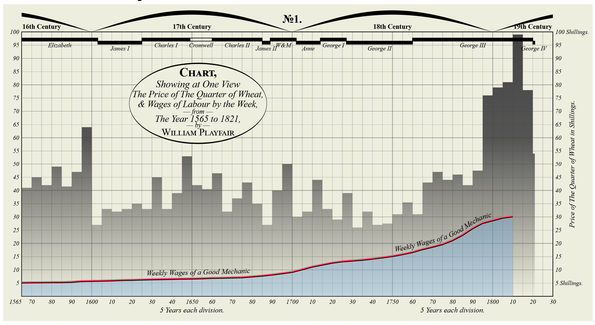]
.small[Reference: https://wam.fandom.com/wiki/William_Playfair%27s_Price_of_Wheat]

---
## A short visual history of time-series graphs
### Bump Chart shows rank of the most populous cities at each census: 1790-1890

.center[
]
.small[An interactive version here http://vallandingham.me/census_bump/]

---
## A short visual history of time-series graphs
### Multiple charts showing records of the Weather in New York City for December, 1912. 

.center[
]

???
The bold line indicates temperature in degrees Fahrenheit. The light solid line shows wind velocity in miles per hour.  The dotted line depicts relative humidity in percentage from readings taken at 8 a.m. and 8 p.m.  Arrows portray the prevailing direction of the wind. Initials at the base of the chart show the weather conditions as follows: S, clear; PC, partly cloudy; C, cloudy; R, rain; Sn, snow.

---
## Time-series graph that change public understading
### The Hockey Stick Chart

.center[
]

.small[
Reference: Michael E. Mann, Raymond S. Bradley, Malcolm K. Hughes (1999) ["Northern hemisphere temperatures during the past millennium: Inferences, uncertainties, and limitations"](https://agupubs.onlinelibrary.wiley.com/doi/abs/10.1029/1999GL900070). *Geophysical Research Letters*, Vol. 26, No. pp. 759-762.
]

---
# Time-series data patterns

.vlarge[
- Trend

- Variability

- Rate of change

- Co-variation

- Cycles

- Exceptions
]

---
## Time-series Patterns: Trend

.left-column[
.large[
- The overall or general direction of change in a series of time-series values is called the trend.]]

.right-column[
.center[
]]

---
## Time-series Patterns: Trend

.left-column[
.large[
- An upward trend.]]

.right-column[
.center[
]]

---
## Time-series Patterns: Trend

.left-column[
.large[
- A mixed trends.]]

.right-column[
.center[
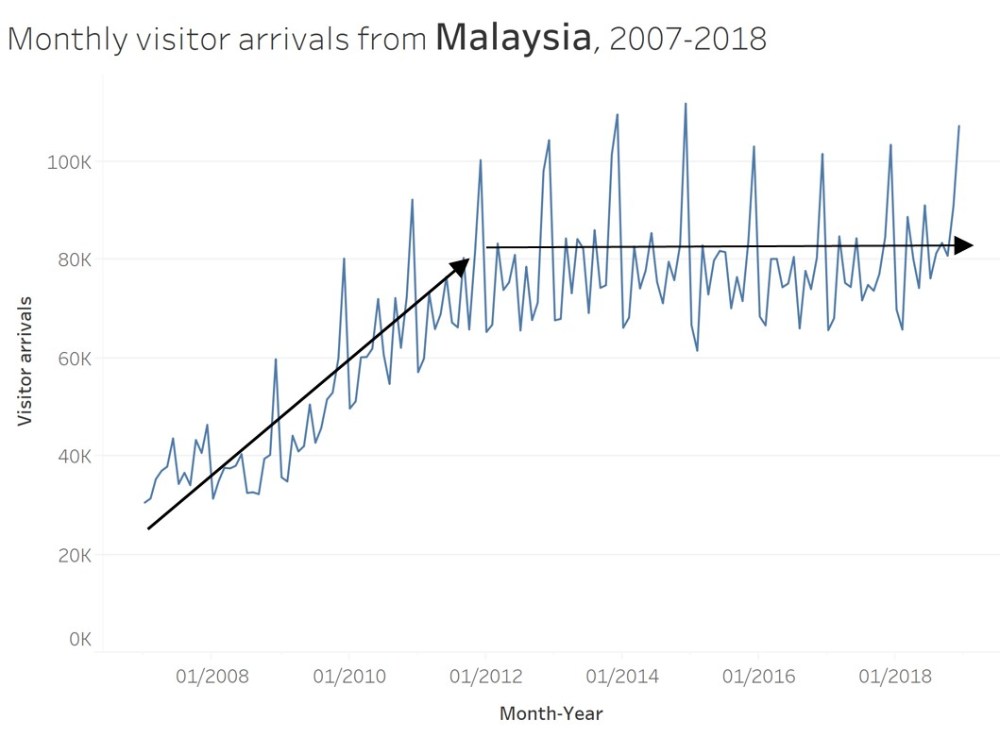]]

---
## Time-series Patterns: Variability

.large[
- The average degree of change from one point of time to the next throughout a particular span of time.]

.pull-left[

]

--

.pull-right[

]

---
## Time-series Patterns: Cycles

.left-column[
.large[
- Cycles are patterns that repeat at regular intervals.]]

.right-column[
.center[
]]

---
## Time-series Patterns: Rate of change

.left-column[
.large[
- The percentage difference between one value to the next value.]]

.right-column[
.center[
]]

---
## Time-series Patters: Co-variation

.left-column[
.large[
- When two time series relate to one another so that changes in one are reflected as changes in the other, either immediately or later.]]

.right-column[
.center[
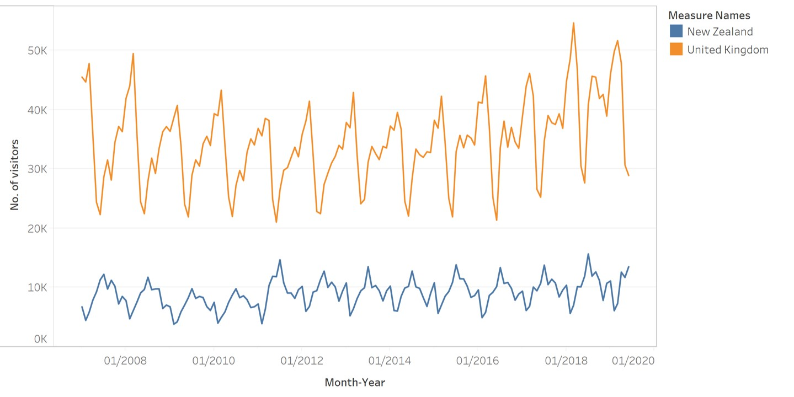]]

---
## Time-series Patterns: Exceptions

.large[
- Values that fall outside the norm.]

.center[
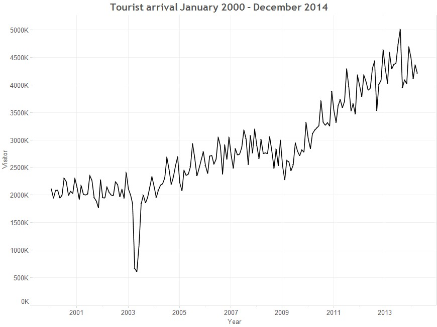]

---
## Line graph design tips
### Not all line graphs should start at zero!

.pull-left[
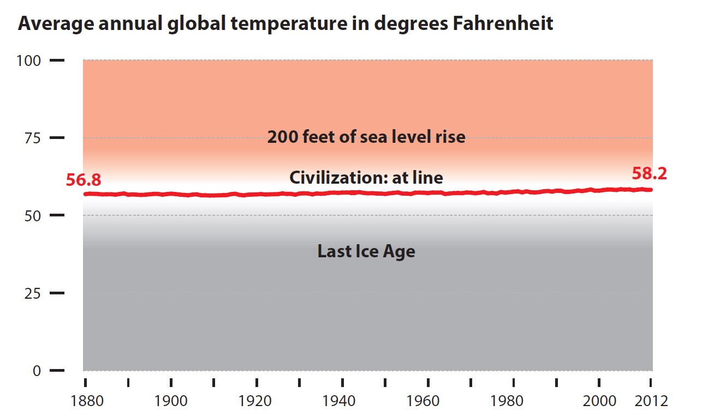
]

--
.pull-right[

]

---
## Line graph design tips
### Multiple lines in a single graph is less effective than trellis line graph

.pull-left[

]

--
.pull-right[

]

---
## Line graph design tips
### Not all time-series graphs have time on the x-axis

The **connected scatter plot** below reveals changes over time by joining each time event points on the scatter plot.  The historical trail can be a effective alternative to animation.

.center[

]

.small[
Source: https://ourworldindata.org/growth-and-structural-transformation-are-emerging-economies-industrializing-too-quickly
]

---
## Line graph design tips
### Label line graph instead of using legend

.pull-left[

]

--
.pull-right[

]

---
## Line graph design tips

.pull-left[
### Line chart without reference line

]

--
.pull-right[
### Line chart with reference line

]

---
## Line graph design tips
### Line chart with reference band

.center[
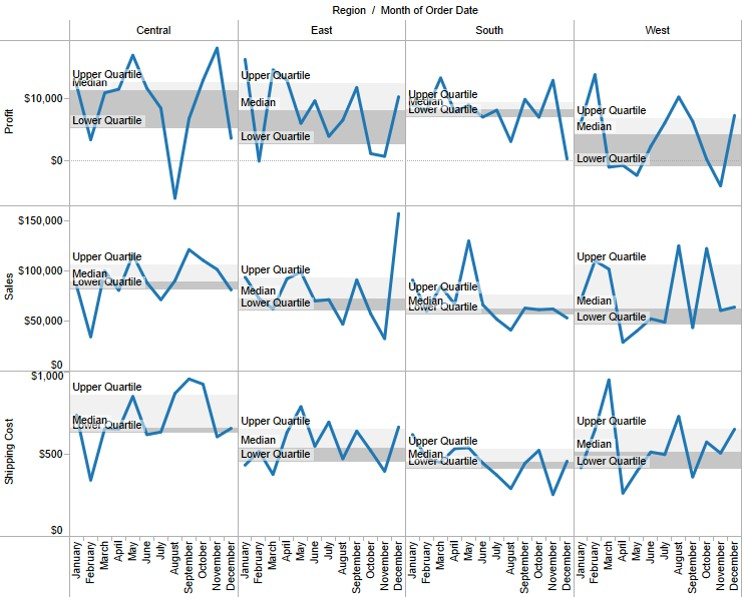]

---
## Beyond Line Graph
### Control Chart: An analytical line chart 

.center[
]

---
### Control chart in real world

.left-column[
.large[
In this use-case, control chart was used to display numbers of views of a digital news platform.
]
]

.right-column[
.center[
]]

---
## Beyond Line Graph
### Candlestick chart

.left-column[
.large[
Candlestick Charts display multiple bits of price information such as the open price, close price, highest price and lowest price through the use of candlestick-like symbols.]]

.right-column[
.center[
]]

---
### Candlestick chart
#### Interpreting candlestick chart

.left-column[
.large[
Candlesticks are usually composed of the body (black or white), and an upper and a lower shadow (wick): the area between the open and the close is called the real body, price excursions above and below the real body are called shadows. 
]]

.right-column[
.center[
]]

???
Candlesticks are usually composed of the body (black or white), and an upper and a lower shadow (wick): the area between the open and the close is called the real body, price excursions above and below the real body are called shadows. The wick illustrates the highest and lowest traded prices of a security during the time interval represented. The body illustrates the opening and closing trades. If the security closed higher than it opened, the body is white or unfilled, with the opening price at the bottom of the body and the closing price at the top. If the security closed lower than it opened, the body is black, with the opening price at the top and the closing price at the bottom. A candlestick need not have either a body or a wick.

---
### Candlestick chart
#### Interpreting candlestick chart

.center[
]

???
To better highlight price movements, modern candlestick charts (especially those displayed digitally) often replace the black or white of the candlestick body with colors such as red (for a lower closing) and blue or green (for a higher closing). In some East Asian countries such as Taiwan, China, Japan, and South Korea, the colouring scheme is reversed (red for higher closing, and green/blue for a lower closing).

---
### Learning from the Master

This link provides an example of [interactive candlestick](https://public.tableau.com/profile/stanke#!/vizhome/WorkoutWednesday-Week13CanyoucreateadynamicviewofhistoricalDATAstockpricesWorkoutWednesday2019/WorkoutWednesday2019-Week13?:embed=yes&:display_count=yes&:toolbar=no).   

.center[

]

Click on this [link](http://www.workout-wednesday.com/2019-week-13/) for more detail.

---
## Challenge I: Visualising Change between Two Points in Time
### Bar chart method

.center[
]

---
## Slopegraphs come to rescue!

.left-column[
.large[
Slopegraphs compare changes usually over time for a list
of nouns located on an ordinal or interval scale.]]

.right-column[
.center[


]]


.small[Reference: http://www.edwardtufte.com/bboard/q-and-a-fetch-msg?msg_id=0003nk] 

---
### Learning from the Master

Visit [Tableau Public](https://public.tableau.com/views/Slopegraphs/Slopegraphs?%3Aembed=y&%3AshowVizHome=no&%3Adisplay_count=y&%3Adisplay_static_image=y&%3AbootstrapWhenNotified=true&%3Alanguage=en&%3Amobile=true&:embed=y&:showVizHome=n&:apiID=host0) to try out the interactive version and visit this [link](https://dataremixed.com/2013/12/slopegraphs-in-tableau/) to learn more.

.center[

]

---
## Challenge II: Visualising cyclical patterns
### Classic line graph method

.center[
]

---
## Challenge II: Visualising cyclical patterns
### Solution: Cycle plot

.center[
]

.small[Reference: http://www.perceptualedge.com/articles/guests/intro_to_cycle_plots.pdf] 

---
## Challenge II: Visualising cyclical patterns
### Solution: Sunburst diagram method

.center[
]

---
## Challenge III: Massive Time-series Data
### Classic line graph method

.left-column[
.large[
Line graph will not be effective to reveal high number of time series lines (for example 50) 
]
]

.center[
]

---
## Challenge III: Massive Time-series Data
### Solution: Horizon graph

.left-column[
.large[
By dividing an area chart into consecutive layers, horizon graphs present time-series data in a compact space while preserving resolution. ]]

.right-column[
.center[

]]


.small[Reference: https://www.perceptualedge.com/articles/visual_business_intelligence/time_on_the_horizon.pdf]

---
## Solution: Horizon graph
### The basic construct of a horizon graph

.left-column[
.large[Figure on the right shows the process of constructing an horizon graph.]

.small[Reference: [The Developmentof the Horizon Graph](http://citeseerx.ist.psu.edu/viewdoc/download;jsessionid=3556C47AD33B1577060EEA3F409ECD32?doi=10.1.1.363.5396&rep=rep1&type=pdf)]
]

.right-column[
.center[

]]

---
### Horizon graph in Tableau

.center[
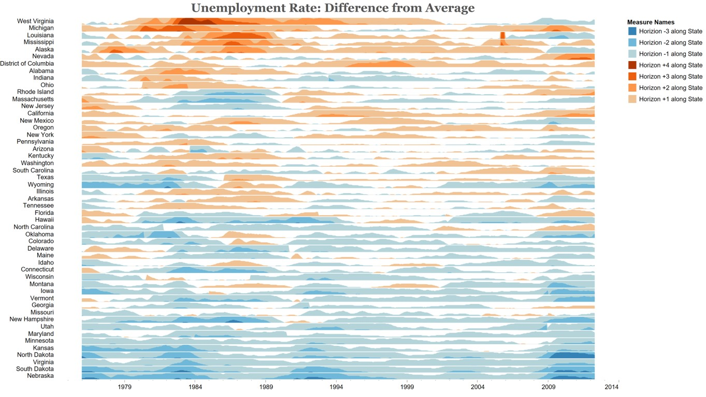]

.small[Source: https://public.tableau.com/en-us/gallery/unemployment-horizon-chart].
.small[This video https://www.tableau.com/learn/tutorials/on-demand/horizon-charts provides step-by-step explanation on how to create a horizon graph using Tableau].

---
## Challenge IV: Distribution over time

.pull-left[
### Line graph method

.center[
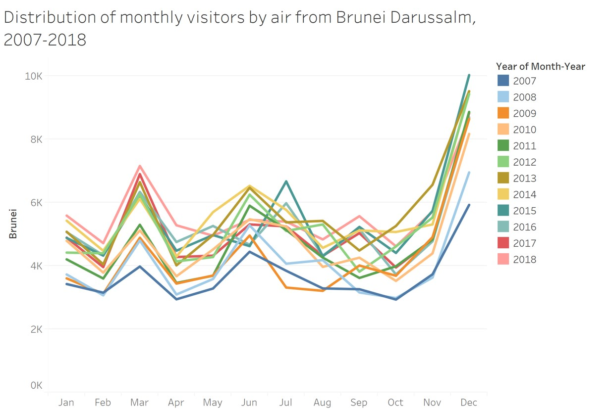
]]

--

.pull-right[
### Boxplot method

.center[
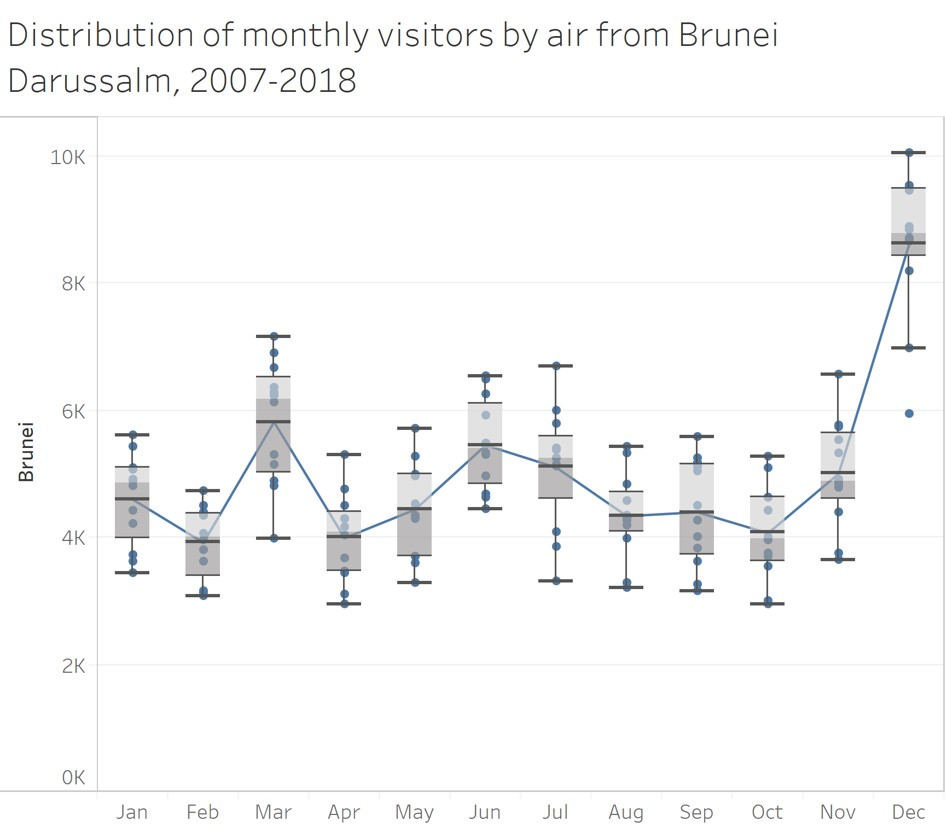
]]

---
## Alternative Time-series Data Visualisation methods
### Calendar Heatmap

.left-column[
.large[
It is a 2-dimensional calendar view that shows a value over time through color coding it, often with warmer colors indicating higher values (hence heatmap).
]]

.right-column[
.center[
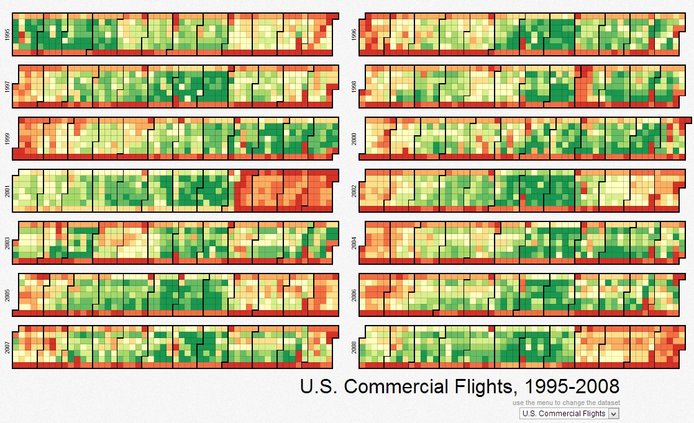
]

.small[Source: http://mbostock.github.io/d3/talk/20111018/calendar.html]
]

---
## Alternative Time-series Data Visualisation methods
### Stream Graph (also know as ThemeRiver)

.left-column[
.large[
A streamgraph, or stream graph, is a type of stacked area graph which is displaced around a central axis, resulting in a flowing, organic shape.  
]]

.right-column[
.center[
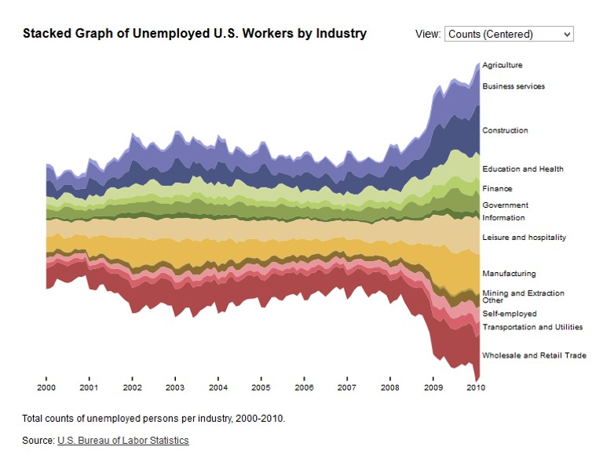]

.small[Reference: https://datavizcatalogue.com/methods/stream_graph.html]]

---
## Visualising Change Over Time
### Animated bubble plot (or motion chart)

.left-column[
.large[A motion chart displays changes over time by showing movement within the two-dimensional space and changes in the size and color of the bubbles.
]]
  
.right-column[  
.center[
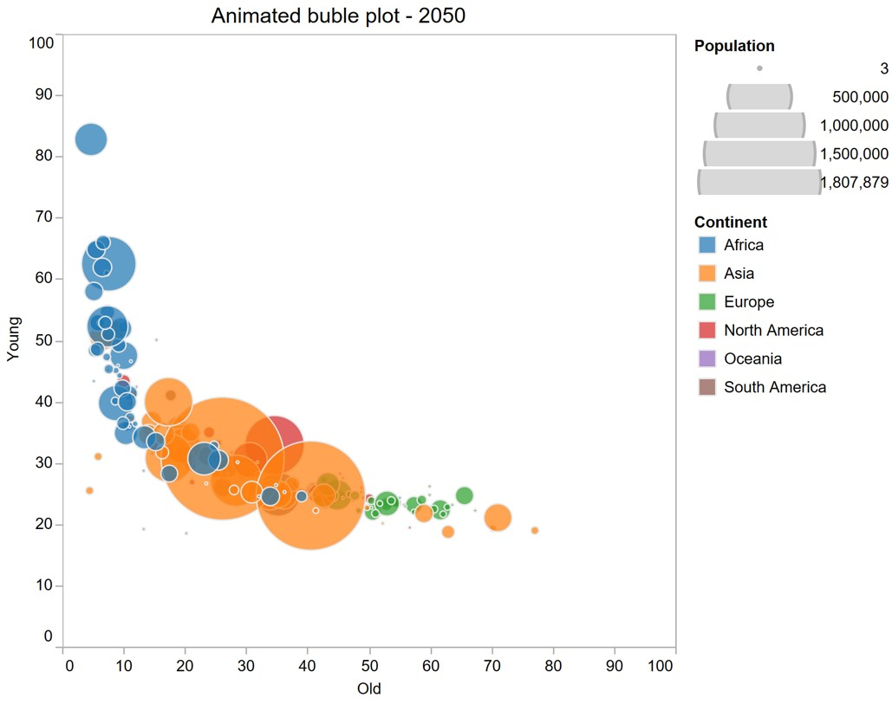
]]

---
## References

Claus. O. Wilke (2019) **Fundamentals of Data Visualisation**, O’Reilly. USA. [Chapter 13 Visualizing time series and other functions of an independent variable](https://clauswilke.com/dataviz/time-series.html) and [Chapter 14 Visualizing trends](https://clauswilke.com/dataviz/visualizing-trends.html)

[Introduction to Cycle Plots](http://www.perceptualedge.com/articles/guests/intro_to_cycle_plots.pdf) 

[Slopegraphs for comparing gradients: Slopegraph theory and practice](http://www.edwardtufte.com/bboard/q-and-a-fetch-msg?msg_id=0003nk) 

[The Development of the Horizon Graph](http://www.stonesc.com/Vis08_Workshop/DVD/Reijner_submission.pdf)


```{r echo=FALSE, eval=FALSE}
library(pagedown)
pagedown::chrome_print("Lesson06-It_is_About_Time.html")
```
