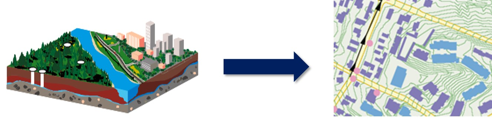
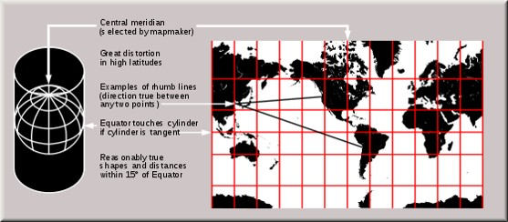
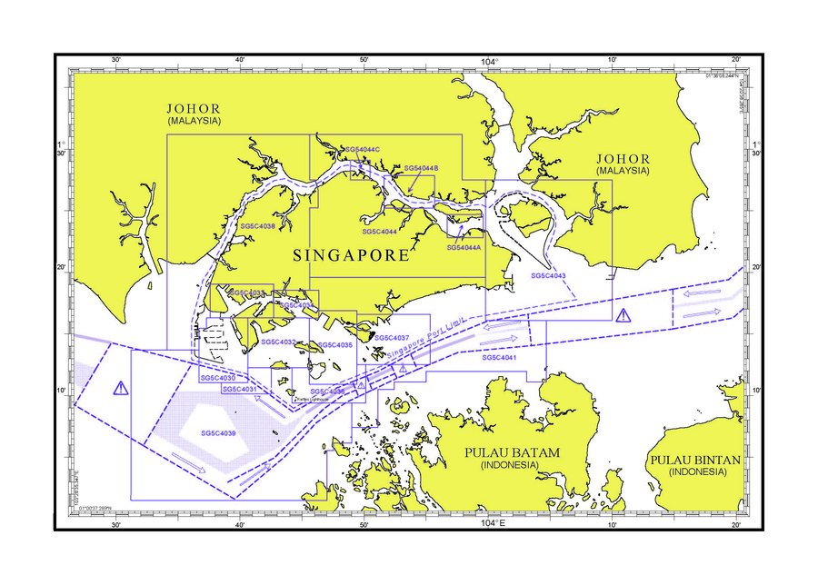
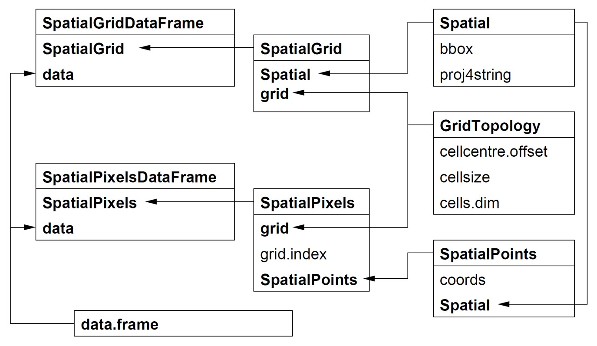
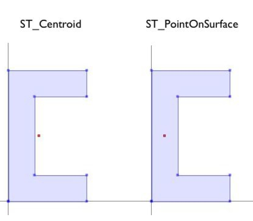
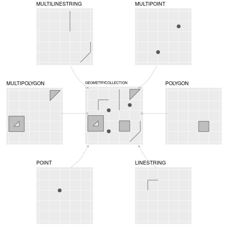
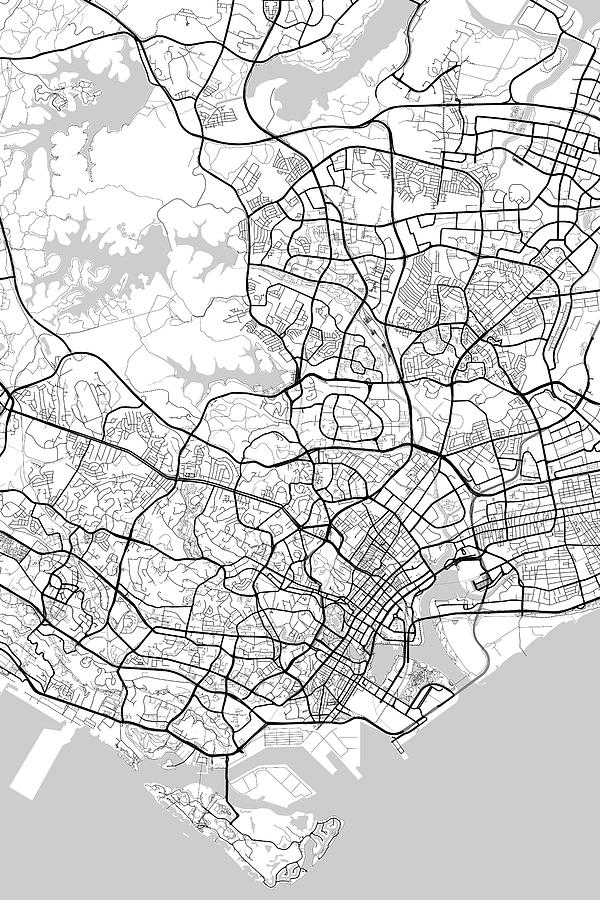
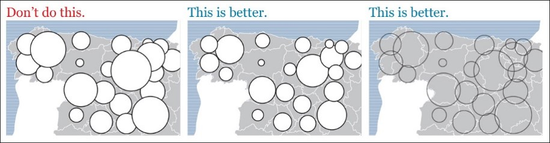
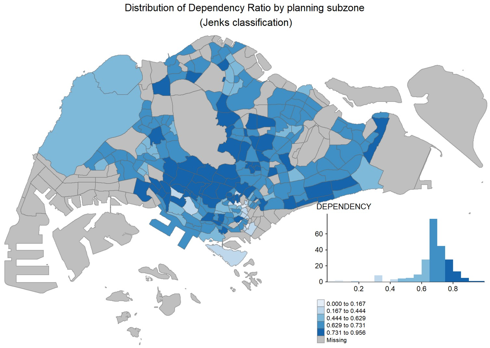
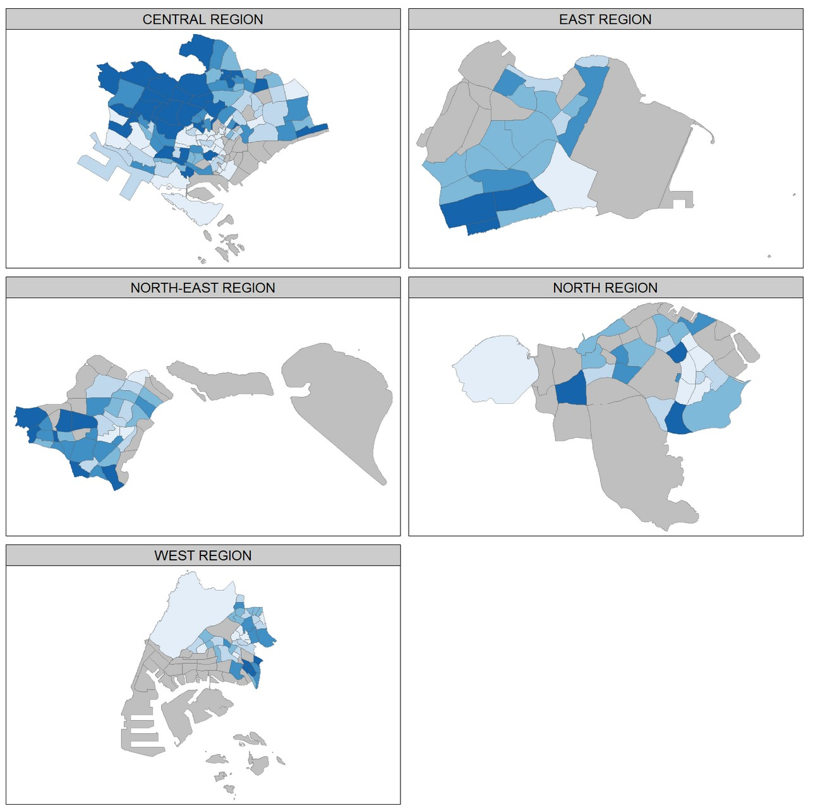

```{r setup, include=FALSE}
knitr::opts_chunk$set(echo = FALSE)
```

# What will you learn from this lesson?

.vlarge[
- Introducing map
- Properties of geographical data
    - Geographical data models
    - Map projections
- Typology of maps
    - Reference maps
    - Thematic maps
- Proportional Symbol Map
- Choropleth Map]

---
# What is a Map?

.large[
A map is a model of real world depict by a collection of cartographic symbols or/and visual abstraction.]  

.center[
]

---
# What is a Map?

.large[
An interface between geographical data and map users.]

.center[
]

---
## A Map and Geographical Data

.center[
]

---
## Types of geographical data

.center[
]

---
## How location information are registered?

.large[
- Geographic Coordinates Systems

- Projected Coordinates Systems
]

---
## How location information are registered?
### Geographic Coordinates Systems

.pull-left[
.large[
- A geographic coordinate system defines two-dimensional coordinates based on the Earth’s surface. It has an angular unit of measure, prime meridian and datum (which contains the spheroid). 
- For example, WGS84, NAD27 and NAD83.
]
.small[Source: https://en.wikipedia.org/wiki/Geographic_coordinate_system]
]

.pull-right[
]

---
## How location information are registered?
### Projected Coordinates Systems

.pull-left[
.large[
- A projected coordinate system is defined on a flat, two-dimensional surface. 
- A projected coordinate system, unlike a geographic one, has the advantage that lengths, angles, and areas are constant across the two dimensions. This is not true when working in a geographic coordinate system. 
- A projected coordinate system is always based on a geographic coordinate system that can use a sphere or spheroid.]]

.pull-right[
]

.small[Source: http://en.wikipedia.org/wiki/Map_projection 
]

---
# The Purpose of a Map

.large[
- To serve as a piece of historical archive]

.center[
]
.small[Reference: http://en.wikipedia.org/wiki/Battle_of_Singapore]

???
A map serves as a record of the physical and cultural environment at a particular time.  For example, the map above shows Singapore in early February 1942; the disposition of Allied ground forces is in red. The main north–south transport corridor, formed by Woodlands Road and the railway, connecting the city centre (in the southeast) and The Causeway (central north), is the black line running through the centre of the island. Sarimbun is at the north west corner of the island; Bukit Timah is located close to the centre on the transport corridor; Pasir Panjang is between the city centre and the southwest corner of the island and the "Jurong Line" is the bracket-like shape in red, just west of Woodlands Roadland use allocation on Singapore Concept Plan in 2001.   

---
# The Purpose of a Map

.large[
- To support navigation (i.e. Google Map)]

.center[
]

---
# The Purpose of a Map
.large[
- To support navigation (i.e. sea chart of Singapore)]

.center[
]
.small[Source: https://www.mpa.gov.sg/web/portal/home/port-of-singapore/services/charts-tidal-info-atons-and-hydrography/singapore-electronic-navigational-chart]

---
# The Purpose of a Map

.large[
- To reveal spatial patterns.]

.center[
]
.small[Reference: https://en.wikipedia.org/wiki/John_Snow]

---
# The Purpose of a Map

.large[
- To describe spatial relationship.]

.center[
]

---
# Typology of Maps

.center[
]

---
## Reference maps

- Reference maps emphasize the location of spatial phenomena, such buildings, roads, vegetations, rivers, etc. Some of popular reference maps are **topographical map** and internet map such as Google map.

.center[
]

???
Topographic maps are detailed, accurate graphic representations of features that appear on the Earth's surface. These features include:
cultural: roads, buildings, urban development, railways, airports, names of places and geographic features, administrative boundaries, state and international borders, reserves
hydrography: lakes, rivers, streams, swamps, coastal flats
relief: mountains, valleys, slopes, depressions
vegetation: wooded and cleared areas, vineyards and orchards.

A map legend (or key) lists the features shown on that map, and their corresponding symbols.
Topographic maps usually show a geographic graticule and a coordinate grid, so you can determine relative and absolute positions of mapped features.  
It is important to note that a map is merely a two or three dimensional representation of the physical environment at a given time.  Therefore, a map will never be entirely up to date.  Changes to the landscape and cultural features regularly occur (such as roads, vegetation, and buildings), resulting in maps becoming dated, although the rate of obsolescence varies depending upon location.
Traditionally present in paper printed format.

---
## Thematic Map

.pull-left[
.large[
- Thematic maps emphasize the spatial pattern of geographic attributes or statistics about places and relationships between places such as Life in Los Angeles.]

.small[Source: https://mapdesign.icaci.org/2014/12/mapcarte-353365-life-in-los-angeles-by-eugene-turner-1977/
]]

.pull-right[
]

---
## Thematic Mapping

.large[
- Displaying 
    - Qualitative data
    - Quantitative data

- Choosing 
    -Appropriate classification method for displaying data
    - Appropriate number of classes

- Techniques in data analysis
    - Using the classification histogram
    - Normalizing data
]

---
## Qualitative Thematic Maps
### Visual Variables and Cartographic Symbols

.pull-left[
.large[
- Qualitative visual variables are used for nominal scale data.
- The goal of qualitative visual variables is to show how entities differ from each other. 
- The visual variables that do a good job of showing ordinal differences are: colour value, colour saturation, size and texture/grain.  
- Figure on the right for examples of these four ordinal visual variables used each in point, linear and areal symbols.]]

.pull-right[
]

---
## Qualitative Thematic Map
### Point symbol map

.pull-left[
.large[
- Different point symbols are used to represent school types]]  

.pull-right[
]

---
## Qualitative Thematic Map
### Line symbol map

.pull-left[
.large[
- A road map is an example of a thematic map.  It shows the road network of an area.  In this map, lines with different colour intensity and tickness are used to differentiate hierarchy of roads.]]

.pull-right[
.center[
]]

---
## Qualitative Thematic Map
### Area map

.pull-left[
.large[
- Land use map below is a good example of a discrete thematic map.  In this map, different colours are use to represent different land use types.]]

.pull-right[
]

---
## Quantitative Thematic Map
### Visual Variables and Cartographic Symbols

.pull-left[
- Quantitative visual variables are used to display ordinal, interval or ratio scale data.  
- The goal of the quantitative visual variable is to show relative magnitude or order between entities.
- The visual variables that do a good job of showing ordinal differences are: colour value, colour saturation, size and texture/grain.  
- Figure on the right shows of these four ordinal visual variables used each in point, linear and areal symbols.]

.pull-right[
]

---
## Proportional Symbol Map
- The proportional symbol technique uses symbols of different sizes to represent data associated with different areas or locations within the map.

.center[
]

???
The proportional symbol technique uses symbols of different sizes to represent data associated with different areas or locations within the map. For example, the proportional maps above use circle with different sizes to represent millions of people.
There are two types of point features that are typically depicted with proportional symbols: features for which the data represents a geographic position directly (e.g., gallons of oil from individual oil wells), and features that are geographic areas to which data are aggregated and the data magnitudes are assigned to a representative point within the area (e.g., the geographic centroid of a state as in the examples above). In either case, the area of the symbol is scaled to represent the data magnitude, sometimes with a bit of exaggeration to adjust for a general tendency of human vision to underestimate differences in area. A variant on this direct data-to-symbol scaling groups values into categories first, then scales the symbol to represent the mean for the category, assigning a symbol to each place to represent the category range that the mean for the place falls within

---
### How to size circles incorrectly and correctly?

.large[
Figure below explains how attribute values are map on circles.  One strategy to overcome this problem is to use square instead of circle.]

.center[

]

---
### How to make proportional symbol maps clearer?

.large[
When designing a proportional symbol map, one of the important consideration is to avoid the circles blocking each other.  One possible strategy to overcome this problem is to applying opacity (also known as transparency).]

.center[

]

---
### Proportional Symbol Map: Pie Chart Map

One important characteristic of proportional symbols is that they can easily be designed to represent more than one data value per location.  Among the most common example is a **pie chart map** in which a circle is scaled proportionally to some total, and the size of wedges within the circle is scaled to depict a proportion of a total for two or more sub-categories. 

.center[
]

???
One important characteristic of proportional symbols is that they can easily be designed to represent more than one data value per location.  Among the most common example is a “pie chart map” in which a circle is scaled proportionally to some total, and the size of wedges within the circle is scaled to depict a proportion of a total for two or more sub-categories.  The map above uses circle size to depict total sales in each city, and the pie slices then depict proportion of the three shipping modes, namely: delivery truck, express air and regular air.

---
### Proportional Symbol Map: Bar Chart Map

**Proportional side-by-side bar map** places side-by-side bar chart on a map based on the location of the observations.  

.center[
]

---
### Proportional Symbol Map - Junk Map

.large[
When preparing a proportional symbol map, it is important to ensure that the geographical level used is the same.]

]

.small[
Source: [COVID-19 Dashboard](https://gisanddata.maps.arcgis.com/apps/opsdashboard/index.html#/bda7594740fd40299423467b48e9ecf6) 
]

---
### Altertive of Proportional Symbol Map: Bricks Map

Bricks Map aims to provide better ways to encode quantitative information graphically—ways that can be easily, efficiently, and accurately decoded. 

.center[
]

.small[Source: http://www.perceptualedge.com/articles/visual_business_intelligence/building_insight_with_bricks.pdf and http://www.encodingpano.com/ 
]

---
### Bricks Map versus Proportional Symbol Map

.large[
By plotting a proportional symbol map and a bricks map side-by-side as shown below, it is clear that bubbles of graduated sizes proportional to the value ranges that they represent can be difficult to distinguish than the bricks. 
]

.pull-left[

]


.pull-right[

]

---
## Dot Density Map

A dot-density map is a type of thematic map that uses dots or other symbols on the map to show the values of one or more numeric data fields. Each dot on a dot-density map represents some amount of data.

.center[
]
.small[one dot represent 100 households]

.small[
Reference: [Dot distribution map](https://en.wikipedia.org/wiki/Dot_distribution_map) at wiki and [Dot Density Maps](https://www.axismaps.com/guide/dot-density)
]

---
## Choropleth Map

A choropleth map is a type of thematic map in which areas are shaded or patterned in proportion to a statistical variable that represents an aggregate summary of a geographic characteristic within each area, such as population or per capita income.

.center[
]

---
### Classified choropleth map

- A choropleth map can be either classified or unclassified.
- A **classed choropleth map** combines areal units into a smaller number of groups.  Interval levels may vary, but typically 4 to 7 are used in a map.  There is different classification techniques used to divide up the intervals.  

.center[
]

---
### Unclassified choropleth map

- An **unclassified choropleth** map is similar to a classed choropleth map; however, an unclassed choropleth maps do not have an averaged statistic towards each particular colour.  

.center[
]

---
### Choropleth mapping technique - Number of classes

The readability of a choropleth map will be affected by the number of classes used.

.pull-left[
*  When a small number of classes is used, the spatial distribution reveals will be very limited. 


]

--
.pull-right[
*  When an appropriate number of classes is used, the spatial distribution reveals will be clear. 


]


---
### Choropleth mapping technique - Number of classes

Figure below provided a mathematical method to determine number of classes used for preparing a choropleth map.

.center[
]

---
### Choropleth map

.vlarge[Methods of choosing classes]

.large[
- Based on the nature of the distribution
    - quantile, equal interval, natural breaks, standard deviations, defined interval

- Arbitrary
    - Can be based on round numbers. 
    - Examples: Grouping according to age or census housing categories
    - Can result in empty categories
]

---
### Data classification method: Equal interval

.large[
- Divides the range of attribute values into equally sized classes.]

.center[

]

---
### Data classification method: Quantitle

.large[
- Same number of features per class.]

.center[

]

---
### Data classification method: Jenks (also known as Natural breaks)

.large[
- Default Jenk’s statistical optimization by finds natural groupings in the data.]

.center[

]

---
### Data classification method: Standard deviation 

.large[
- A measure of dispersion. Use if the distribution approximates a normal distribution.]

.center[

]

---
### Choropleth map - Colour scheme

.large[
[ColorBrewer](http://colorbrewer2.org/) is an online tool designed to help people select good color schemes for maps and other graphics.]

.center[

]

---
### Colour Scheme Tip

- Avoiding multiple colours in choropleth mapping
- Stick with a single hue (or a small set of closely related hues) and vary intensity from pale colours for low values to increasingly darker and brighter colours for high values.

.center[

]

---
### Trellis choropleth map

.pull-left[
.large[

- **Trellis maps** , also known as **small multiple maps**, are composed of many maps arrange side-by-side, and sometimes stacked vertically. 
- Small multiple maps enable the visualisation of how spatial relationships change with respect to another variable, such as time.
]]

.pull-right[

]

---
# Reference

[Proportional Symbols](https://www.axismaps.com/guide/proportional-symbols)

[Choropleth Maps](https://www.axismaps.com/guide/choropleth)

[Dot Density Maps](https://www.axismaps.com/guide/dot-density)

[The Basics of Data Classification](https://www.axismaps.com/guide/data-classification)

[Should a map be interactive?](https://www.axismaps.com/guide/should-a-map-be-interactive)

[Map interaction](https://www.axismaps.com/guide/map-interaction)


```{r echo=FALSE, eval=FALSE}
library(pagedown)
pagedown::chrome_print("Lesson06-Visualising_Geographical_Data.html")
```


