```{r setup, include=FALSE}
options(htmltools.dir.version = FALSE)
knitr::opts_chunk$set(
  fig.retina=3,
  cache = FALSE,
  echo = TRUE,
  message = FALSE, 
  warning = FALSE)
```

```{r xaringan-themer, include=FALSE, warning=FALSE}
library(xaringanthemer)
style_duo_accent(
  primary_color = "#1381B0",
  secondary_color = "#FF961C",
  inverse_header_color = "#FFFFFF"
)
```

# Content

.large[
- Introduction to Graph Visual Analytics

- Graph Visualisation in Actions

- Basic Principles of Graph

- Network data sets
    - Graph data format

- Network Visualisation and Analysis
    - Network visualisation and analysis process model
    - Graph layouts and visual attributes
    - Network metrics
]

---
# Introduction to Graph Analytics

.large[
- What is Graph Analytics?

- Basic concepts of graph

- Network in Real World

- Graph Visualisation in Actions
]

---
## What is Graph Analytics?

.pull-left[
.large[

- The study and analysis of data that can be transformed into a graph representation consisting of nodes and links.

- Analytic tools used to determine strength and direction of relationships between objects in a graph. 
- The focus of graph analytics is on pairwise relationship between two objects at a time and structural characteristics of the graph as a whole.
]]

.pull-right[
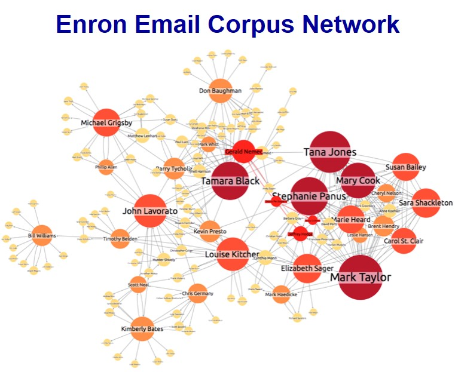

.small[Source: https://cambridge-intelligence.com/using-social-network-analysis-measures/]
]


---
## What is Graph Analytics?

.large[
- For example, in a graph representing relationships (such as “liking” or “friending” another individual’s profile or site) between individuals, graph analytics can help answer questions like the following:
    - How many other individuals does the average individual “friend” with?
    - What is the maximum number of “friends” any one individual has?
    - How interconnected are groups of users with one another?
    - How many “friend” relationships does it take to get from one user to another user?
    - Are there isolated groups of individuals who are connected to each other but not to individuals not in their group?

- Applications of Graph Analytics include clustering, partitioning, search, shortest path solution, widest path solution, finding connected components, and page rank.
]

---
## Graph Analytics in History: Classical Graph Theory

.large[
The Seven Bridges of Königsberg is a historically notable problem in mathematics. Its negative resolution by Leonhard Euler in 1735 laid the foundations of graph theory and prefigured the idea of topology.]

.center[
]


.small[Source: http://en.wikipedia.org/wiki/Seven_Bridges_of_K%C3%B6nigsberg 
]

---
## Graph Analytics in History: Sociogram

.large[
A sociogram is a tool for charting the relationships within a group. It’s a visual representation of the social links and preferences that each person has – valuable data for leaders.]

.center[
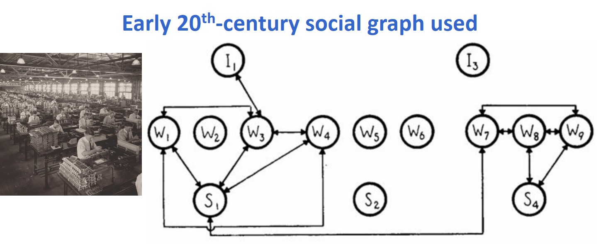]

.small[Source: Valdis Krebs (2010) “Your Choice Reveal Who You Are: Mining and Visualizing Social Patterns” in Beautiful Visualization.
]

---
## Where are Graphs used

.large[
- Graphs are sometimes used in surprising ways. There are many problems which may not initially appear to take the form of graphs but can be solved more quickly if they are transformed into a graph:

    - Partitioning large physical volumes into smaller physical volumes as part of high performance simulations on supercomputers.
    - Parsing speech to determine what is the most likely sequence of words that matches a given set of sounds.
    - Analyzing the way different parts of a complex software program interact in order to proactively find and remove bugs.
]

---
# Basic Principles of Graph

.large[
- Basic Graph

- Direct and Undirected Graphs

- Weighted Graph

- Ego-centric Graph

- Bipartite Graph

- Multimodel Graph
]

---
## A Complete Graph

.pull-left[
.large[
A complete graph is a simple **undirected** graph in which every pair of distinct **vertices** (also known as **nodes**) are connected by an unique **edge** (also known as **link**).]]

.pull-right[
]

---
## A Directed Graph

.pull-left[
.large[
Have a clear origin and destination. Also known as *asymmetric edges*. Suitable for representing network with non reciprocal relationships such as Twitter.]]

.pull-right[
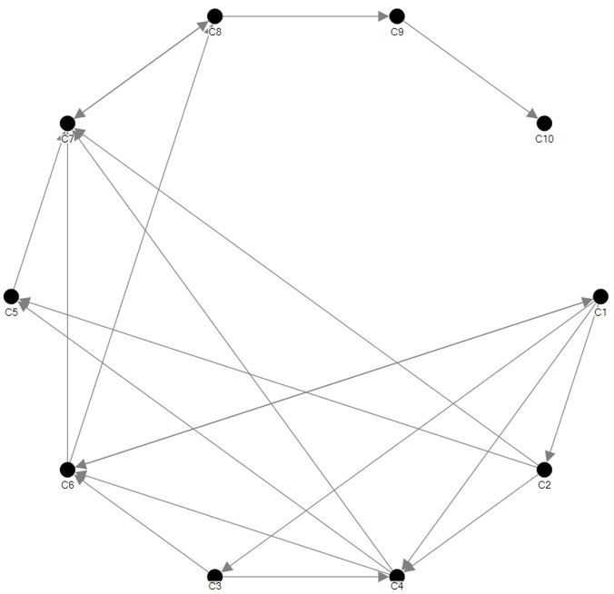]

---
## Graph representation

.large[
On the left is a normal graph, in the centre is a graph in which each edge is given a numerical value, and to the right is a directed graph.]

.center[
]

---
## A weighted graph

.pull-left[
.large[
- A weighted edge includes values associated with each edge that indicate the strength or frequency of tie. For example, numbers of calls between two staffs.
]]

.pull-right[
]

---
## A weighted graph

.pull-left[
.large[
- Edges with different thickness are used to represent the monthly calls by staffs.
]]

.pull-right[
]

---
## An ego-centric graph

.pull-left[
.large[
- Network consisting of an individual and their immediate peers (Heer & Boyd, 2005).
]]

.pull-right[
]

---
## Bipartite Graph

.pull-left[
.large[
- A graph whose vertices can be divided into two disjoint sets U and V such that every edge connects a vertex in U to one in V; that is, U and V are independent sets. 

- Equivalently, a bipartite graph is a graph that does not contain any odd-length cycles.
]]

.pull-right[
]

---
## Affiliation Networks - Bipartite Graph

.center[
]

.small[Source: Valdis Krebs (2010) “Your Choice Reveal Who You Are: Mining and Visualizing Social Patterns” in Beautiful Visualization.
]

---
## A Multimodel Graph

.pull-left[
.large[
Social network connecting different types of vertices. For example, a network may connect peers to discussion forums and blog posts they have commented on.]]

.pull-right[
]

---
# Network in real World

.large[
- Physical
    - Transportation (i.e. road, port, rail, etc)
    - Utility (electricity, water, gas, network cable, etc)
    - Natural (river, etc)

- Abstract
    - Social media (i.e. e-mail, Facebook, Twitter, Wikipedia, etc)
    - Organisation (i.e. NGO, politics, customer-company, staff-to-staff, criminal, terrorist, disease, etc)]

---
## Real world network

.large[
- Land transport]

.center[
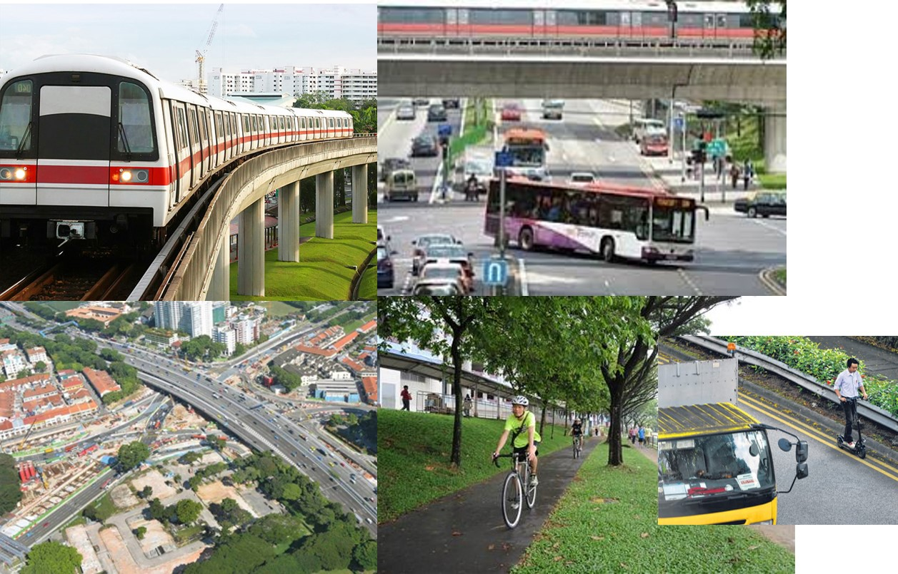]

---
## Real world network

.large[
- Maritime transport]

.center[
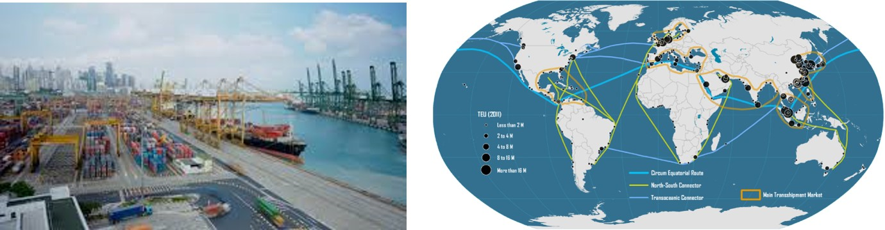]

---
## Real world network

.large[
- Air transport]

.center[
]

---
## Real world network

.large[
- Life line]

.center[
]

---
## Real world network

.large[
- Social network]

.center[
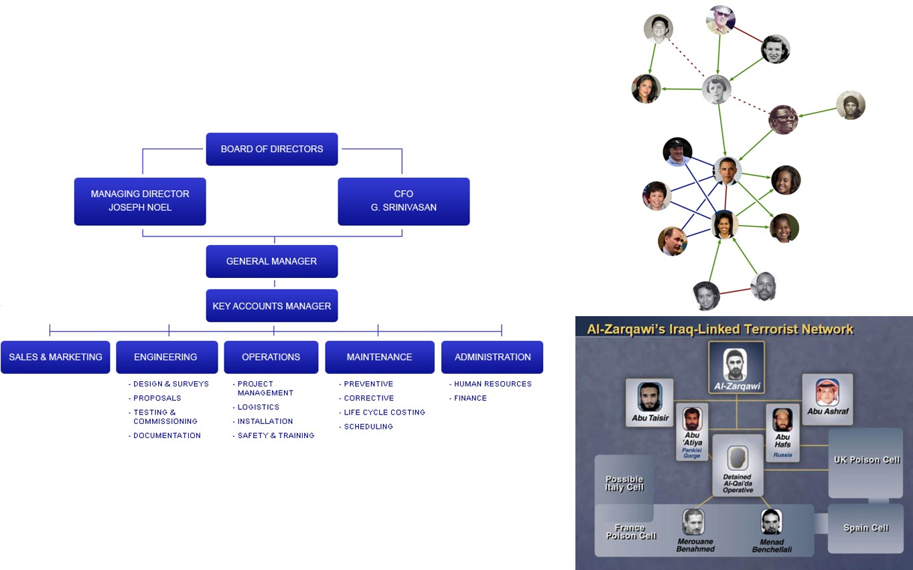]

---
## Graph Visualisation in action 1

.large[
Using graph visualisation to understand business networks]

.center[
]

.small[Source: https://exxonsecrets.org/maps.php]

---
## Graph Visualisation in action 2

.large[
Graph visualisation is used to reveal voting patterns among United States senators 
]

.center[
]

.small[Source: http://www.cs.umd.edu/hcil/socialaction/users/umd/socialaction.jnlp]

---
## Graph Visualisation in action 3

.large[
Graph visualisation is used to understand online social network]

.center[
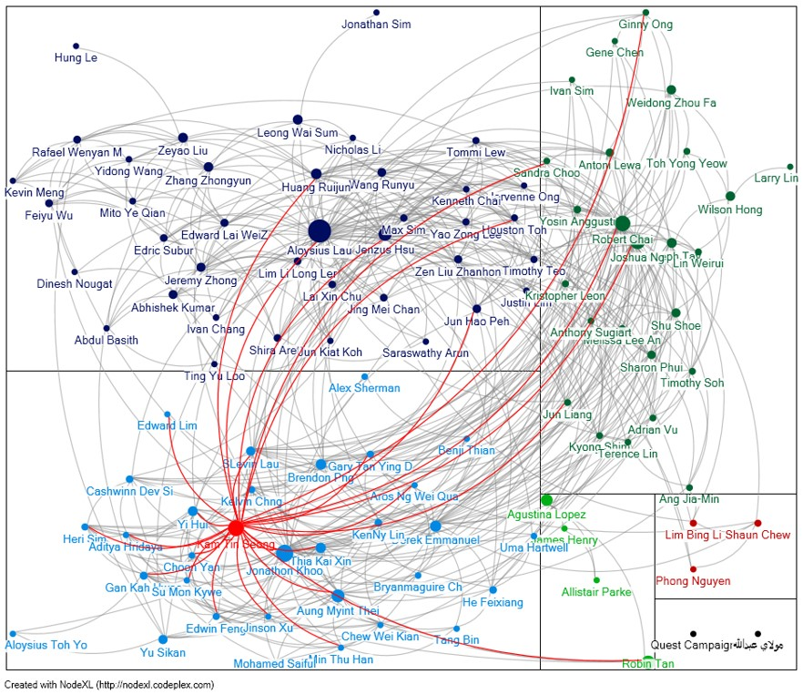]

---
## Graph Visualisation in action 4

.large[
Graph visualisation is used to show how the news are all connected by degrees of separation]

.center[
]

.small[Source: Link: http://whichlight.github.io/reddit-network-vis/?discussion=http://reddit.com/r/gaming/comments/3d2ewz/nintendo_president_satoru_iwata_passes_away/]  

---
## Graph Visualisation in action 5

.large[
Application of network analysis in project management. 
]

.center[
]

.small[Source: Source: Pryke, S.D.”Analysing construction project coalitions: exploring the application of social network analysis”, Construction Management and Economics, (2004), 22. pp. 787-797.]

---
## Graph Visualisation in action 6

.large[SecViz: Application of network graph in security]

.center[
(a) Similarity graph of log entries and (b) Similarity graph of network scans

]

.small[Source: Graph Drawing for Security Visualization
]

---
## Graph Visualisation in action 7

.large[Alumni network]

- Networks of the below universities are expanded in a breadth first manner up to the depth of 2, (showing university, alumni and companies they are associated with through employment, investment or other activities)
- Size of the node reflects degree of the node (scaled logarithmically).


.center[
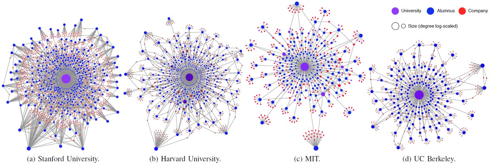]

.small[Source: http://www.innovation-ecosystems.org/wp-content/uploads/2010/12/209.educon.pdf
]

---
## Graph Visualisation in action 8

.large[Public Transport Network Analysis]

- Degree centrality indexes for nodes in the existing (2006) and proposed (2020) public transport networks in Melbourne’s north-east


.center[
]

.small[]

---
## Graph Visualisation in action 9

.large[Maritime Port Network Analysis]

- Maritime degree, centrality and vulnerability: port hierarchies and emerging areas in containerized transport (2008–2010)


.center[
]

.small[]

---
## Graph Visualisation in action 10

.large[Firm Network Analysis]

- S&T cooperation network diagram of cities in China

.center[
]

.small[]

---
## Graph Visualisation in action 11

.large[UN Voting in Europe]

- An interesting visual analytics product contributes to [tidytuesday](https://github.com/rfordatascience/tidytuesday).  The code is available at this [github repository](https://github.com/jack-davison/TidyTuesday/blob/master/R/2021_03_23_unvotes.R).

.center[
]

.small[

]


---
# To learn more, go to Visual Complexity

.center[
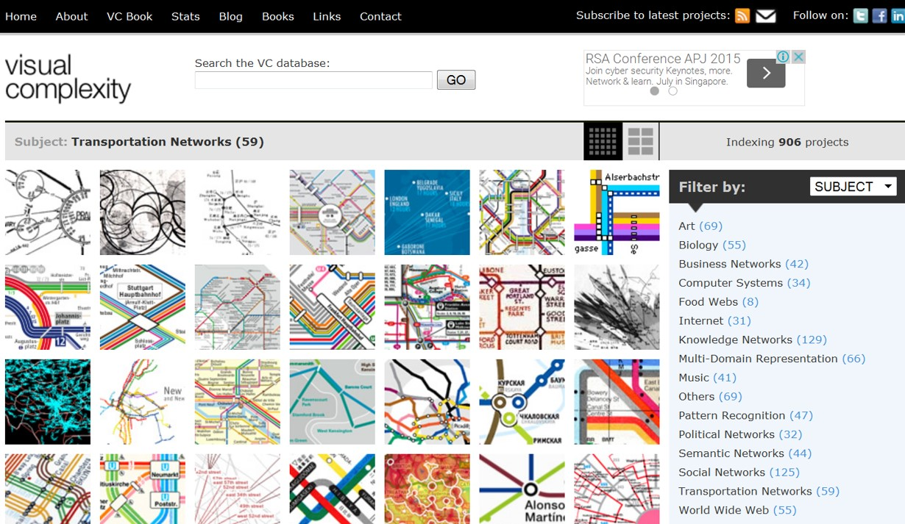]

.small[Source: http://www.visualcomplexity.com/vc/index.cfm?domain=Transportation%20Networks ]

---
# Graph Data

.large[
- What is graph data?

- Storing graph data
    - file-based
    - database management system
    - R object
]

---
## Potential Graph Data Sources
### Node and Link Data Sets 

- [Flight Stats](http://transtats.bts.gov).

- The record indicates the city pair (that is, a link), such as ORD–LGA or LAX–ATL. Note that this particular data has directed links. ORD–LGA is a flight that starts in Chicago’s O’Hare Airport and ends at LaGuardia Airport in New York City and is different from LGA–ORD, which is a flight going in the other direction. Both links are valid.

.center[
]

---
## Potential Graph Data Sources
### Link Records 

- Sometimes only links are identified in a data set. One example is network log files. Although log files may seem arcane, they contain a wealth of interesting information—for example, from where people are connecting into a corporate network, when and where big files are transferred out, patterns of regular activity (such as network backup), and patterns of irregular activity (such as hackers attempting to break in).  

.center[
]

---
## Potential Graph Data Sources
###  Transaction Records 

- By looking at the items that co-exist in a transaction, you can construct a graph. Nodes are the items, and links are the co-occurrence of items within any transaction. Examples of this type of graph include a wide variety of social networking (including e‑mail data, as well as multiple authors of documents such as books, news stories, or reports.

.center[
]

---
## Potential Graph Data Sources
###  Sequence Data 

- Sequence data is very similar to transaction data with explicit time stamps on each record.

.center[
]

---
## Potential Graph Data Sources
###  Unstructured Data (for Example, Tweets)

- Unstructured data can also be processed to extract nodes and links. 
- A means to identify nodes and identify links is required. For example, tweets are short, 140-character messages publicly broadcast on Twitter. Tweets are a rich data source from which you can mine different kinds of nodes and links by looking for co-occurrence of hash tags (that is, user-defined topics), usernames, or stock symbols within tweets, and you can extract these to form graphs.

.center[
]

---
## Potential Graph Data Sources
###  Matrix (for Example, Trade, Migration)

- Sometimes a matrix of data contains the same entries in both the first column and first row. For example, global trade flows between countries can be represented as a table of numbers (http://stats.oecd.org).

.center[
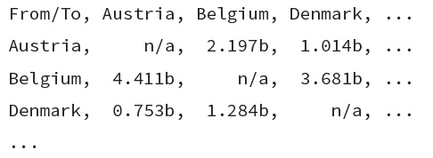]

---
## Potential Graph Data Sources
###  Statistical Correlation (for Example, Stocks, News Stories)

- Graphs can also be created
statistically.

.center[
]
---
## Potential Graph Data Sources
###  Two Data Types (for Example, Board Memberships)

- A *bipartite* graph has two different types of nodes, with linkages between the different types. For example, a graph analysis of executives and their board memberships reveals the connections between companies via board members. The two different data types in this example are people and companies. These are the nodes. The board memberships are the links that connect a person to a company.

.center[
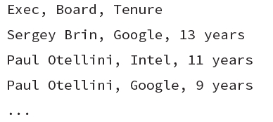]

---
## Potential Graph Data Sources
###  Many Data Types (for Example, Social Links)

.pull-left[
.large[
- People can be connected through many kinds of commonalities—for example, LinkedIn builds connections via companies, friendships, educational institutions, group memberships, and so on.]]

.pull-right[
]

---
## Popular Graph Data File Formats

.large[
- [GraphML](https://en.wikipedia.org/wiki/GraphML), an XML-based file format for graphs.
- [GXL](https://en.wikipedia.org/wiki/GXL), graph exchange format based on XML.
- [Trivial Graph Format](https://en.wikipedia.org/wiki/Trivial_Graph_Format), simple text based format.
- [GML](https://en.wikipedia.org/wiki/Graph_Modelling_Language) is another widely used graph exchange format.
- [DGML](https://en.wikipedia.org/wiki/DGML), Directed Graph Markup Language from Microsoft.
- [XGMML](https://en.wikipedia.org/wiki/XGMML), an XML-based graph markup language closely related to GML.
- [Dot Language](https://en.wikipedia.org/wiki/DOT_(graph_description_language), a format for describing graphs and their presentation, for the Graphviz set of tools.]

---
## Graph database

.large[
[Neo4j (Network Exploration and Optimization 4 Java)](https://en.wikipedia.org/wiki/Neo4j) is a graph database management system developed by [Neo4j, Inc.](https://neo4j.com/)
]

.center[
]

.small[Source: http://neo4j.com/developer/get-started/]

---
## R Graph Objects

.large[

- [network](https://cran.r-project.org/web/packages/network/index.html): Classes for Relational Data

- [igraph](https://igraph.org/r/): Network Analysis and Visualization.  There is also R [CRAN version](https://cran.r-project.org/web/packages/igraph/index.html) of documentation.      .  

- [tidygraph](https://cran.r-project.org/web/packages/tidygraph/index.html): A Tidy API for Graph Manipulation.  Refer to these two articles for more information:
    - [Introducing tidygraph](https://www.data-imaginist.com/2017/introducing-tidygraph/)
    - [tidygraph 1.1 – A tidy hope ](https://www.data-imaginist.com/2018/tidygraph-1-1-a-tidy-hope/)

]

---
## Introducing **tidygraph**

.large[
- A tidy API for graph/network manipulation in R

- It provides a way to switch between node and edge tables.

- It provides dplyr verbs for manipulating node and edge tables. 

- It provides access to a lot of graph algorithms with return values that facilitate their use in a tidy workflow.

- The full reference guide is available at this [link](https://tidygraph.data-imaginist.com/).
]

---
# Network Graph Visualisation and Analysis

.large[

- Layouts

- Visual Attributes

- Network Geometrics
]

---
## Graph Layouts

.pull-left[
.large[
Graph layouts are algorithms that return coordinates for each node in a network graph.

- Showing node-edge relationship.

- Very challenging for large graph.
]]

.pull-right[
]


---
## Node-and-Link Layouts

.large[One common method for drawing graphs is to draw nodes as markers and edges as lines connecting them (also referred to as links)]

.center[
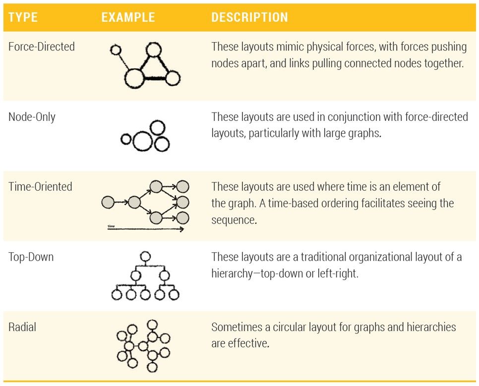]

---
## Node-and-Link Layouts

.large[https://flare.prefuse.org/]

.center[
]

.small[Source: https://flare.prefuse.org/demo/]

---
### Force-Directed Layout

.pull-left[
.large[
- Force-directed graph drawing algorithms are a class of algorithms for drawing graphs in an aesthetically-pleasing way. 
- Their purpose is to position the nodes of a graph in two-dimensional or three-dimensional space so that all the edges are of more or less equal length and there are as few crossing edges as possible, by assigning forces among the set of edges and the set of nodes, based on their relative positions, and then using these forces either to simulate the motion of the edges and nodes or to minimize their energy.]

.small[Source: https://en.wikipedia.org/wiki/Force-directed_graph_drawing]
]


.pull-right[


.small[http://bl.ocks.org/mbostock/4062045]
]

---
### BiPartite Layout

.center[
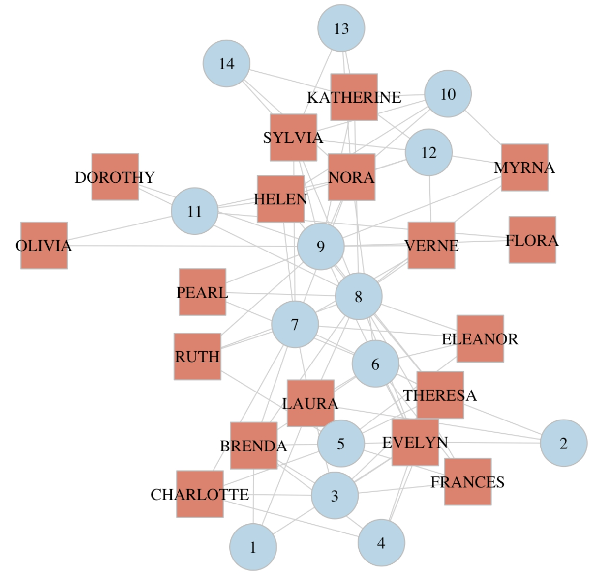]

.small[Source: https://rpubs.com/pjmurphy/317838]

---
### Node-Only Layout

.center[
]

.small[Source: http://www.nytimes.com/interactive/2012/02/13/us/politics/2013-budget-proposal-graphic.html 
]

---
### Time-Oriented Layout

.center[
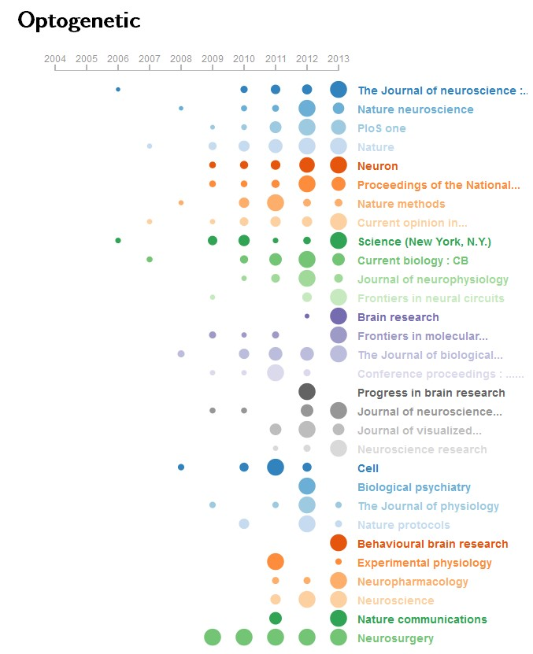]

---
### Radial Hierarchical Layout

.center[
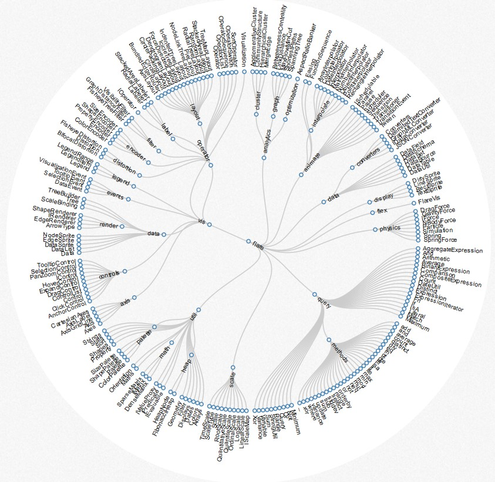]

.small[http://mbostock.github.io/d3/talk/20111018/cluster.html] 

---
### Tree Hierarchical Layout

.center[
]

.small[http://mbostock.github.io/d3/talk/20111018/tree.html]

---
### Geographic Layout

.center[
]

.small[https://wiki.smu.edu.sg/1617t3isss608g1/ShinyNET_Data_Prep_Report]

---
### Chord Diagrams

.center[
]

.small[https://davidten.shinyapps.io/migrationanalytics2/]

---
### Sankey Diagrams

.center[
]

.small[https://observablehq.com/@d3/sankey-diagram]

---
### Hive Plot (https://academic.oup.com/bib/article/13/5/627/412507)

.center[
]

.small[http://www.hiveplot.net/]

---
### Hive Plot of Network of Individuals at Risk of HIV

.center[
]

.small[https://konstantinkashin.com/assets/data/hiveplot.html]

---
### Hive Plot in **ggraph**

.center[
]

.small[https://www.data-imaginist.com/2017/ggraph-introduction-layouts/]

---
### Adjacency Matrix (https://en.wikipedia.org/wiki/Adjacency_matrix)

.center[
]

.small[https://matthewlincoln.net/2014/12/20/adjacency-matrix-plots-with-r-and-ggplot2.html]

---
## Basic Visual Attributes

.center[
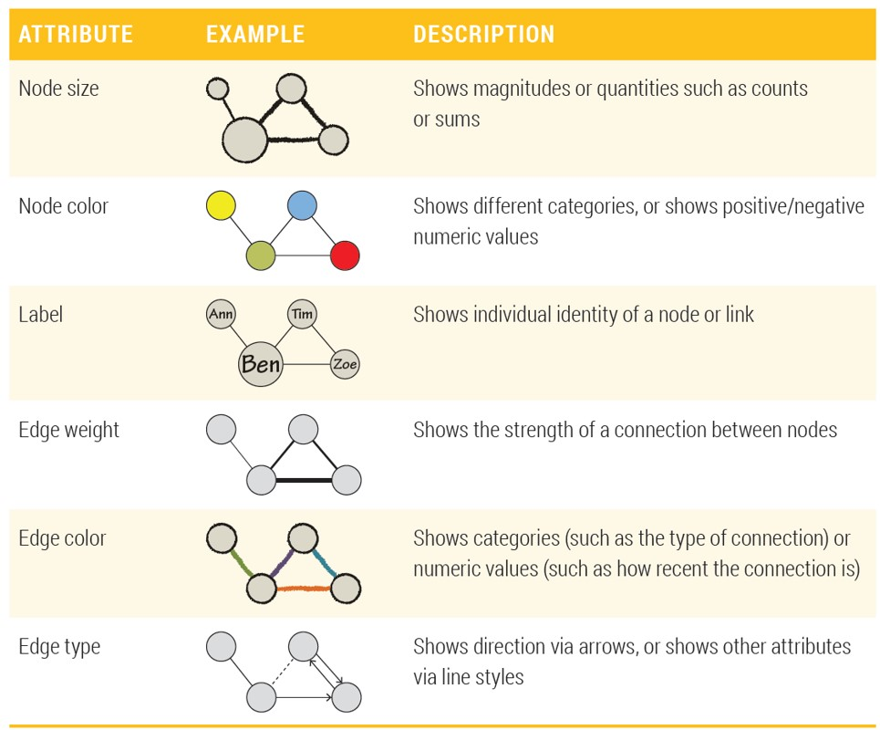]

.small[]

---
## Additional Visual Attributes

.center[
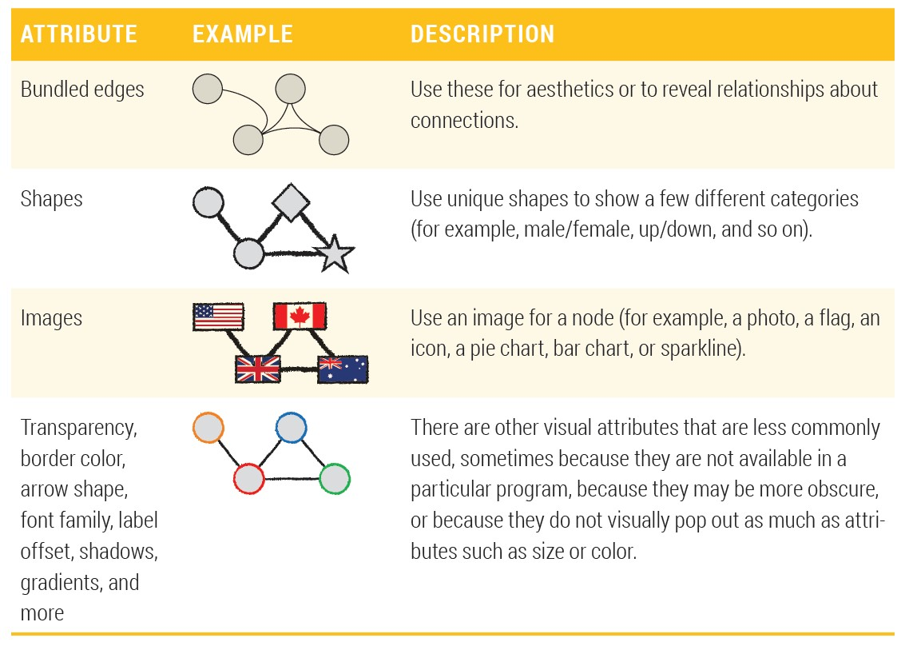]

.small[]

---
## Combining Visual Attributes

.center[
]

.small[]

---
## Network Visualisation and Analysis Process Model .small[(Hansen, D. L. et. al. 2009)]

.center[
]

.small[]

---
## Measures of Power and Influence - Network Metrics

.pull-left[
.large[
- A collection of statistical measures to report:
    - the connectivity of a node within a network,
    - the complexity of a network, 
    - the clusters or sub-groups within a network.
]]

.pull-right[
]

---
### Network Metrics: Degree

.pull-left[
.large[
- **Degree**, the number of direct connections a node has. 

- Degree is often interpreted in terms of the immediate risk of node for catching whatever is flowing through the network (such as a virus, or some information).]]

.pull-right[
]

---
### Network Metrics: In-degree & Out-degree

.pull-left[
.large[
- If the network is **directed** (meaning that ties have direction), then we usually define two separate measures of degree centrality, namely **indegree** and **outdegree**. 

- **Indegree** is a count of the number of ties directed to the node, and **outdegree** is the number of ties that the node directs to others. 

- For positive relations such as friendship or advice, we normally interpret indegree as a form of popularity, and outdegree as gregariousness.
]]

---
### Network Metrics: Betweenness centrality

.pull-left[
.large[
- **Betweenness** is a centrality measure of a vertex within a graph (there is also edge betweenness, which is not discussed here). 

- Vertices that occur on many shortest paths between other vertices have higher betweenness than those that do not.
]]

.pull-right[
]

---
### Network Metrics: Closeness Centrality

.pull-left[
.large[
- In graph theory closeness is a centrality measure of a vertex within a graph. Vertices that are 'shallow' to other vertices (that is, those that tend to have short geodesic distances to other vertices with in the graph) have higher closeness. 

- **Closeness** is preferred in network analysis to mean shortest-path length, as it gives higher values to more central vertices, and so is usually positively associated with other measures such as degree.
]]

.pull-right[
]

---
### Network Metrics: Eigenvector Centrality

.pull-left[
.large[
- A measure of the importance of a node in a network. 

- It assigns relative scores to all nodes in the network based on the principle that connections to high-scoring nodes contribute more to the score of the node in question than equal connections to low-scoring nodes. 
).]]

.pull-right[
]

---
### Network Metrics: Clustering Coefficient

.pull-left[
.large[
- A measure on how connected a vertex’s neighbours are to one another.  More specifically, it is the number of edges connecting a vertex’s neighbours divided by the total number of possible edges between the vertex’s neighbour.
]]

.pull-right[
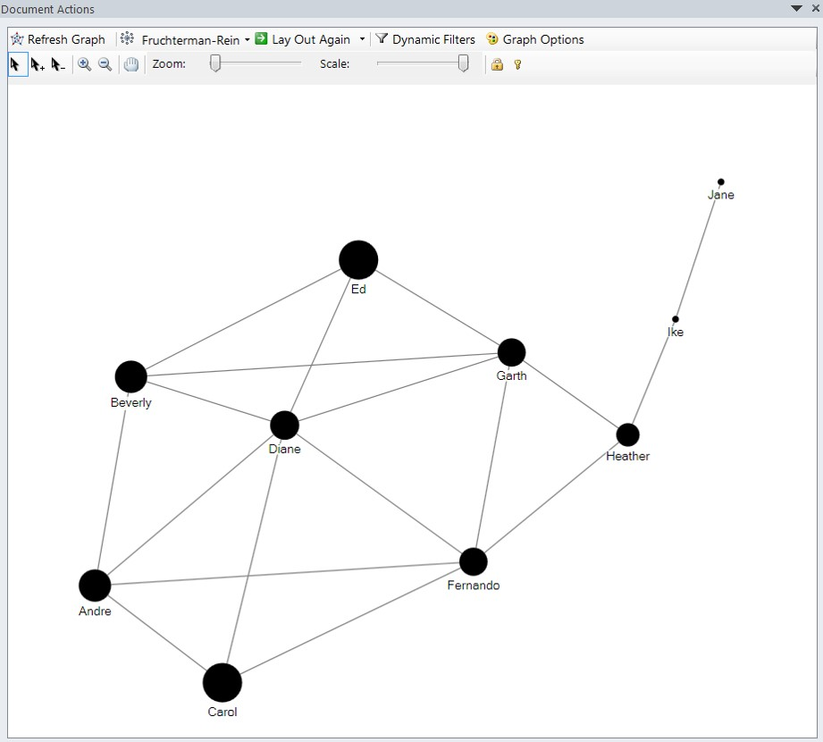]

---
## Network Analytics Methods

.large[
- Mapping relationships

- Identifying hierarchies

- Detecting communities

- Analysing flow
]

---
### Analysing Spatial Networks Relationship

.center[
]

.small[Source: http://www.snamuts.com/melbourne.html]

---
### Analysing Hierarchy of Spatial Network

.center[
]

.small[Source: http://onlinelibrary.wiley.com/doi/10.1111/j.1471-0374.2011.00355.x/pdf]

---
### Detecting communities

.center[
]

.small[Source: Source: http://arxiv.org/pdf/0906.0612.pdf]

---
### Spatial Networks for Flow Analysis

.large[
Arteries of the City]

.center[
]

.small[Source: http://2013.sopawards.com/wp-content/uploads/2013/05/697-South-China-Morning-Post-Arteries-of-the-City.pdf]

---
## Swiss Knife for Graph Visualisation and Analysis I

.large[[NodeXL](http://nodexl.codeplex.com/), an open-source template for Microsoft® Excel® 2007 and 2010 that makes it easy to explore network graphs.]

.center[
]


---
## Swiss Knife for Graph Visualisation and Analysis II

.large[[Gephi](https://gephi.org/), an open source network graph visualisation and analysis toolkit.]

.center[
]


---
## R Package for Network Visualisation and Analysis

.large[
- Network analysis centric

    - [igraph](https://cran.r-project.org/web/packages/igraph/index.html)
    - [sna](https://cran.r-project.org/web/packages/sna/) 
    - [Network](https://cran.r-project.org/web/packages/network/)
    - [tidygraph](https://github.com/thomasp85/tidygraph)

- Network visualization centric
    - [ggraph](https://cran.r-project.org/web/packages/ggraph/index.html)
    - [vizNetwork](https://cran.r-project.org/web/packages/visNetwork/vignettes/Introduction-to-visNetwork.html)
    - [ggnet2](https://briatte.github.io/ggnet/)
    - [geomnet](https://cran.r-project.org/web/packages/geomnet/index.html) 
    - [ggnetwork](https://briatte.github.io/ggnetwork/) 
]

---
## Web enabled Graph Visualisation Libraries

.large[
- Graph 
    - [Sigma.js]((http://sigmajs.org/)
    - [Cytoscape.js](http://js.cytoscape.org/)

- Generic
    - [Vis.js](http://visjs.org/index.html)
    - [JavaScript InfoVis Toolkit](http://philogb.github.io/jit/demos.html)
    - [D3.js](http://d3js.org/)  
]

---
# References

.large[

**Highly Recommended:**

- Richard Brath and David Jonker (2015)	
**Graph Analysis and Visualization: Discovering Business Opportunity in Linked Data**, John Wiley & Sons.  This book is available [online](https://library-books24x7-com.libproxy.smu.edu.sg/toc.aspx?site=DJI6C&bookid=80765) at smu digital library. 

-  Luke, Douglas A. (2015) **A user's guide to network analysis in R**, Springer.  This book is available [online](https://link-springer-com.libproxy.smu.edu.sg/book/10.1007%2F978-3-319-23883-8) at smu digital library.


Additional readings

- Ian McCulloh, Helen Armstrong, and Anthony Johnson (2013) **Social Network Analysis with Applications**, Chapter 1-3.  This book is available [online](https://ebookcentral-proquest-com.libproxy.smu.edu.sg/lib/smu/detail.action?pq-origsite=primo&docID=1211931) at smu digital library.

- Scott, John (2017) **Social network analysis** (4th Edition).  This book is available [online](https://methods-sagepub-com.libproxy.smu.edu.sg/book/social-network-analysis-4e) at smu digital library.
]

---
## Geospatial Network Visualisation


.small[
This [site](https://geonetworks.github.io/) provides an outstanding overview and survey of various geospatial network visualisations. 
]


```{r echo=FALSE, eval=FALSE}
library(pagedown)
pagedown::chrome_print("Lesson09-NetworkVis.html")
```
