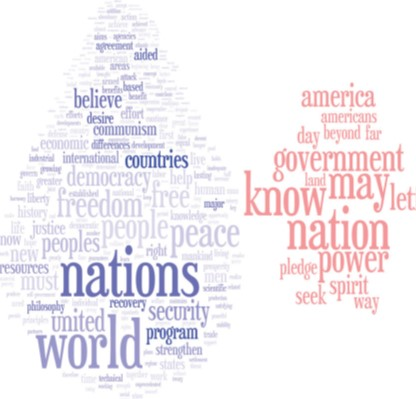
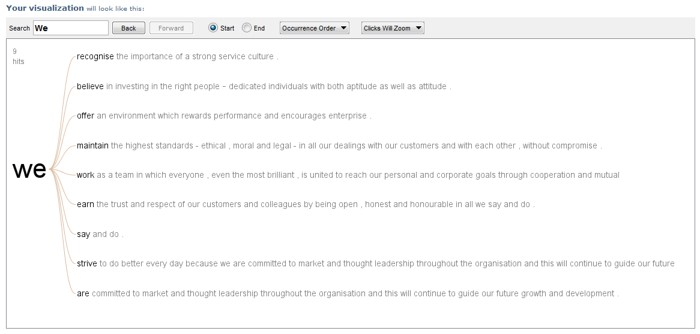
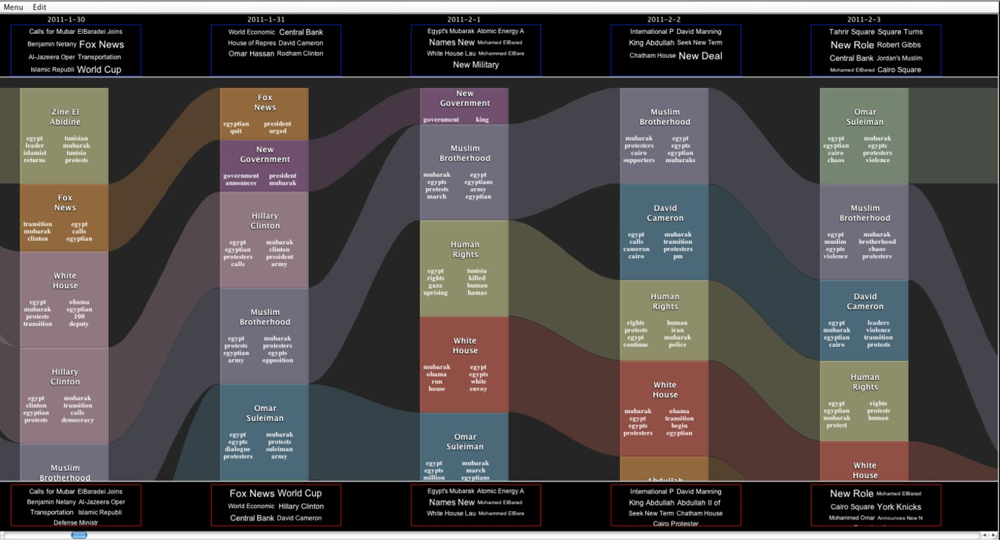

```{r setup, include=FALSE}
options(htmltools.dir.version = FALSE)
knitr::opts_chunk$set(
  fig.retina=3,
  cache = FALSE,
  echo = TRUE,
  message = FALSE, 
  warning = FALSE)
```

```{r xaringan-themer, include=FALSE, warning=FALSE}
library(xaringanthemer)
style_duo_accent(
  primary_color = "#1381B0",
  secondary_color = "#FF961C",
  inverse_header_color = "#FFFFFF"
)
```

# Content

- Introduction Text Visualisation
    - Text data
- Text Visualisation methods
    - Tag Cloud
    - Wordle
    - Word Tree
    - Phrase Nets
- Text Visualisation toolkits
    - JIGSAW

---
## Introduction to Text Visualisation
### History of text

.center[

]

---
## Introduction to Text Visualisation
### Text as historical archive

.center[

]

---
## Introduction to Text Visualisation
### Text as a mode of communication

.center[

]

---
## Introduction to Text Visualisation
### Textual data for business intelligence analytics

.center[

]

---
### Why Visualise Text?

.large[
- Understanding – get the “gist” of a document
- Grouping – cluster for overview or classification
- Compare – compare document collections, or
- Inspect evolution of collection over time
- Correlate – compare patterns in text to those in other data, e.g., correlate with social network
]

---
### Levels of Text Representation

.large[
- Lexical level, transforming a string of characters into a sequence of atomic entities, called tokens.
- Syntactic level, identifying and tagging (anotating) each token’s functions.
- Semantic level, extracting of meaning and relationships between pieces of knowledge derived from the structures identified in the syntactical level.
]

---
### Fundamental of Text Visualisation

.center[
.vlarge[
Be warn, not all text are written in English and in digital forms!


]]

---
# Text Visualisation Methods

.vlarge[
- Tag Cloud
- Wordle
- Word Tree
- Phrase Nets
]

---
### Tag Cloud

.pull-left[
.large[
- A tag cloud (word cloud, or weighted list in visual design) is a visual representation for text data, typically used to depict keyword metadata (tags) on websites, or to visualize free form text. 
- 'Tags' are usually single words, normally listed alphabetically, and the importance of each tag is shown with font size or color.
]]


.pull-right[


Source: [Tag cloud](http://en.wikipedia.org/wiki/Tag_cloud)
]

---
### Application of Tag Cloud I: Branding

.large[
- One-word tag cloud of DBS’s corporate values statement created using Many Eyes.  
]

.center[

]

---
### Application of Tag Cloud I: Branding

.large[
- Two-word tag cloud of DBS’s corporate values statement created using Many Eyes.  
]

.center[

]

---
## Wordle 

.large[
- A toy for generating “word clouds” from text that you provide
]

.center[

]

---
### Word Clouds of Corporate Values Statements

.pull-left[

]

.pull-right[

]

---
## Word Tree

.pull-left[
.large[
- A visual search tool for unstructured text, such as a book, article, speech or poem. It lets you pick a word or phrase and shows you all the different contexts in which the word or phrase appears. 
- The contexts are arranged in a tree-like branching structure to reveal recurrent themes and phrases. 
]]

.pull-right[


Link: https://www.jasondavies.com/wordtree/ 
]

---
## Phrase Net

.pull-left[
.large[
- A phrase net diagrams the relationships between different words used in a text.  It uses a simple form of pattern matching to provide multiple views of the concepts contained in a book, speech, or poem. 
]]

.pull-right[

]

---
## Phrase Net

.pull-left[
.large[
.center[
Words separate by the keyword "and"
]]


]

.pull-right[
.large[
.center[
Words that directly follow one another
]]


]

---
## Parallel Tag Cloud

.center[

]

.small[
Reference: [Parallel Tag Clouds to Explore and Analyze Faceted Text Corpora](http://vialab.science.uoit.ca/wp-content/papercite-data/pdf/col2009b.pdf)
]

---
## Story Tracker: Main View

.center[

]

.small[
Reference: [Story Tracker: Incremental visual textanalytics of news story development](https://kops.uni-konstanz.de/bitstream/handle/123456789/26224/Krstajic_262244.pdf?sequence=2)
]

---


