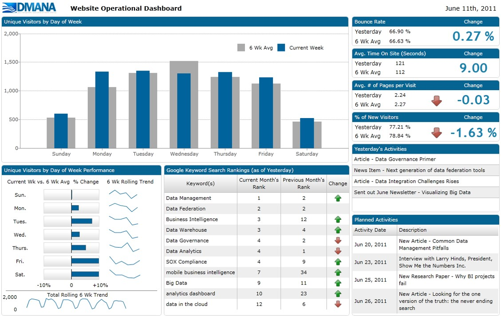

```{r setup, include=FALSE}
options(htmltools.dir.version = FALSE)
knitr::opts_chunk$set(
  fig.retina=3,
  cache = FALSE,
  echo = TRUE,
  message = FALSE, 
  warning = FALSE)
```

```{r xaringan-themer, include=FALSE, warning=FALSE}
library(xaringanthemer)
style_duo_accent(
  primary_color = "#1381B0",
  secondary_color = "#FF961C",
  inverse_header_color = "#FFFFFF"
)
```

# Content

- Introduction Text Visualisation
    - Text data
- Text Visualisation methods
    - Tag Cloud
    - Wordle
    - Word Tree
    - Phrase Nets
- Text Visualisation toolkits
    - JIGSAW

---
## Introduction to Text Visualisation
### History of text

.center[

]

---
## Introduction to Text Visualisation
### Text as historical archive

.center[

]

---
## Introduction to Text Visualisation
### Text as a mode of communication

.center[

]

---
## Introduction to Text Visualisation
### Textual data for business intelligence analytics

.center[

]

---
### Why Visualise Text?

.large[
- Understanding – get the “gist” of a document
- Grouping – cluster for overview or classification
- Compare – compare document collections, or
- Inspect evolution of collection over time
- Correlate – compare patterns in text to those in other data, e.g., correlate with social network
]

---
### Levels of Text Representation

.large[
- Lexical level, transforming a string of characters into a sequence of atomic entities, called tokens.
- Syntactic level, identifying and tagging (anotating) each token’s functions.
- Semantic level, extracting of meaning and relationships between pieces of knowledge derived from the structures identified in the syntactical level.
]

---
### Fundamental of Text Visualisation

.center[
.vlarge[
Be warn, not all text are written in English and in digital forms!


]]


