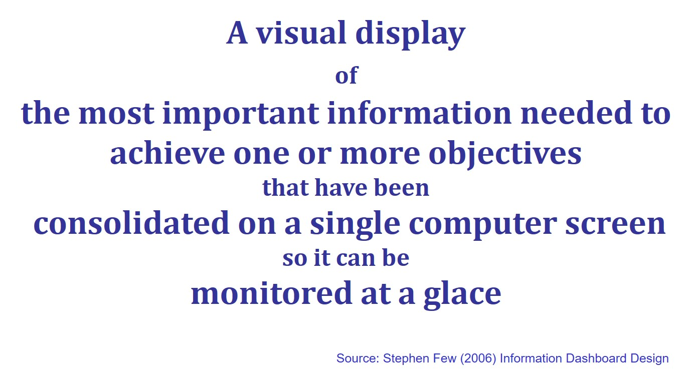
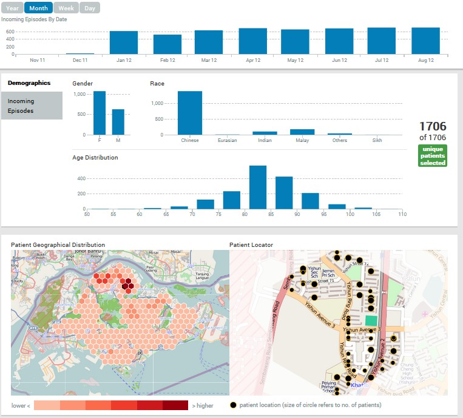
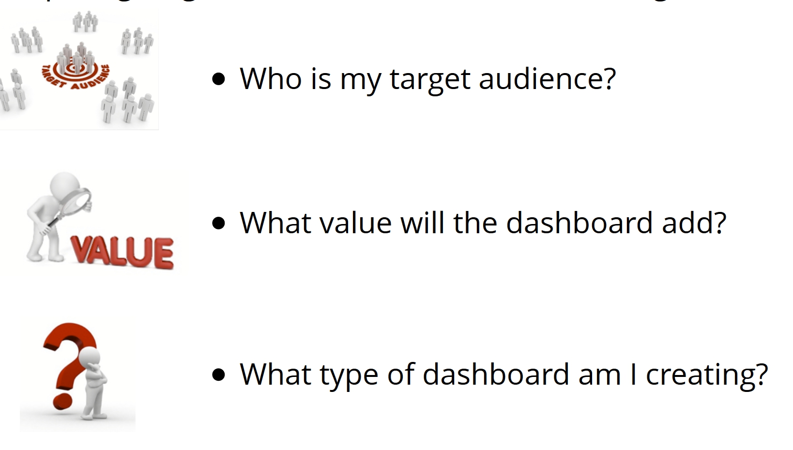
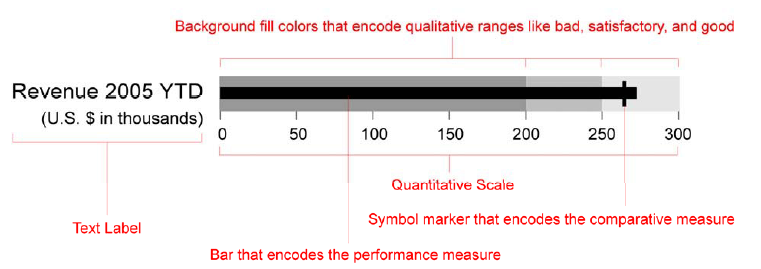
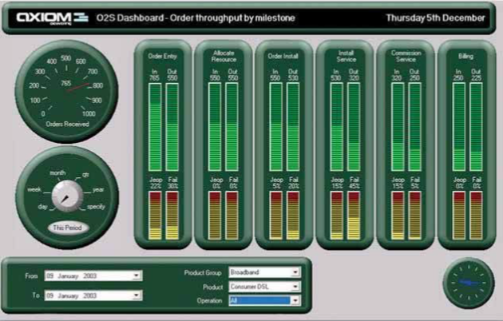
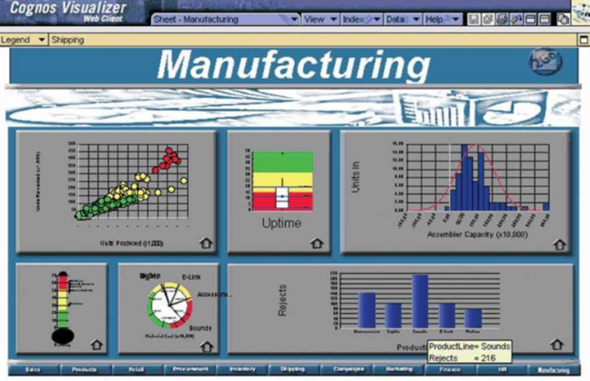

```{r setup, include=FALSE}
knitr::opts_chunk$set(fig.retina=3,
                      echo = TRUE,
                      eval = TRUE,
                      message = FALSE,
                      warning = FALSE)
```

## Content
.large[

- Introducing information dashboard

- Information dashboard design best practices

- Common mistakes in dashboard design

- Ideal graphs for information dashboard
    + Bullet graph
    + Sparklines
    + Bandlines
]

---
# Introducing information dashboard

.center[
]

---
# Introducing information dashboard
## Why are dashboards so important?

.pull-left[
.large[
- A  well-designed performance dashboard helps you to see more clearly by helping you to understand each fact more quickly so you can find patterns in the storm.
]]

.pull-right[
]

---
# Introducing information dashboard
## Classifying Dashboards by Role

.large[
- Dashboards for strategic purpose

- Dashboards for operational purpose

- Dashboards for analytics purpose
]

---
# Introducing information dashboard
## Dashboards for operational purpose

.center[
]

---
# Introducing information dashboard
## Dashboards for strategic purpose

.center[
]

---
# Introducing information dashboard
## Dashboards for analytics purpose

.center[
]

---
# Best Practices for Dashboard Design

.large[
- Preparing stage
    - Target the user
    - Know what value your dashboard will add
    - Display only actionable information

- Design stage
    - Right tool for the right job
    - Context
    - Layout and clarity
    - Visual aesthetics
]

---
# Best Practices for Dashboard Design
## Preparing stage: Target the user

.center[
]

---
# Best Practices for Dashboard Design
## Preparing stage: User-centered Design Process

.pull-left[
]

.pull-right[Reference: Developing and Applying a User-Centered Model for the Design and Implementation of Information Visualisation (https://ink.library.smu.edu.sg/sis_research/1479/)]

---
# Best Practices for Dashboard Design
## Preparing stage: A User-Centric Dashboard Design Guide

.center[
]

---
# Best Practices for Dashboard Design
## Preparing stage: A User-Centric Dashboard Design Guide

.center[
**Who is my target audience?**

]

---
# Best Practices for Dashboard Design
## Preparing stage: A User-Centric Dashboard Design Guide

**What value will the dashboard bring?**

- Help management define what is important.
- Educate people in the organization about the things that matter.
- Set goals and expectations for specific individuals or groups.
- Help executives sleep at night because they know what’s going on.
- Encourage specific actions in a timely manner.
- Highlight exceptions and provide alerts when problems occur.
- Communicate progress and success.
- Provide a common interface for interacting with and analysing important business data.

---
# Best Practices for Dashboard Design
## Preparing stage: A User-Centric Dashboard Design Guide

.center[
**What type of dashboard am I creating?**

]


---
# Best Practices for Dashboard Design
## Preparing stage: A User-Centric Dashboard Design Guide

.pull-left[
.large[
**Information Discrimination**

- Find the core

- Ask a better question

- Push to the appendix

- Reporting vs exploration
]]

.pull-right[
]

---
# Best Practices for Dashboard Design
## Preparing stage: A User-Centric Dashboard Design Guide

.center[
**Choosing the perfect metric**

]

---
# Best Practices for Dashboard Design
## Preparing stage: A User-Centric Dashboard Design Guide

.center[
**Choosing the perfect metric**

]

---
# Ideal graphs for information dashboard
## Right tool for the right job

.center[
.center[
**An assortment of typical dashboard gauges**

]]

---
# Ideal graphs for information dashboard
## Introduction to Bullet Graphs

.center[
.large[
**Bullet graphs to replace gauges**

]]

---
# Ideal graphs for information dashboard
## Introduction to Bullet Graphs

.large[
**Bullet graph specifications**]

.center[
]

---
# Ideal graphs for information dashboard
## Introduction to Sparklines 

- A sparkline is a very small line chart, typically drawn without axes or coordinates.

.center[
]

.small[reference: https://www.edwardtufte.com/bboard/q-and-a-fetch-msg?msg_id=000AIr]

---
## Introduction to Sparklines
### Pre-attentive with colour and symbol


---
## Introduction to Sparklines
### Aspect ratio

.large[
- A graphic's width/height ratio makes a big difference in displaying data.] 

.center[
]

---
## Introduction to Sparklines
### Unintentional optical clutter

.large[
- Areas surrounding data-lines may generate unintentional optical clutter. Strong frames produce melodramatic but content-diminishing visual effects. ]

.center[
]

---
## Introduction to Sparklines
### Sparklines best practice

.large[
- Enriched with context
]

.center[
]

---
## Introduction to Sparklines
### Sparklines best practice

.large[
- Use reference line to provide context
]

.center[
]

---
## Introduction to Sparklines
### Sparklines best practice

.pull-left[
.large[
- Use reference region to provide context
]]

.pull-right[
]

.small[Reference: https://stackoverflow.com/questions/35434760/sparklines-in-ggplot2]

---
# Best Practices for Dashboard Design
## Common mistakes in dashboard design

.large[
- Exceeding the boundaries of a single page

- Supplying inadequate context for the data

- Displaying excessive detail or precision

- Exposing measure indirectly

- Choosing inappropriate display media

- Introducing meaningless variety

- Using poorly designed display media

- Encoding quantitative data inaccurately
]

---
## Common mistakes in dashboard design

.large[
- Exceeding the boundaries of a single page and requiring the viewer to scroll
]

.center[
]

---
## Common mistakes in dashboard design
.large[
- Fragmenting data into separate screen
]
.center[
]

---
## Common mistakes in dashboard design
.large[
- Displaying excessive detail or precision
]
.center[
]

---
## Common mistakes in dashboard design
.large[
- Introducing meaningless variety
]
.center[
]

---
## Common mistakes in dashboard design
.large[
- Arranging the data poorly
]
.center[
]

---
## Common mistakes in dashboard design
.large[
- Highlighting important data ineffectively or not
]
.center[
]

---
## Common mistakes in dashboard design
.large[
- Cluttering the display with useless decoration
]
.center[
]

---
## Common mistakes in dashboard design
.large[
- Misusing or overusing colour
]
.center[
]

---
## Common mistakes in dashboard design
.large[
- Designing an unattractive visual display
]
.center[
]

---
## Common mistakes in dashboard design
.large[
- Design that failed to reveal KPIs effectively
]
.center[
]

---
## Alternative dashboard design
.large[
- Design that reveals KPIs effectively
]
.center[
]

---
## Common mistakes in dashboard design
.large[
- Design with poor layout and clarity
]
.center[
]

---
## Alternative dashboard design
.large[
- Design with good layout and clarity
]
.center[
]

---
## Common mistakes in dashboard design
.large[
- Design with poor visual aestheticsness
]
.center[
]

---
## Alternative dashboard design
.large[
- Design with good visual aestheticsness
]
.center[
]


---
# References
## Dashboard Design

- A Guide to Creating Dashboards People Love to Use (http://static.squarespace.com/static/52f42657e4b0b3416ff6b831/t/5310292ce4b08d35a87c9426/1393568044420/Guide_to_Dashboard_Design.pdf)

- 5 Best Practices for Creating Effective Dashboards (http://www.tableausoftware.com/learn/whitepapers/5-best-practices-for-effective-dashboards)

- The Must Do’s of Marketing Dashboards (http://www.tableau.com/sites/default/files/media/whitepaper_mustdosofmarketingdashboards_eng_3.pdf)

- Making Flow Happen (http://www.tableau.com/learn/webinars/making-flow-happen-dashboards-persuade-inform-and-engage)

- With Dashboards: Formatting and layout Definitely Matter (http://www.perceptualedge.com/articles/Whitepapers/Formatting_and_Layout_Matter.pdf)

- Dashboard Design for real-Time Situation Awareness (http://www.perceptualedge.com/articles/Whitepapers/Dashboard_Design.pdf)  

---
# References
### Dashboard Design

- Dashboard Design for Rich and Rapid Monitoring (http://www.perceptualedge.com/articles/visual_business_intelligence/dd_for_rapid_monitoring.pdf)

- Pervasive Hurdles to Effective Dashboard Design (http://www.perceptualedge.com/articles/visual_business_intelligence/pervasive_hurdles_to_dd.pdf)

- Why Most Dashboards Fail (http://www.perceptualedge.com/articles/misc/WhyMostDashboardsFail.pdf)

- Dashboard Confusion (http://www.perceptualedge.com/articles/ie/dashboard_confusion.pdf)

- Dashboard Confusion Revisited (http://www.perceptualedge.com/articles/visual_business_intelligence/dboard_confusion_revisited.pdf)

- Dashboard Design for at-a-glance monitoring (http://courses.ischool.berkeley.edu/i247/s10/lectures/Few-Dashboards.pdf)

---
# References
### Bullet Chart & Sparklines

- Bullet graph @wiki (https://en.wikipedia.org/wiki/Bullet_graph)

- Bullet Graph Design Specification (http://www.perceptualedge.com/articles/misc/Bullet_Graph_Design_Spec.pdf)

- Sparkline theory and practice (http://www.edwardtufte.com/bboard/q-and-a-fetch-msg?msg_id=0001OR)

- Best Practices for Scaling Sparklines in Dashboard (http://www.perceptualedge.com/articles/visual_business_intelligence/best_practices_for_scaling_sparklines.pdf)

- Introducing Bandlines (https://www.perceptualedge.com/articles/visual_business_intelligence/introducing_bandlines.pdf)


```{r echo=FALSE, eval=FALSE}
library(pagedown)
pagedown::chrome_print("Lesson10.html")
```